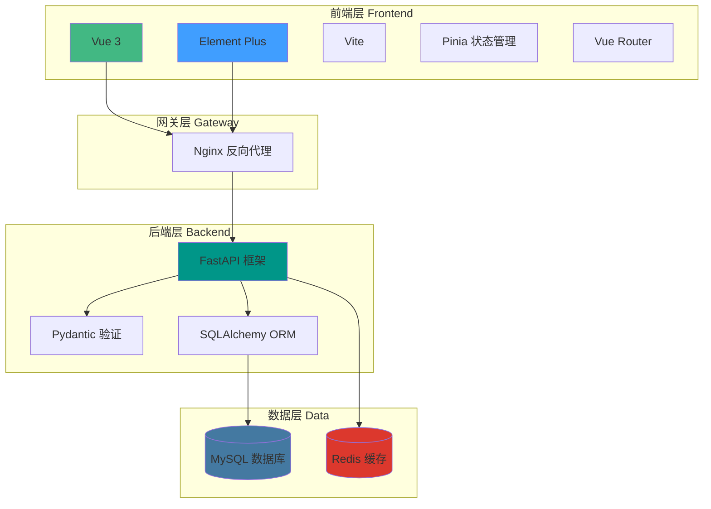
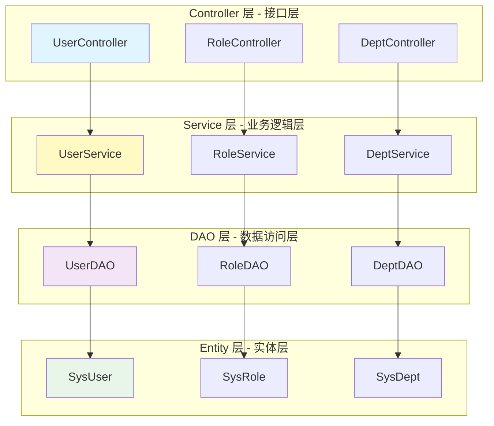
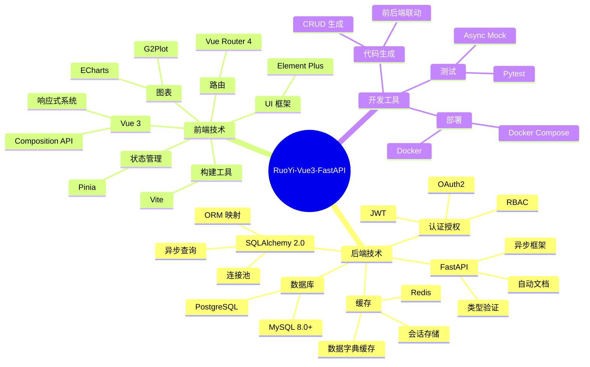
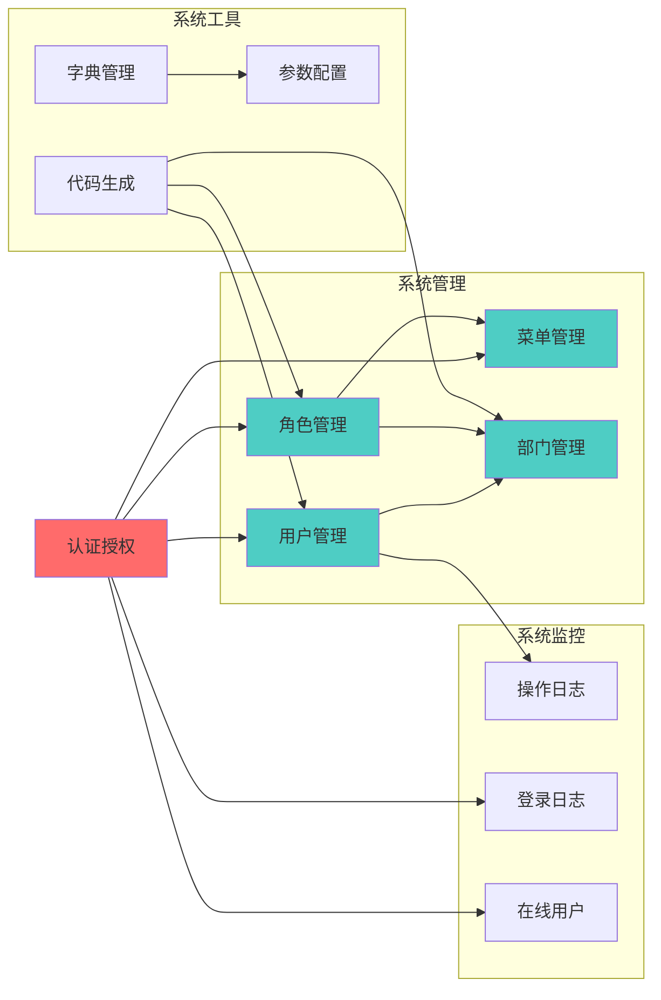
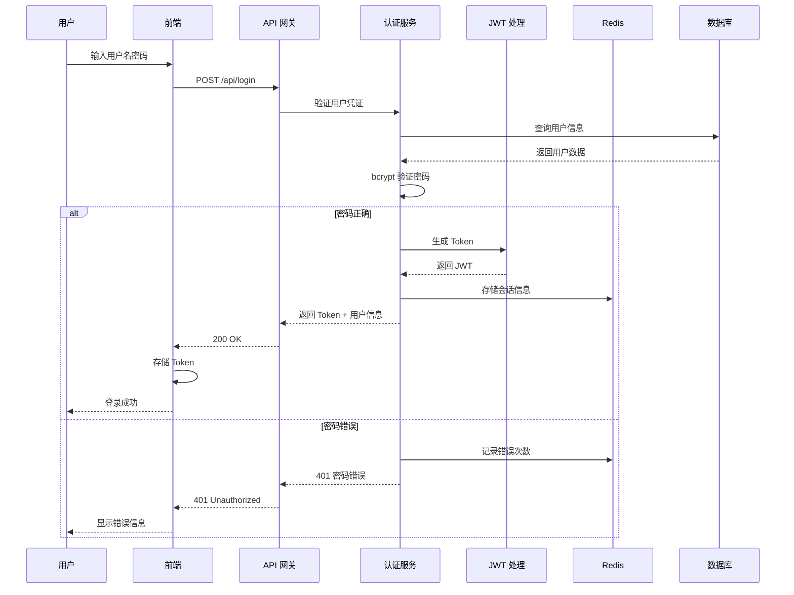
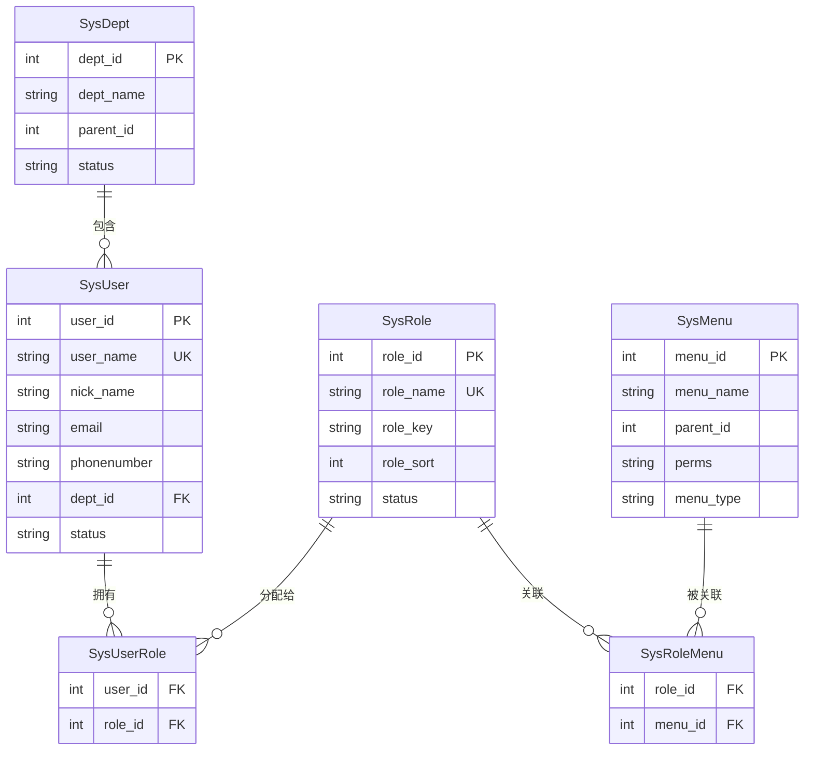
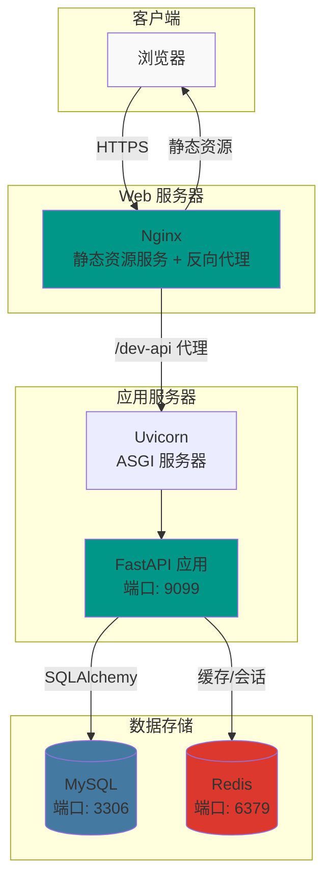

# 项目概览 - 技术栈与整体架构

## 1. 项目整体架构

## 2. 后端分层架构

## 3. 核心技术栈

## 4. 核心功能模块

## 5. 认证授权流程

## 6. 数据库关系图

## 7. 部署架构

## 技术栈说明

### 后端核心

| 技术 | 版本 | 用途 |
|------|------|------|
| Python | 3.10+ | 开发语言 |
| FastAPI | 0.104+ | Web 框架 |
| SQLAlchemy | 2.0+ | ORM 框架 |
| Pydantic | 2.0+ | 数据验证 |
| MySQL | 8.0+ | 关系数据库 |
| Redis | 6.0+ | 缓存数据库 |
| Uvicorn | 0.24+ | ASGI 服务器 |

### 前端核心

| 技术 | 版本 | 用途 |
|------|------|------|
| Vue | 3.3+ | 前端框架 |
| Element Plus | 2.4+ | UI 组件库 |
| Vite | 5.0+ | 构建工具 |
| Pinia | 2.1+ | 状态管理 |
| Vue Router | 4.2+ | 路由管理 |

### 项目特点

1. **异步编程**：全面使用 async/await，提高并发性能
2. **类型安全**：利用 Python 类型提示和 Pydantic 进行数据验证
3. **分层架构**：Controller-Service-DAO 三层分离
4. **权限控制**：基于 RBAC 的细粒度权限管理
5. **代码生成**：支持快速生成 CRUD 代码
6. **链路追踪**：TraceID 全链路日志追踪
