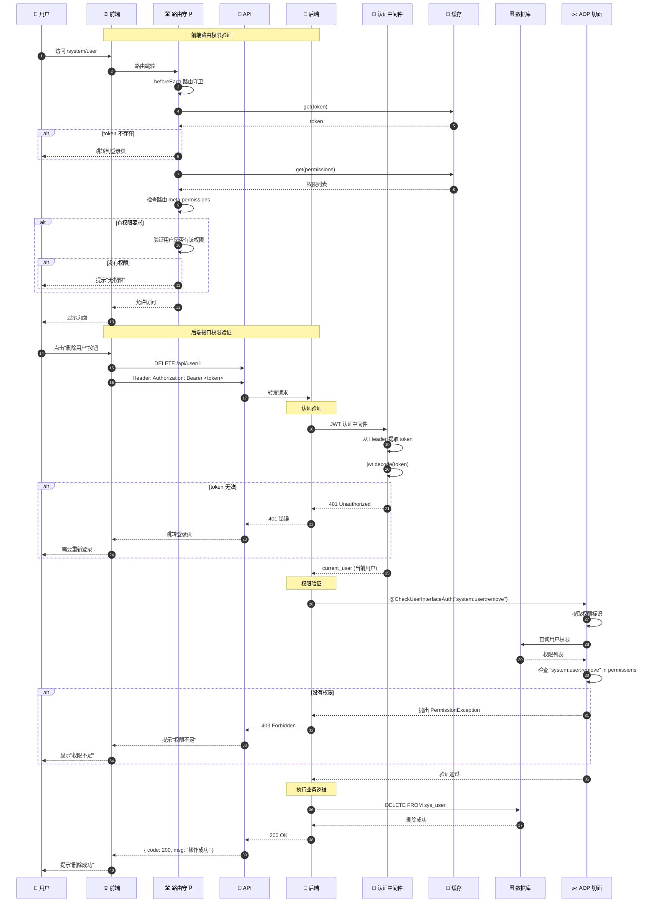
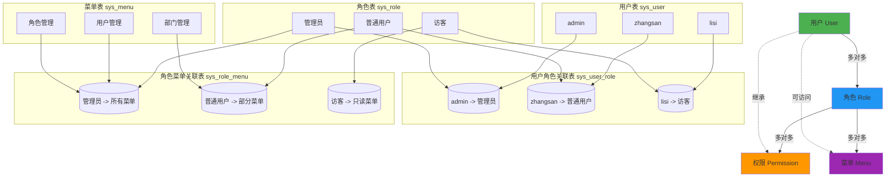
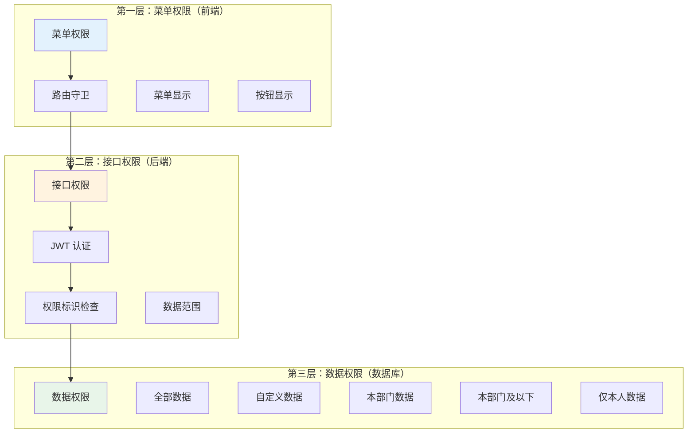
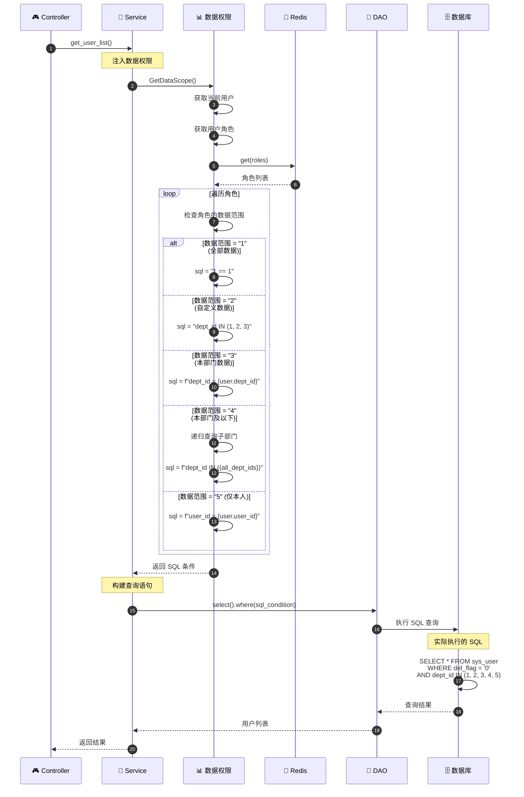
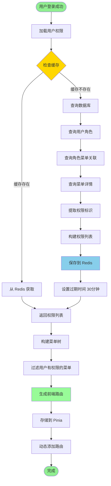
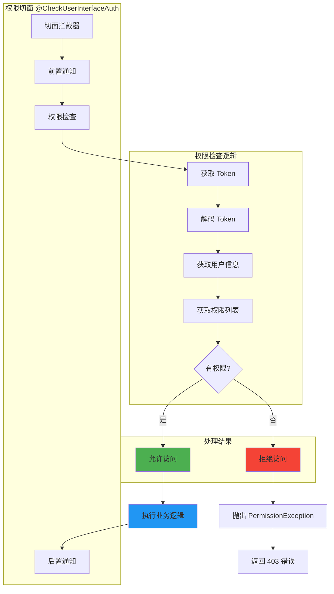
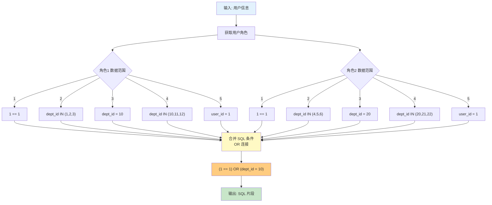
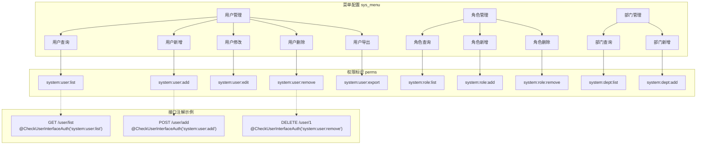
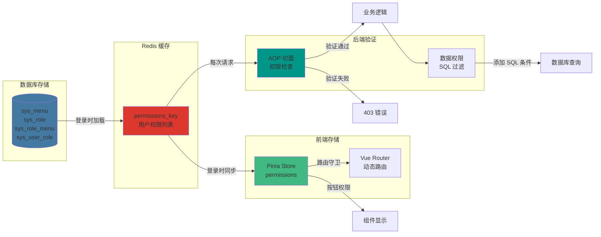

# 权限验证流程详解

## 1. 权限验证完整流程

## 2. RBAC 权限模型

## 3. 权限验证的三个层次

## 4. 数据权限过滤流程

## 5. 权限加载与缓存流程

## 6. AOP 权限切面实现

## 7. 数据权限 SQL 生成

## 8. 权限配置示例

## 9. 权限验证数据流

## 关键代码位置

| 功能 | 文件路径 |
|------|---------|
| 权限注解 | `common/expend/GetPermission.py` |
| 权限验证 | `common/expend/CheckUserInterfaceAuth.py` |
| 数据权限 | `common/expend/GetDataScope.py` |
| 角色 DAO | `module_admin/dao/role_dao.py` |
| 菜单 DAO | `module_admin/dao/menu_dao.py` |
| 前端权限指令 | `ruoyi-fastapi-frontend/src/directives/permission.js` |

## 权限常量定义

| 值 | 含义 | 说明 |
|----|------|------|
| 1 | 全部数据 | 可以查看所有数据 |
| 2 | 自定义数据 | 只能查看指定部门的数据 |
| 3 | 本部门数据 | 只能查看本部门的数据 |
| 4 | 本部门及以下 | 可以查看本部门及子部门的数据 |
| 5 | 仅本人 | 只能查看自己的数据 |
