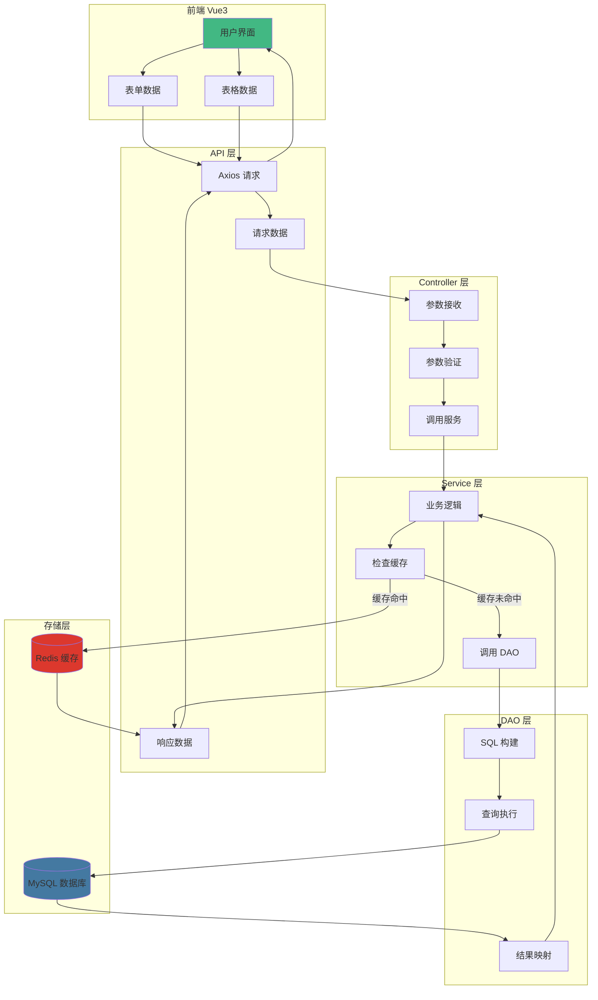
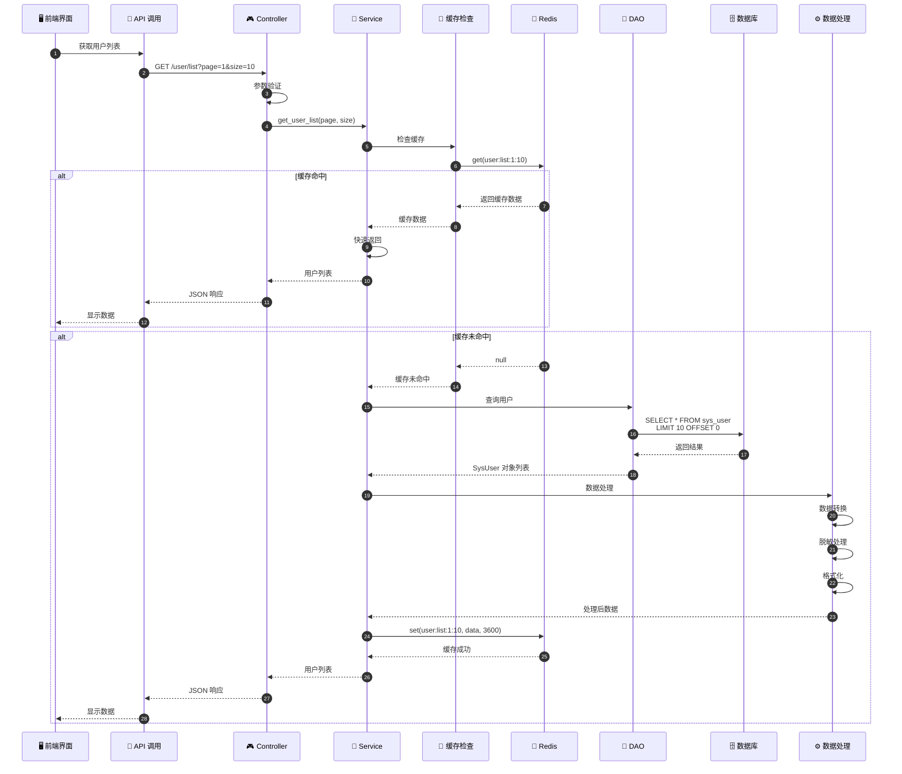
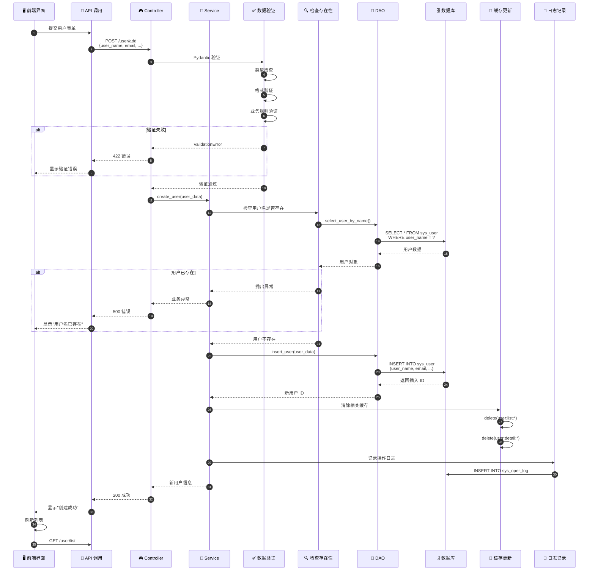
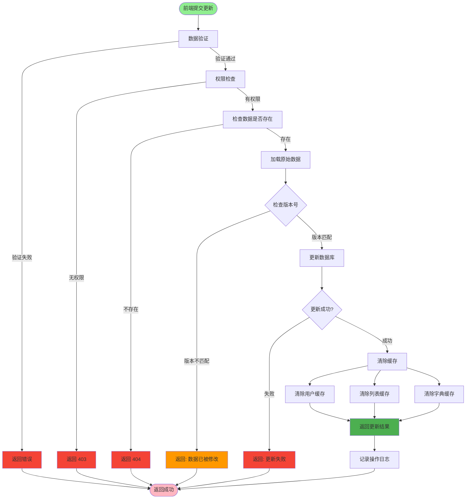
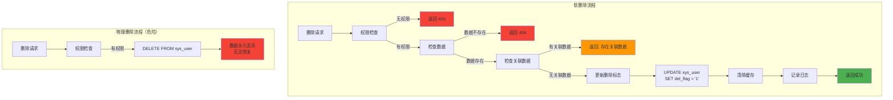
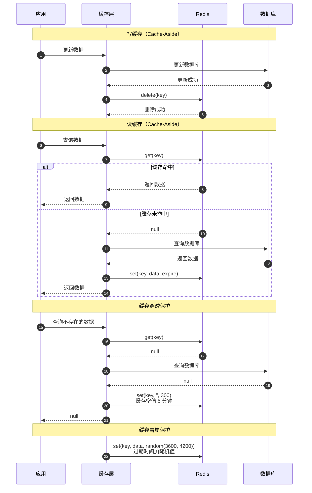
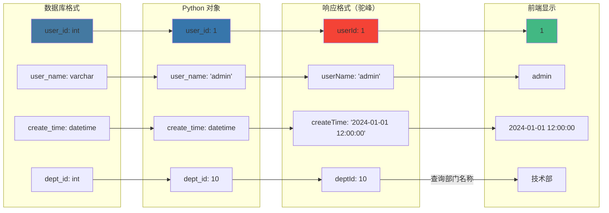
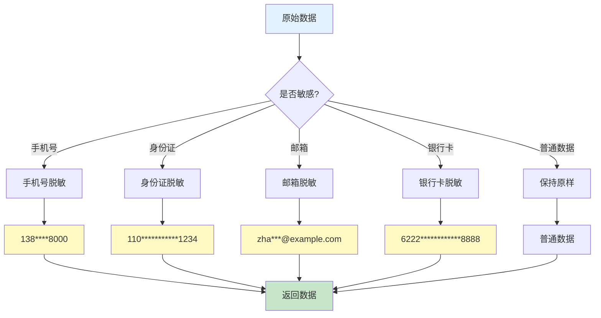
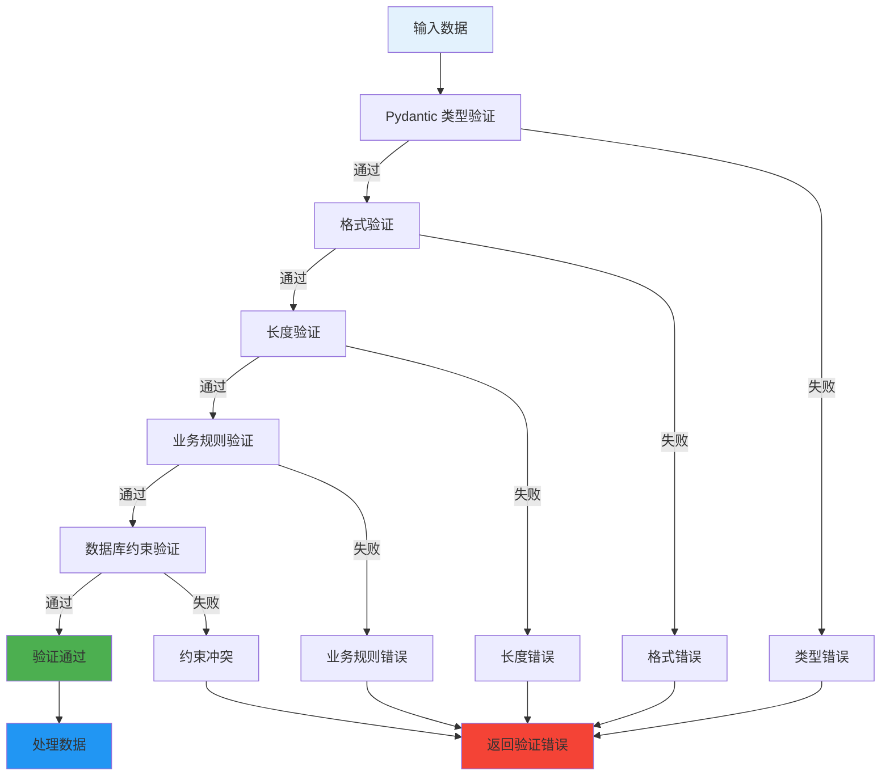
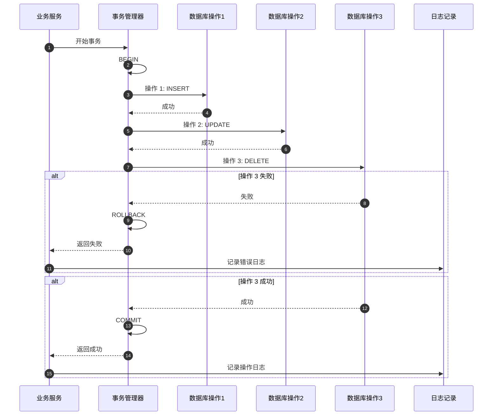

# 数据流转流程详解

## 1. 完整数据流转



## 2. 查询数据流转



## 3. 创建数据流转



## 4. 更新数据流转



## 5. 删除数据流转



## 6. 缓存数据流转



## 7. 数据格式转换



## 8. 数据脱敏流程



## 9. 分页数据流转

```mermaid
graph TB
    Request[请求参数<br/>page=1, size=10] --> CalculateOffset[计算 OFFSET]
    CalculateOffset --> Offset["offset = (page-1) * size<br/>offset = 0"]

    Offset --> BuildQuery[构建查询]
    BuildQuery --> CountQuery[查询总数]
    BuildQuery --> DataQuery[查询数据]

    CountQuery --> DB1[SELECT COUNT(*)<br/>FROM sys_user]
    DB1 --> Total[total = 100]

    DataQuery --> DB2[SELECT * FROM sys_user<br/>LIMIT 10 OFFSET 0]
    DB2 --> Rows[rows = [用户1, 用户2, ...]]

    Total --> BuildResponse[构建分页响应]
    Rows --> BuildResponse

    BuildResponse --> Response["code:200, rows:[...], total:100"]

    Response --> Frontend[前端分页组件]
    Frontend --> Display[显示数据]
    Frontend --> Pagination[分页控件]

    Pagination --> CalcPage[计算页数<br/>pages = ceil(total/size)]
    CalcPage --> ShowPage[显示: 1/10页]

    style Request fill:#E3F2FD
    style Response fill:#C8E6C9
    style Display fill:#FFF9C4
```

## 10. 数据验证链



## 11. 事务处理流程



## 12. 数据流转关键节点

| 阶段 | 数据格式 | 说明 |
|------|---------|------|
| 前端输入 | JavaScript Object | { userName: 'admin' } |
| HTTP 请求 | JSON | {"userName": "admin"} |
| Controller | Pydantic Model | UserModel(user_name='admin') |
| Service | Python Dict | {'user_name': 'admin'} |
| DAO | SQLAlchemy Model | SysUser(user_name='admin') |
| 数据库 | Relational | user_name varchar(30) |
| 缓存 | JSON String | '{"user_name":"admin"}' |
| 响应 | Dict | {'userName': 'admin'} |
| 前端接收 | JavaScript Object | { userName: 'admin' } |

## 关键代码位置

| 功能 | 文件路径 |
|------|---------|
| 数据模型 | `module_admin/entity/do/` |
| Pydantic 模型 | `module_admin/model/` |
| DAO 层 | `module_admin/dao/` |
| Service 层 | `module_admin/service/` |
| Controller 层 | `module_admin/controller/` |
| 缓存服务 | `common/redis/async_redis.py` |
| 数据脱敏 | `common/expend/mask_data.py` |
| 事务管理 | `common/database.py` |
