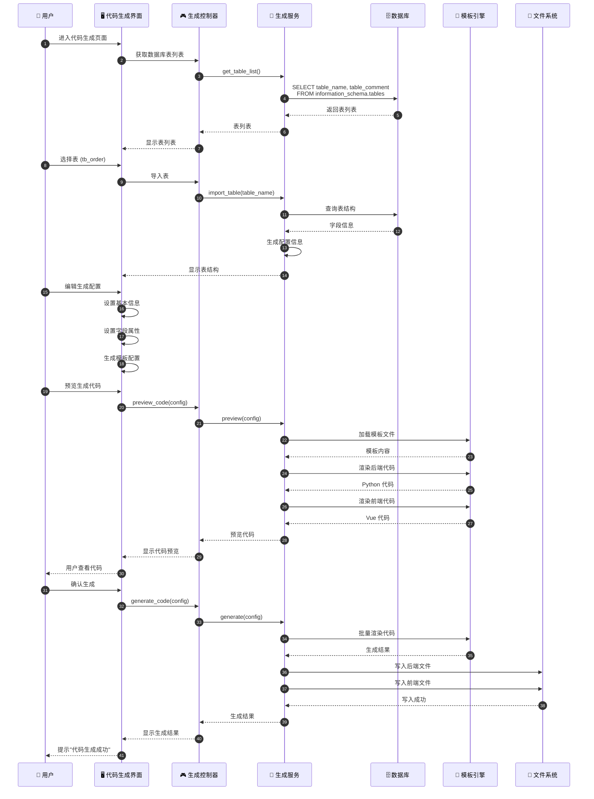
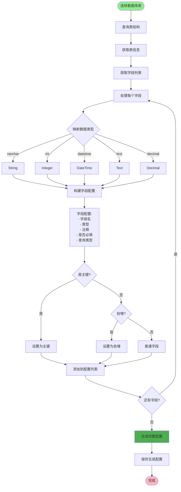
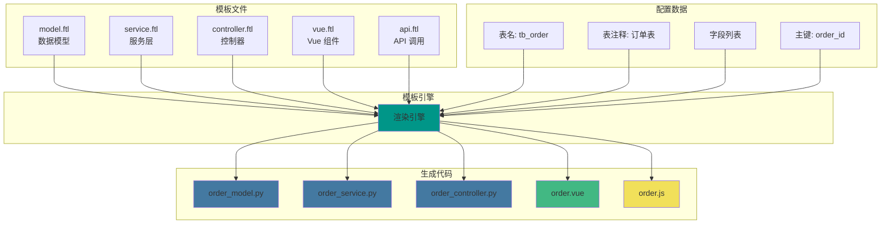
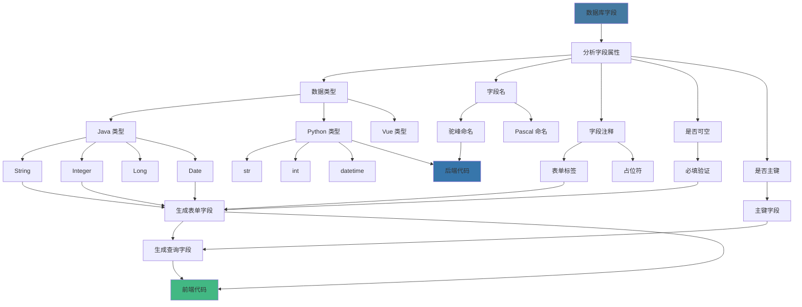
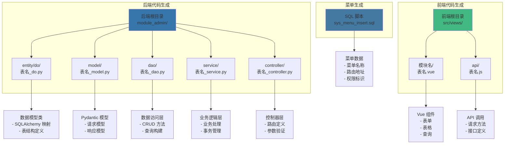
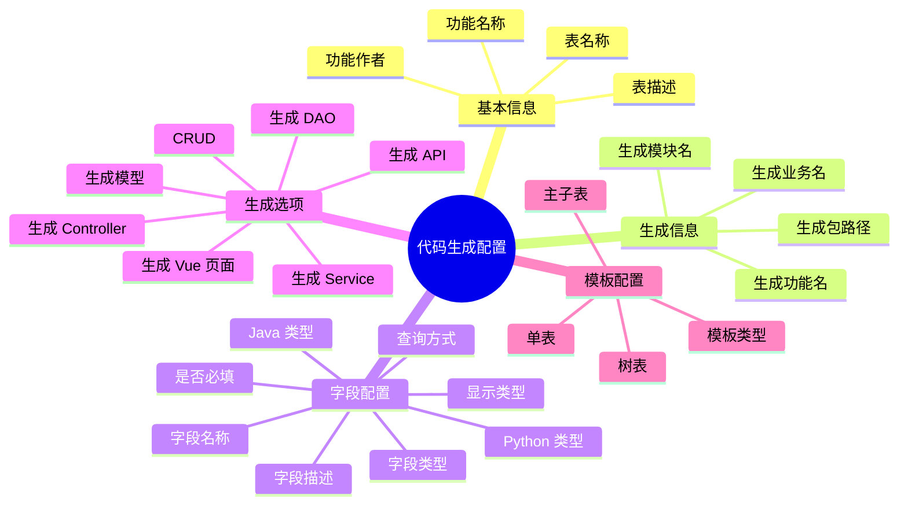
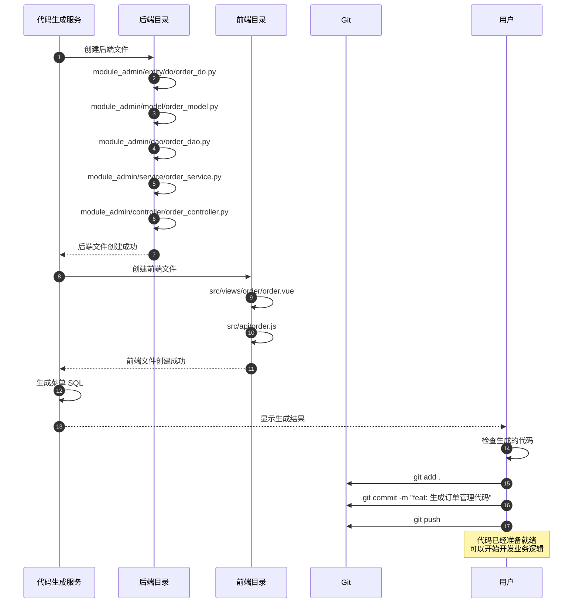
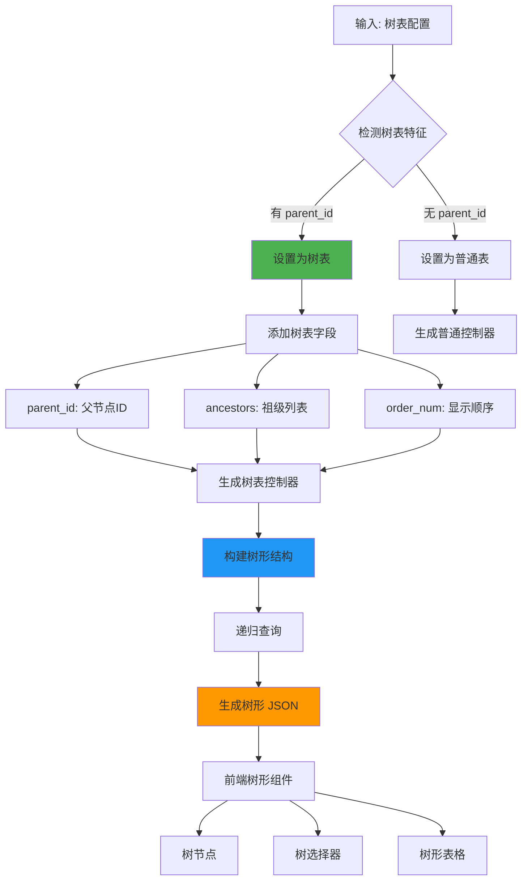
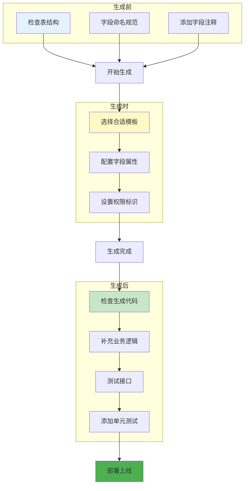

# 代码生成流程详解

## 1. 代码生成完整流程



## 2. 表结构导入流程



## 3. 代码模板渲染流程



## 4. 字段配置映射



## 5. 前后端代码生成结构



## 6. 生成配置选项



## 7. 代码生成后的文件操作



## 8. 树表特殊处理



## 9. 代码生成优化建议



## 关键代码位置

| 功能 | 文件路径 |
|------|---------|
| 代码生成控制器 | `module_admin/controller/gen_controller.py` |
| 代码生成服务 | `module_admin/service/gen_service.py` |
| 代码生成 DAO | `module_admin/dao/gen_dao.py` |
| 代码生成模型 | `module_admin/model/gen_model.py` |
| 模板文件 | `module_admin/template/` |
| 字段类型映射 | `common/gen/gen_type.py` |
| 代码生成工具 | `common/gen/gen_util.py` |

## 生成代码示例

### 后端生成示例

```python
# module_admin/entity/do/order_do.py
from sqlalchemy import Column, Integer, String, DateTime
from module_admin.entity.entity_base import EntityBase

class Order(EntityBase):
    __tablename__ = 'tb_order'

    order_id = Column(Integer, primary_key=True, autoincrement=True, comment='订单ID')
    order_no = Column(String(32), nullable=False, comment='订单号')
    user_id = Column(Integer, comment='用户ID')
    total_amount = Column(Integer, comment='总金额')
    status = Column(String(20), nullable=False, comment='订单状态')
```

### 前端生成示例

```vue
<!-- src/views/order/order.vue -->
<template>
  <div class="app-container">
    <el-form :model="queryParams">
      <el-form-item label="订单号">
        <el-input v-model="queryParams.orderNo" />
      </el-form-item>
    </el-form>

    <el-table :data="orderList">
      <el-table-column label="订单号" prop="orderNo" />
      <el-table-column label="总金额" prop="totalAmount" />
      <el-table-column label="状态" prop="status" />
    </el-table>
  </div>
</template>
```
