# 定时任务流程详解

## 1. 定时任务完整流程

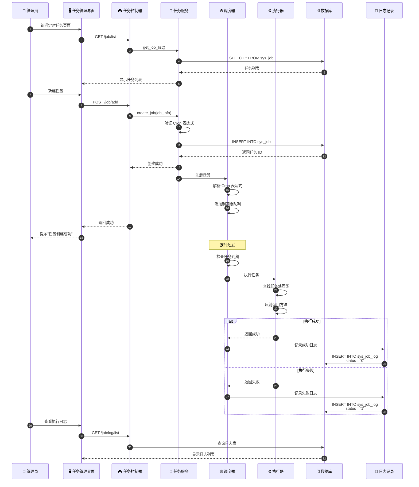

## 2. Cron 表达式解析

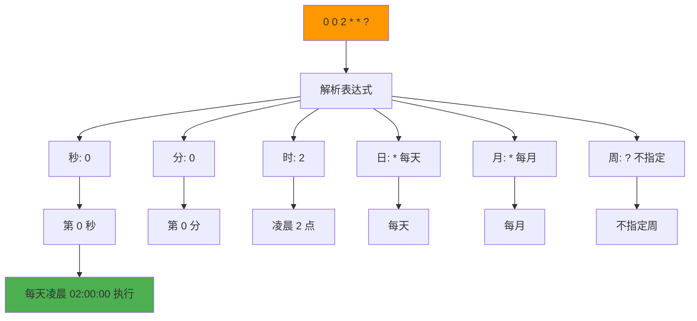

## 3. 定时任务状态流转

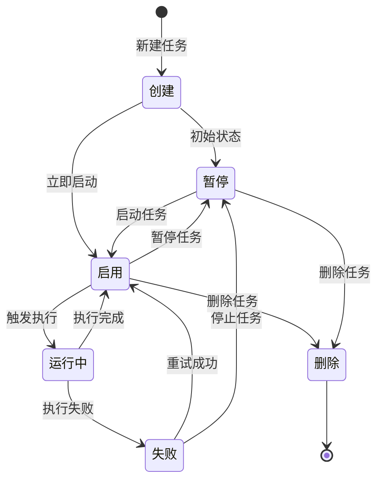

## 4. 任务执行流程

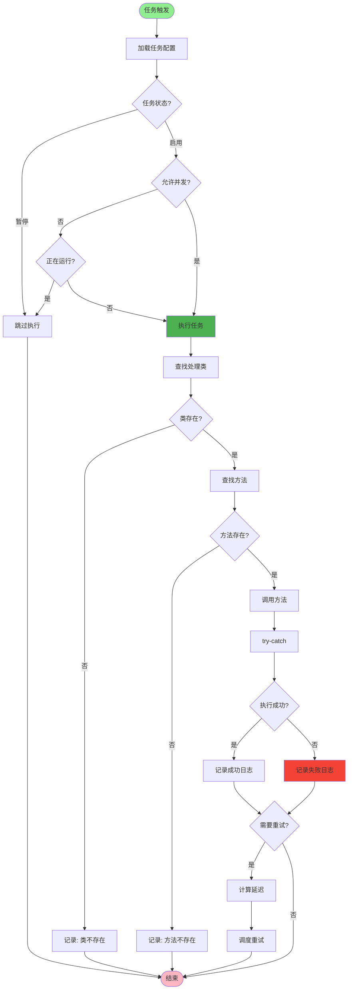

## 5. 任务调度器架构

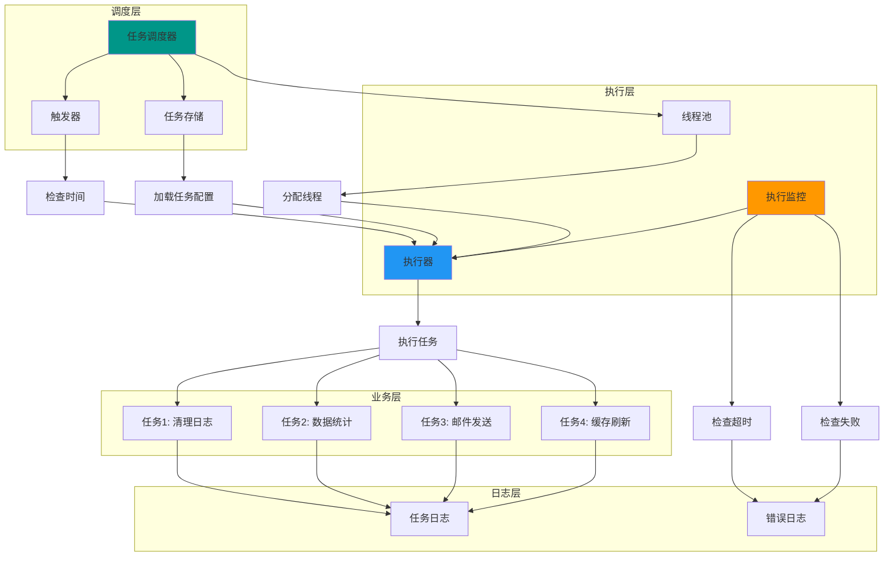

## 6. 常用 Cron 表达式示例

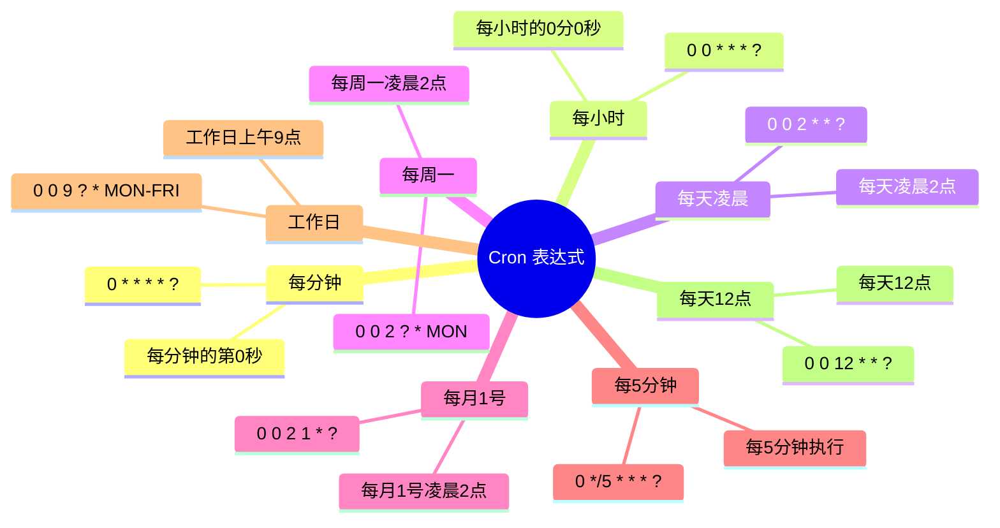

## 7. 任务失败重试策略

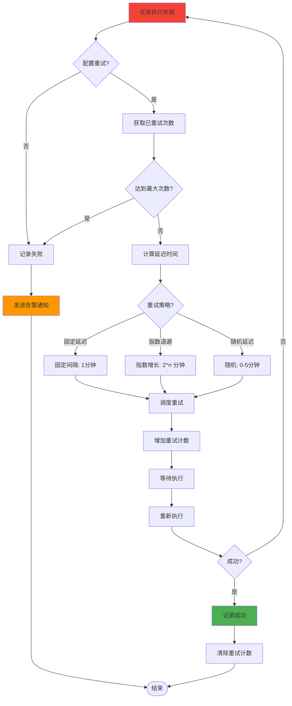

## 8. 任务并发控制

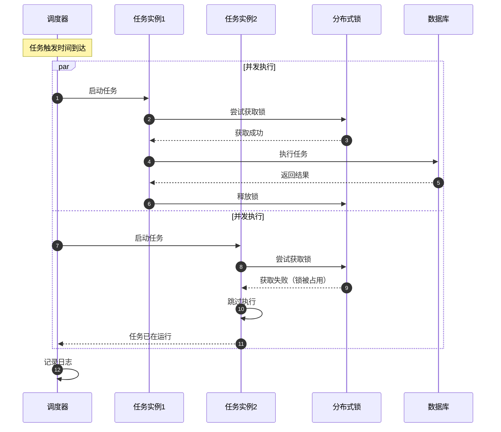

## 9. 任务监控告警

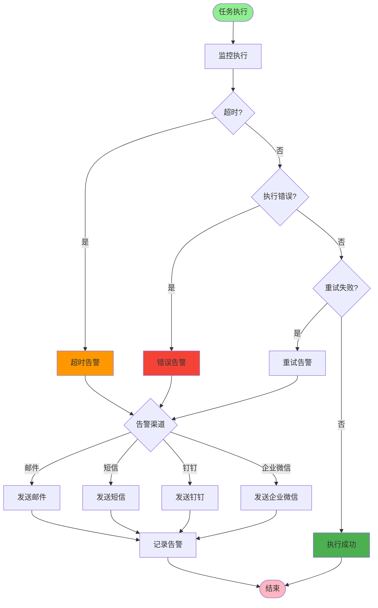

## 10. 任务管理功能

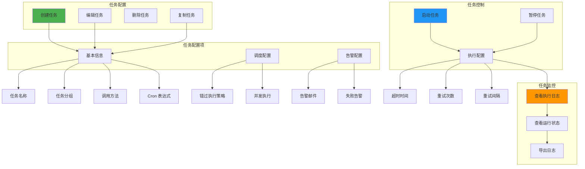

## 11. 系统内置定时任务

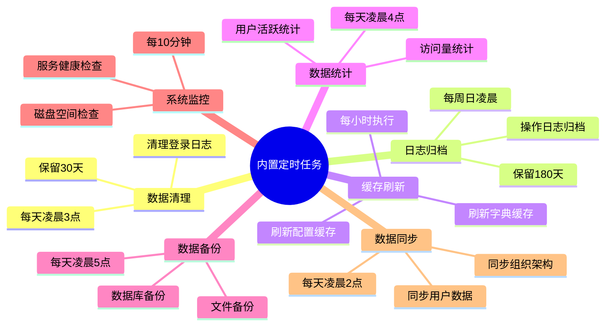

## 关键代码位置

| 功能 | 文件路径 |
|------|---------|
| 任务控制器 | `module_admin/controller/job_controller.py` |
| 任务服务 | `module_admin/service/job_service.py` |
| 任务模型 | `module_admin/entity/do/job_do.py` |
| 任务日志 | `module_admin/entity/do/job_log_do.py` |
| 调度器配置 | `common/scheduler/scheduler_config.py` |
| 任务执行器 | `common/scheduler/job_executor.py` |
| Cron 解析 | `common/utils/cron_utils.py` |

## Cron 表达式格式

```
格式: 秒 分 时 日 月 周

字段    允许值          允许特殊字符
秒      0-59            , - * /
分      0-59            , - * /
时      0-23            , - * /
日      1-31            , - * ? / L W
月      1-12 或 JAN-DEC , - * /
周      1-7 或 SUN-SAT  , - * ? / L #

特殊字符:
*  : 所有值
?  : 不指定值（仅用于日和周）
-  : 范围（如 10-12）
,  : 列举（如 1,3,5）
/  : 步长（如 0/15 每15分钟）
L  : 最后（日或周）
W  : 工作日
#  : 第几个周几
```
