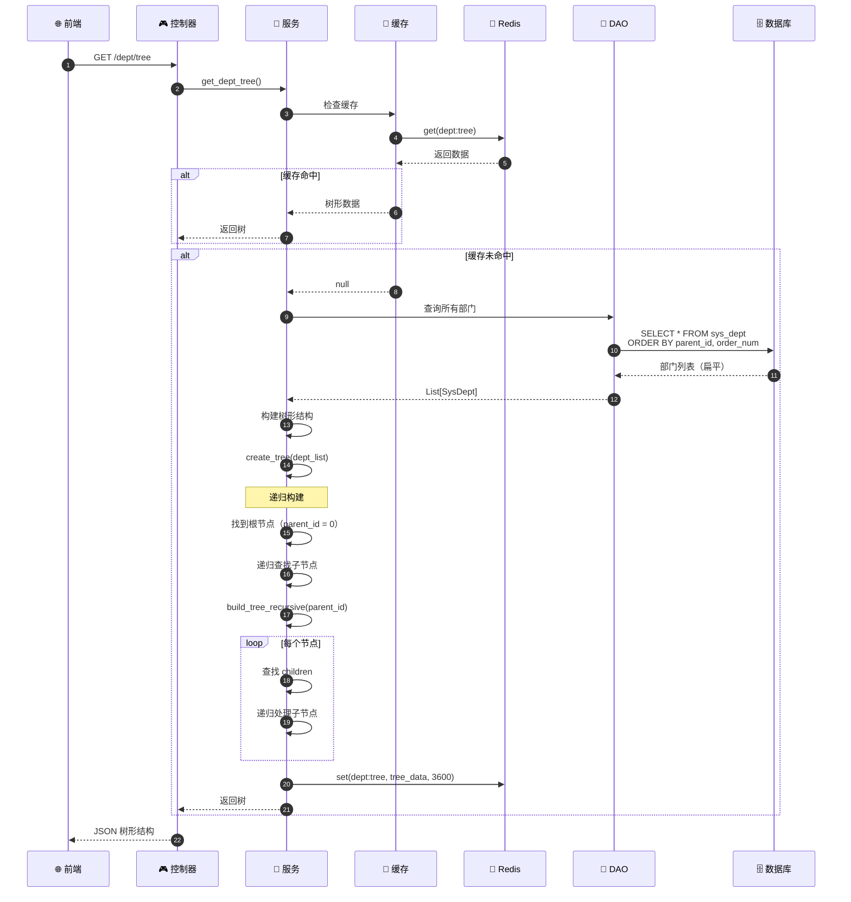
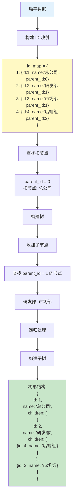
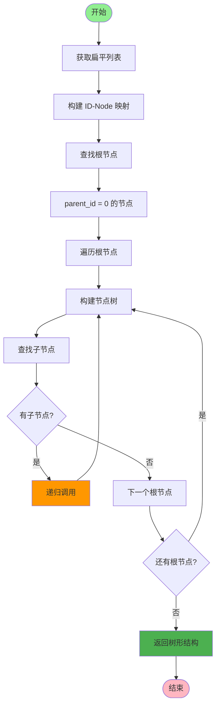
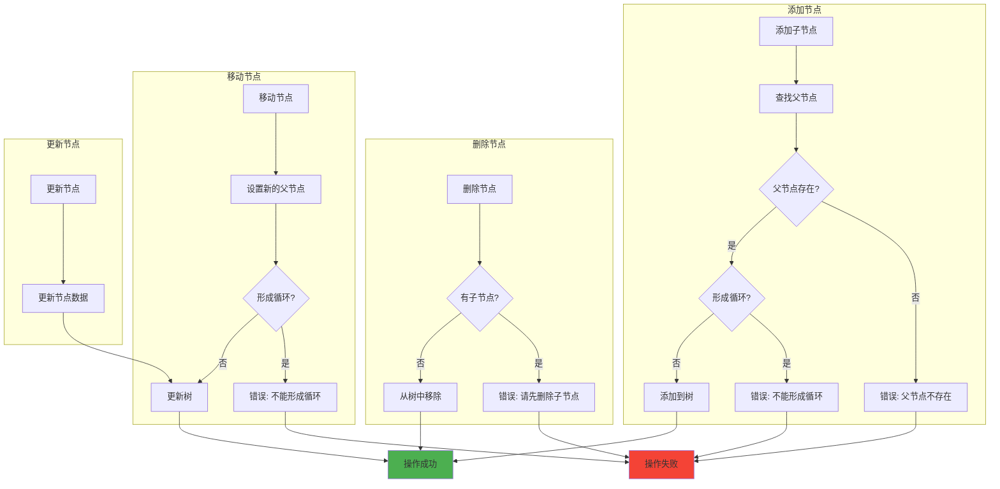
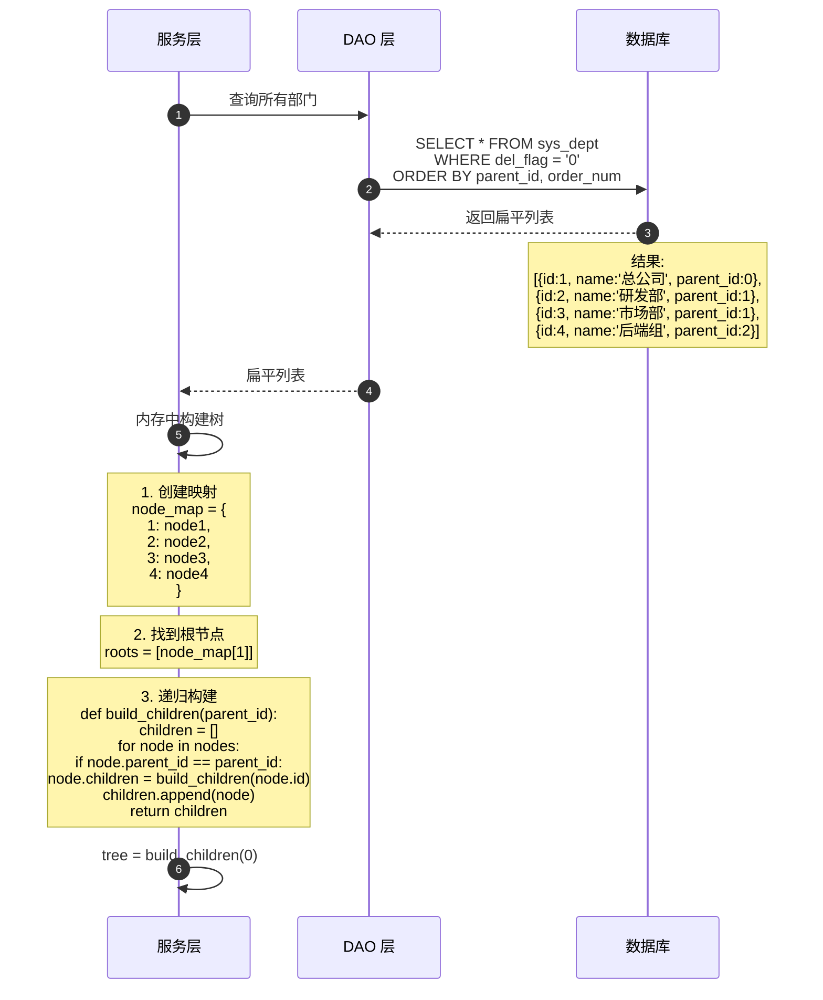
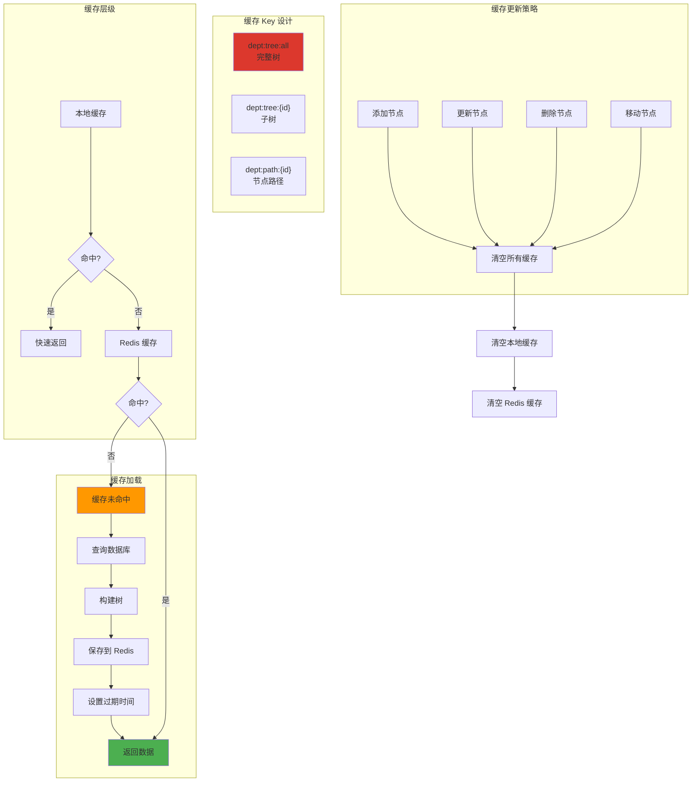
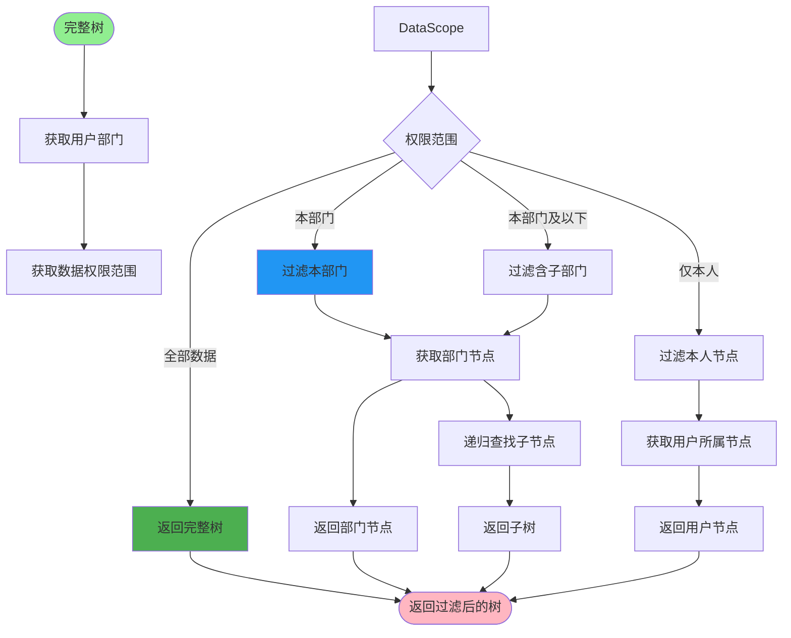
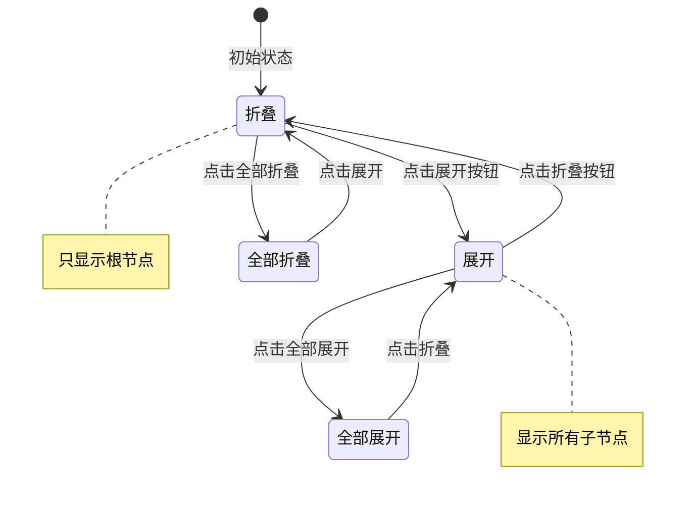
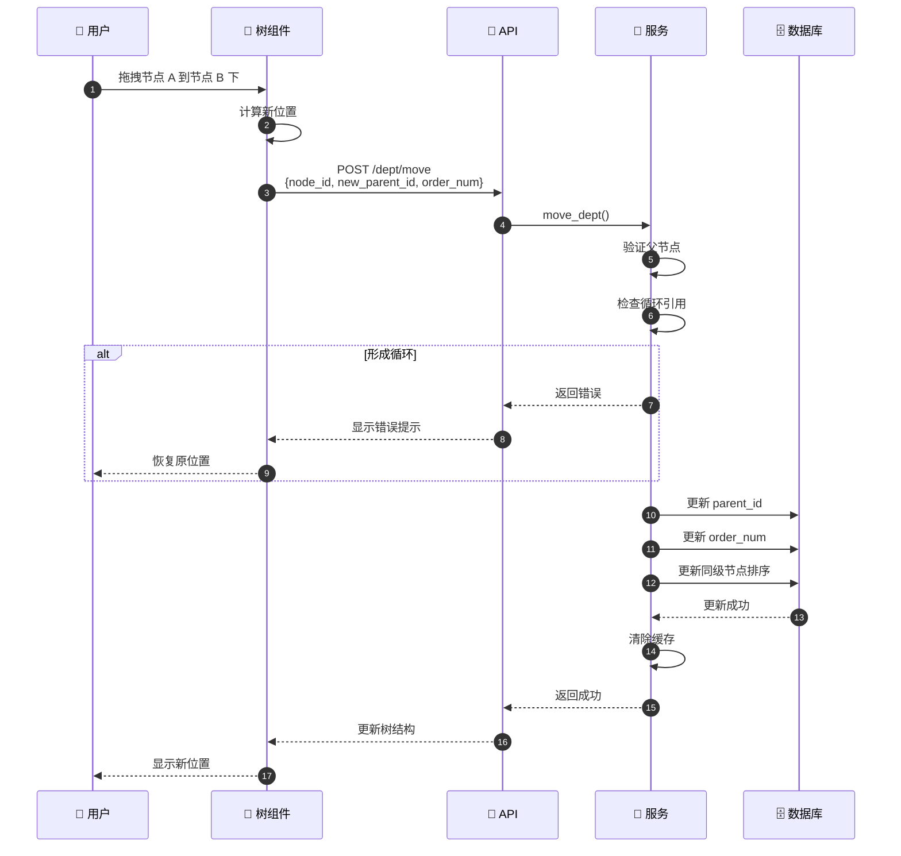
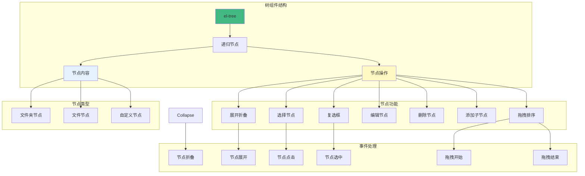

# 树形结构构建流程详解

## 1. 部门树构建完整流程



## 2. 树形结构数据转换



## 3. 递归构建算法



## 4. 树节点操作



## 5. 部门树数据库查询



## 6. 树形结构缓存策略



## 7. 树节点权限过滤



## 8. 树形结构展开与折叠



## 9. 树节点拖拽排序



## 10. 前端树组件渲染



## 11. 树形结构性能优化

```mermaid
mindmap
    root((性能优化))
        数据库优化
            添加索引
                parent_id
                order_num
            使用递归 CTE
                MySQL 8.0+
                PostgreSQL
        缓存优化
            Redis 缓存
                完整树缓存
                子树缓存
            本地缓存
                进程内缓存
        查询优化
            按需加载
                懒加载子节点
                分页加载
            批量查询
                一次性查询所有
                减少数据库往返
        算法优化
            使用字典映射
                O(1) 查找
            避免递归过深
                使用栈
                使用队列
        前端优化
            虚拟滚动
                只渲染可见节点
            延迟渲染
                按需展开
```

## 关键代码位置

| 功能 | 文件路径 |
|------|---------|
| 部门控制器 | `module_admin/controller/dept_controller.py` |
| 部门服务 | `module_admin/service/dept_service.py` |
| 部门 DAO | `module_admin/dao/dept_dao.py` |
| 部门模型 | `module_admin/entity/do/dept_do.py` |
| 树构建工具 | `common/utils/tree_utils.py` |
| 前端树组件 | `ruoyi-fastapi-frontend/src/components/DeptTree/index.vue` |

## 树形结构数据示例

### 扁平数据（数据库存储）
```json
[
  {"id": 1, "name": "总公司", "parentId": 0, "orderNum": 1},
  {"id": 2, "name": "研发部", "parentId": 1, "orderNum": 1},
  {"id": 3, "name": "市场部", "parentId": 1, "orderNum": 2},
  {"id": 4, "name": "后端组", "parentId": 2, "orderNum": 1},
  {"id": 5, "name": "前端组", "parentId": 2, "orderNum": 2}
]
```

### 树形数据（API 返回）
```json
{
  "id": 1,
  "name": "总公司",
  "children": [
    {
      "id": 2,
      "name": "研发部",
      "children": [
        {"id": 4, "name": "后端组"},
        {"id": 5, "name": "前端组"}
      ]
    },
    {
      "id": 3,
      "name": "市场部",
      "children": []
    }
  ]
}
```
