# 缓存使用流程详解

## 1. 缓存读写完整流程

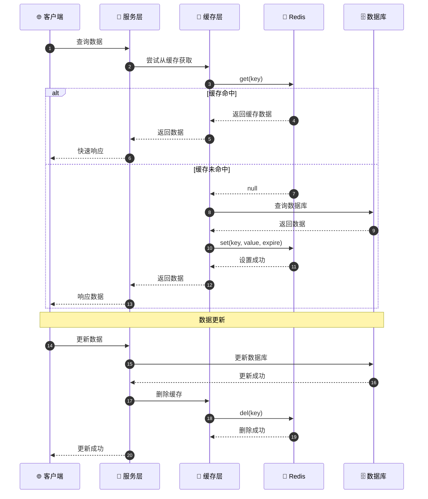

## 2. 缓存策略模式

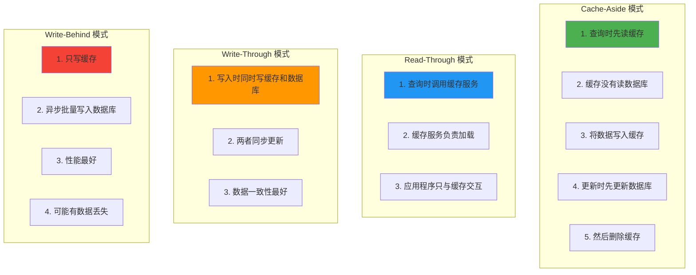

## 3. 多级缓存架构

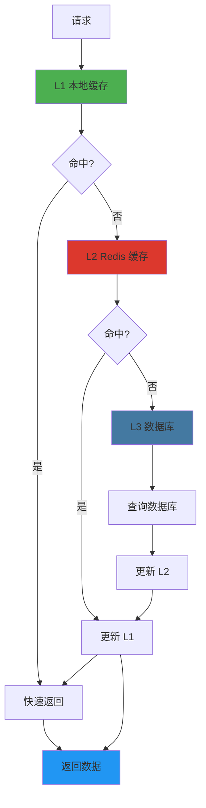

## 4. 缓存穿透防护

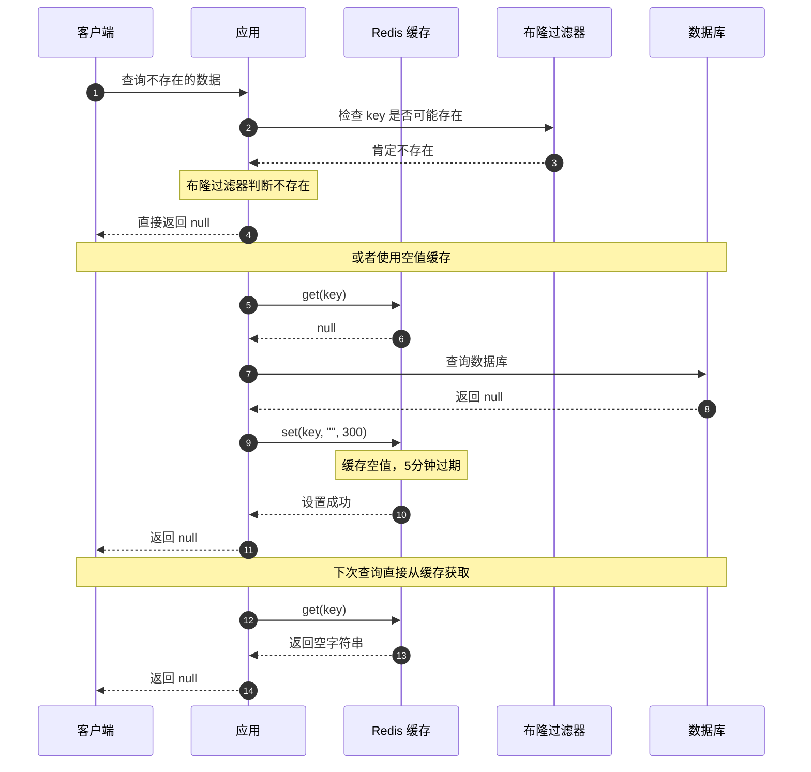

## 5. 缓存雪崩防护

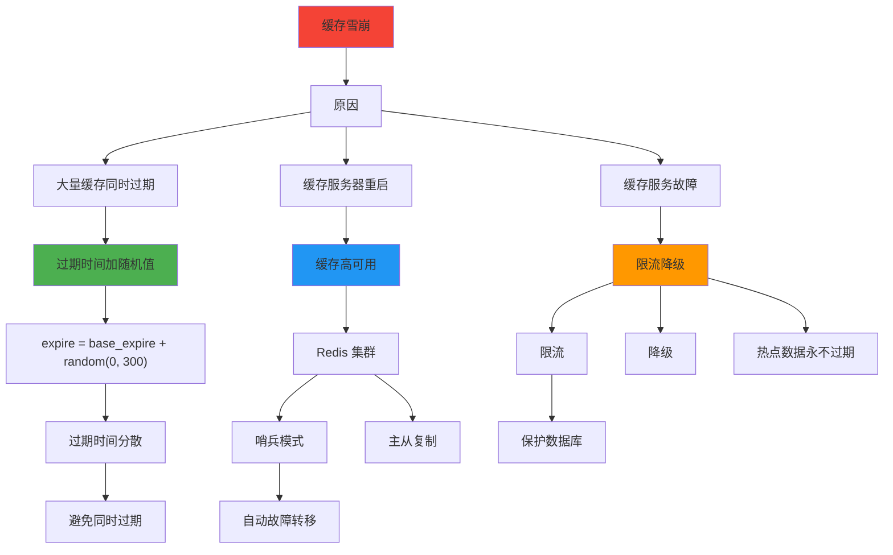

## 6. 缓存击穿防护

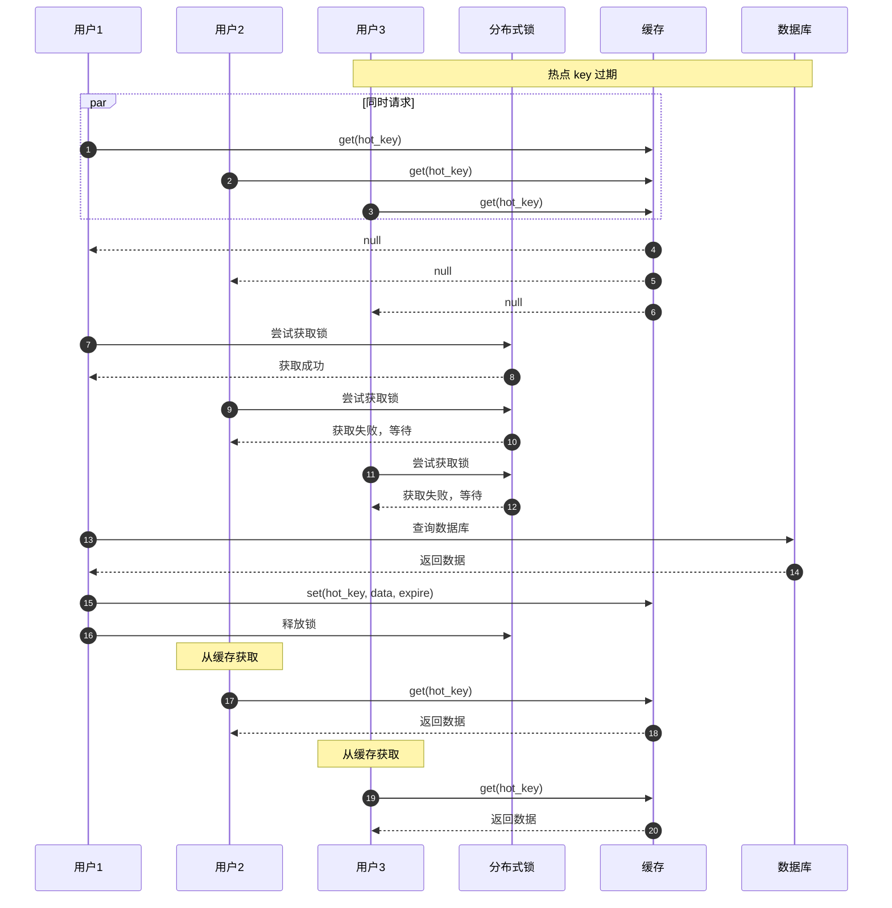

## 7. 缓存更新策略

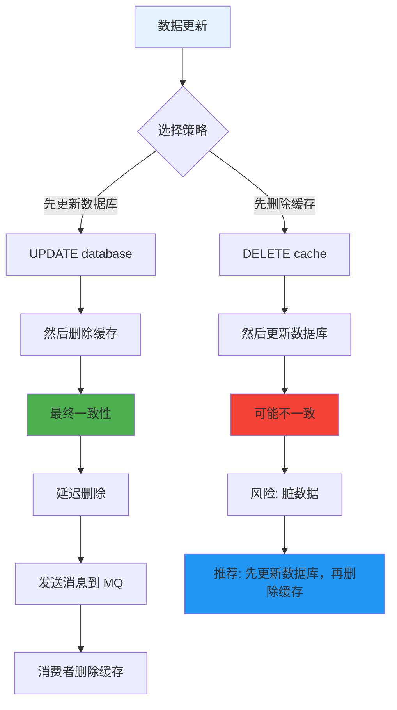

## 8. 缓存预热

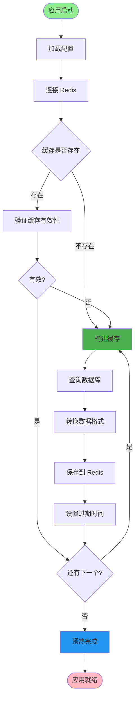

## 9. 项目缓存使用场景

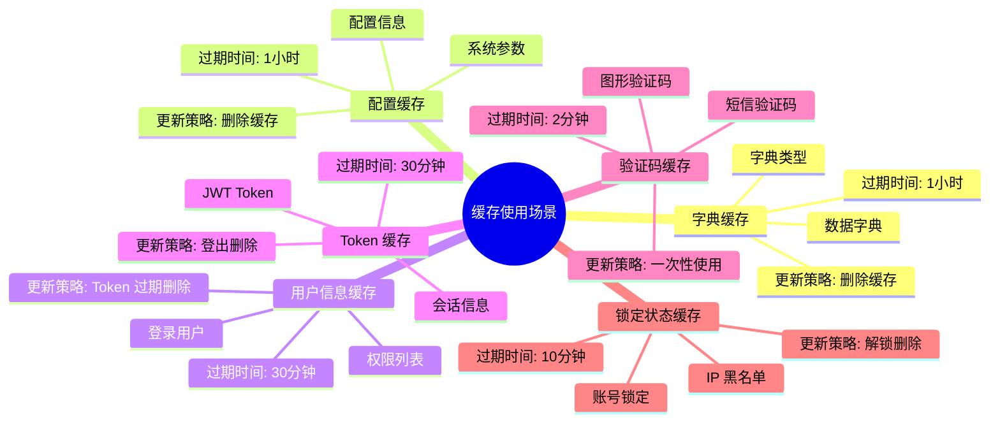

## 10. 缓存 Key 设计规范

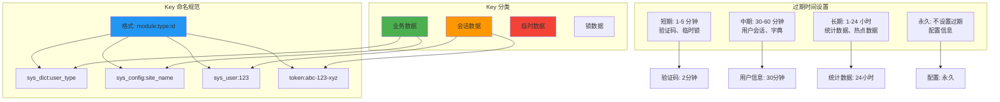

## 11. 缓存监控与告警

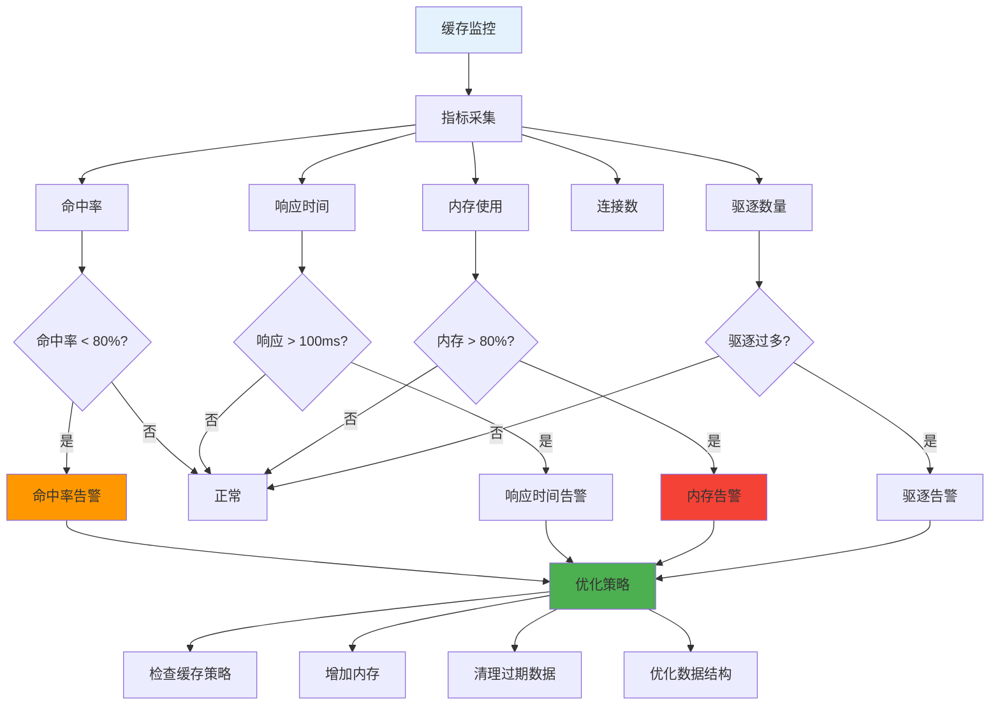

## 12. 分布式锁实现

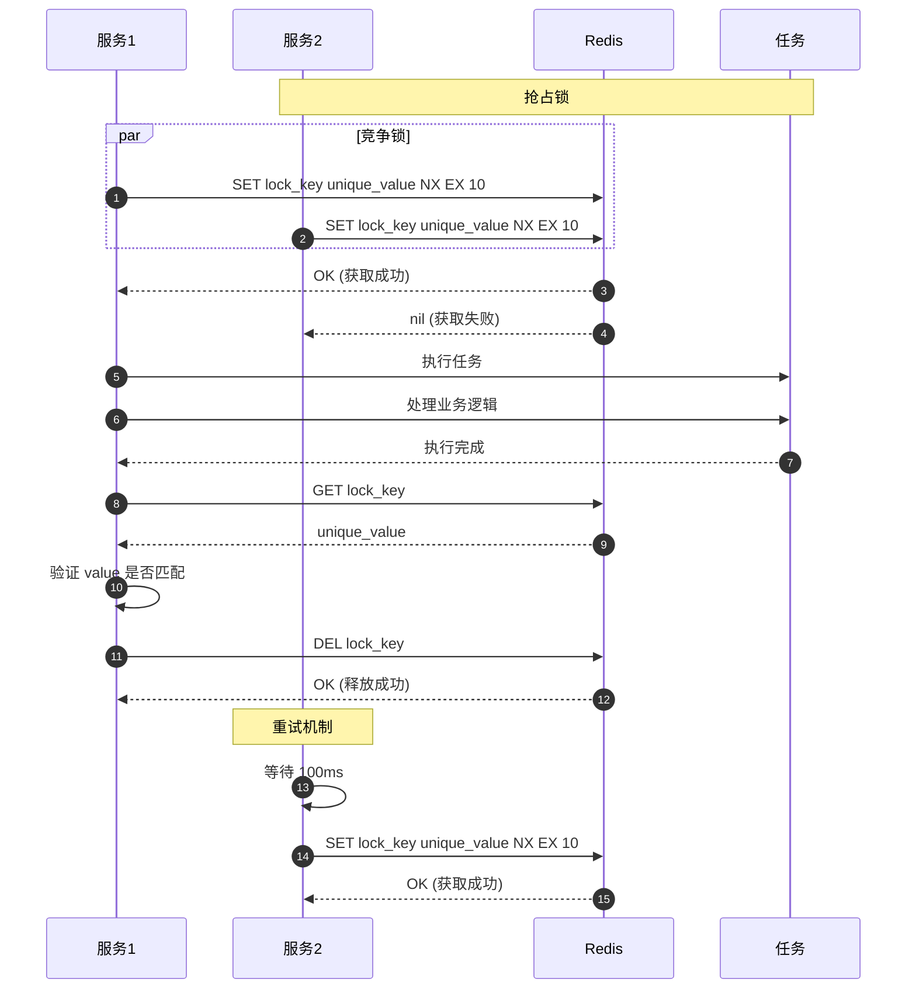

## 关键代码位置

| 功能 | 文件路径 |
|------|---------|
| Redis 配置 | `config/redis_config.py` |
| 异步 Redis | `common/redis/async_redis.py` |
| 缓存服务 | `common/service/cache_service.py` |
| 分布式锁 | `common/redis/redis_lock.py` |
| 缓存常量 | `common/constants/cache_constants.py` |

## 缓存配置示例

```python
# 缓存配置
class CacheConfig:
    # 缓存命名空间
    PREFIX = "ruoyi:"

    # 过期时间（秒）
    EXPIRE_DICT = 3600        # 字典缓存: 1小时
    EXPIRE_CONFIG = 3600      # 配置缓存: 1小时
    EXPIRE_TOKEN = 1800       # Token缓存: 30分钟
    EXPIRE_CAPTCHA = 120      # 验证码: 2分钟
    EXPIRE_LOCK = 600         # 锁定: 10分钟

    # 缓存 Key 模板
    KEY_DICT = f"{PREFIX}dict:{{type}}"
    KEY_CONFIG = f"{PREFIX}config:{{key}}"
    KEY_TOKEN = f"{PREFIX}token:{{token}}"
    KEY_USER = f"{PREFIX}user:{{user_id}}"
    KEY_PERMISSION = f"{PREFIX}permission:{{user_id}}"
```
