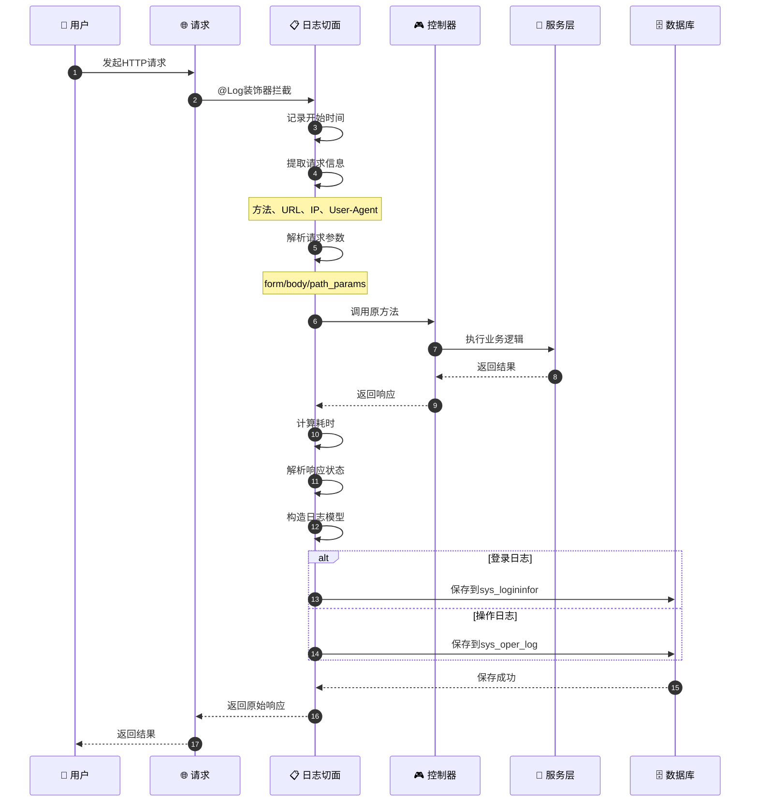
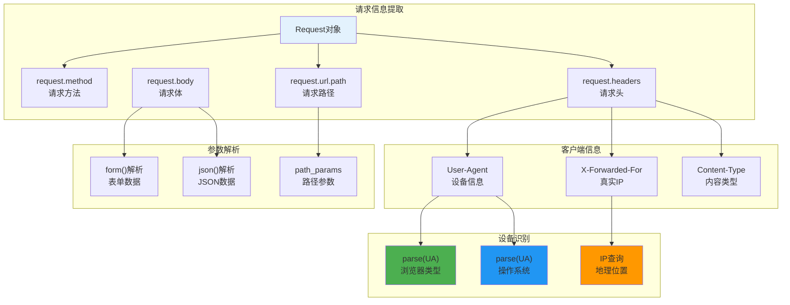
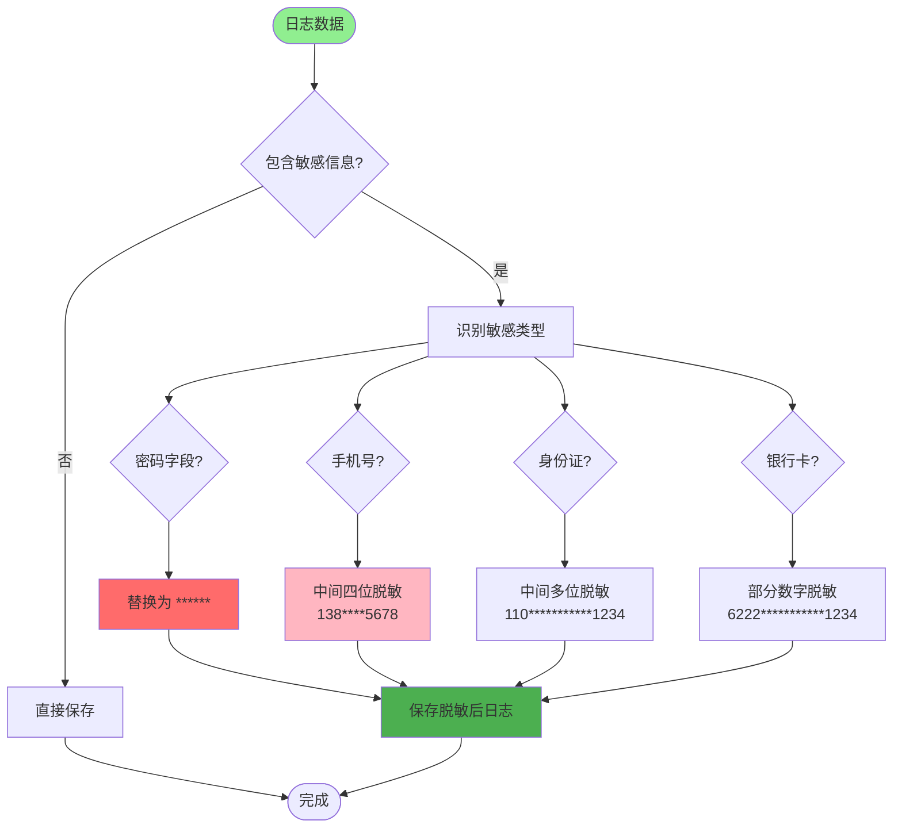
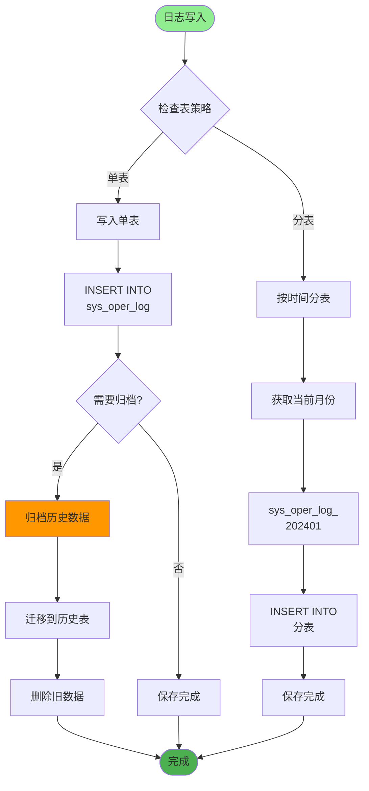
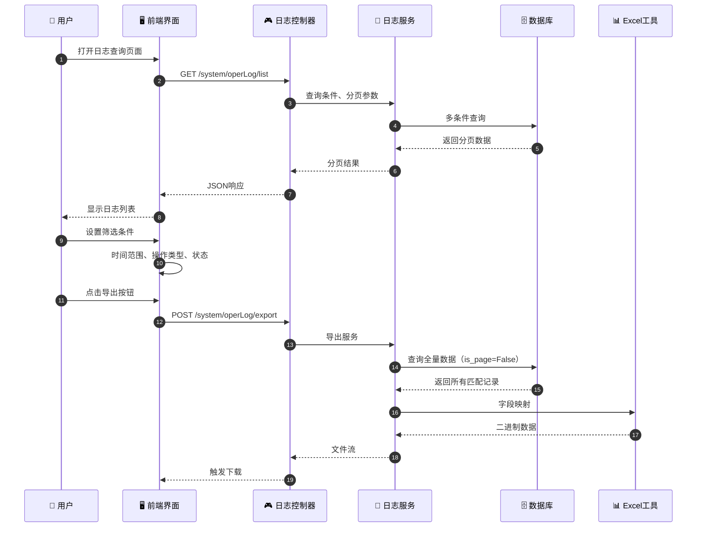
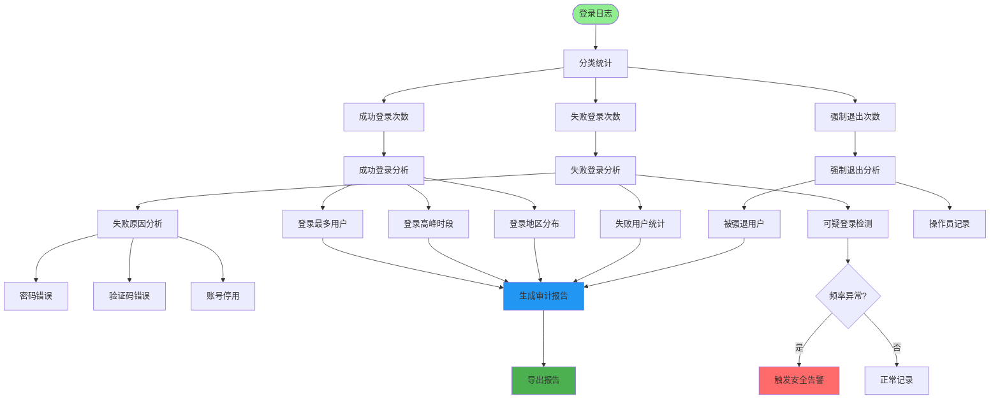
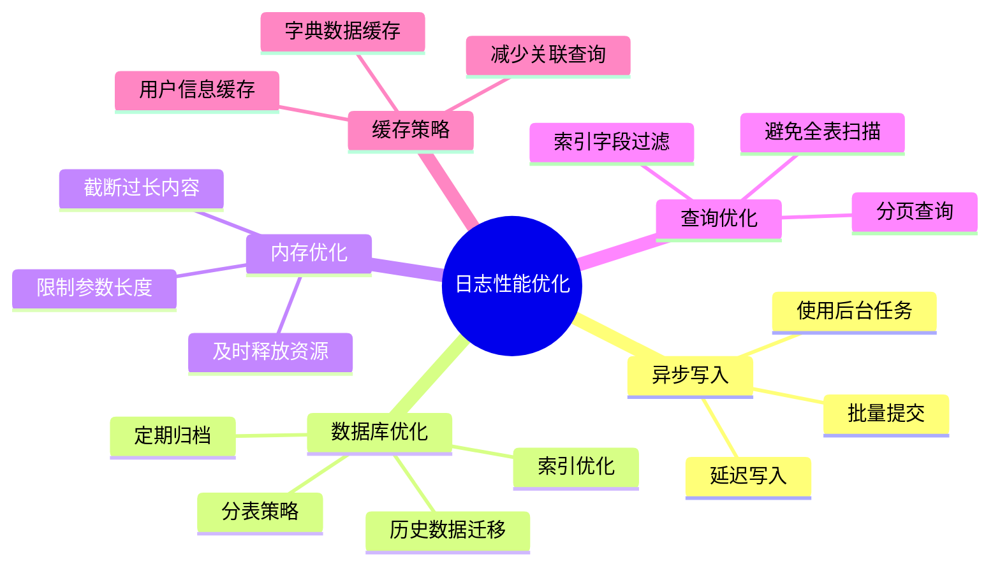
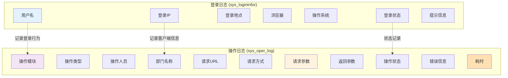
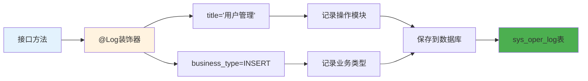
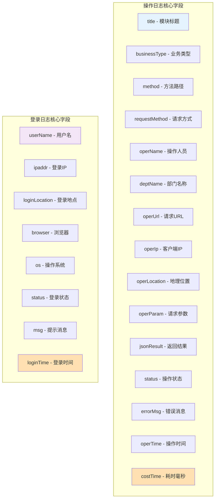

# 操作日志与登录日志详解

## 1. 日志收集完整流程时序图



## 2. AOP 日志切面拦截机制

```mermaid
graph TD
    Start([请求到达]) --> CheckDecorator{有@Log装饰器?}

    CheckDecorator -->|否| Execute[直接执行方法]
    CheckDecorator -->|是| EnterAspect[进入日志切面]

    EnterAspect --> RecordStart[记录开始时间]
    RecordStart --> ExtractRequest[提取请求信息]

    ExtractRequest --> GetMethod[获取请求方法]
    ExtractRequest --> GetURL[获取请求URL]
    ExtractRequest --> GetIP[获取客户端IP]
    ExtractRequest --> GetUA[获取User-Agent]

    GetMethod --> ParseParams[解析请求参数]
    GetURL --> ParseParams
    GetIP --> ParseParams
    GetUA --> ParseParams

    ParseParams --> DetectType{Content-Type?}

    DetectType -->|form-data| ParseForm[解析表单数据]
    DetectType -->|json| ParseJSON[解析JSON数据]

    ParseForm --> ExecuteMethod[执行原方法]
    ParseJSON --> ExecuteMethod

    ExecuteMethod --> CatchResponse[捕获响应]
    CatchResponse --> CalcCost[计算耗时]
    CalcCost --> BuildLog[构造日志模型]

    Execute --> Execute

    style Start fill:#90EE90
    style ExecuteMethod fill:#2196F3
    style BuildLog fill:#4CAF50
```

## 3. 日志数据提取与解析



## 4. 敏感信息脱敏流程



## 5. 日志存储策略（分表/归档）



## 6. 日志查询与导出流程



## 7. 登录日志审计分析



## 8. 日志性能优化策略



## 9. 日志类型对比



## 关键代码位置

| 功能 | 文件路径 |
|------|---------|
| 日志注解 | `module_admin/annotation/log_annotation.py` |
| 日志控制器 | `module_admin/controller/log_controller.py` |
| 日志服务 | `module_admin/service/log_service.py` |
| 日志DAO | `module_admin/dao/log_dao.py` |
| 操作日志模型 | `module_admin/entity/do/oper_log_do.py` |
| 登录日志模型 | `module_admin/entity/do/logininfor_do.py` |

## 日志装饰器使用示例



## 日志数据结构


