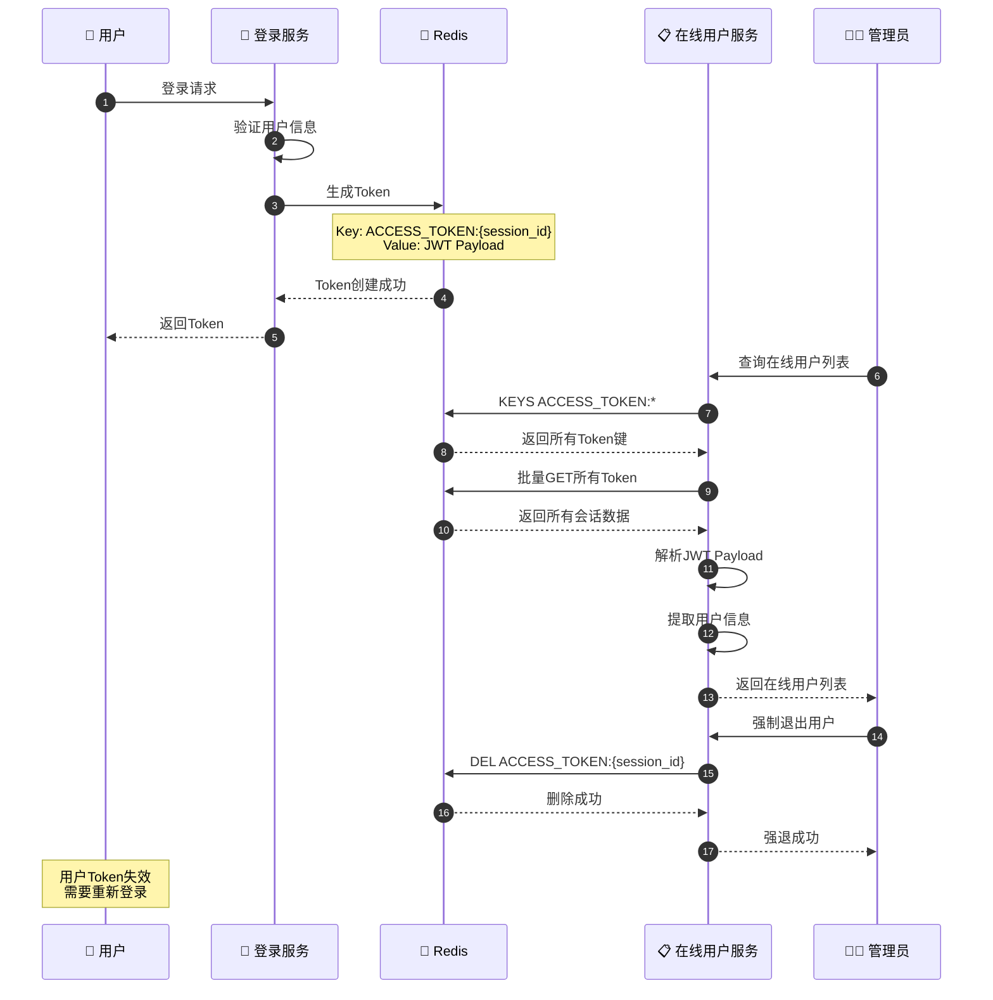
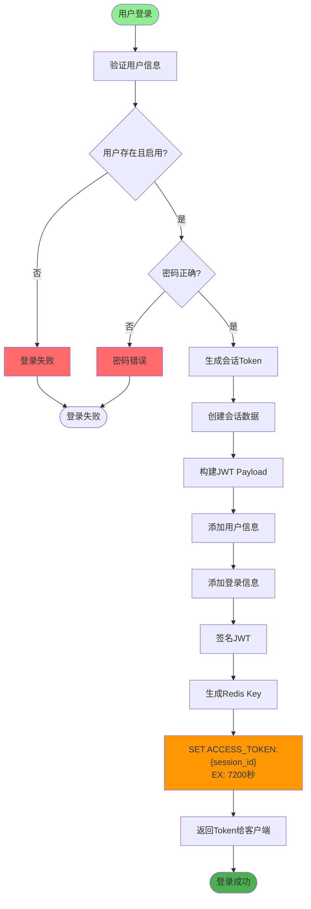
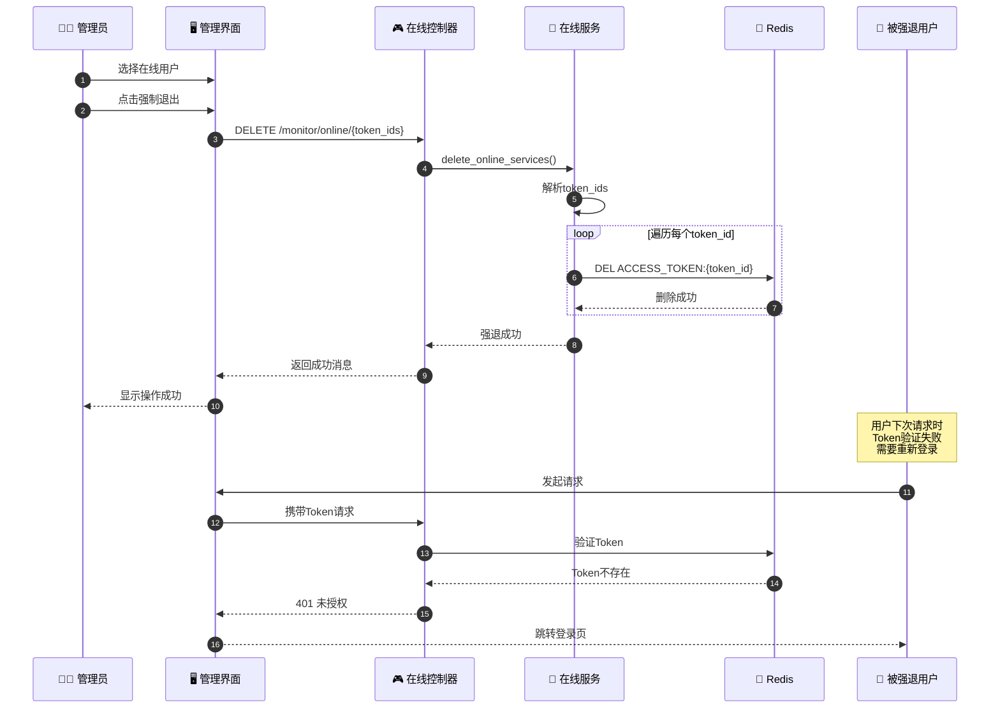
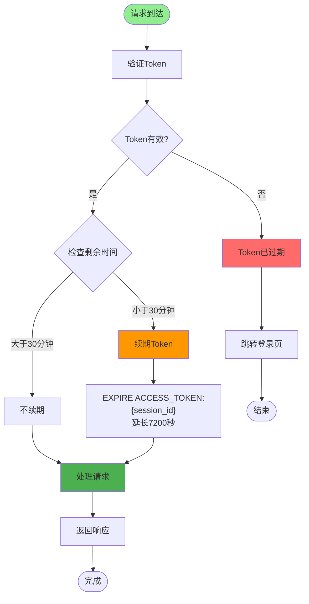
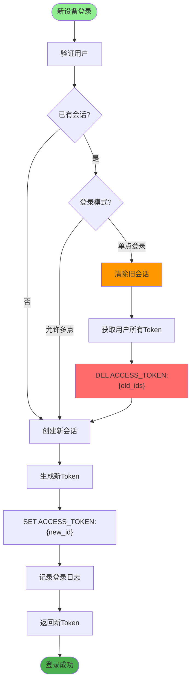
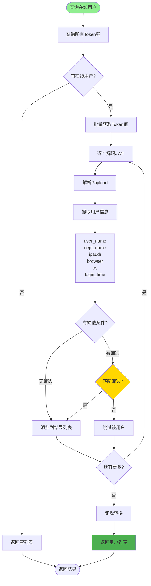
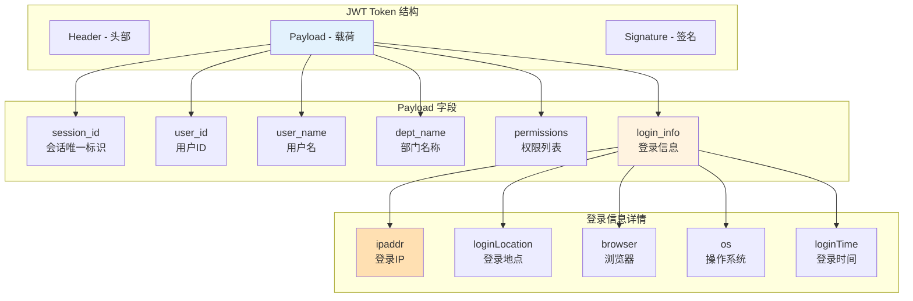
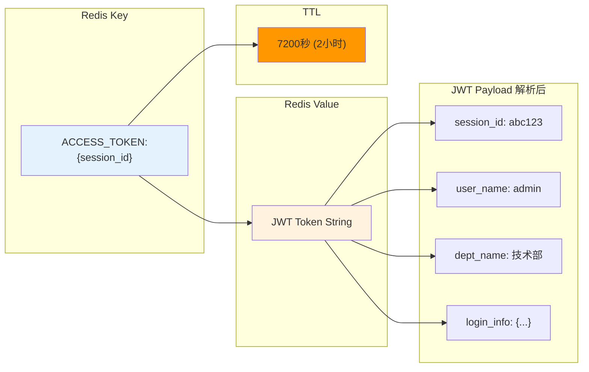
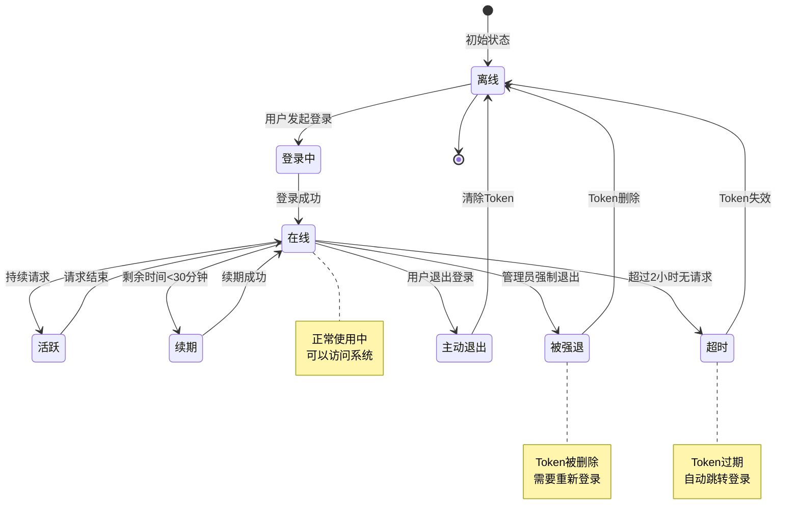

# 在线用户管理详解

## 1. 在线用户会话管理完整流程

## 2. 会话创建与存储流程

## 3. 强制退出用户流程

## 4. 会话超时与续期机制

## 5. 并发登录控制（单点登录）

## 6. 在线用户列表查询流程

## 7. JWT Payload 结构

## 关键代码位置

| 功能 | 文件路径 |
|------|---------|
| 在线用户控制器 | `module_admin/controller/online_controller.py` |
| 在线用户服务 | `module_admin/service/online_service.py` |
| 登录服务 | `module_admin/service/login_service.py` |
| Redis配置枚举 | `config/enums.py` (RedisInitKeyConfig.ACCESS_TOKEN) |
| 在线用户模型 | `module_admin/entity/vo/online_vo.py` |

## Redis 会话存储结构

## 在线用户状态流转

