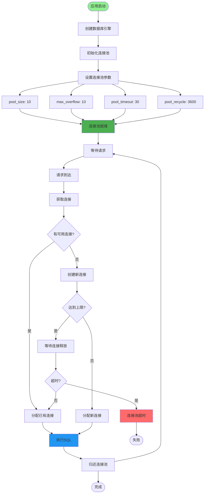
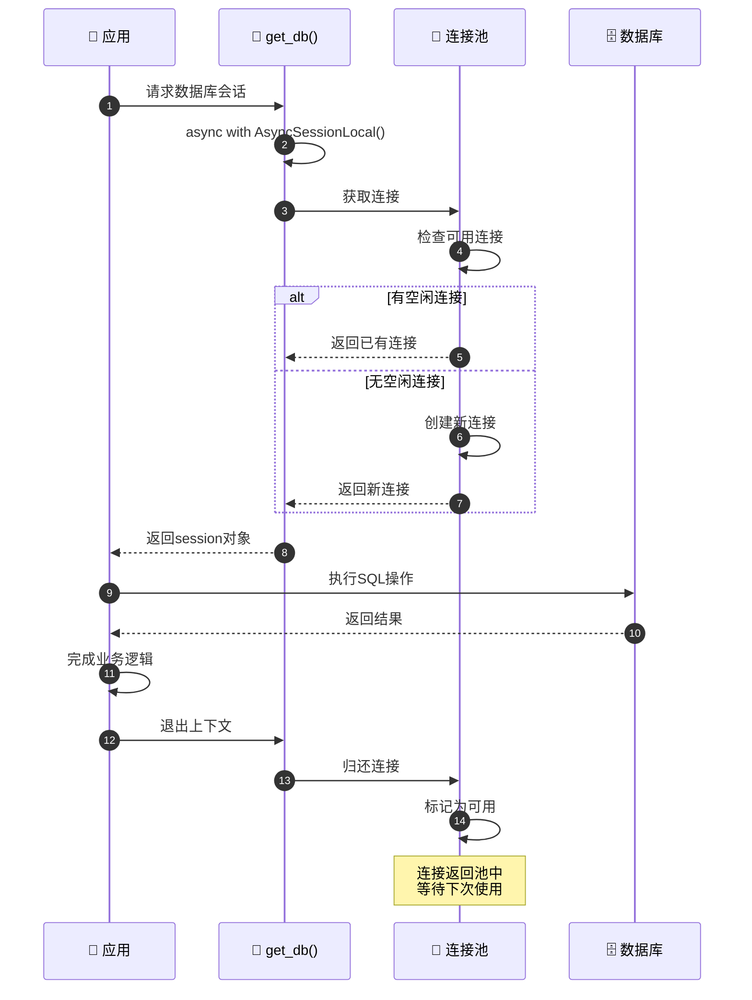
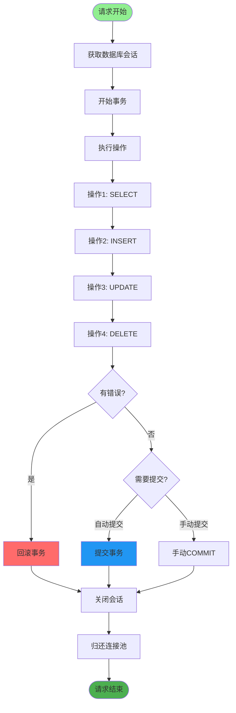
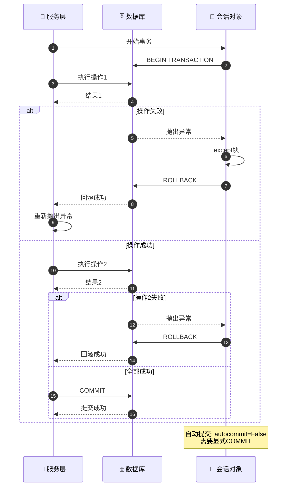
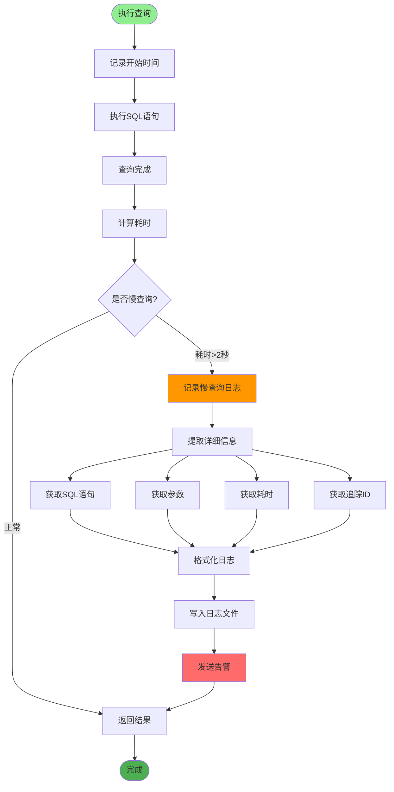
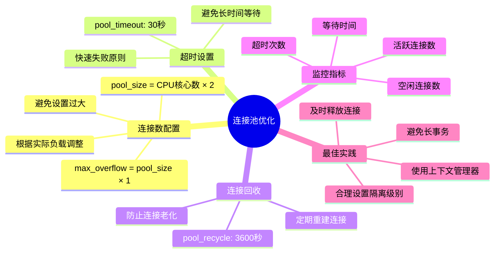
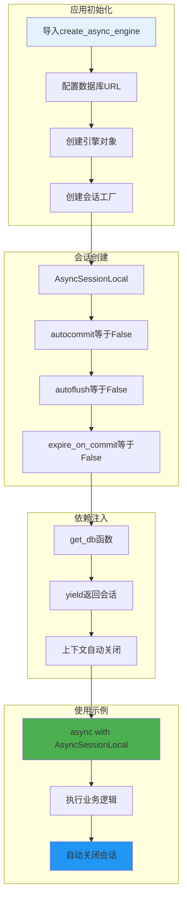
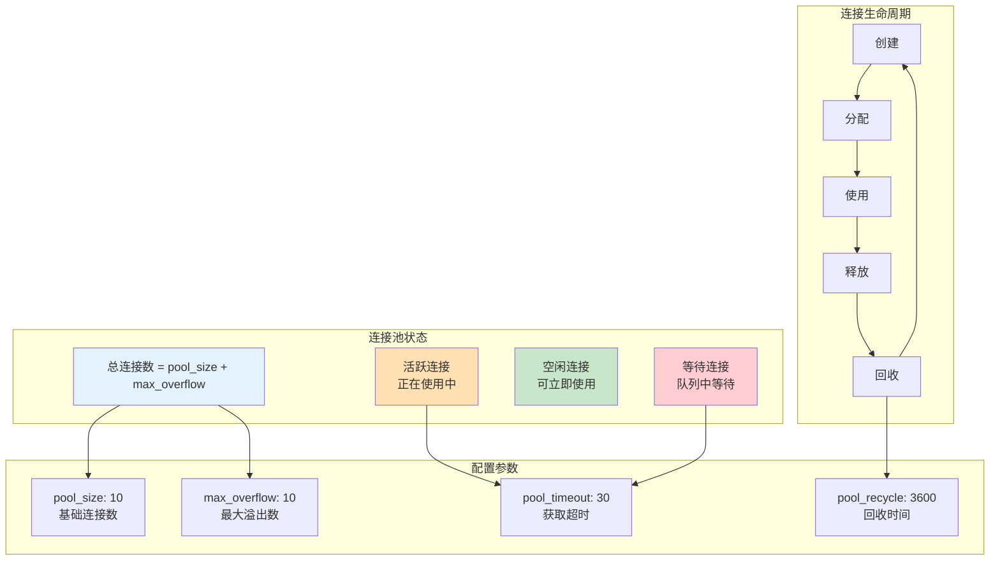
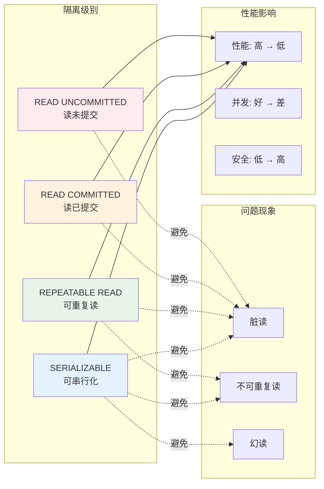
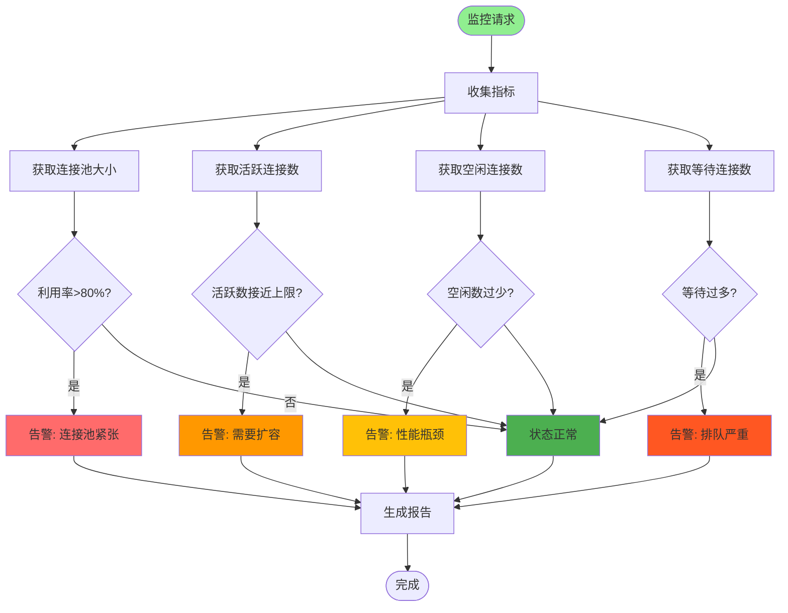

# 数据库连接池与事务管理详解

## 1. 连接池工作原理流程图

## 2. 连接获取与释放流程

## 3. 事务边界与传播

## 4. 自动提交与回滚机制

## 5. 慢查询监控流程

## 6. 连接池配置优化建议

## 7. 异步会话管理

## 关键代码位置

| 功能 | 文件路径 |
|------|---------|
| 数据库配置 | `config/database.py` |
| 会话管理 | `config/get_db.py` |
| 环境配置 | `config/env.py` (DataBaseConfig) |
| ORM基类 | `config/database.py` (Base) |
| 会话依赖 | `config/get_db.py` (get_db) |

## 数据库连接池状态

## 事务隔离级别

## 连接池监控指标

