# 接口限流与防护详解

## 1. 限流策略实现流程（建议方案）

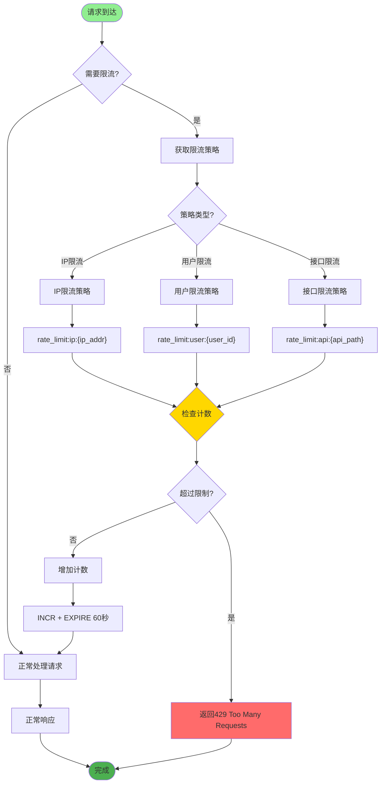

## 2. IP 限流与用户限流

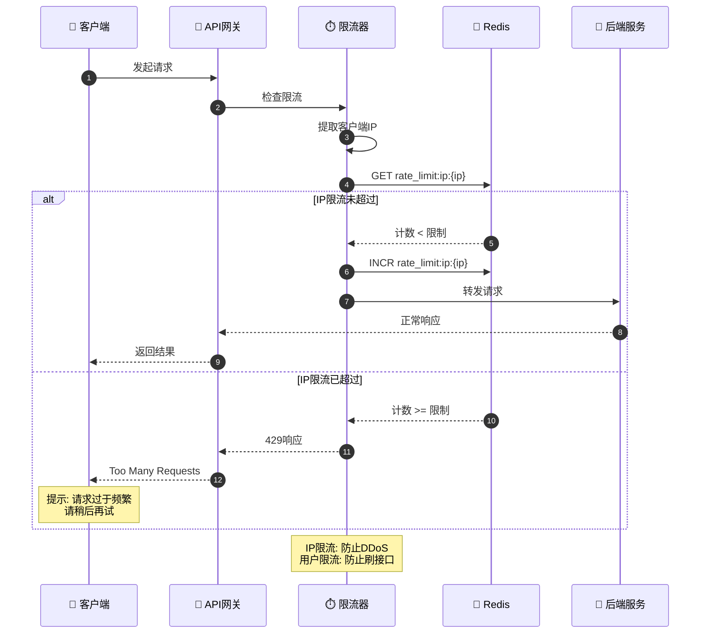

## 3. 滑动窗口算法实现

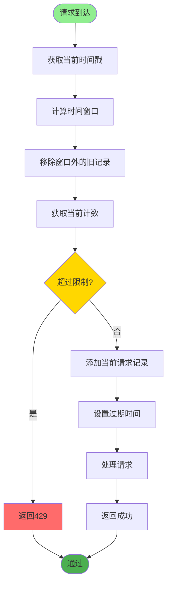

## 4. 接口防刷与验证码

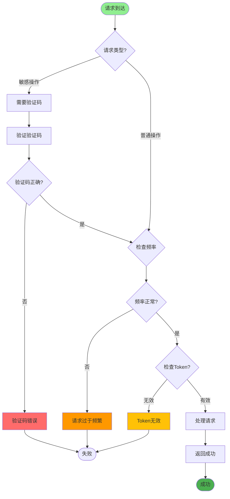

## 5. 黑白名单机制

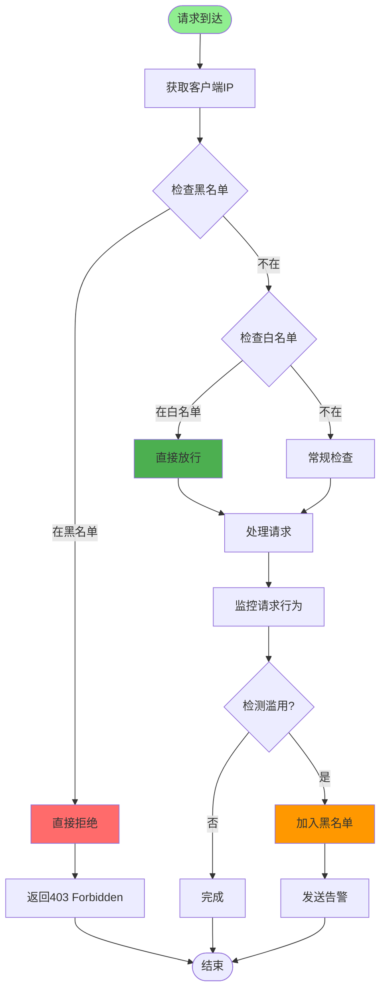

## 6. 限流告警与降级

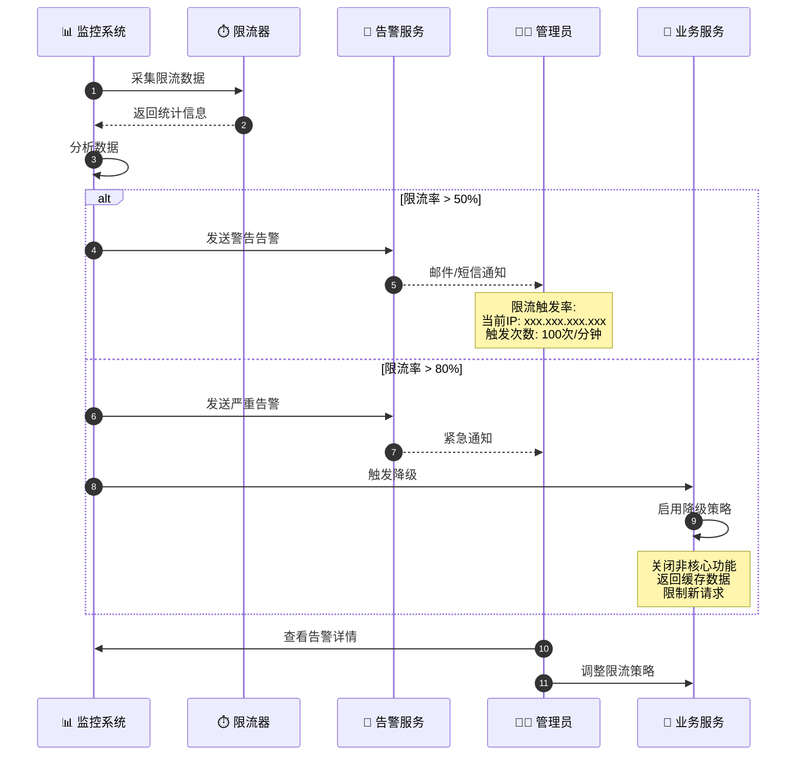

## 7. 分布式限流实现

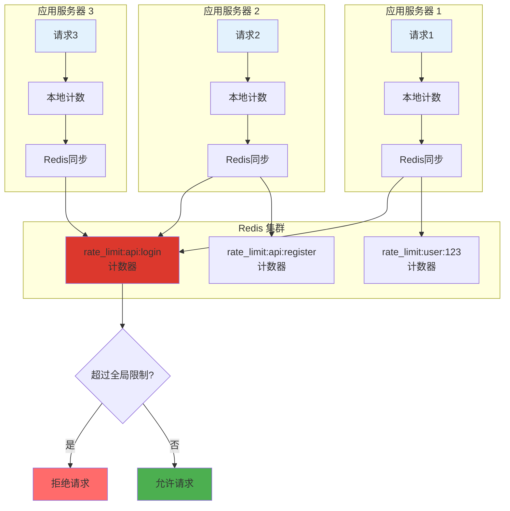

## 8. 关键配置说明

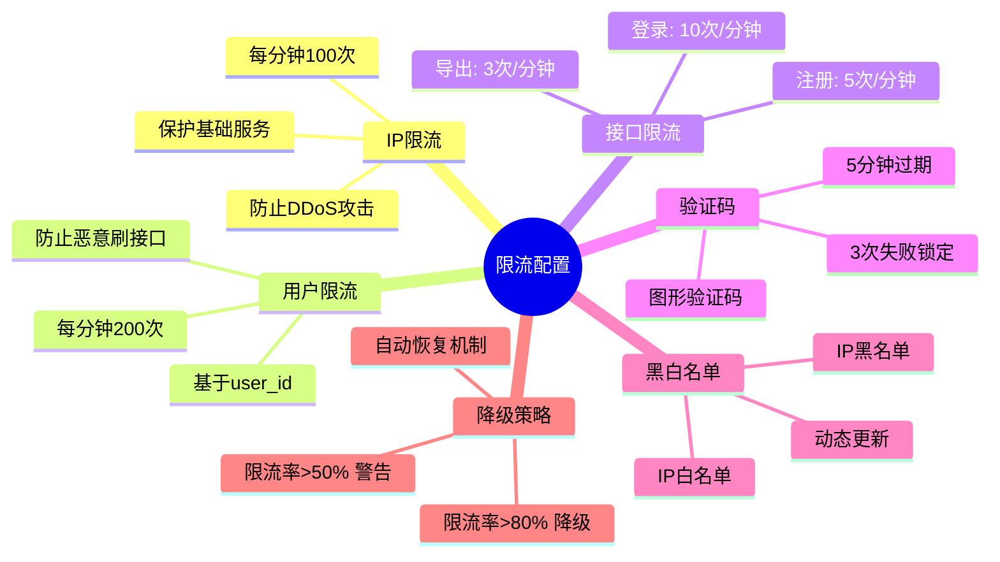

## 限流算法对比

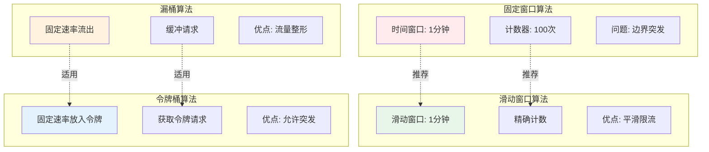

## Redis 限流实现

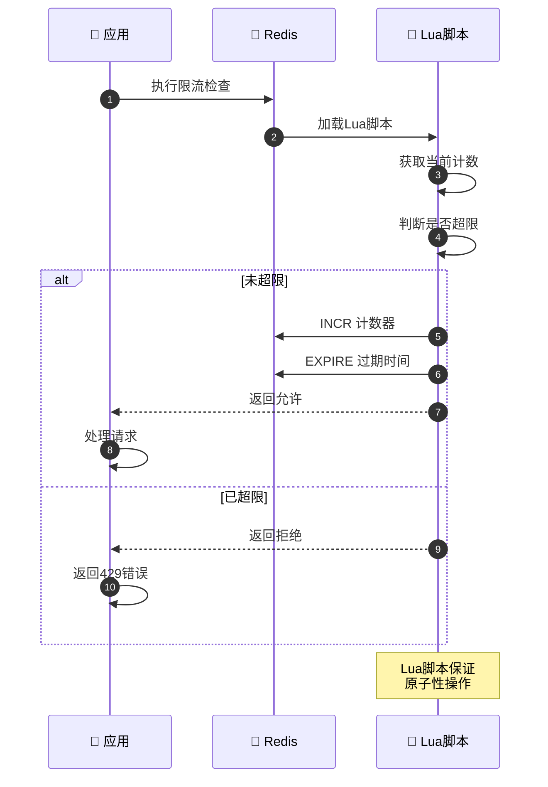

## 限流防护层次

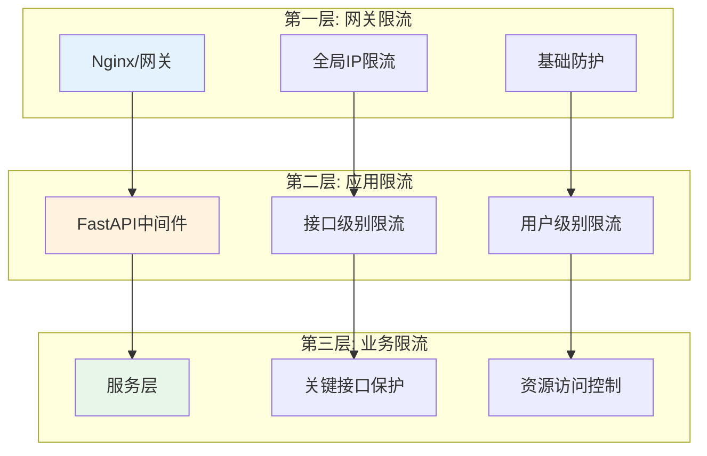

## 限流监控指标

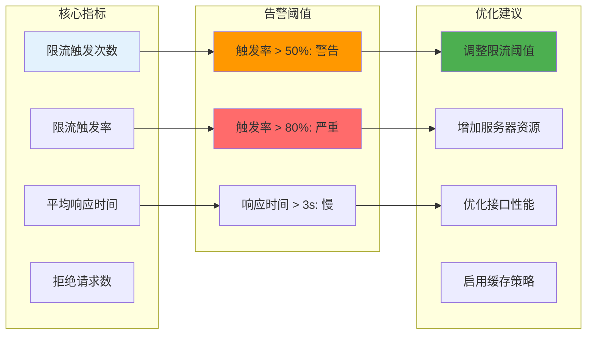

## 实现建议

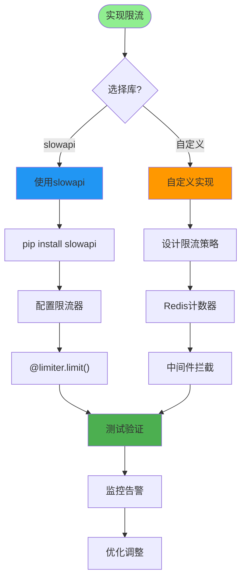

## 注意事项

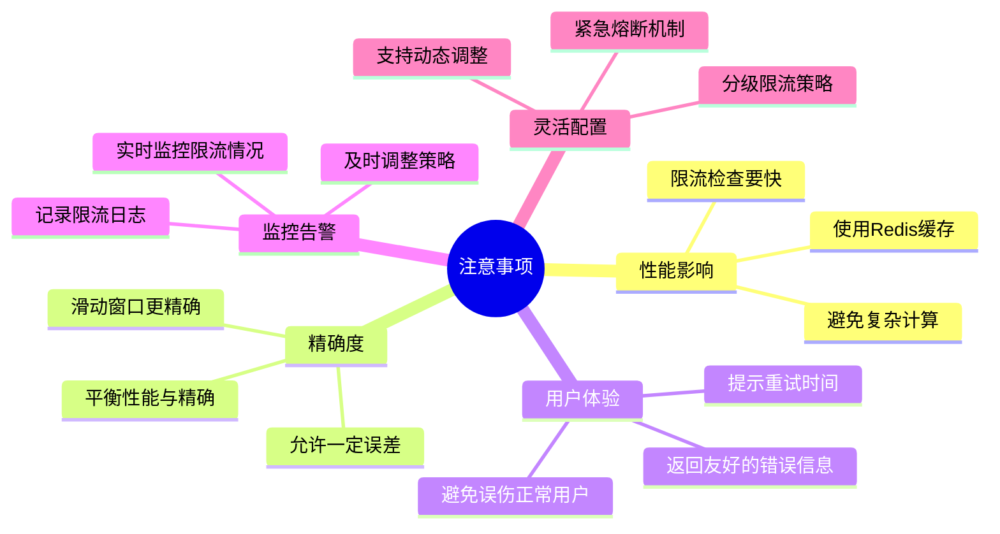
