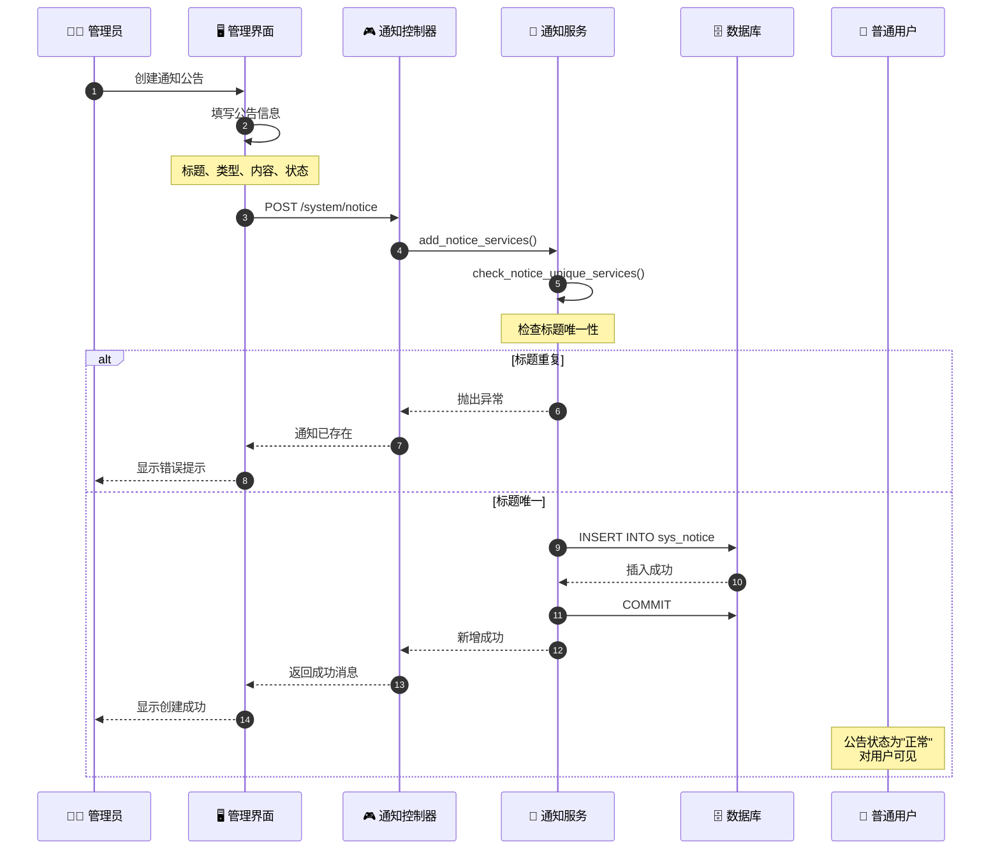
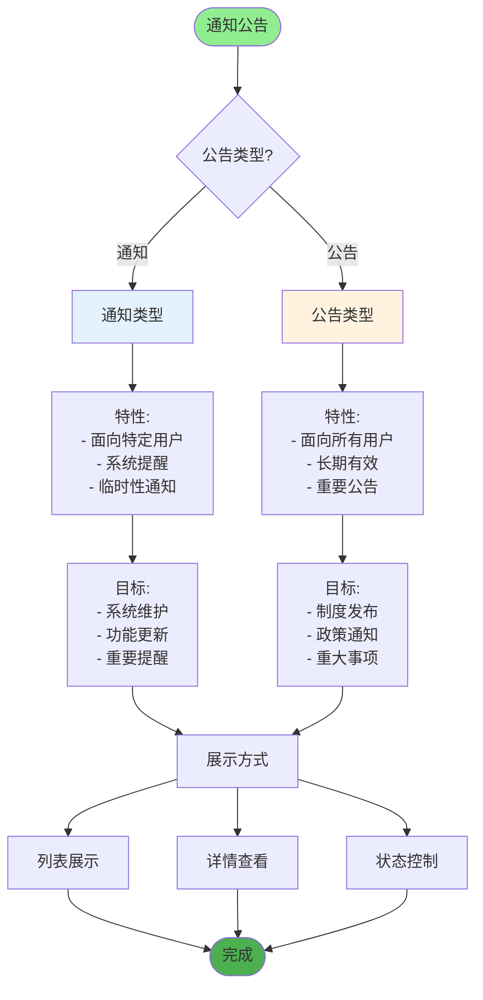
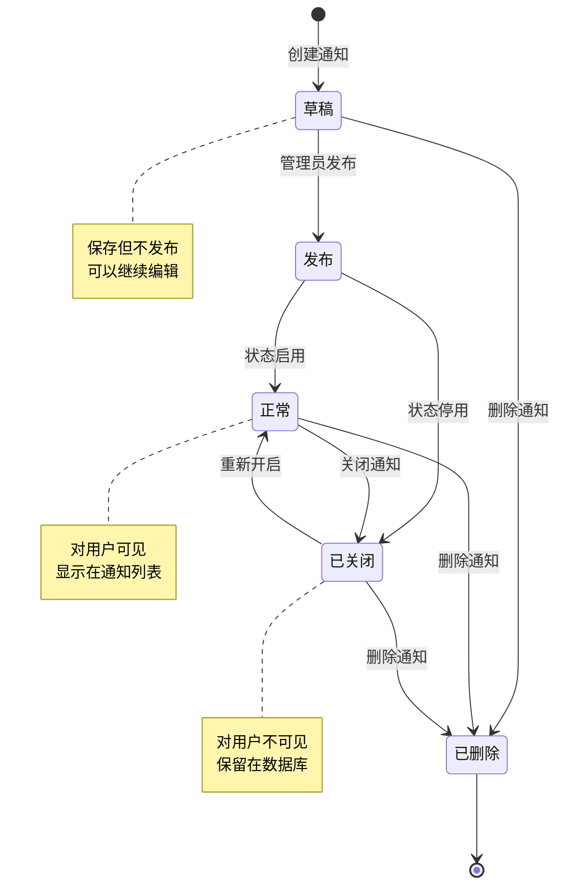
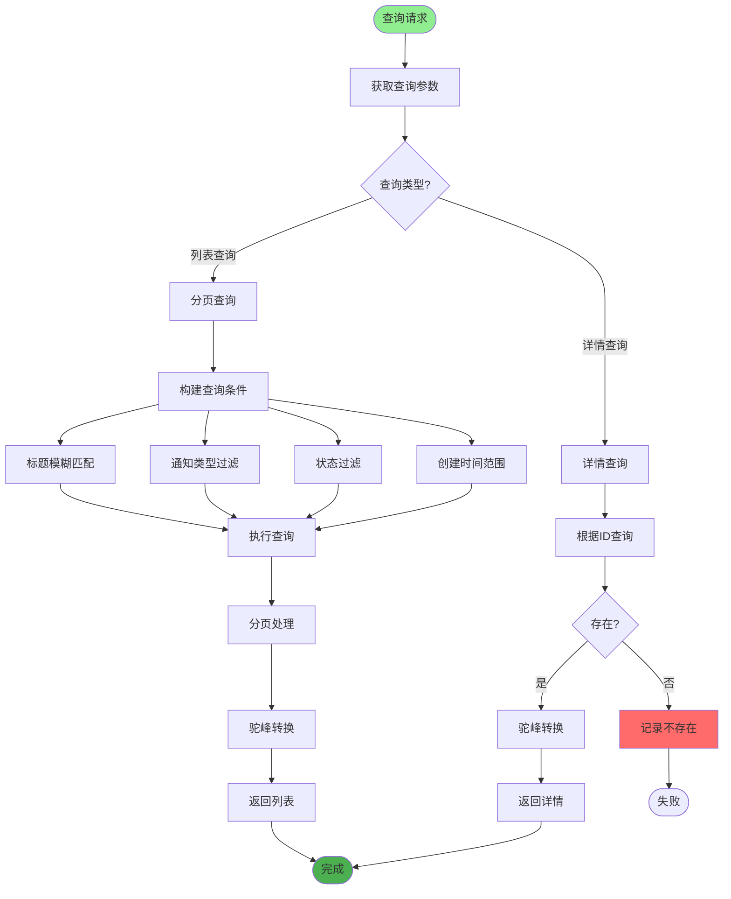
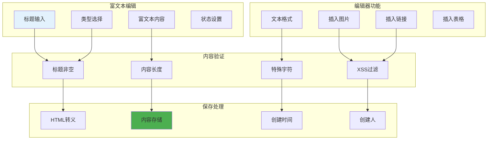
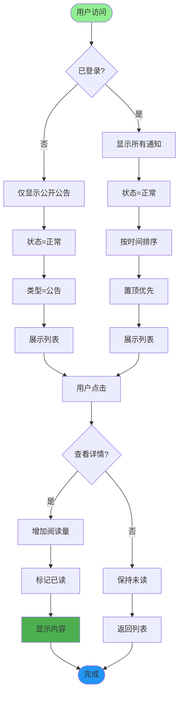
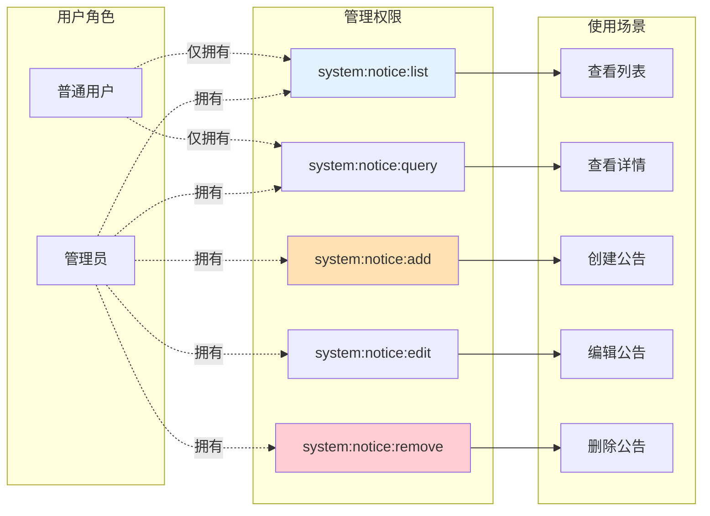
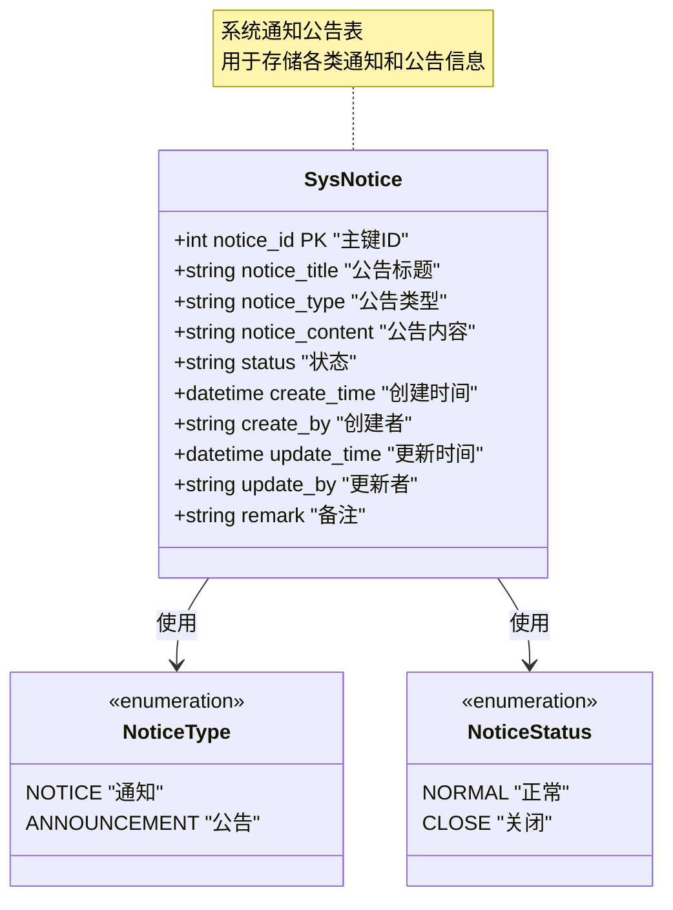
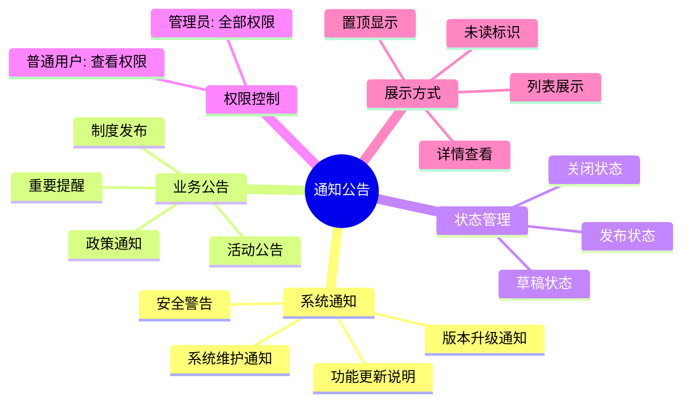

# 通知公告流程详解

## 1. 通知公告发布完整流程

## 2. 通知公告类型分类

## 3. 通知公告状态管理

## 4. 通知公告查询流程

## 5. 通知公告内容编辑

## 6. 通知公告展示策略

## 7. 通知公告权限控制

## 8. 通知公告数据结构

## 关键代码位置

| 功能 | 文件路径 |
|------|---------|
| 通知控制器 | `module_admin/controller/notice_controller.py` |
| 通知服务 | `module_admin/service/notice_service.py` |
| 通知DAO | `module_admin/dao/notice_dao.py` |
| 通知模型 | `module_admin/entity/do/notice_do.py` |
| 通知VO模型 | `module_admin/entity/vo/notice_vo.py` |

## 通知公告使用场景

