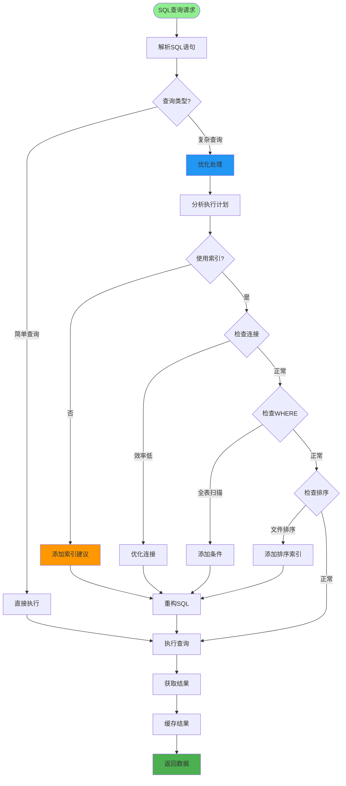
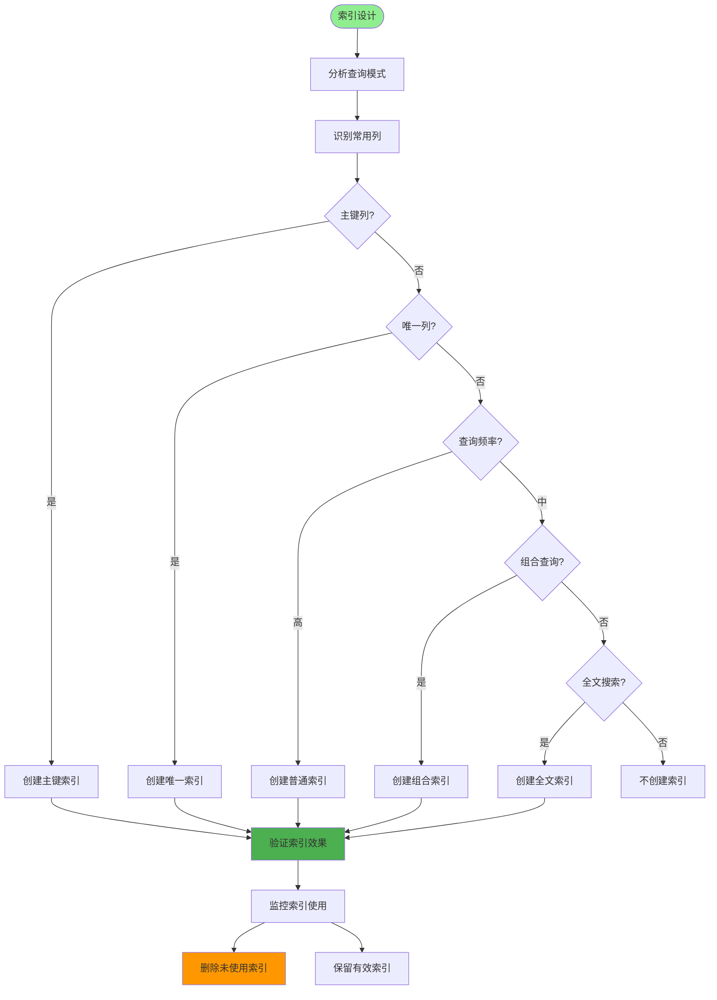
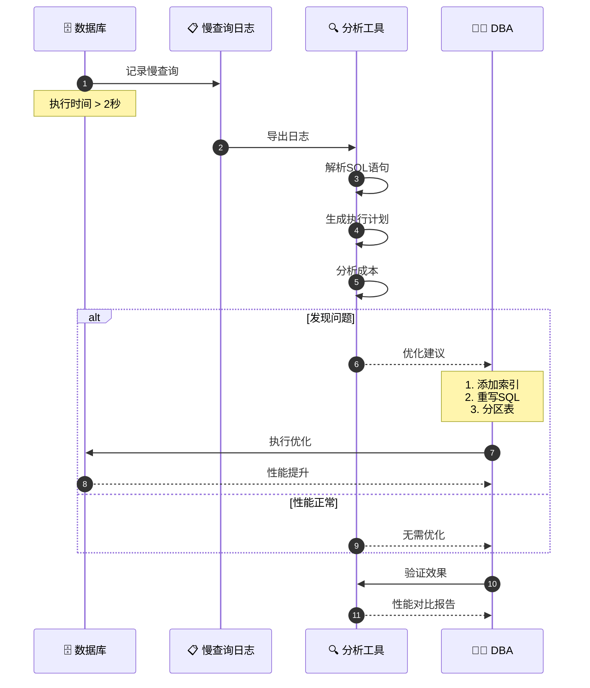
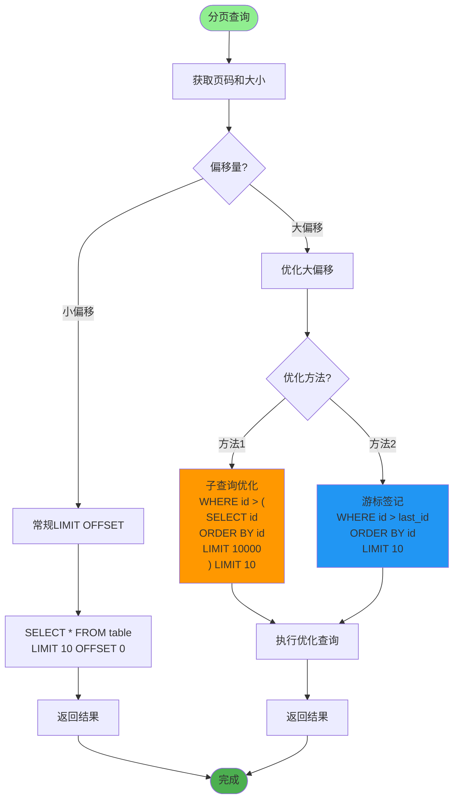
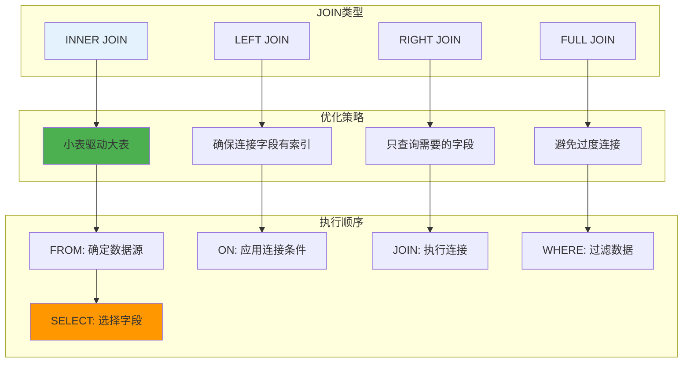
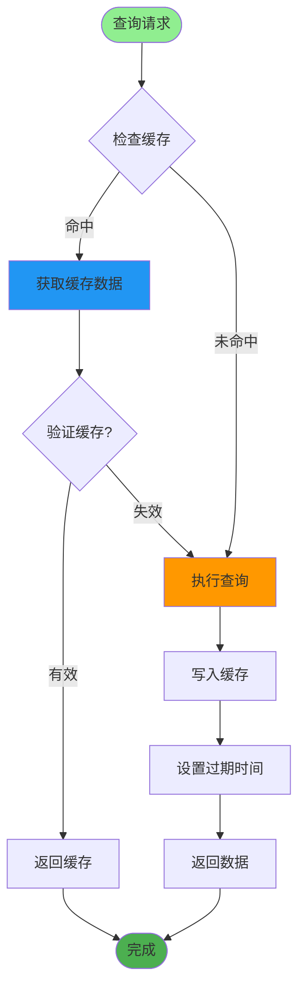
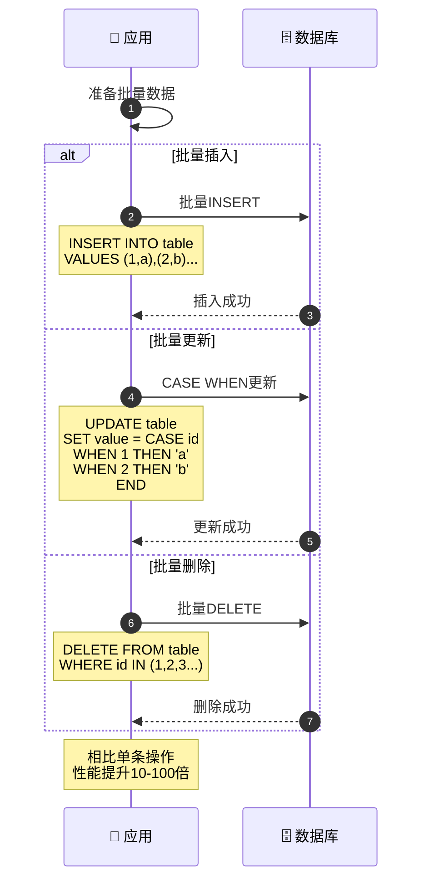
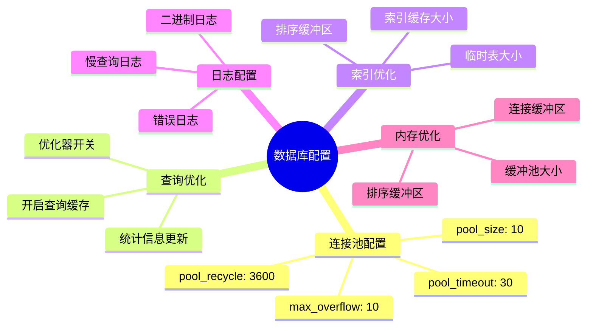
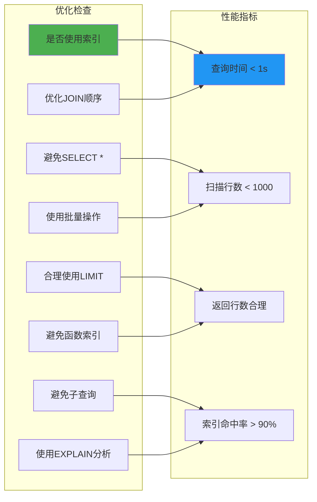

# SQL查询优化详解

## 1. 查询优化完整流程

## 2. 索引设计与优化

## 3. 慢查询分析与优化

## 4. 分页查询优化

## 5. JOIN查询优化

## 6. 查询缓存策略

## 7. 批量操作优化

## 8. 数据库配置优化

## 关键代码位置

| 功能 | 文件路径 |
|------|---------|
| DAO层 | `module_admin/dao/*.py` |
| 数据库配置 | `config/database.py` |
| 分页工具 | `utils/page_util.py` |
| 模型定义 | `module_admin/entity/do/*.py` |

## SQL优化检查清单

