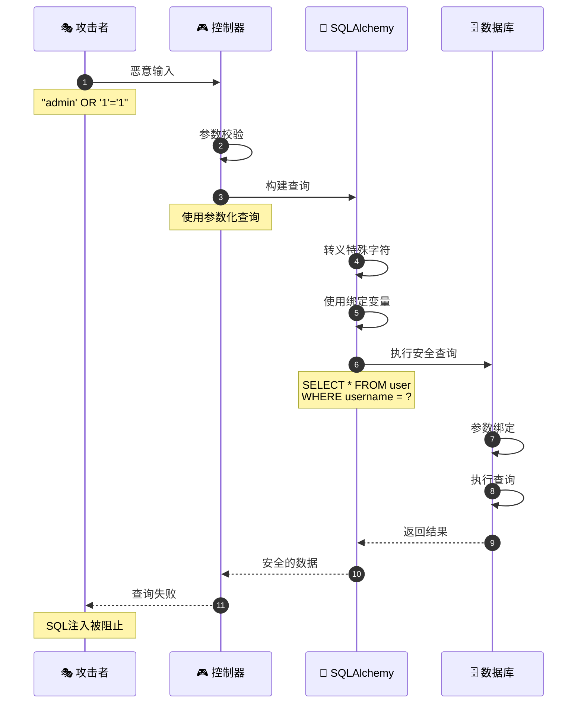
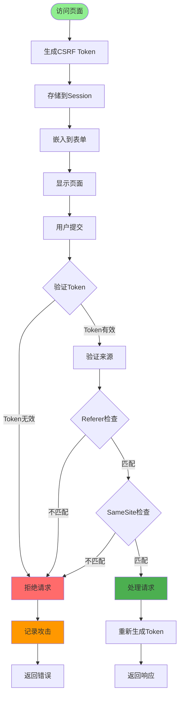
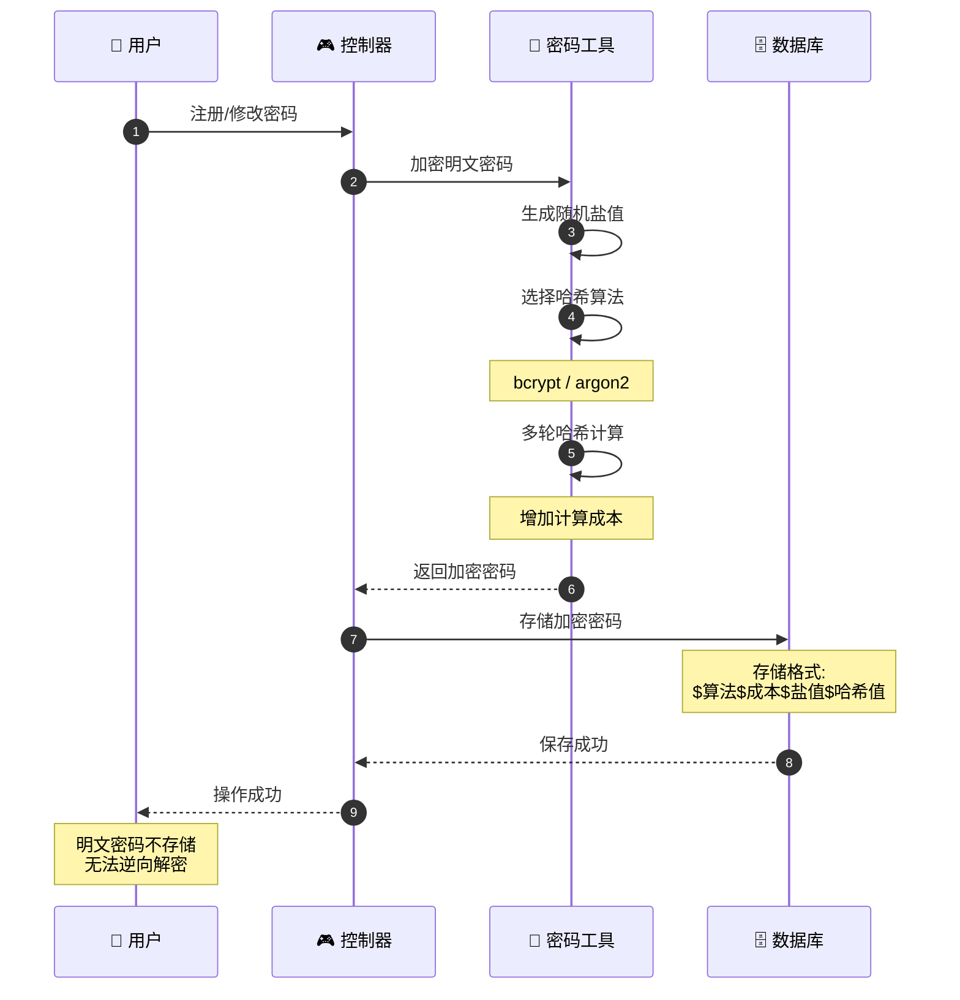
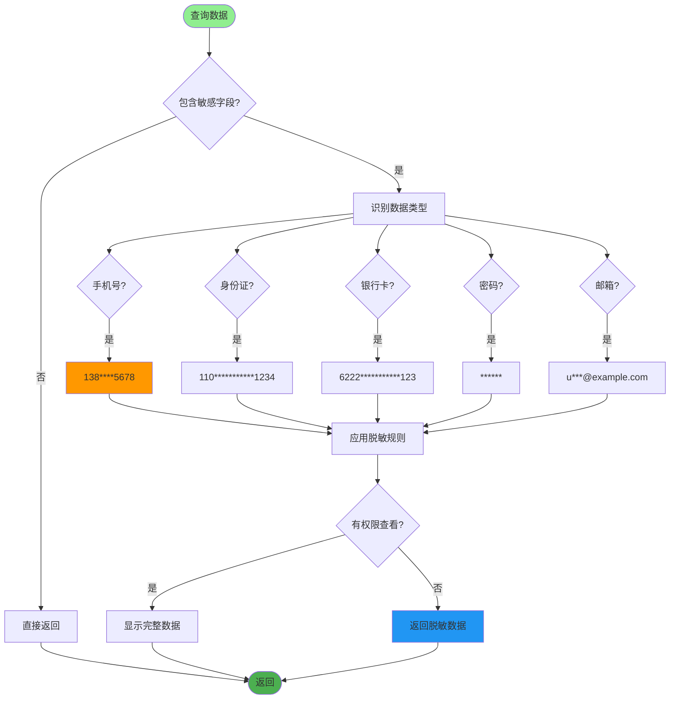
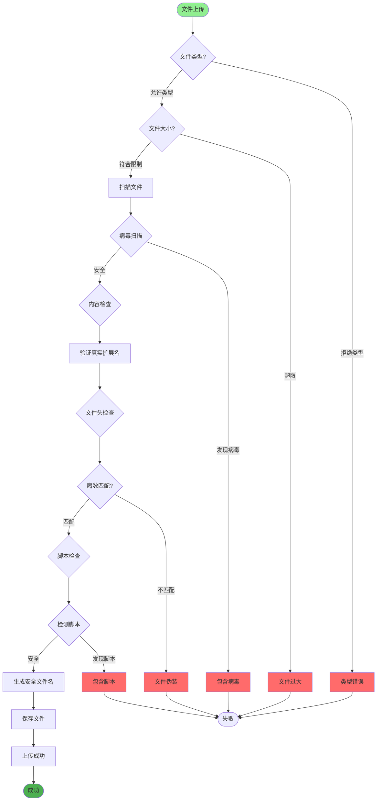
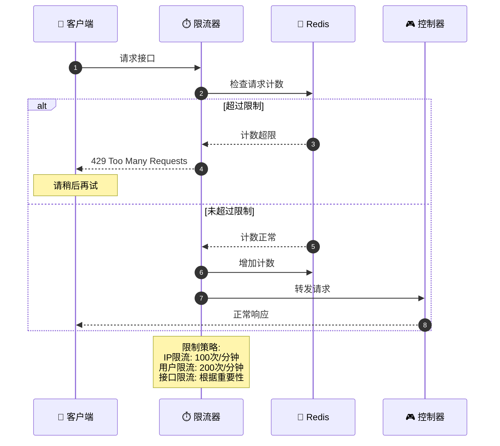
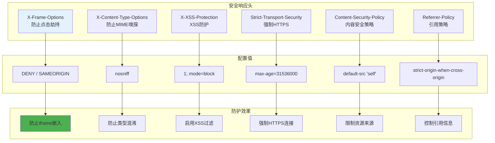
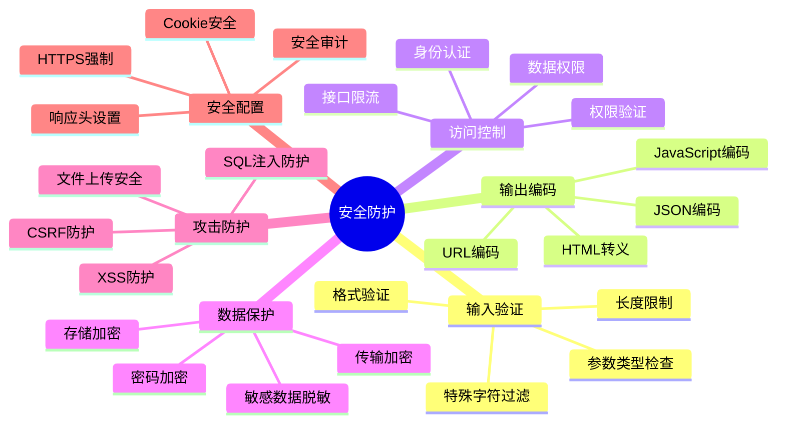

# 安全防护机制详解

## 1. SQL注入防护流程



## 2. XSS攻击防护

```mermaid
flowchart TD
    Start([用户输入]) --> CheckContext{输入类型?}

    CheckContext -->|富文本| SanitizeHTML[HTML净化]
    CheckContext -->|普通文本| EscapeHTML[HTML转义]

    SanitizeHTML --> AllowTags["允许安全标签"]
    AllowTags --> FilterAttrs["过滤危险属性"]
    FilterAttrs --> RemoveScript["移除script标签"]

    EscapeHTML --> Encode["编码特殊字符"]
    Encode --> MapChars["<br/>&<br/>\"<br/>'"]

    RemoveScript --> Validate[验证结果]
    MapChars --> Validate

    Validate --> SafeStore[安全存储]

    SafeStore --> Output[输出到页面]

    Output --> CheckOutput{输出方式?}

    CheckOutput -->|HTML| AutoEscape["自动转义"]
    CheckOutput -->|JavaScript| JsonEncode["JSON编码"]
    CheckOutput -->|URL| UrlEncode["URL编码"]

    AutoEscape --> Display[安全显示]
    JsonEncode --> Display
    UrlEncode --> Display

    style Start fill:#90EE90
    style Display fill:#4CAF50
    style SanitizeHTML fill:#FF9800
    style EscapeHTML fill:#2196F3
```

## 3. CSRF防护机制



## 4. 密码加密存储



## 5. 敏感数据脱敏



## 6. 文件上传安全检查



## 7. 接口访问频率限制



## 8. 安全响应头设置



## 关键代码位置

| 功能 | 文件路径 |
|------|---------|
| 密码工具 | `utils/pwd_util.py` |
| 字符串工具 | `utils/string_util.py` |
| 文件上传 | `module_admin/service/file_service.py` |
| 文件工具 | `utils/upload_util.py` |
| 异常处理 | `exceptions/handle.py` |

## 安全防护层次


