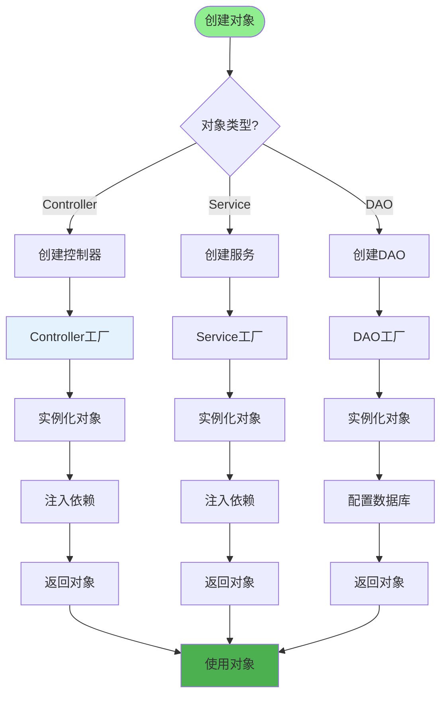
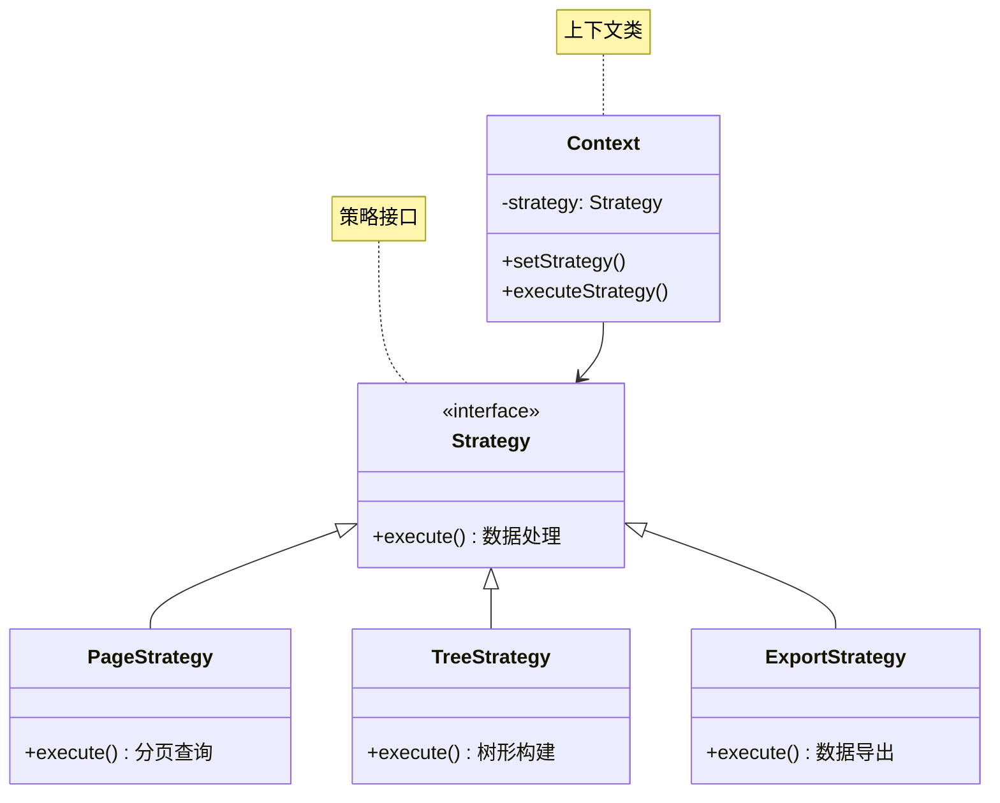
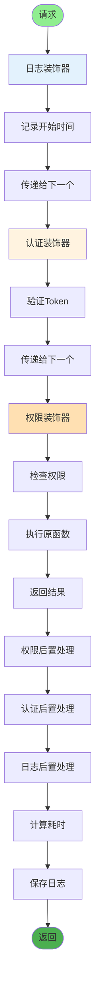
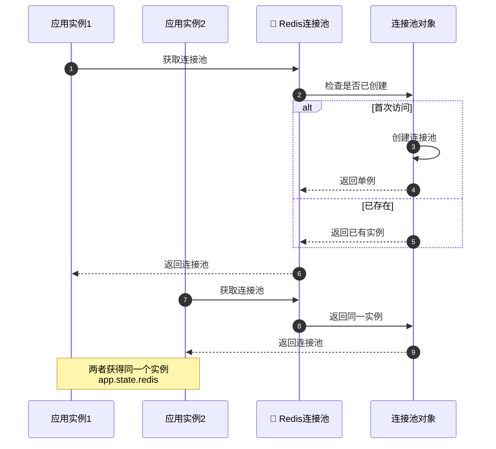
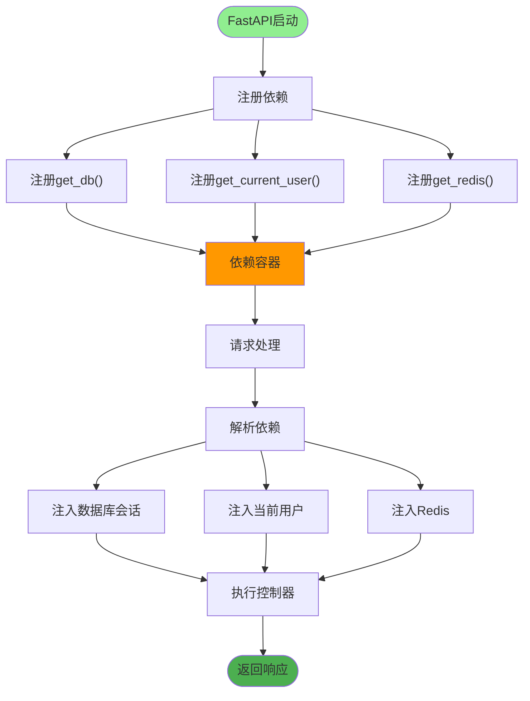
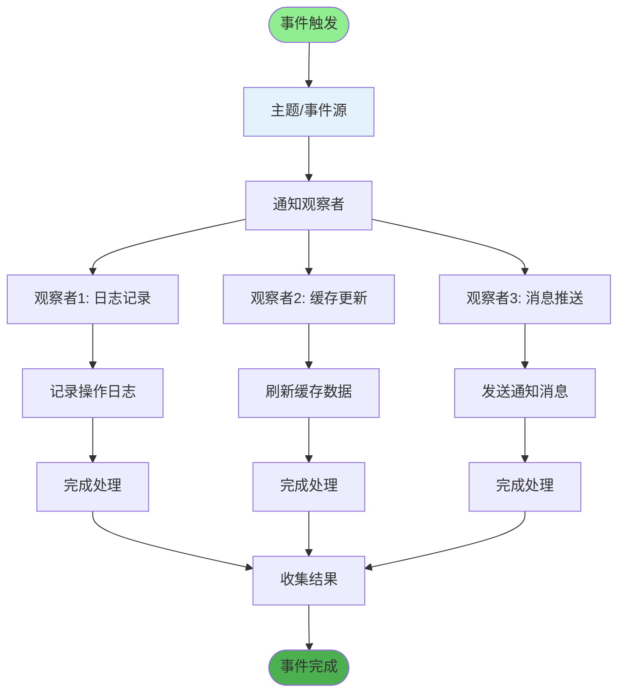
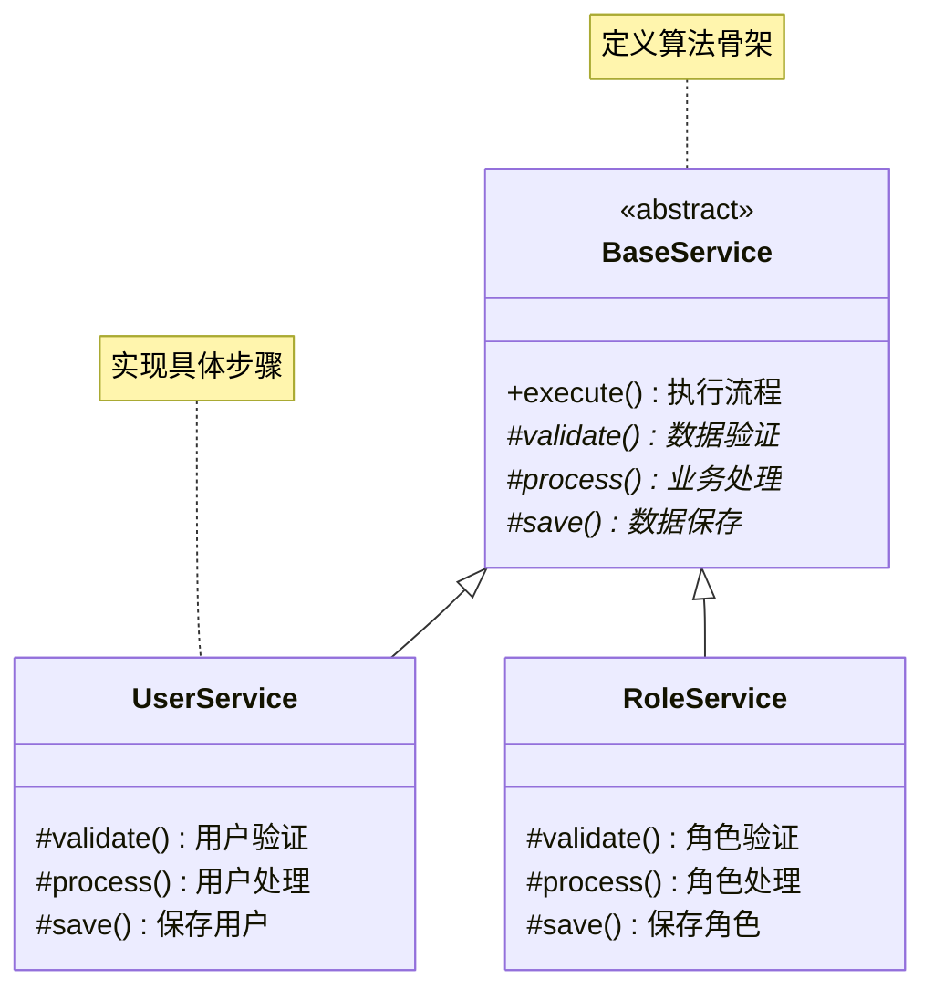
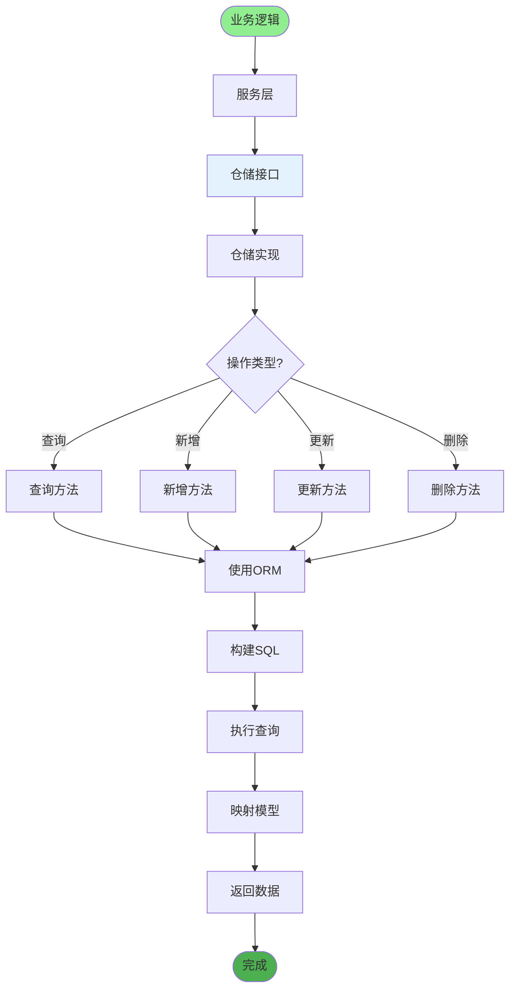
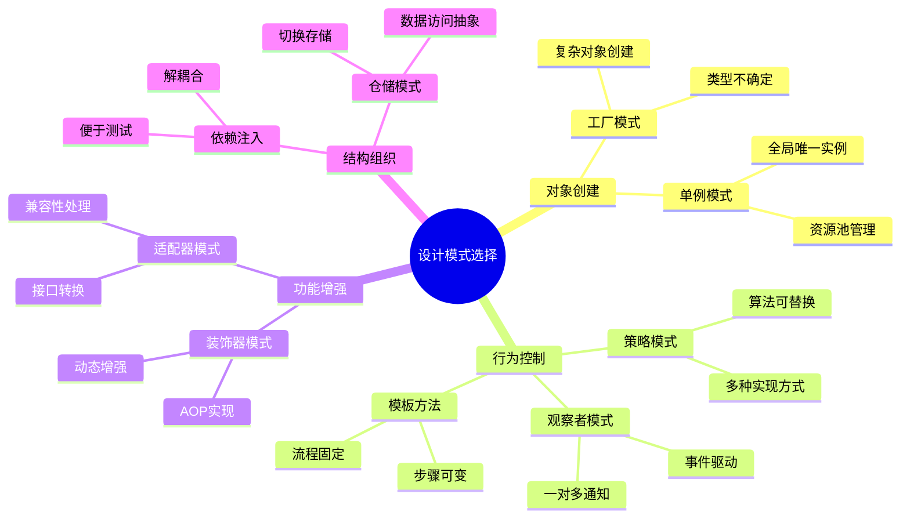

# 设计模式应用详解

## 1. 工厂模式应用

## 2. 策略模式应用

## 3. 装饰器模式应用

## 4. 单例模式应用

## 5. 依赖注入模式

## 6. 观察者模式应用

## 7. 模板方法模式

## 8. 仓储模式应用

## 关键代码位置

| 模式 | 应用位置 |
|------|---------|
| 工厂模式 | `config/get_db.py` |
| 策略模式 | `utils/page_util.py` |
| 装饰器模式 | `module_admin/annotation/*.py` |
| 单例模式 | `config/get_redis.py` |
| 依赖注入 | `server.py` 路由注册 |
| 观察者模式 | `module_admin/annotation/log_annotation.py` |
| 模板方法 | `module_admin/service/*_service.py` |
| 仓储模式 | `module_admin/dao/*_dao.py` |

## 设计模式选择指南

