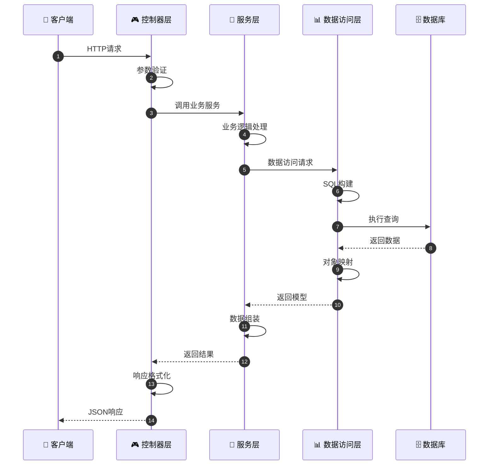
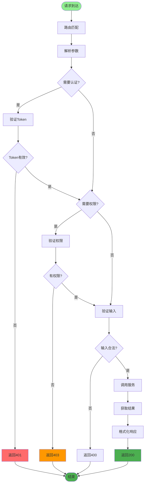
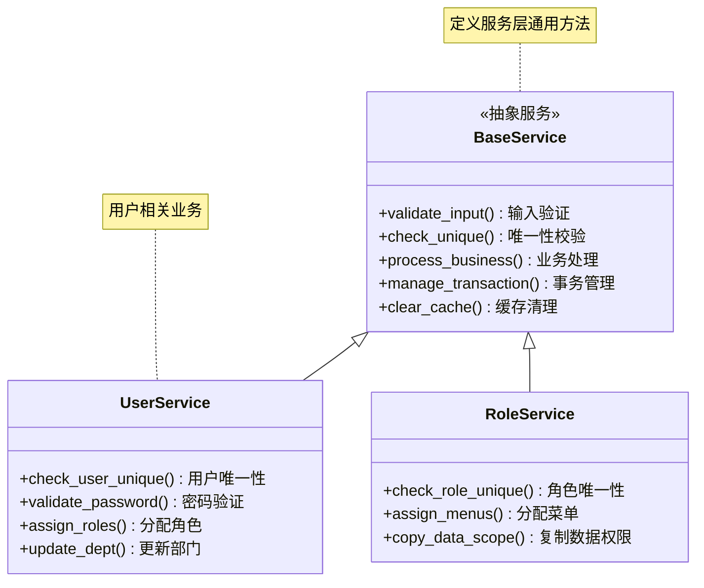
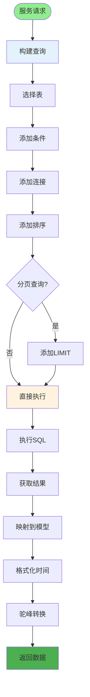
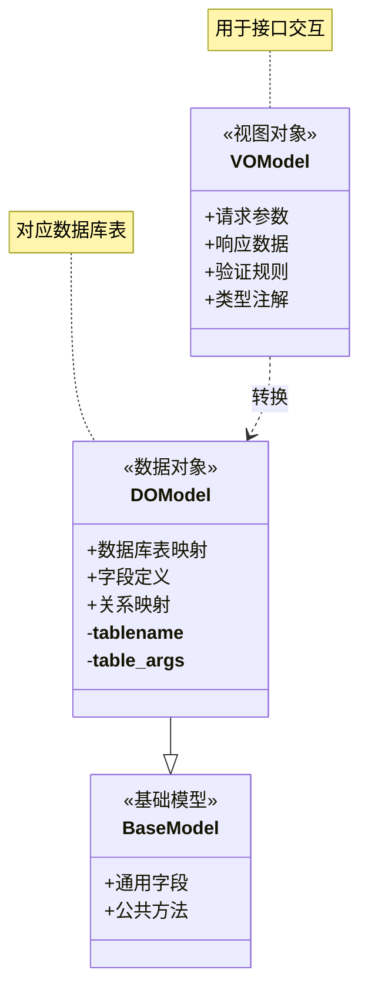
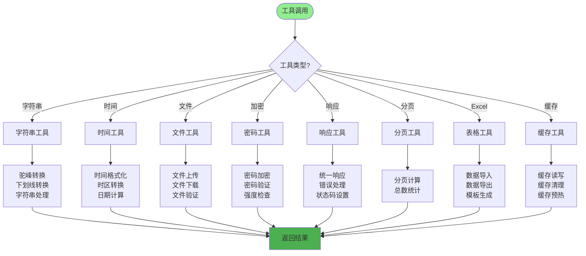
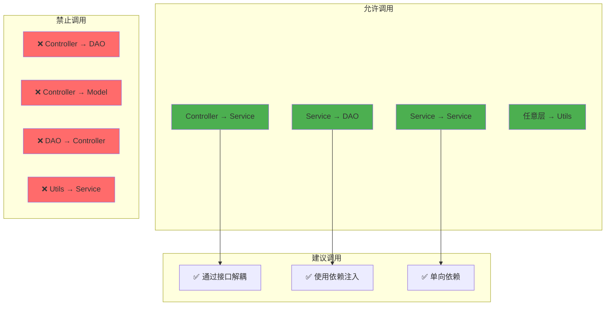
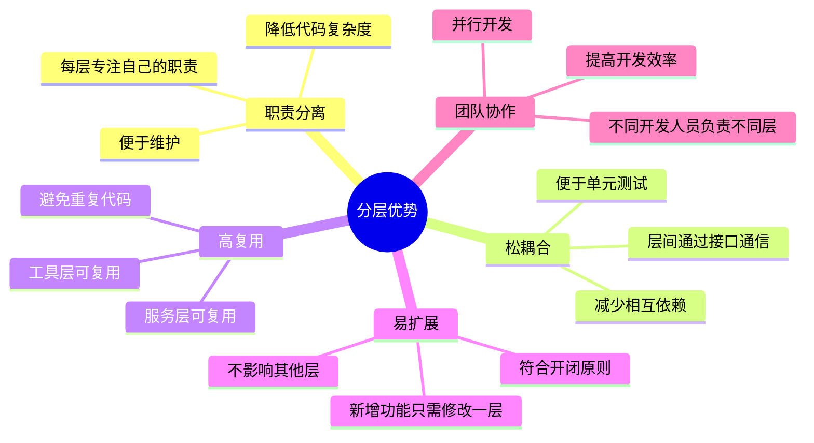
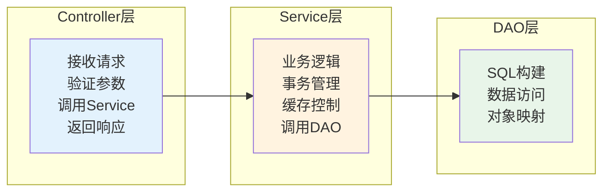

# 代码分层详解

## 1. 三层架构流程

## 2. 控制器层职责

## 3. 服务层职责

## 4. 数据访问层职责

## 5. 模型层分类

## 6. 工具层职责

## 7. 跨层调用规则

## 8. 分层优势

## 关键代码位置

| 层次 | 目录 | 示例 |
|------|------|------|
| 控制器层 | `module_admin/controller/` | `user_controller.py` |
| 服务层 | `module_admin/service/` | `user_service.py` |
| 数据访问层 | `module_admin/dao/` | `user_dao.py` |
| 模型层 | `module_admin/entity/` | `do/`, `vo/` |
| 工具层 | `utils/` | `common_util.py` |

## 分层最佳实践

