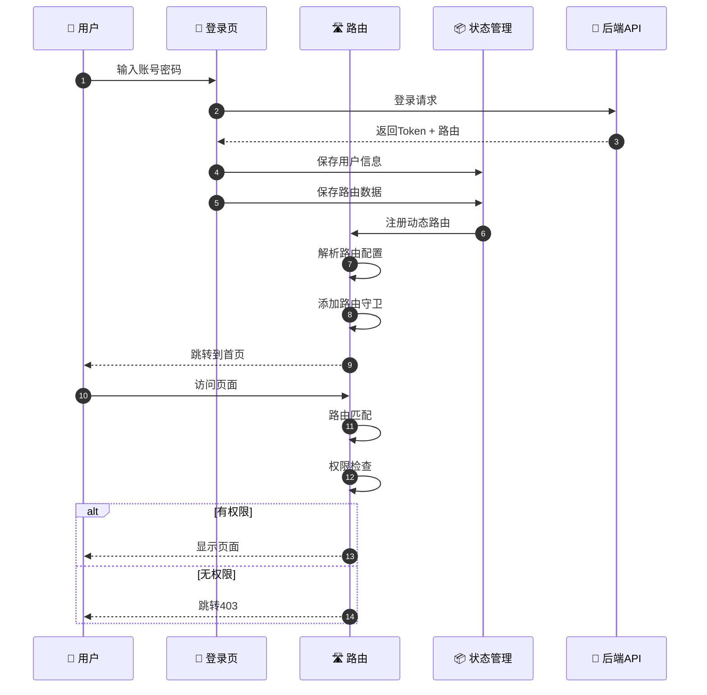
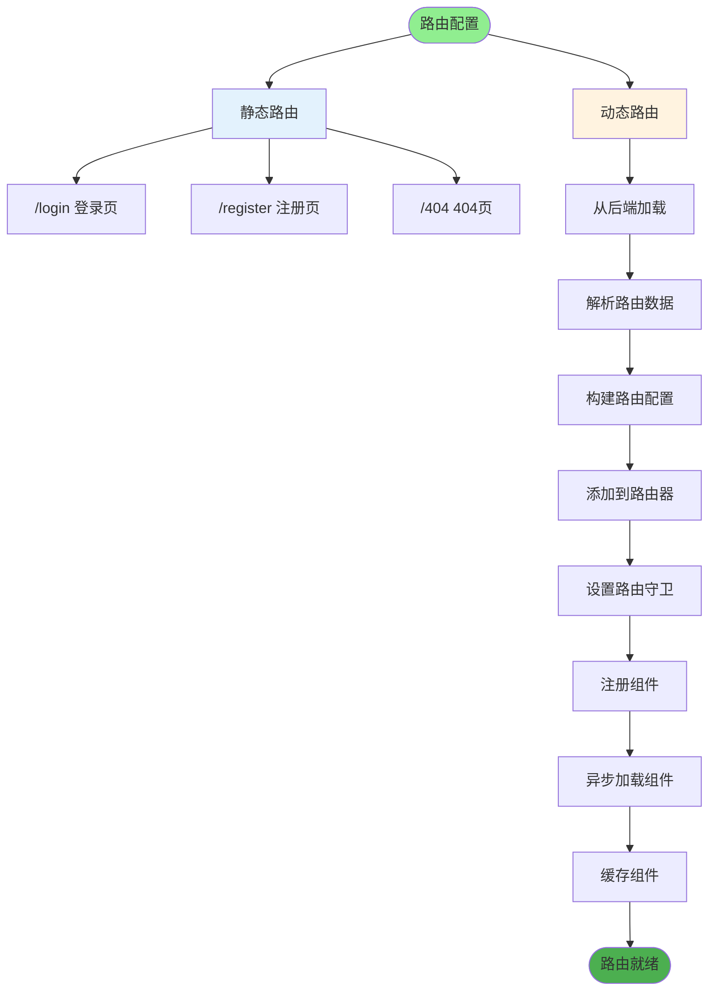
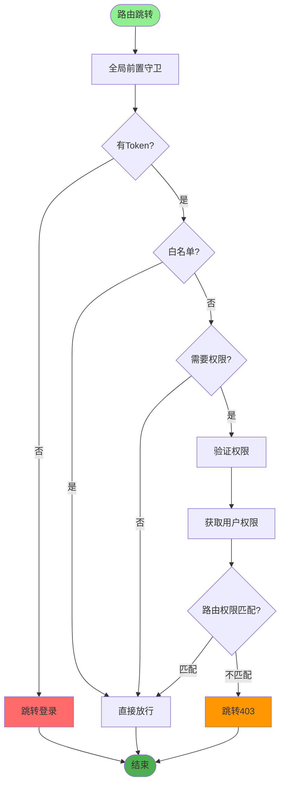
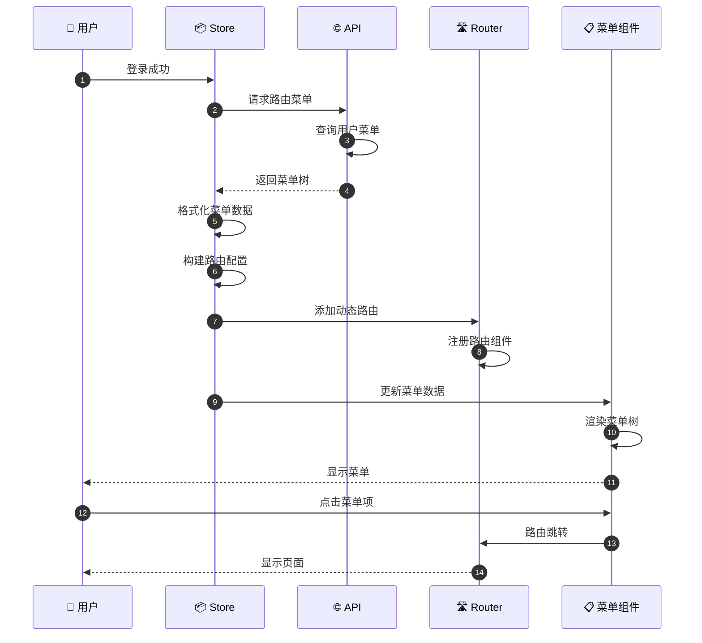
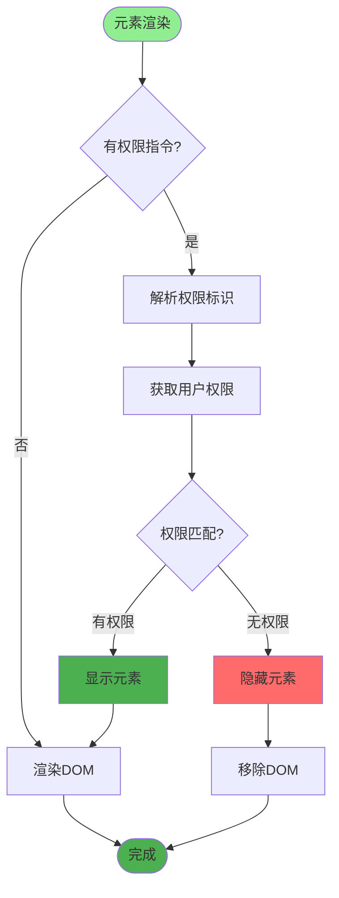
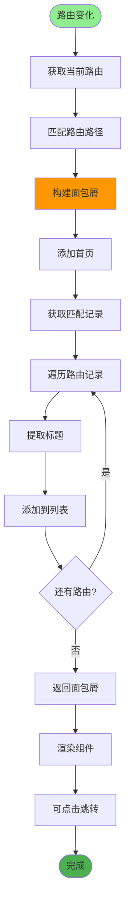
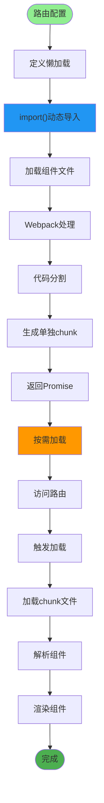
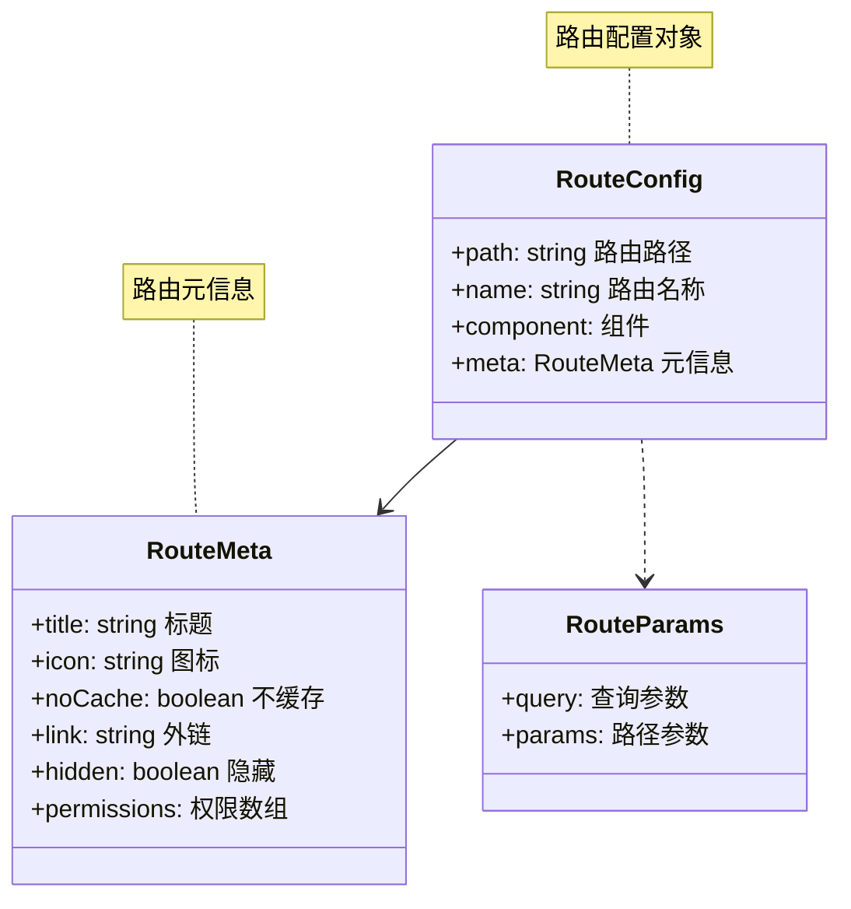

# 前端路由与权限详解

## 1. 路由配置流程



## 2. 路由结构设计



## 3. 路由守卫实现



## 4. 动态菜单生成



## 5. 权限指令实现



## 6. 面包屑导航



## 7. 路由懒加载



## 8. 路由参数传递



## 关键代码位置

| 功能 | 文件路径 |
|------|---------|
| 路由配置 | `ruoyi-fastapi-frontend/src/router/index.js` |
| 权限指令 | `ruoyi-fastapi-frontend/src/directive/permission/index.js` |
| 菜单组件 | `ruoyi-fastapi-frontend/src/layout/components/Sidebar/index.vue` |
| 面包屑 | `ruoyi-fastapi-frontend/src/components/Breadcrumb/index.vue` |
| 状态管理 | `ruoyi-fastapi-frontend/src/store/` |

## 路由配置示例

```mermaid
codeblock
"""
// 静态路由配置示例
export const constantRoutes = [
  {
    path: '/login',
    component: () => import('@/views/login'),
    hidden: true
  },
  {
    path: '/404',
    component: () => import('@/views/error/404'),
    hidden: true
  }
]

// 动态路由配置示例
export const asyncRoutes = [
  {
    path: '/system',
    component: Layout,
    redirect: '/system/user',
    meta: { title: '系统管理', icon: 'system' },
    children: [
      {
        path: 'user',
        component: () => import('@/views/system/user'),
        name: 'User',
        meta: {
          title: '用户管理',
          icon: 'user',
          permissions: ['system:user:list']
        }
      }
    ]
  }
]
"""
```
