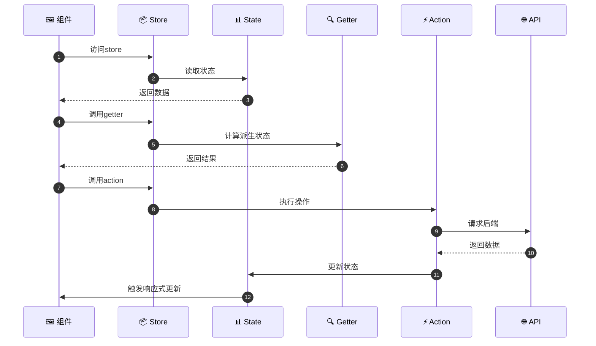
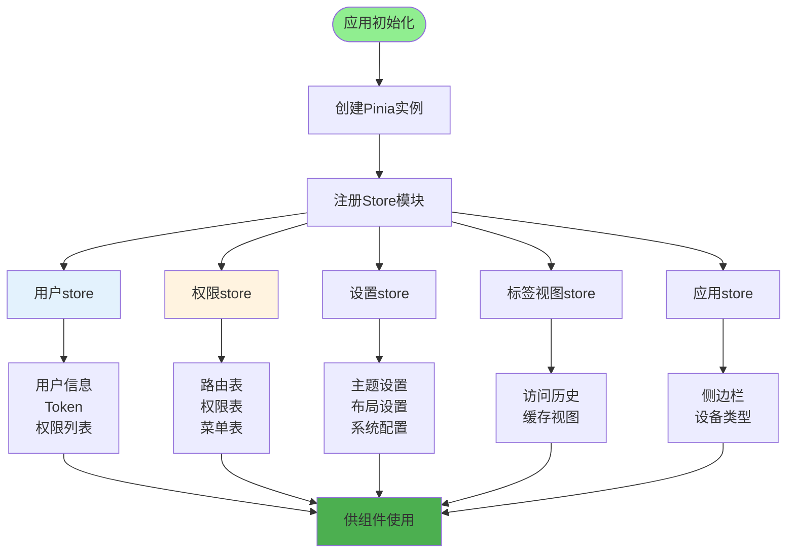
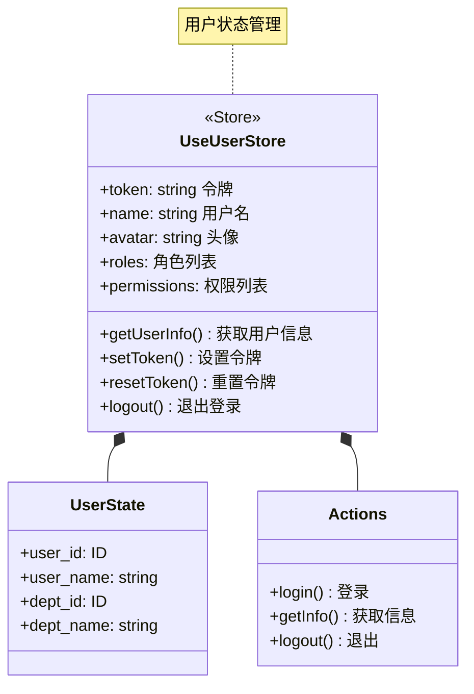
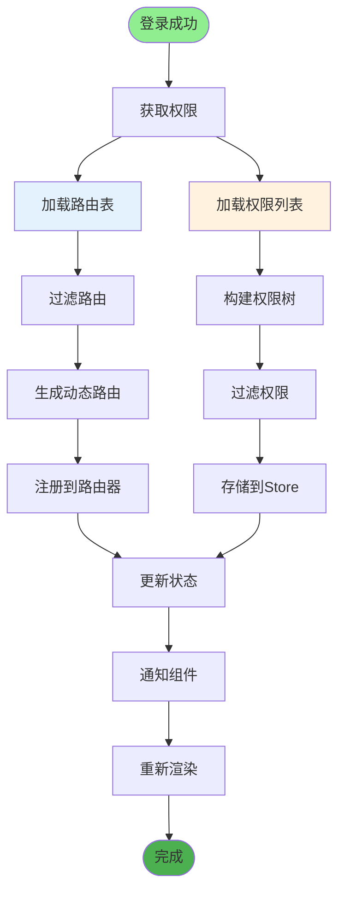
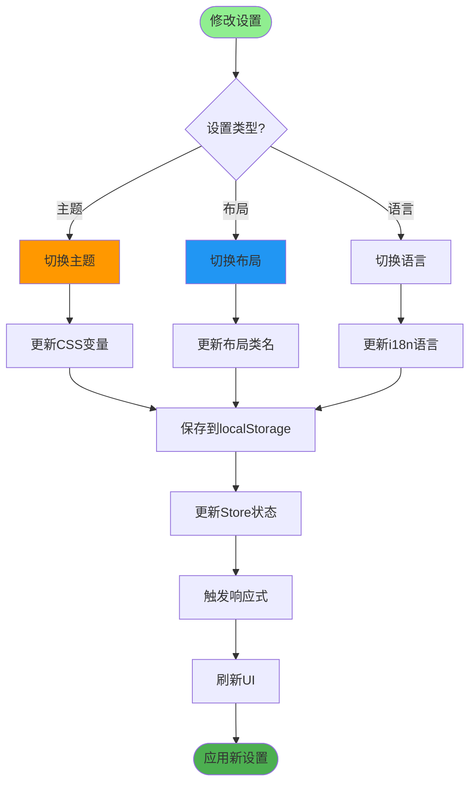
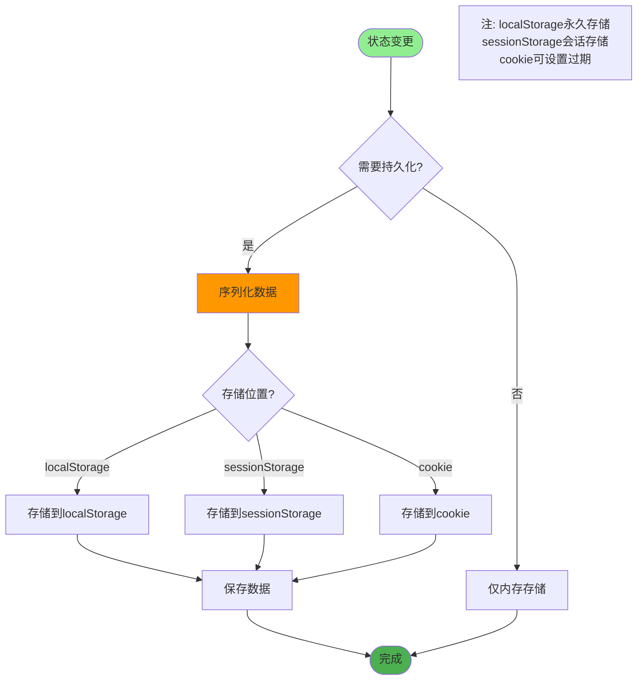
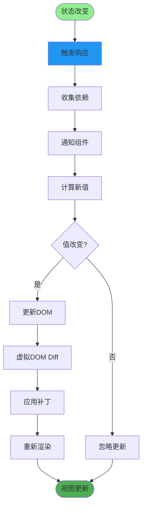
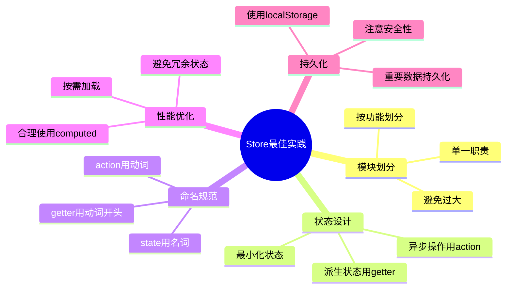

# 前端状态管理详解

## 1. Pinia状态管理流程



## 2. Store模块划分



## 3. 用户状态管理



## 4. 权限状态管理



## 5. 设置状态管理



## 6. 标签视图状态

```mermaid
sequenceDiagram
    autonumber
    participant User as 👤 用户
    Component as 🖼️ 页面组件
    Store as 📦 TagsViewStore
    LocalStorage as 💾 本地存储

    User->>Component: 访问页面
    Component->>Store: 添加视图
    Store->>Store: 检查重复

    Store->>LocalStorage: 持久化存储

    User->>Component: 关闭标签
    Component->>Store: 移除视图
    Store->>Store: 更新状态
    Store->>LocalStorage: 同步存储

    User->>Component: 关闭其他
    Component->>Store: 关闭所有
    Store->>Store: 清空列表
    Store->>LocalStorage: 清空存储
```

## 7. 持久化存储



## 8. 状态响应式更新



## 关键代码位置

| 功能 | 文件路径 |
|------|---------|
| Store入口 | `ruoyi-fastapi-frontend/src/store/index.js` |
| 用户Store | `ruoyi-fastapi-frontend/src/store/modules/user.js` |
| 权限Store | `ruoyi-fastapi-frontend/src/store/modules/permission.js` |
| 设置Store | `ruoyi-fastapi-frontend/src/store/modules/settings.js` |
| 标签Store | `ruoyi-fastapi-frontend/src/store/modules/tagsView.js` |

## Store最佳实践


