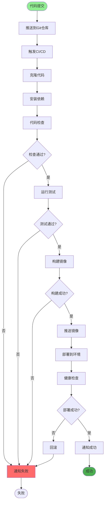
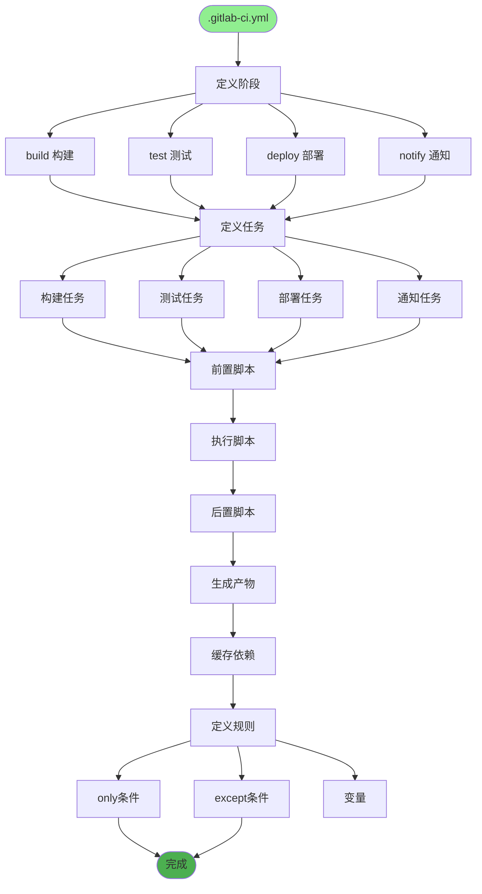
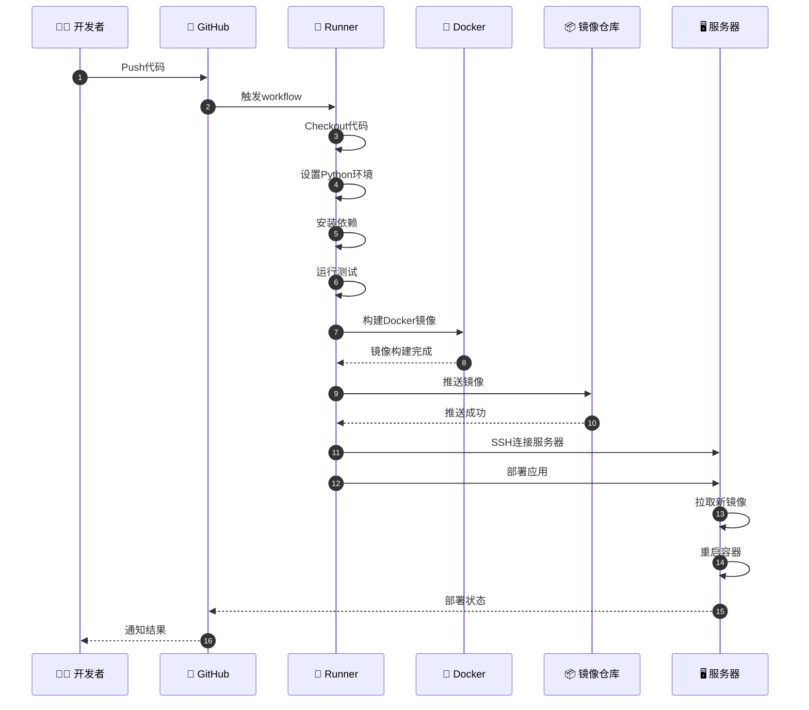
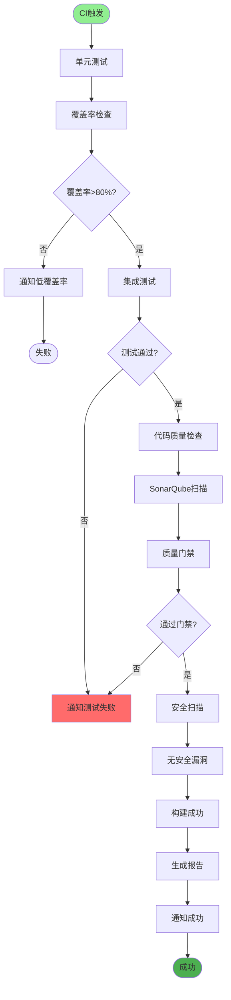
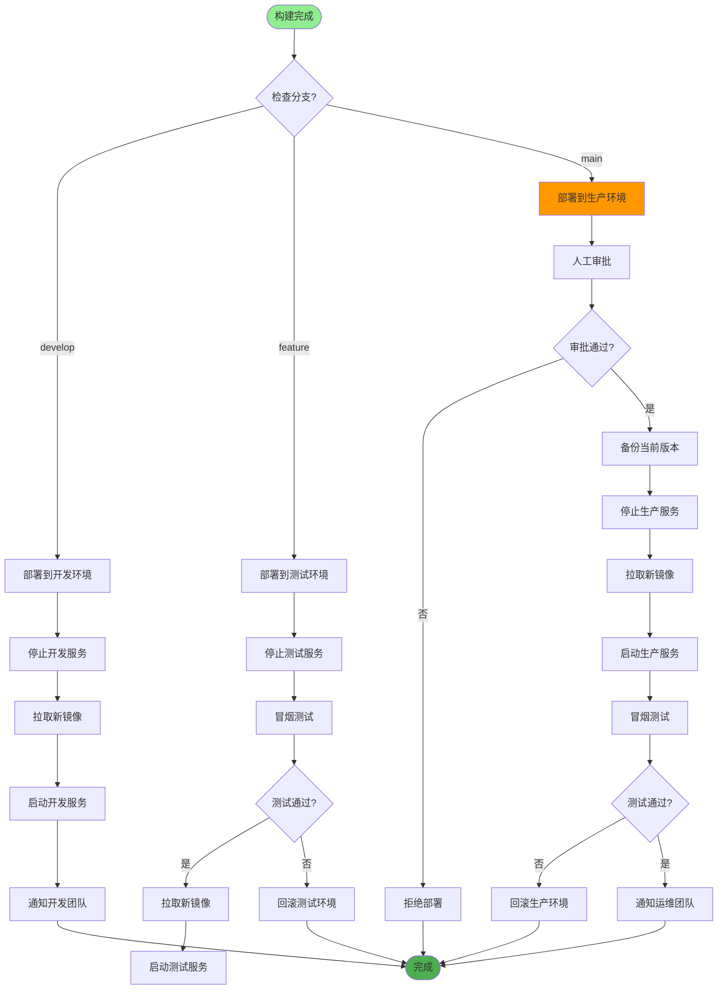
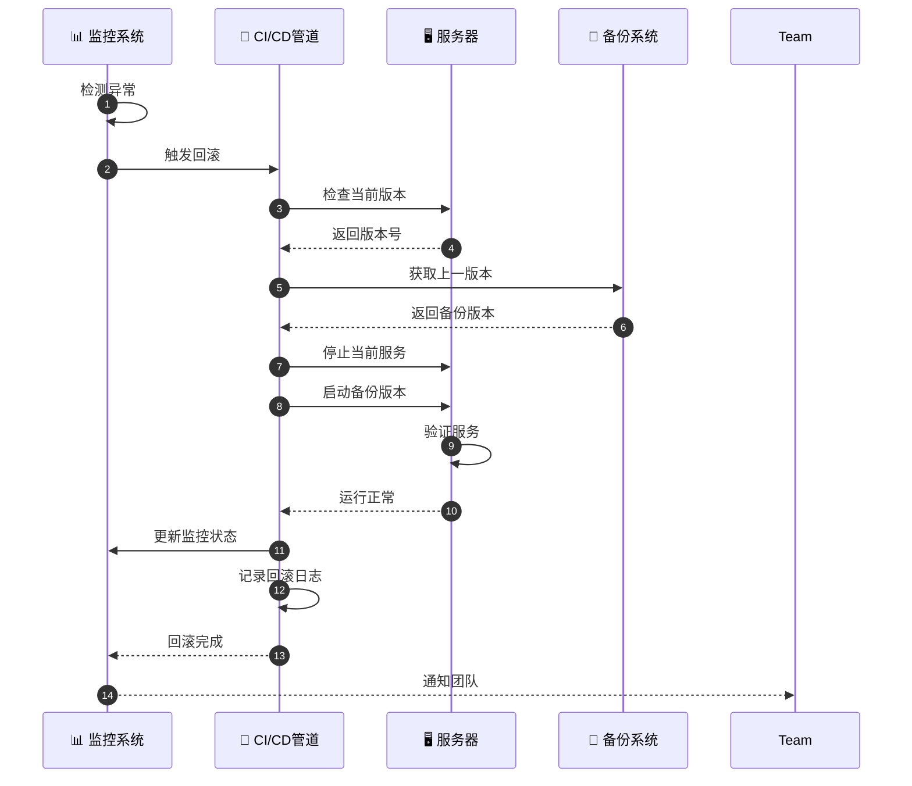
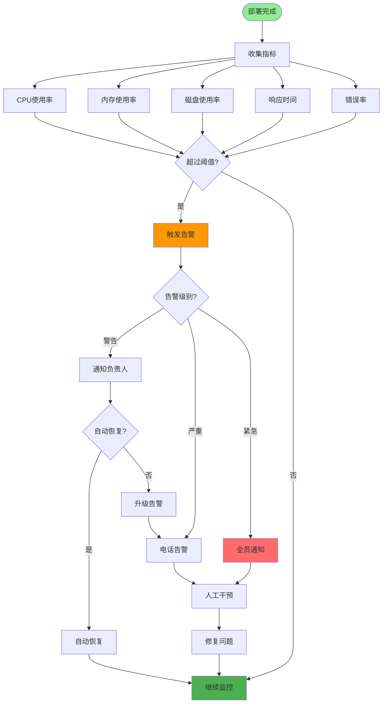
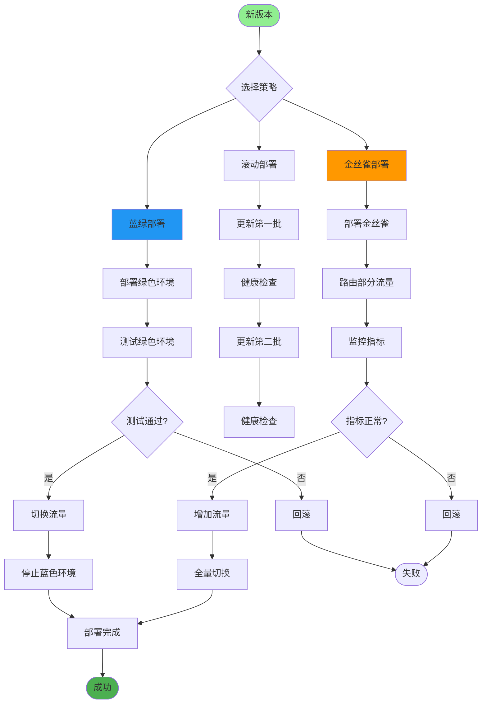
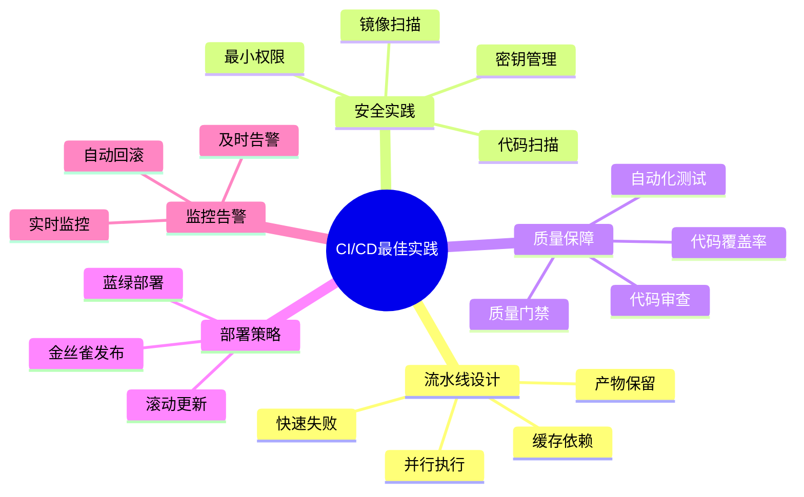

# CI/CD流程详解

## 1. CI/CD完整流程

## 2. GitLab CI配置

## 3. GitHub Actions工作流

## 4. 自动化测试流程

## 5. 环境部署策略

## 6. 回滚机制

## 7. 监控与告警

## 8. 发布策略

## 关键配置文件

| 文件 | 用途 |
|------|------|
| `.gitlab-ci.yml` | GitLab CI配置 |
| `.github/workflows/*.yml` | GitHub Actions配置 |
| `Jenkinsfile` | Jenkins流水线 |
| `Dockerfile` | 镜像构建 |
| `docker-compose*.yml` | 容器编排 |

## 最佳实践

