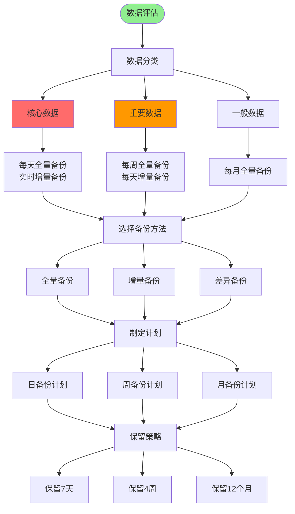
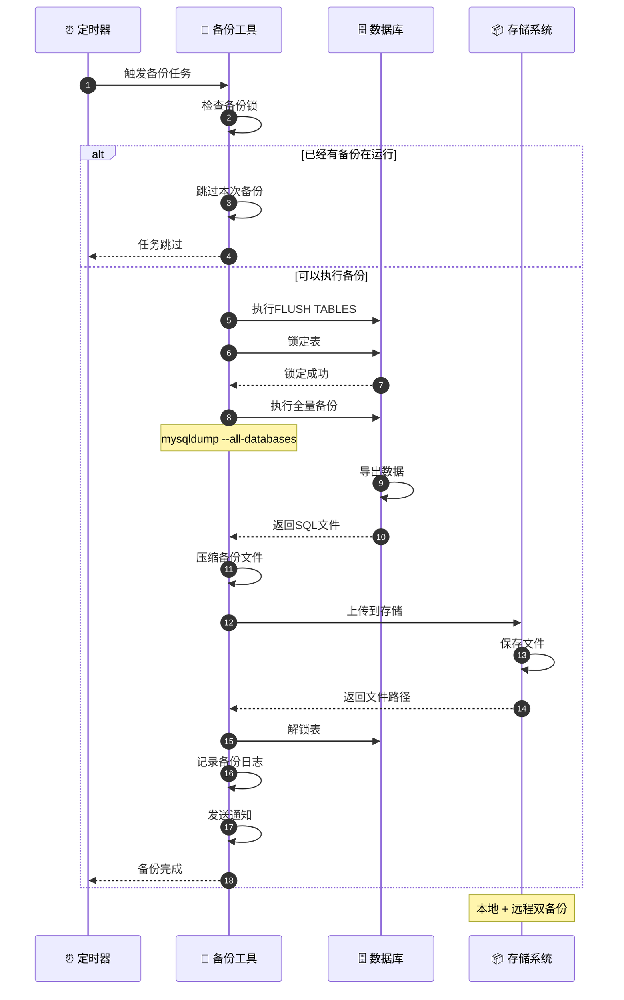
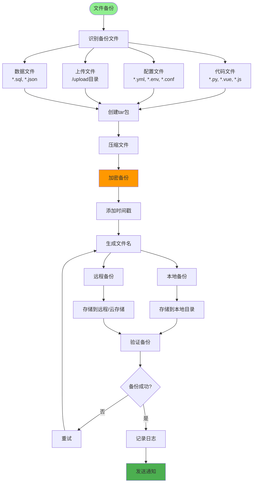
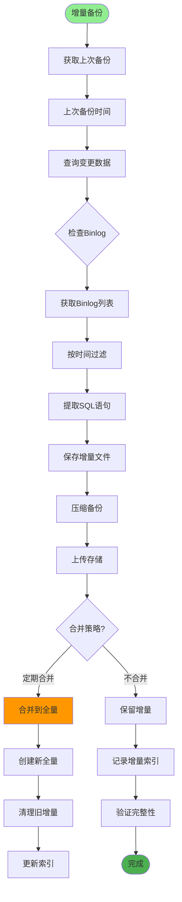
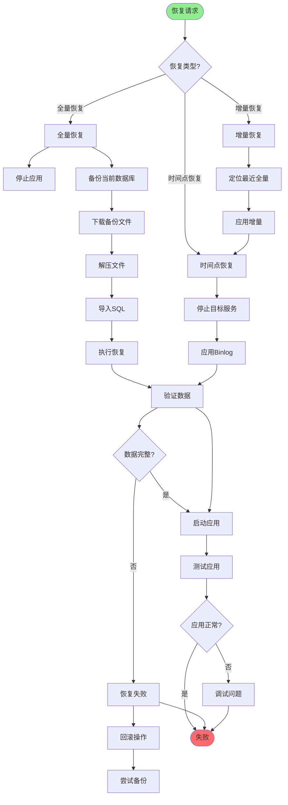
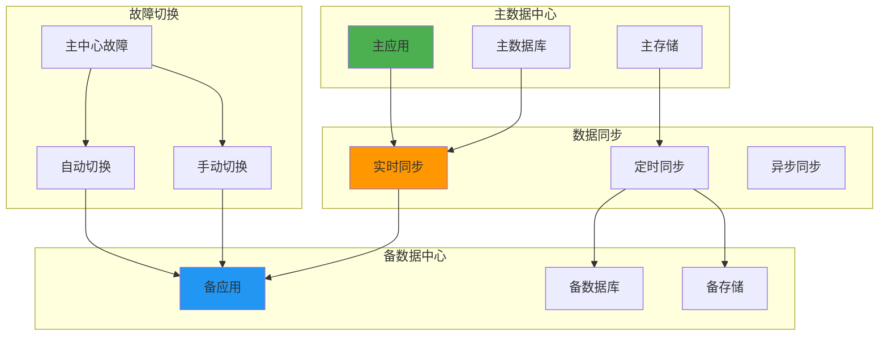
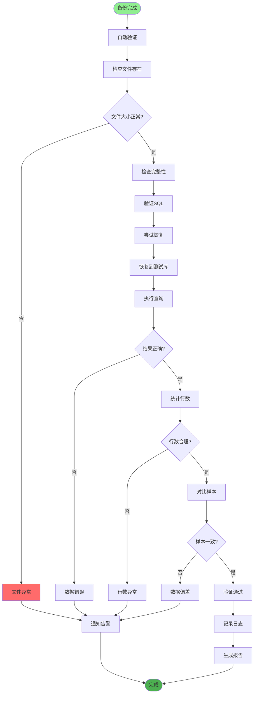
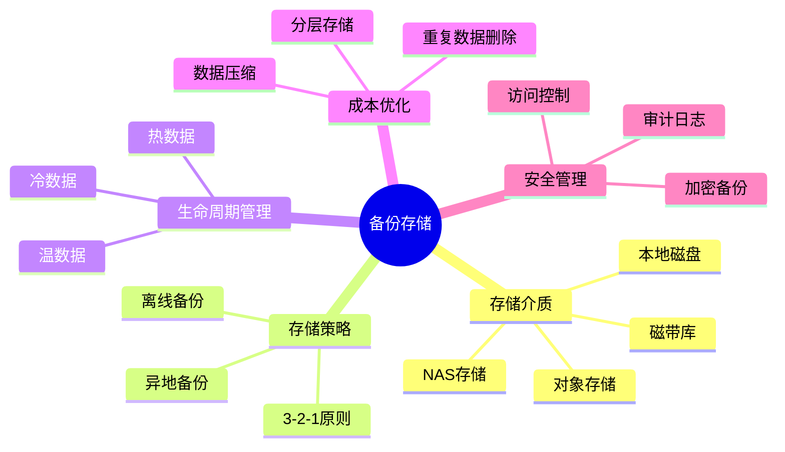
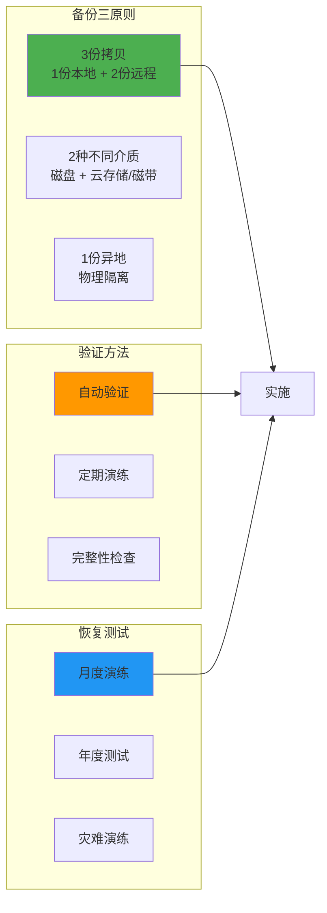

# 数据备份恢复详解

## 1. 备份策略制定

## 2. 数据库备份流程

## 3. 文件系统备份

## 4. 增量备份实现

## 5. 恢复流程

## 6. 容灾备份

## 7. 备份验证

## 8. 备份存储管理

## 关键配置文件

| 文件 | 用途 |
|------|------|
| `backup.sh` | 备份脚本 |
| `restore.sh` | 恢复脚本 |
| `crontab` | 定时任务配置 |
| `backup.yml` | 备份配置 |

## 最佳实践

