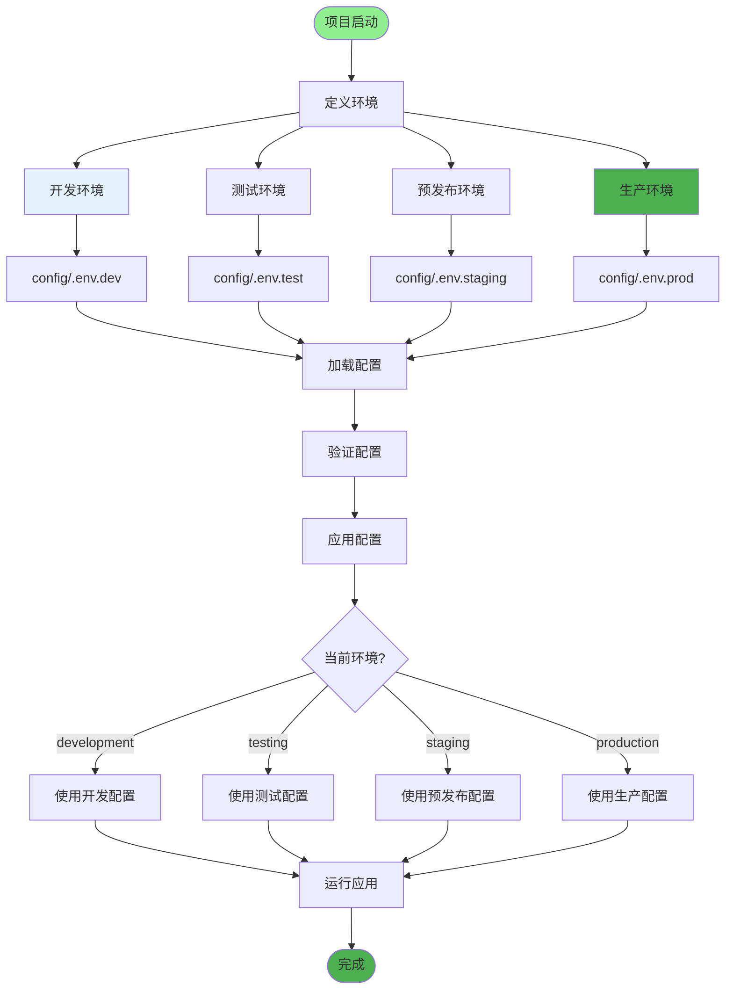
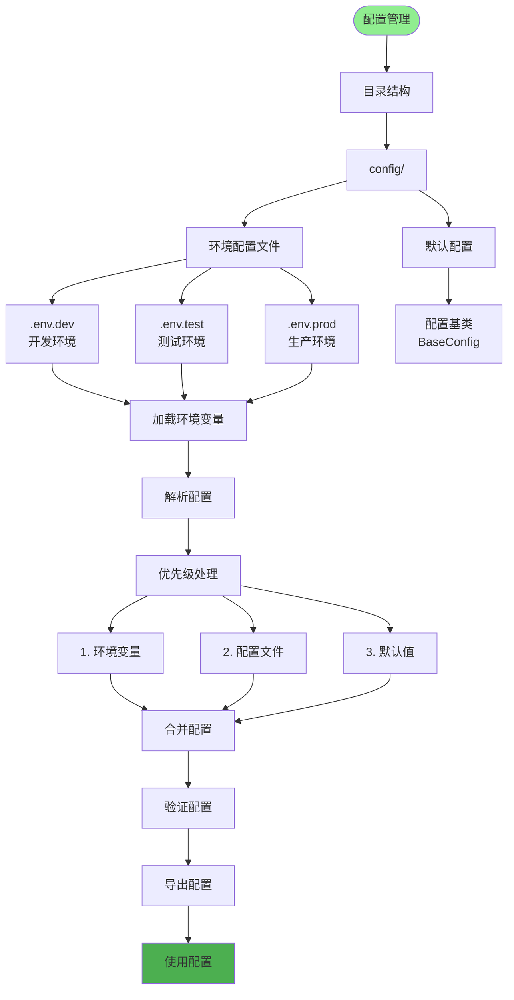
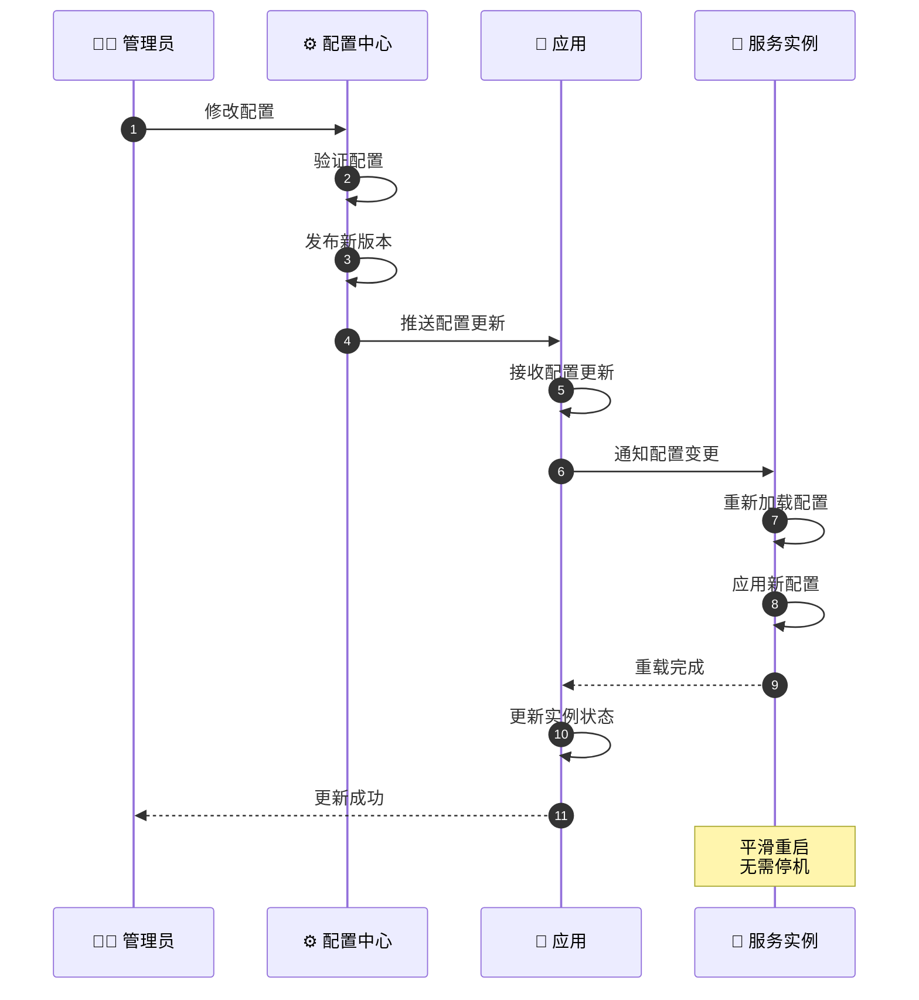
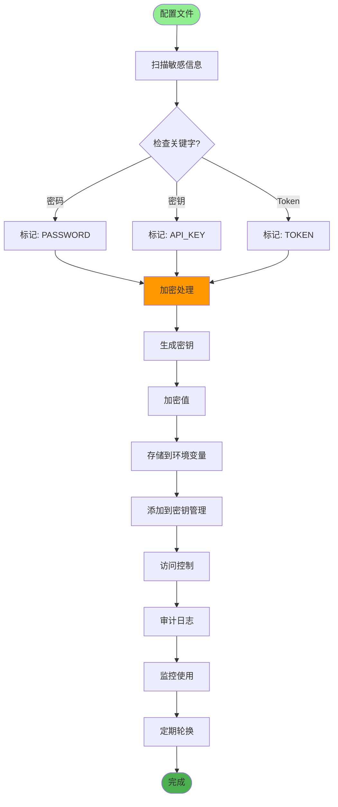
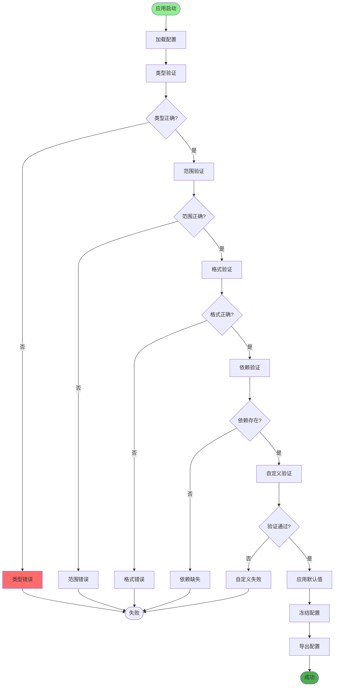
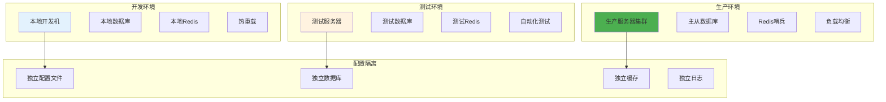
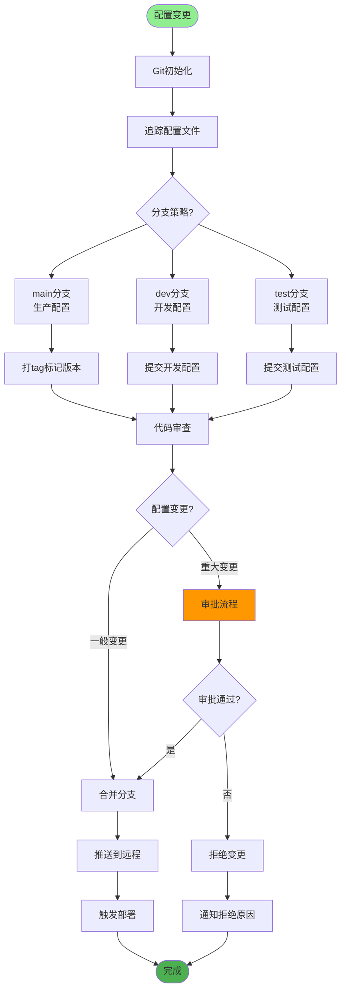
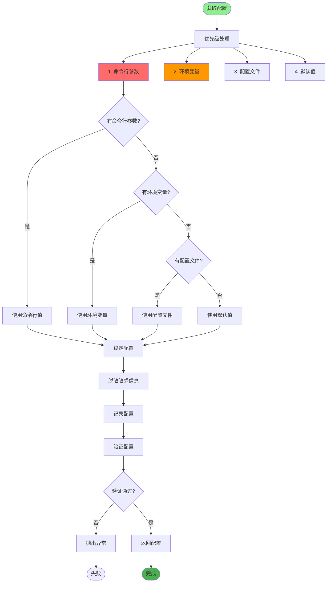
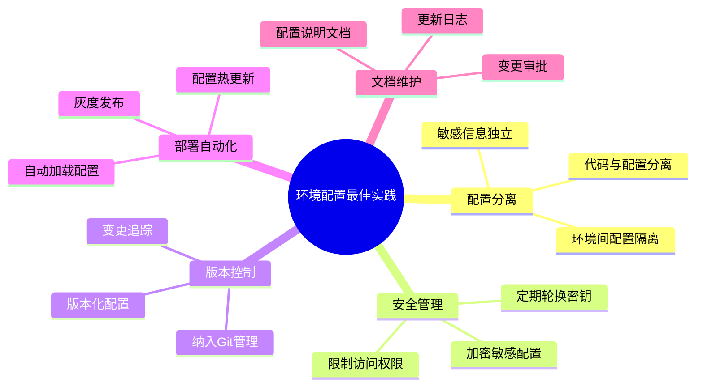

# 多环境配置详解

## 1. 环境划分策略

## 2. 配置文件管理

## 3. 配置热更新

## 4. 敏感信息处理

## 5. 配置验证

## 6. 环境隔离

## 7. 配置版本控制

## 8. 环境变量优先级

## 关键配置文件

| 环境 | 文件 | 用途 |
|------|------|------|
| 开发 | `.env.dev` | 开发环境配置 |
| 测试 | `.env.test` | 测试环境配置 |
| 生产 | `.env.prod` | 生产环境配置 |
| 通用 | `config.py` | 基础配置类 |

## 最佳实践

