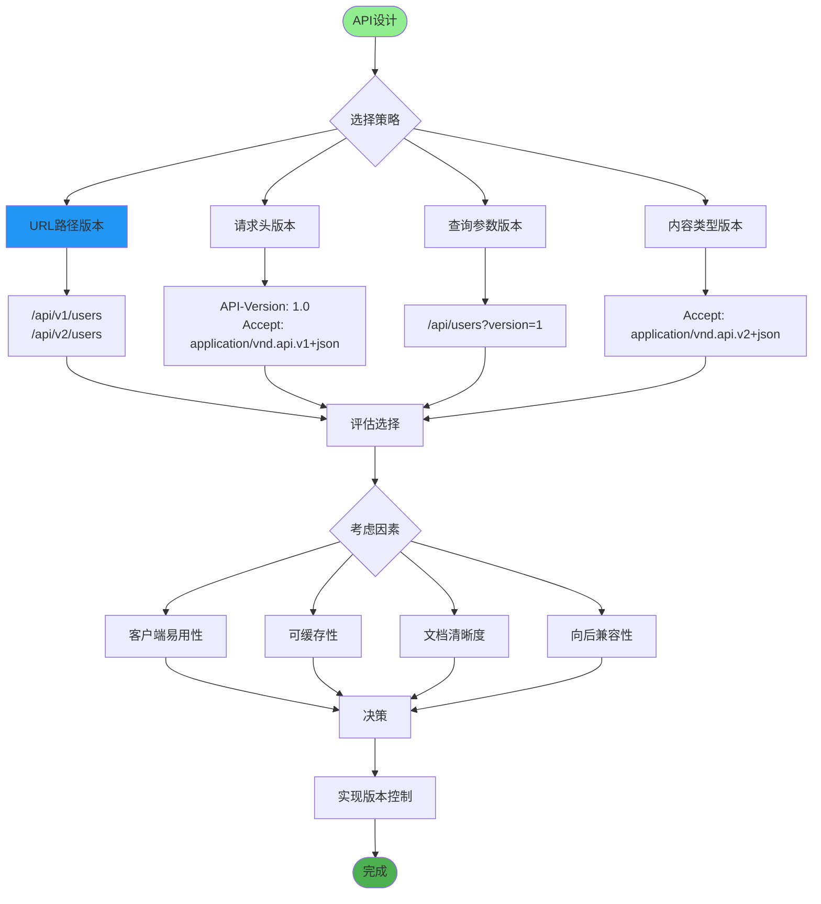
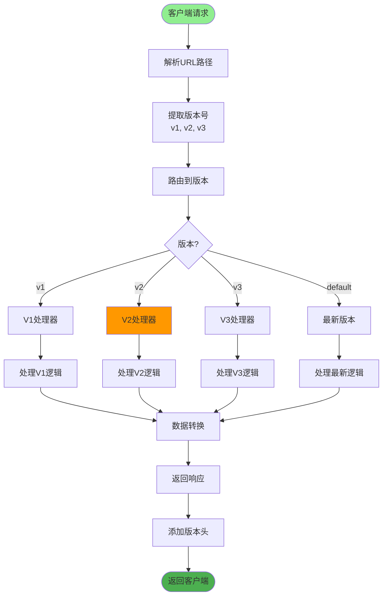
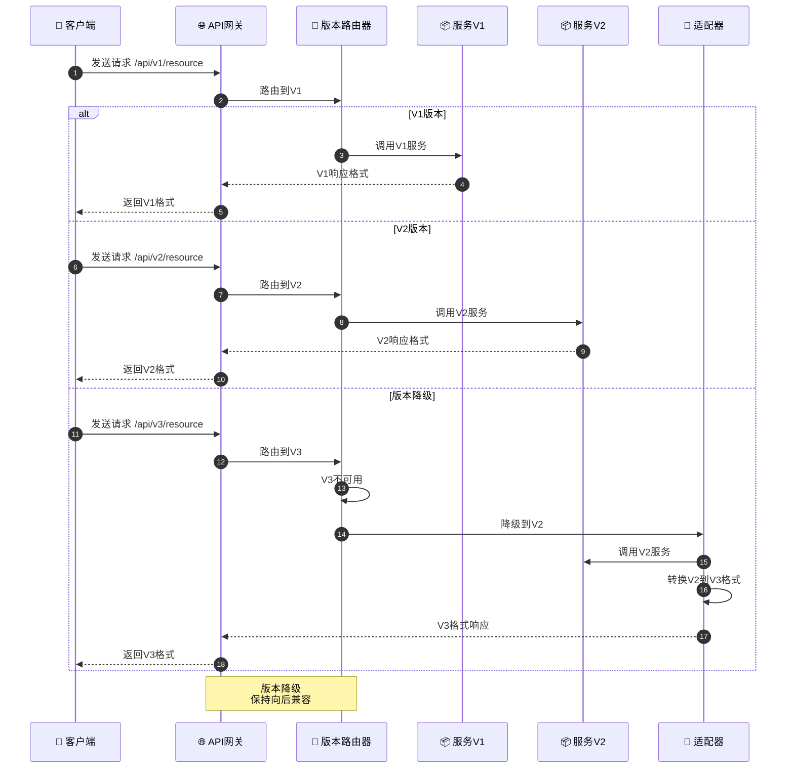
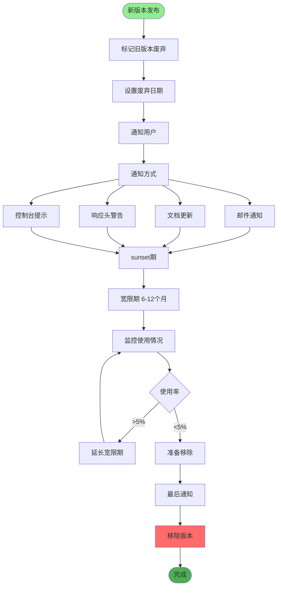
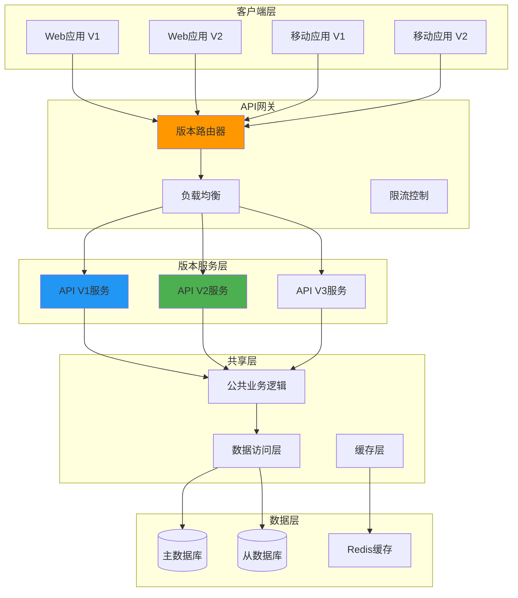
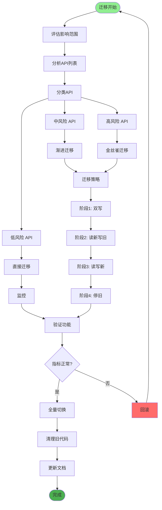
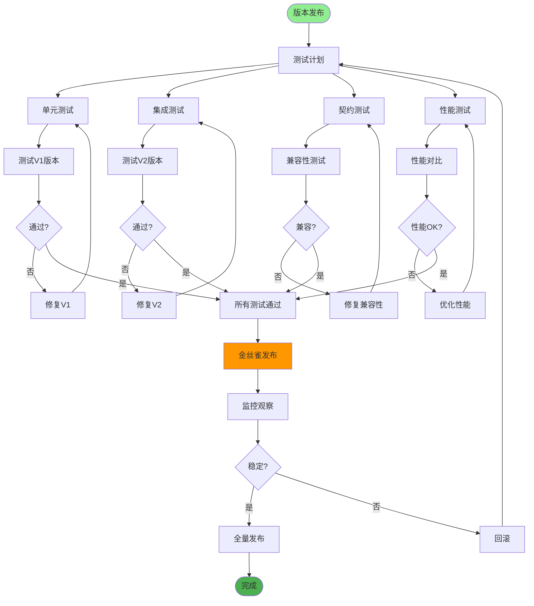
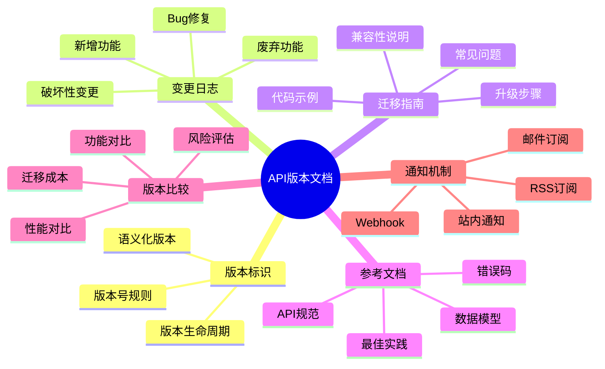
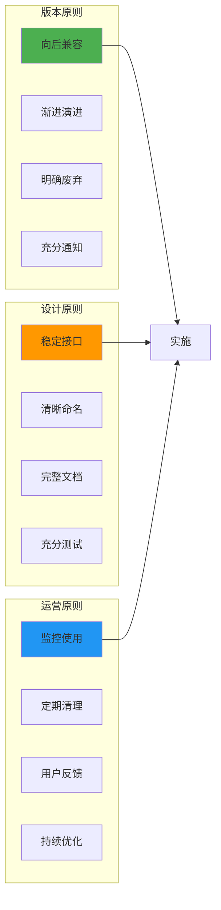

# API版本管理详解

## 1. 版本管理策略

## 2. URL路径版本控制

## 3. 版本兼容性管理

## 4. 版本废弃流程

## 5. 多版本共存架构

## 6. 版本迁移策略

## 7. 版本测试策略

## 8. 版本文档管理

## 关键代码位置

| 功能 | 文件路径 |
|------|---------|
| API路由版本控制 | `router/__init__.py` |
| 版本依赖注入 | `dependencies/version.py` |
| 版本中间件 | `middleware/version_middleware.py` |
| 版本响应头 | `core/response.py` |

## 最佳实践

