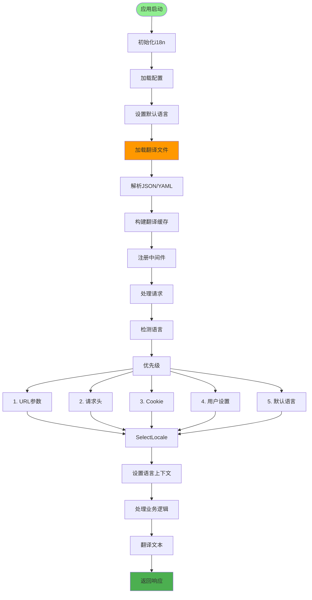
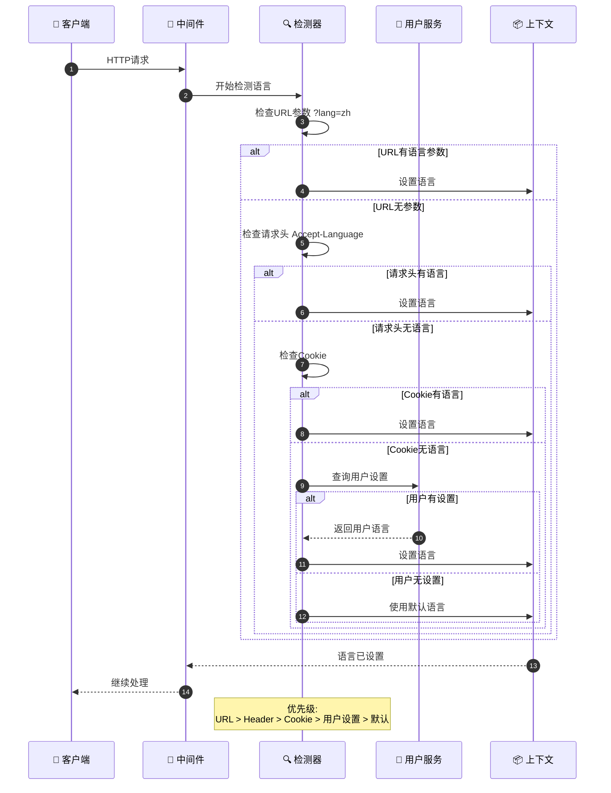
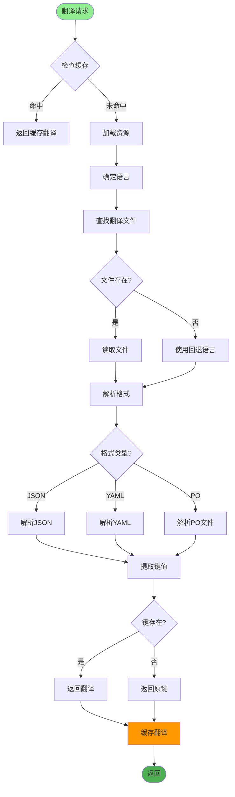
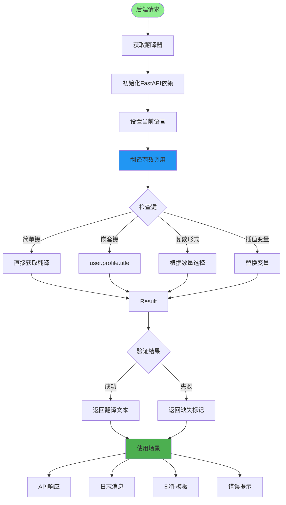
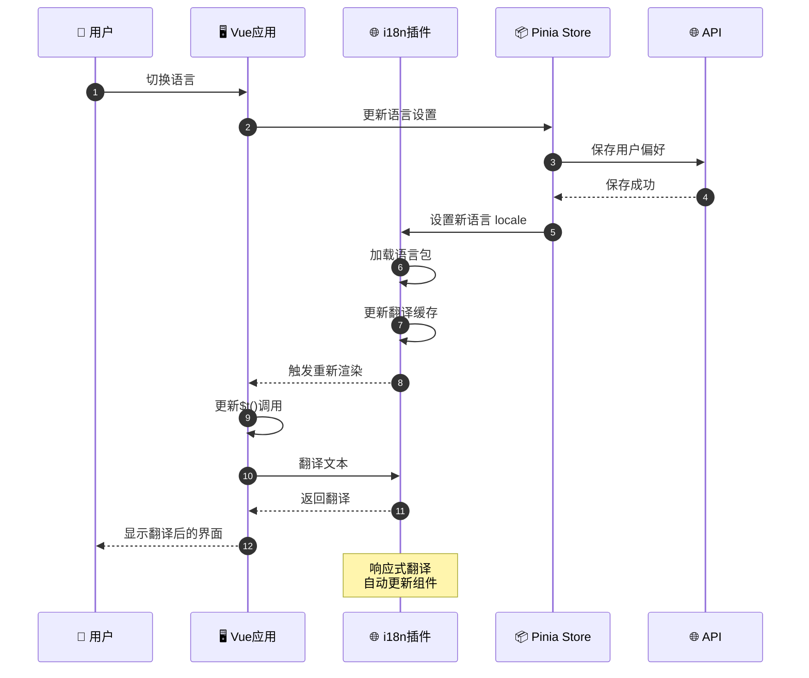
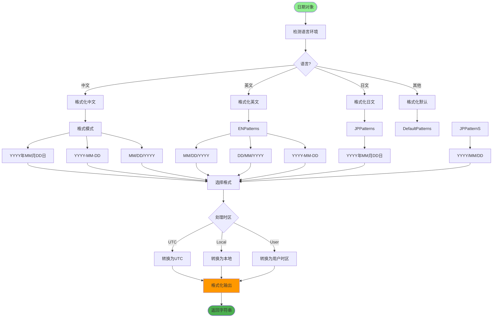
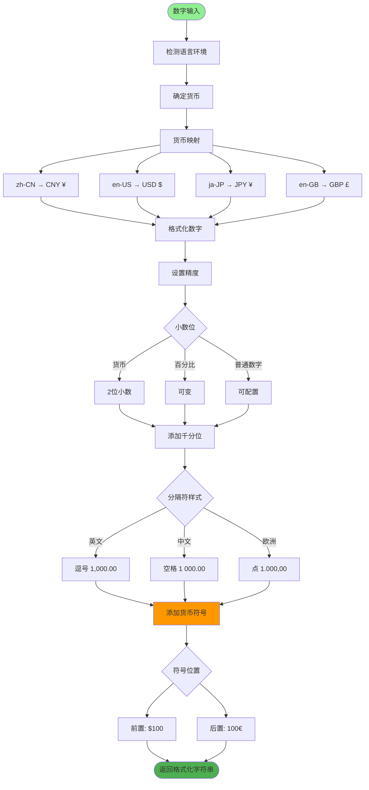
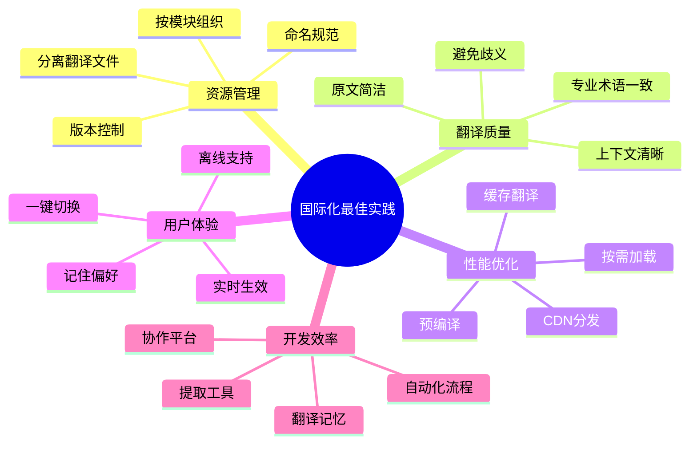

# 国际化i18n详解

## 1. 国际化架构设计



## 2. 语言检测流程



## 3. 翻译资源管理



## 4. 后端翻译实现



## 5. 前端翻译实现



## 6. 日期时间格式化



## 7. 货币数字格式化



## 8. 翻译工作流程

```mermaid
flowchart TD
    Start([项目启动]) --> ExtractKeys[提取翻译键]

    ExtractKeys --> ScanCode[扫描代码]
    ScanCode --> FindCalls[查找翻译调用]

    FindCalls --> Backend[后端 _() 调用]
    FindCalls --> Frontend[前端 $t() 调用]
    FindCalls --> Templates[模板翻译]

    Backend --> CollectKeys[收集所有键]
    Frontend --> CollectKeys
    Templates --> CollectKeys

    CollectKeys --> GenerateTemplate[生成翻译模板]
    GenerateTemplate --> ExportFile[导出文件]

    ExportFile --> SendTranslator[发送给翻译]
    SendTranslator --> TranslateProcess[翻译流程]

    TranslateProcess --> Manual[人工翻译]
    TranslateProcess --> Machine[机器翻译辅助]
    TranslateProcess --> Review[审校]

    Manual --> ImportFiles[导入翻译文件]
    Machine --> ImportFiles
    Review --> ImportFiles

    ImportFiles --> ValidateFormat[验证格式]
    ValidateFormat --> CheckCompleteness[检查完整性]
    CheckCompleteness --> TestUI[测试界面]

    TestUI --> TestOK{显示正常?}
    TestOK -->|否| FixTranslation[修复翻译]
    TestOK -->|是| Deploy[部署]

    FixTranslation --> ImportFiles

    Deploy --> Monitor[监控反馈]
    Monitor --> Update[持续更新]

    style Start fill:#90EE90
    style Deploy fill:#4CAF50
    style TranslateProcess fill:#FF9800
```

## 关键代码位置

| 功能 | 文件路径 |
|------|---------|
| i18n配置 | `config/i18n.py` |
| 翻译文件 | `locales/{lang}/messages.json` |
| 前端i18n | `ruoyi-fastapi-frontend/src/i18n/` |
| 翻译工具 | `utils/i18n_utils.py` |

## 最佳实践


