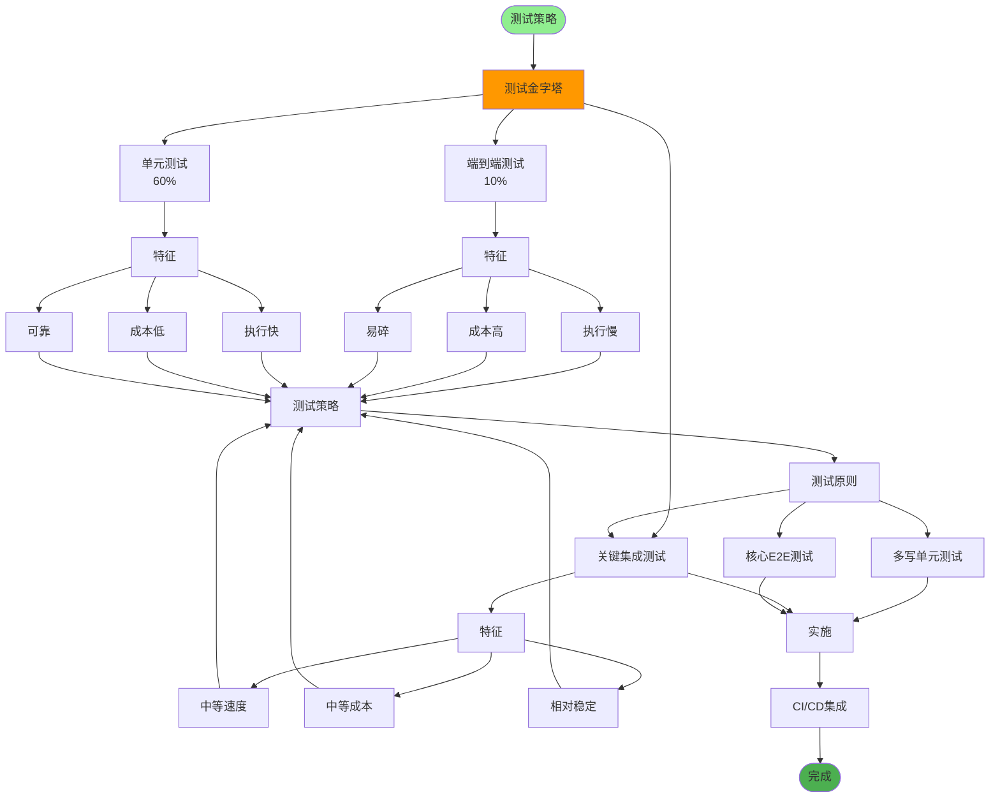
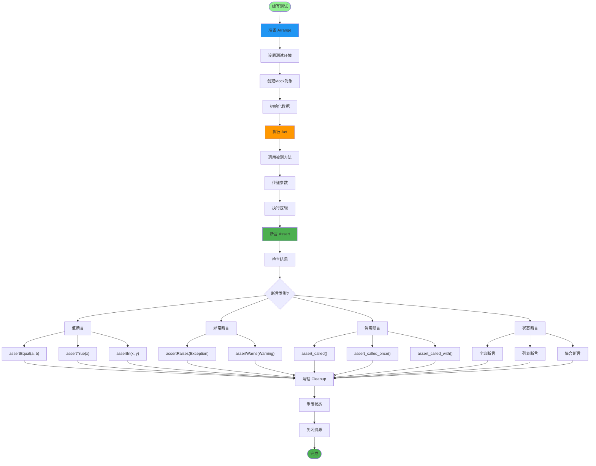
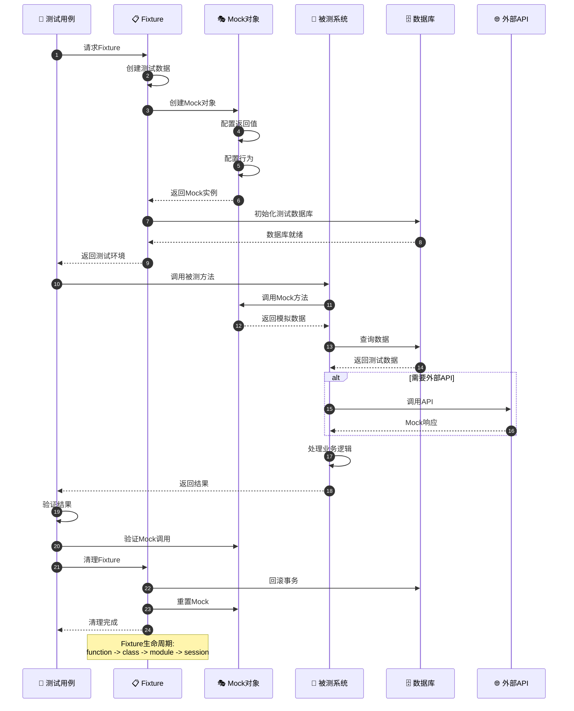
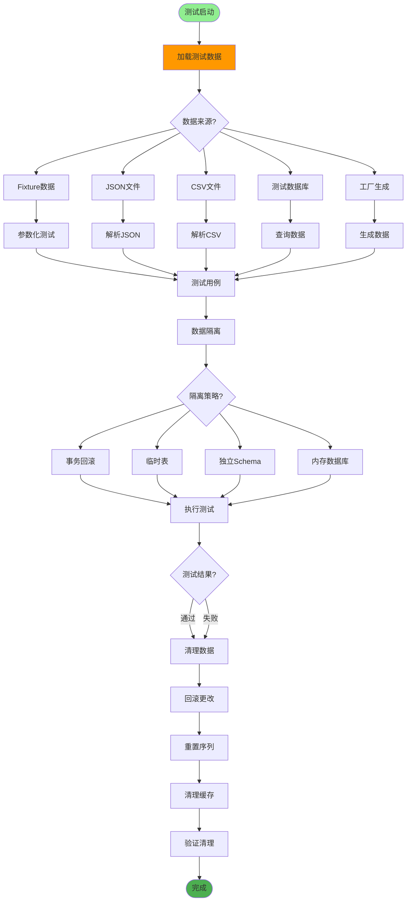
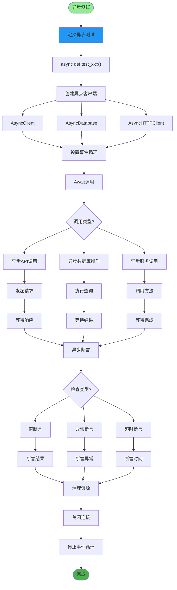
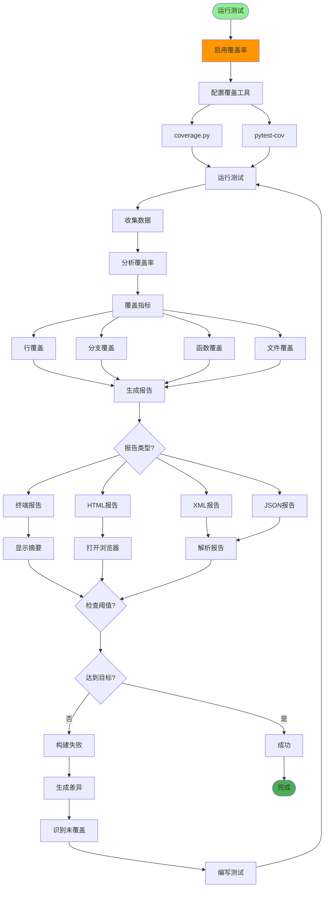
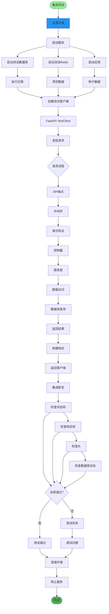
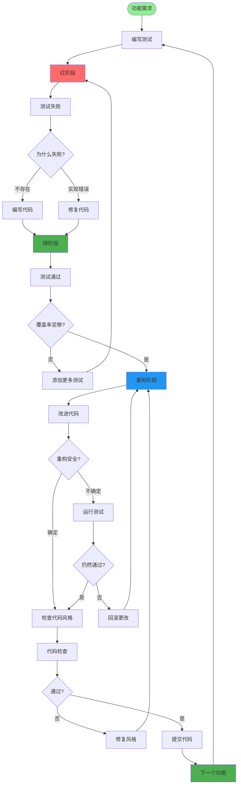
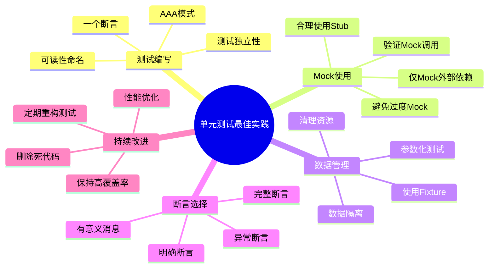

# 单元测试指南详解

## 1. 测试金字塔策略

## 2. 单元测试结构

## 3. Mock与Fixture使用

## 4. 测试数据管理

## 5. 异步测试

## 6. 测试覆盖率

## 7. 集成测试

## 8. TDD测试驱动开发

## 关键代码位置

| 功能 | 文件路径 |
|------|---------|
| 测试配置 | `tests/conftest.py` |
| 单元测试 | `tests/test_*.py` |
| API测试 | `tests/test_api/` |
| 覆盖率配置 | `pytest.ini` |
| Fixtures | `tests/fixtures/` |

## 最佳实践

