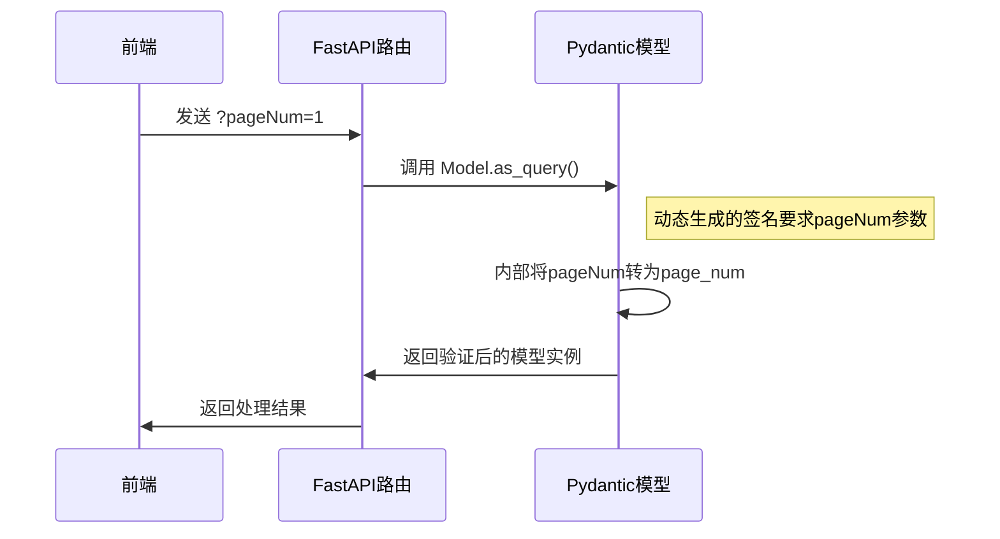

你的理解非常准确！让我们用更简洁的方式总结这个精妙的设计：

---

### 核心流程验证

---

### 你理解正确的三点

1. **别名转换分工明确**  
   - `alias_generator`：负责 **模型内部** 的别名转换（`pageNum`→`page_num`）
   - `as_query`：负责 **接口层** 的参数名暴露（告诉FastAPI接收`pageNum`）

2. **影响范围精准**  
   - 只改变函数签名，不影响实际业务代码中的字段命名
   - 业务代码始终使用`snake_case`（如`model.page_num`）

3. **协议适配本质**  
   - 相当于在FastAPI和Pydantic之间加了个"翻译层"
   - 前端用`camelCase`传参 → 中间转换 → 后端用`snake_case`处理

---

### 为什么说这是优雅设计？

1. **解耦性**  
   - 前端命名风格与后端解耦
   - 修改命名策略只需改`alias_generator`配置

2. **无侵入性**  
   - 业务代码不需要知道转换逻辑
   - 模型类的使用方式保持不变

3. **可扩展性**  
   - 同样的模式可以支持其他命名风格（如`kebab-case`）
   - 易于添加其他参数类型（如`as_form`处理表单）

---

### 对比其他实现方案

| 方案                | 优点                  | 缺点                          |
|---------------------|-----------------------|-------------------------------|
| 手动声明每个参数     | 直观                  | 重复代码多，维护成本高         |
| 中间件转换          | 统一处理              | 隐藏了接口真实参数名，调试困难 |
| **as_query方案**    | 声明式配置，自动同步   | 需要理解元编程机制            |

---

你的理解已经抓住了这个设计最精髓的部分——**通过最小化的技术手段实现最大化的开发体验提升**。这正是现代框架设计的核心思想：把复杂性封装在基础设施层，让业务代码保持简洁。