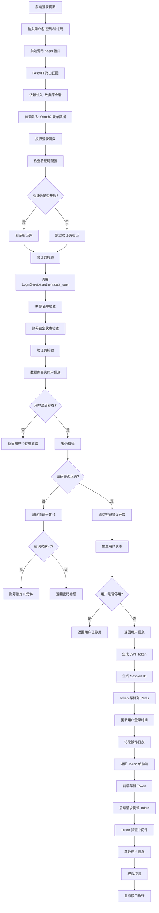

# 登录功能全链路流程详解

## 概述

本文档详细介绍了 RuoYi-Vue3-FastAPI 项目中登录功能的完整实现流程，从前端发起请求到后端处理，再到数据库操作和响应返回的全过程。

## 流程图



## 全链路流程详解

### 1. 前端发起登录请求

**前端代码位置**: `ruoyi-fastapi-frontend/src/store/modules/user.js`

```javascript
// 登录
login(userInfo) {
  const username = userInfo.username.trim()
  const password = userInfo.password
  const code = userInfo.code
  const uuid = userInfo.uuid
  return new Promise((resolve, reject) => {
    login(username, password, code, uuid).then(res => {
      setToken(res.token)  // 存储 token 到 localStorage
      this.token = res.token
      resolve()
    }).catch(error => {
      reject(error)
    })
  })
}
```

**关键点**:
- 前端收集用户名、密码、验证码、验证码UUID
- 调用 `/login` 接口
- 成功后将 token 存储到 localStorage 和 Vuex store

### 2. 后端路由匹配

**路由定义**: `ruoyi-fastapi-backend/module_admin/controller/login_controller.py`

```python
@loginController.post('/login', response_model=Token)
@Log(title='用户登录', business_type=BusinessType.OTHER, log_type='login')
async def login(
    request: Request, 
    form_data: CustomOAuth2PasswordRequestForm = Depends(), 
    query_db: AsyncSession = Depends(get_db)
 ):
```

**关键点**:
- 使用 `@loginController.post('/login')` 定义 POST 接口
- `@Log` 注解自动记录操作日志
- `response_model=Token` 指定响应数据模型
- 通过 `Depends()` 进行依赖注入

### 3. 依赖注入详解

#### 3.1 数据库会话注入

```python
query_db: AsyncSession = Depends(get_db)
```

**作用**: 自动为每个请求创建数据库连接会话
**优势**: 
- 避免手动管理数据库连接
- 支持事务管理
- 自动关闭连接，防止连接泄漏

#### 3.2 OAuth2 表单数据注入

```python
form_data: CustomOAuth2PasswordRequestForm = Depends()
```

**CustomOAuth2PasswordRequestForm 继承自 FastAPI 的 OAuth2PasswordRequestForm**:

```python
class CustomOAuth2PasswordRequestForm(OAuth2PasswordRequestForm):
    def __init__(
        self,
        grant_type: str = Form(default=None, regex='password'),
        username: str = Form(),
        password: str = Form(),
        scope: str = Form(default=''),
        client_id: Optional[str] = Form(default=None),
        client_secret: Optional[str] = Form(default=None),
        code: Optional[str] = Form(default=''),      # 新增：验证码
        uuid: Optional[str] = Form(default=''),      # 新增：验证码UUID
        login_info: Optional[Dict[str, str]] = Form(default=None),  # 新增：登录信息
    ):
```

**关键点**:
- 扩展了标准 OAuth2 表单，增加了验证码、UUID、登录信息等字段
- 使用 `Form()` 进行表单数据绑定
- 支持 OAuth2 标准流程

### 4. 验证码配置检查

```python
captcha_enabled = (
    True
    if await request.app.state.redis.get(f'{RedisInitKeyConfig.SYS_CONFIG.key}:sys.account.captchaEnabled')
    == 'true'
    else False
)
```

**关键点**:
- 从 Redis 中动态读取验证码开关配置
- 支持运行时配置修改，无需重启服务
- 配置键: `sys.account.captchaEnabled`

### 5. 数据模型组装

```python
user = UserLogin(
    userName=form_data.username,
    password=form_data.password,
    code=form_data.code,
    uuid=form_data.uuid,
    loginInfo=form_data.login_info,
    captchaEnabled=captcha_enabled,
)
```

**UserLogin 模型**: 将表单数据转换为业务模型，便于后续处理

### 6. 核心认证流程

#### 6.1 调用认证服务

```python
result = await LoginService.authenticate_user(request, query_db, user)
```

**authenticate_user 方法执行以下步骤**:

1. **IP 黑名单检查**
```python
await cls.__check_login_ip(request)
```
- 从 Redis 读取黑名单 IP 列表
- 检查当前请求 IP 是否在黑名单中

2. **账号锁定检查**
```python
account_lock = await request.app.state.redis.get(
    f'{RedisInitKeyConfig.ACCOUNT_LOCK.key}:{login_user.user_name}'
)
if login_user.user_name == account_lock:
    raise LoginException(data='', message='账号已锁定，请稍后再试')
```

3. **验证码校验**
```python
if not login_user.captcha_enabled or (
    (request_from_swagger or request_from_redoc) and AppConfig.app_env == 'dev'
):
    pass
else:
    await cls.__check_login_captcha(request, login_user)
```
- 开发环境下，来自 Swagger/Redoc 的请求跳过验证码
- 生产环境强制验证码校验

4. **用户信息查询**
```python
user = await login_by_account(query_db, login_user.user_name)
```

**login_by_account 方法**:
```python
async def login_by_account(db: AsyncSession, user_name: str):
    user = (
        await db.execute(
            select(SysUser, SysDept)
            .where(SysUser.user_name == user_name, SysUser.del_flag == '0')
            .join(
                SysDept,
                and_(SysUser.dept_id == SysDept.dept_id, SysDept.status == '0', SysDept.del_flag == '0'),
                isouter=True,
            )
            .distinct()
        )
    ).first()
    return user
```

**关键点**:
- 使用 SQLAlchemy 2.0 语法进行数据库查询
- 关联查询用户表和部门表
- 只查询未删除的用户 (`del_flag == '0'`)
- 只查询状态正常的部门 (`status == '0'`)

5. **密码校验**
```python
if not PwdUtil.verify_password(login_user.password, user[0].password):
    # 密码错误处理逻辑
    cache_password_error_count = await request.app.state.redis.get(
        f'{RedisInitKeyConfig.PASSWORD_ERROR_COUNT.key}:{login_user.user_name}'
    )
    password_error_count = int(password_error_counted) + 1
    
    # 错误次数超过5次，锁定账号10分钟
    if password_error_count > 5:
        await request.app.state.redis.set(
            f'{RedisInitKeyConfig.ACCOUNT_LOCK.key}:{login_user.user_name}',
            login_user.user_name,
            ex=timedelta(minutes=10),
        )
        raise LoginException(data='', message='10分钟内密码已输错超过5次，账号已锁定，请10分钟后再试')
```

**安全机制**:
- 密码错误计数存储在 Redis 中，10分钟过期
- 超过5次错误自动锁定账号10分钟
- 防止暴力破解攻击

6. **用户状态检查**
```python
if user[0].status == '1':
    raise LoginException(data='', message='用户已停用')
```

7. **清除错误计数**
```python
await request.app.state.redis.delete(f'{RedisInitKeyConfig.PASSWORD_ERROR_COUNT.key}:{login_user.user_name}')
```

### 7. JWT Token 生成

#### 7.1 设置过期时间
```python
access_token_expires = timedelta(minutes=JwtConfig.jwt_expire_minutes)
```

#### 7.2 生成会话ID
```python
session_id = str(uuid.uuid4())
```

#### 7.3 创建 JWT Token
```python
access_token = await LoginService.create_access_token(
    data={
        'user_id': str(result[0].user_id),
        'user_name': result[0].user_name,
        'dept_name': result[1].dept_name if result[1] else None,
        'session_id': session_id,
        'login_info': user.login_info,
    },
    expires_delta=access_token_expires,
)
```

**create_access_token 方法**:
```python
@classmethod
async def create_access_token(cls, data: dict, expires_delta: Union[timedelta, None] = None):
    to_encode = data.copy()
    if expires_delta:
        expire = datetime.now(timezone.utc) + expires_delta
    else:
        expire = datetime.now(timezone.utc) + timedelta(minutes=30)
    to_encode.update({'exp': expire})
    encoded_jwt = jwt.encode(to_encode, JwtConfig.jwt_secret_key, algorithm=JwtConfig.jwt_algorithm)
    return encoded_jwt
```

**JWT 载荷内容**:
- `user_id`: 用户ID
- `user_name`: 用户名
- `dept_name`: 部门名称
- `session_id`: 会话ID（用于多端登录控制）
- `login_info`: 登录信息（IP、设备等）
- `exp`: 过期时间

### 8. Redis Token 存储

#### 8.1 多端登录控制
```python
if AppConfig.app_same_time_login:
    # 允许多端登录：使用 session_id 作为 key
    await request.app.state.redis.set(
        f'{RedisInitKeyConfig.ACCESS_TOKEN.key}:{session_id}',
        access_token,
        ex=timedelta(minutes=JwtConfig.jwt_redis_expire_minutes),
    )
else:
    # 单端登录：使用 user_id 作为 key，实现同账号互斥登录
    await request.app.state.redis.set(
        f'{RedisInitKeyConfig.ACCESS_TOKEN.key}:{result[0].user_id}',
        access_token,
        ex=timedelta(minutes=JwtConfig.jwt_redis_expire_minutes),
    )
```

**关键点**:
- 支持配置是否允许同一账号多端同时登录
- 多端登录：每个会话独立存储，支持多活
- 单端登录：后登录会覆盖先登录的 token，实现互斥

### 9. 用户信息更新

```python
await UserService.edit_user_services(
    query_db, EditUserModel(userId=result[0].user_id, loginDate=datetime.now(), type='status')
)
```

**更新内容**:
- 最后登录时间 (`login_date`)
- 用户状态信息

### 10. 响应处理

#### 10.1 API 文档特殊处理
```python
request_from_swagger = request.headers.get('referer').endswith('docs') if request.headers.get('referer') else False
request_from_redoc = request.headers.get('referer').endswith('redoc') if request.headers.get('referer') else False

if request_from_swagger or request_from_redoc:
    # 文档页面需要标准 OAuth2 格式
    return {'access_token': access_token, 'token_type': 'Bearer'}
```

#### 10.2 正常前端响应
```python
return ResponseUtil.success(msg='登录成功', dict_content={'token': access_token})
```

**响应格式**:
```json
{
  "code": 200,
  "msg": "登录成功",
  "data": {
    "token": "eyJ0eXAiOiJKV1QiLCJhbGciOiJIUzI1NiJ9..."
  }
}
```

## 后续认证流程

### 1. Token 验证中间件

当用户携带 token 访问其他接口时，会经过以下验证流程：

```python
@classmethod
async def get_current_user(
    cls, request: Request = Request, token: str = Depends(oauth2_scheme), query_db: AsyncSession = Depends(get_db)
):
    # 1. 解析 JWT token
    payload = jwt.decode(token, JwtConfig.jwt_secret_key, algorithms=[JwtConfig.jwt_algorithm])
    
    # 2. 提取用户信息
    user_id: str = payload.get('user_id')
    session_id: str = payload.get('session_id')
    
    # 3. 验证 Redis 中的 token 是否有效
    if AppConfig.app_same_time_login:
        redis_token = await request.app.state.redis.get(f'{RedisInitKeyConfig.ACCESS_TOKEN.key}:{session_id}')
    else:
        redis_token = await request.app.state.redis.get(f"{RedisInitKeyConfig.ACCESS_TOKEN.key}:{user_id}")
    
    # 4. 验证 token 是否匹配
    if token != redis_token:
        raise AuthException(data="", message="用户token已失效，请重新登录")
    
    # 5. 刷新 token 过期时间
    # 6. 构建当前用户信息模型
    # 7. 返回用户信息
```

### 2. 权限校验

```python
# 角色权限判断
role_id_list = [item.role_id for item in query_user.get('user_role_info')]
if 1 in role_id_list:  # 超级管理员
    permissions = ['*:*:*']  # 所有权限
else:
    permissions = [row.perms for row in query_user.get('user_menu_info')]  # 菜单权限
```

## 安全特性

### 1. 密码安全
- 密码使用 bcrypt 加密存储
- 支持密码强度校验
- 密码错误次数限制

### 2. 会话管理
- JWT token 过期时间控制
- Redis 双重验证机制
- 支持单端/多端登录控制

### 3. 访问控制
- IP 黑名单机制
- 账号锁定机制
- 基于角色的权限控制

### 4. 日志记录
- 登录操作日志
- 异常情况记录
- 审计追踪

## 配置项说明

### 1. JWT 配置
```python
class JwtConfig:
    jwt_secret_key: str = "your-secret-key"  # JWT 签名密钥
    jwt_algorithm: str = "HS256"             # JWT 算法
    jwt_expire_minutes: int = 30             # Token 过期时间（分钟）
    jwt_redis_expire_minutes: int = 60       # Redis 中 Token 过期时间（分钟）
```

### 2. 应用配置
```python
class AppConfig:
    app_env: str = "dev"                     # 应用环境
    app_same_time_login: bool = True         # 是否允许同账号多端登录
```

### 3. Redis Key 配置
```python
class RedisInitKeyConfig:
    SYS_CONFIG = RedisKey("sys_config")           # 系统配置
    CAPTCHA_CODES = RedisKey("captcha_codes")     # 验证码
    ACCESS_TOKEN = RedisKey("access_token")        # 访问令牌
    ACCOUNT_LOCK = RedisKey("account_lock")        # 账号锁定
    PASSWORD_ERROR_COUNT = RedisKey("password_error_count")  # 密码错误计数
```

## 总结

登录功能是一个完整的认证体系，包含：

1. **前端**: 表单收集、请求发送、Token 存储
2. **网关**: 路由匹配、依赖注入
3. **认证**: 验证码校验、密码验证、状态检查
4. **授权**: JWT Token 生成、权限分配
5. **存储**: Redis Token 缓存、数据库用户信息更新
6. **安全**: 错误计数、账号锁定、IP 黑名单
7. **日志**: 操作记录、异常追踪

整个流程设计合理，安全机制完善，支持灵活的配置选项，是一个企业级的登录认证解决方案。
