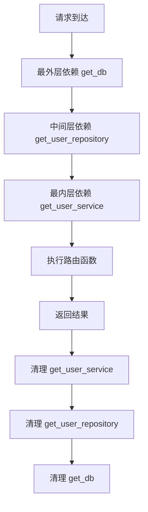

# 依赖注入系统

## 学习目标

- 理解依赖注入的概念和作用
- 掌握 `Depends` 的使用方法
- 学习类作为依赖
- 理解依赖嵌套和缓存
- 掌握上下文管理器作为依赖

## 1. 依赖注入基础

### 1.1 什么是依赖注入？

依赖注入（Dependency Injection）是一种设计模式，用于实现控制反转（IoC）。

**核心思想：**
- 不在函数内部创建依赖对象
- 通过外部传入依赖对象
- 提高代码的可测试性和可维护性

### 1.2 基本用法

```python
from fastapi import Depends, APIRouter

router = APIRouter()

# 定义依赖函数
async def get_db():
    """数据库会话依赖"""
    session = AsyncSessionLocal()
    try:
        yield session
    finally:
        await session.close()

# 使用依赖
@router.get('/users')
async def get_users(db: AsyncSession = Depends(get_db)):
    """
    FastAPI 自动调用 get_db()
    将返回值注入到 db 参数
    """
    users = await db.execute(select(User))
    return users
```

**依赖注入的执行流程：**

```
1. 请求到达 /users
2. FastAPI 看到 Depends(get_db)
3. 调用 get_db() 函数
4. 获取返回的 session
5. 将 session 传递给 get_users(db)
6. 执行业务逻辑
7. 请求结束后，关闭 session
```

## 2. 函数作为依赖

### 2.1 简单依赖

**文件：** `config/get_db.py:7-26`

```python
from sqlalchemy.ext.asyncio import AsyncSession
from config.database import AsyncSessionLocal

async def get_db():
    """
    数据库会话依赖函数

    功能：
    - 为每个请求创建独立的数据库会话
    - 请求处理完毕后自动关闭数据库连接
    - 不同的请求使用不同的连接，确保请求隔离

    语法特点：
    - 使用 yield 创建生成器
    - yield 之前：请求开始时执行
    - yield 之后：请求结束后执行
    """
    async with AsyncSessionLocal() as current_db:
        yield current_db
        # 上下文管理器自动关闭会话
```

**使用方式：**

```python
from fastapi import Depends
from config.get_db import get_db

@router.get('/users')
async def get_users(db: AsyncSession = Depends(get_db)):
    """获取用户列表"""
    result = await db.execute(select(User))
    return result.scalars().all()
```

### 2.2 带参数的依赖

```python
async def get_pagination_params(
    page: int = 1,
    size: int = 10
) -> PaginationParams:
    """分页参数依赖"""
    # 验证参数
    if page < 1:
        page = 1
    if size < 1 or size > 100:
        size = 10

    return PaginationParams(page=page, size=size)

@router.get('/users')
async def get_users(
    params: PaginationParams = Depends(get_pagination_params)
):
    """使用带参数的依赖"""
    users = await get_users_from_db(params.page, params.size)
    return users
```

### 2.3 可选依赖

```python
from typing import Optional
from fastapi import Depends

async def get_current_user(
    token: Optional[str] = Depends(get_token)
):
    """可选的当前用户依赖"""
    if not token:
        return None
    return await verify_token(token)

@router.get('/profile')
async def get_profile(
    user: Optional[UserModel] = Depends(get_current_user)
):
    """获取用户信息 - 未登录也可以访问"""
    if user:
        return {'logged_in': True, 'user': user}
    return {'logged_in': False}
```

## 3. 类作为依赖

### 3.1 基本用法

```python
from fastapi import Depends

class UserService:
    """用户服务类"""

    def __init__(self, db: AsyncSession = Depends(get_db)):
        """
        构造函数的依赖会自动注入

        FastAPI 调用流程：
        1. 调用 get_db() 获取数据库会话
        2. 实例化 UserService(db)
        3. 传递给路由函数
        """
        self.db = db

    async def get_users(self):
        """获取用户列表"""
        result = await self.db.execute(select(User))
        return result.scalars().all()

@router.get('/users')
async def get_users(
    service: UserService = Depends(UserService)
):
    """服务类作为依赖"""
    return await service.get_users()
```

### 3.2 项目中的实际应用

**文件：** `module_admin/service/user_service.py`

```python
from sqlalchemy.ext.asyncio import AsyncSession
from config.get_db import get_db

class UserService:
    """用户服务类"""

    def __init__(self, *args, **kwargs):
        """
        初始化服务

        可以接收多个依赖
        """
        pass

    @classmethod
    async def get_user_list_services(
        cls,
        query_db: AsyncSession,
        user_page_query: UserPageQueryModel,
        data_scope_sql: str,
        is_page: bool = False
    ):
        """
        获取用户列表

        注意：数据库会话通过参数传入
        """
        # 执行查询
        stmt = select(SysUser)

        # 应用数据权限
        if data_scope_sql:
            stmt = stmt.text(data_scope_sql)

        # 分页处理
        if is_page:
            stmt = stmt.offset((user_page_query.page - 1) * user_page_query.page_size)
            stmt = stmt.limit(user_page_query.page_size)

        # 执行查询
        result = await query_db.execute(stmt)

        return result
```

## 4. 依赖嵌套

### 4.1 嵌套依赖示例

```python
# 第一层依赖
async def get_db():
    """获取数据库会话"""
    async with AsyncSessionLocal() as session:
        yield session

# 第二层依赖 - 依赖第一层
async def get_user_repository(db: AsyncSession = Depends(get_db)):
    """获取用户仓库 - 依赖数据库会话"""
    return UserRepository(db)

# 第三层依赖 - 依赖第二层
async def get_user_service(repo: UserRepository = Depends(get_user_repository)):
    """获取用户服务 - 依赖仓库"""
    return UserService(repo)

@router.get('/users')
async def get_users(
    service: UserService = Depends(get_user_service)
):
    """
    依赖链：
    get_db() → UserRepository → UserService
    """
    return await service.get_users()
```

### 4.2 嵌套依赖执行顺序



## 5. 全局依赖

### 5.1 路由级全局依赖

**文件：** `module_admin/controller/user_controller.py:76`

```python
from fastapi import APIRouter, Depends

# 全局依赖：所有路由都需要验证用户登录
userController = APIRouter(
    prefix='/system/user',
    dependencies=[Depends(LoginService.get_current_user)]  # 全局依赖
)

@userController.get('/list')
async def get_users_list():
    """
    这个路由会自动执行 get_current_user
    不需要显式声明依赖

    如果验证失败，不会执行到这里
    """
    pass
```

### 5.2 依赖执行顺序

```python
# 1. 全局依赖优先执行
userController = APIRouter(
    dependencies=[
        Depends(check_token),      # 先执行
        Depends(check_permission)    # 后执行
    ]
)

# 2. 路由级依赖
@userController.get('/list',
                   dependencies=[Depends(check_owner)])  # 最后执行
async def get_users():
    pass

# 执行顺序：
# check_token → check_permission → check_owner → 路由函数
```

## 6. 依赖缓存

### 6.1 默认缓存行为

```python
# 默认情况下，同一请求中的相同依赖只会执行一次

@router.get('/users/{user_id}')
async def get_user(
    user_id: int,
    db1: AsyncSession = Depends(get_db),  # 第1次调用
    db2: AsyncSession = Depends(get_db)    # 第2次调用（使用缓存）
):
    """
    db1 和 db2 是同一个会话对象
    因为 get_db 被缓存了
    """
    assert db1 is db2  # True
    pass
```

### 6.2 禁用缓存

```python
from fastapi import Depends

# 不使用缓存：每次都创建新实例
@router.get('/users')
async def get_users(
    db1: AsyncSession = Depends(get_db, use_cache=False),
    db2: AsyncSession = Depends(get_db, use_cache=False)
):
    """
    db1 和 db2 是不同的会话对象
    use_cache=False 禁用了缓存
    """
    assert db1 is not db2  # True
    pass
```

## 7. 上下文管理器依赖

### 7.1 yield 语法

```python
async def get_db():
    """
    yield 语法说明：
    - yield 之前：请求开始时执行
    - yield 之后：请求结束后执行
    - 类似 try-finally 的效果
    """
    # 资源初始化
    session = AsyncSessionLocal()

    try:
        yield session  # 将 session 提供给路由函数
    finally:
        # 资源清理
        await session.close()
```

### 7.2 多个 yield

```python
async def get_resources():
    """
    可以 yield 多个资源
    """
    db = AsyncSessionLocal()
    redis = await RedisUtil.get_connection()

    try:
        yield db, redis  # 可以 yield 多个值
    finally:
        await db.close()
        await redis.close()

@router.get('/data')
async def get_data(
    resources: tuple[AsyncSession, Redis] = Depends(get_resources)
):
    """
    接收多个资源
    """
    db, redis = resources
    # 使用 db 和 redis
    pass
```

## 8. 依赖验证

### 8.1 在依赖中验证

```python
from fastapi import HTTPException

async def verify_token(token: str = Depends(get_token_header)):
    """验证 Token"""
    user_info = await decode_token(token)

    if not user_info:
        raise HTTPException(status_code=401, detail='Token 无效')

    return user_info

@router.get('/users')
async def get_users(
    user_info: dict = Depends(verify_token)
):
    """
    如果 Token 无效：
    - verify_token 会抛出异常
    - 路由函数不会执行
    """
    pass
```

### 8.2 提升异常到依赖

```python
class AuthException(Exception):
    """自定义认证异常"""

async def check_permission(
    user: UserModel = Depends(get_current_user)
):
    """检查权限 - 在依赖中处理"""
    if not user.is_admin:
        raise AuthException('权限不足')

    return user

# 使用自定义异常处理器
@app.exception_handler(AuthException)
async def auth_exception_handler(request: Request, exc: AuthException):
    return ResponseUtil.unauthorized(msg=str(exc))
```

## 9. 依赖模式

### 9.1 单例模式

```python
# 全局单例
class Config:
    _instance = None

    def __new__(cls):
        if cls._instance is None:
            cls._instance = super().__new__(cls)
        return cls._instance

def get_config() -> Config:
    """配置依赖 - 单例模式"""
    return Config()
```

### 9.2 工厂模式

```python
class DatabaseFactory:
    """数据库工厂"""

    @staticmethod
    async def create_session():
        """创建会话"""
        return AsyncSessionLocal()

def get_db() -> AsyncSession:
    """使用工厂模式"""
    return Depends(DatabaseFactory.create_session)
```

### 9.3 仓储模式

```python
class UserRepository:
    """用户仓储"""

    def __init__(self, db: AsyncSession = Depends(get_db)):
        self.db = db

    async def find_by_id(self, user_id: int):
        """根据 ID 查找"""
        stmt = select(SysUser).where(SysUser.user_id == user_id)
        result = await self.db.execute(stmt)
        return result.scalar_one_or_none()

@router.get('/users/{user_id}')
async def get_user(
    user_id: int,
    repo: UserRepository = Depends(UserRepository)
):
    """使用仓储模式"""
    user = await repo.find_by_id(user_id)
    return user
```

## 10. 项目实战示例

### 10.1 数据库依赖

**文件：** `module_admin/controller/user_controller.py:111`

```python
@userController.get('/list')
async def get_system_user_list(
    query_db: AsyncSession = Depends(get_db),  # 数据库依赖
    data_scope_sql: str = Depends(GetDataScope('SysUser'))  # 数据权限依赖
):
    """
    多个依赖协作：

    1. get_db：提供数据库会话
    2. GetDataScope：提供数据权限 SQL
    """
    user_page_query_result = await UserService.get_user_list_services(
        query_db,
        user_page_query,
        data_scope_sql,
        is_page=True
    )
    return ResponseUtil.success(model_content=user_page_query_result)
```

### 10.2 认证依赖

```python
from core.security import get_current_user

@router.post('/users')
async def create_user(
    user: AddUserModel,
    current_user: UserModel = Depends(get_current_user)  # 认证依赖
):
    """
    创建用户

    get_current_user 会：
    1. 从请求头获取 Token
    2. 验证 Token 有效性
    3. 解析用户信息
    4. 返回当前用户对象

    如果验证失败，抛出 401 异常
    """
    # 记录创建者
    user.create_by = current_user.user_name

    return await create_user_in_db(user)
```

## 11. 最佳实践

### 11.1 依赖设计原则

```python
# ✅ 好的做法
# 1. 单一职责
async def get_db():
    """只负责数据库连接"""
    pass

async def get_current_user():
    """只负责用户认证"""
    pass

# 2. 明确命名
async def get_db_session():
    """清晰表达返回类型"""
    pass

# ❌ 不好的做法
async def get_db_and_user_and_validate():
    """职责过多，难以维护"""
    pass
```

### 11.2 依赖复用

```python
# 定义可复用的依赖组合
def common_dependencies():
    """常用依赖组合"""
    return [
        Depends(get_current_user),
        Depends(check_permission),
        Depends(log_request)
    ]

# 使用组合依赖
@router.get('/users',
           dependencies=common_dependencies())
async def get_users():
    pass
```

### 11.3 依赖性能优化

```python
# ✅ 使用缓存（默认）
@router.get('/users')
async def get_users(
    service: UserService = Depends(UserService)
):
    """
    UserService 实例会被缓存
    同一请求中的多次使用共享同一个实例
    """
    pass

# ❌ 避免重复创建
@router.get('/users')
async def get_users(
    db: AsyncSession = Depends(get_db),
    db2: AsyncSession = Depends(get_db)  # 不必要的第二次依赖
):
    pass
```

## 12. 总结

### 12.1 依赖类型

| 类型 | 语法 | 场景 |
|------|------|------|
| **函数依赖** | `Depends(func)` | 简单依赖 |
| **类依赖** | `Depends(Class)` | 需要初始化 |
| **全局依赖** | `dependencies=[...]` | 路由组级 |
| **yield 依赖** | `async def yield` | 资源管理 |

### 12.2 执行顺序

```
全局依赖 → 路由依赖 → 路由参数依赖 → 验证器 → 路由函数
```

### 12.3 最佳实践

1. **单一职责**：每个依赖只做一件事
2. **清晰命名**：依赖名称要表达意图
3. **合理缓存**：利用默认缓存提高性能
4. **资源管理**：使用 yield 确保资源释放
5. **错误处理**：在依赖中验证并抛出异常

## 13. 练习

1. 创建数据库连接依赖
2. 创建认证依赖（验证 Token）
3. 实现仓储模式依赖
4. 创建多层嵌套依赖
5. 使用全局依赖简化代码

## 14. 下一步

完成本节学习后，继续学习：
- **[07-中间件](./07-中间件.md)** - 学习中间件机制
