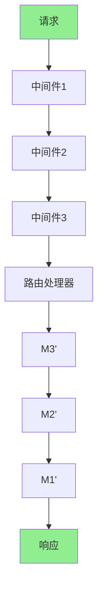

# 中间件

## 学习目标

- 理解中间件的概念和作用
- 掌握中间件的执行顺序
- 学习自定义中间件
- 理解常用中间件（CORS、Gzip、Trace）
- 掌握中间件的最佳实践

## 1. 中间件基础

### 1.1 什么是中间件？

中间件（Middleware）是拦截请求和响应的函数，可以在请求到达路由处理器之前或响应返回客户端之前执行操作。

**中间件的作用：**

```
请求 → [中间件1] → [中间件2] → [中间件3] → 路由处理器
响应 → [中间件3] → [中间件2] → [中间件1] → 客户端
```

**典型用途：**
- 日志记录
- 身份验证
- CORS 处理
- 请求/响应修改
- 错误处理

### 1.2 中间件执行顺序

**文件：** `server.py:146-151`

```python
from fastapi import FastAPI
from middlewares.handle import handle_middleware

app = FastAPI()

# 中间件注册顺序很重要
handle_middleware(app)  # 加载所有中间件
```

**文件：** `middlewares/handle.py:7-16`

```python
def handle_middleware(app: FastAPI):
    """
    全局中间件处理

    执行顺序：
    1. CORS 中间件（跨域处理）
    2. Gzip 中间件（响应压缩）
    3. Trace 中间件（链路追踪）
    """
    # 加载跨域中间件
    add_cors_middleware(app)
    # 加载gzip压缩中间件
    add_gzip_middleware(app)
    # 加载trace中间件
    add_trace_middleware(app)
```

## 2. 自定义中间件

### 2.1 基本中间件

```python
from fastapi import Request
from starlette.middleware.base import BaseHTTPMiddleware

class LoggingMiddleware(BaseHTTPMiddleware):
    """日志中间件"""

    async def dispatch(self, request: Request, call_next):
        """
        处理请求

        request: 当前请求对象
        call_next: 调用下一个中间件或路由
        """
        # 请求处理前
        logger.info(f"请求开始: {request.method} {request.url.path}")

        # 调用下一个中间件或路由处理器
        response = await call_next(request)

        # 请求处理后
        logger.info(f"请求结束: {response.status_code}")

        return response

# 注册中间件
app.add_middleware(LoggingMiddleware)
```

### 2.2 ASGI 中间件

**文件：** `middlewares/trace_middleware/middle.py:21-43`

```python
from starlette.types import ASGIApp, Receive, Scope, Send

class TraceASGIMiddleware:
    """
    FastAPI链路追踪ASGI中间件

    ASGI 中间件实现 __call__ 方法
    """

    def __init__(self, app: ASGIApp) -> None:
        """
        初始化中间件

        :param app: 下一个ASGI应用或中间件
        """
        self.app = app

    async def __call__(self, scope: Scope, receive: Receive, send: Send):
        """
        ASGI 应用入口

        scope: 请求范围信息
        receive: 接收请求的函数
        send: 发送响应的函数
        """
        # 请求处理逻辑
        if scope['type'] != 'http':
            # 只处理 HTTP 请求
            await self.app(scope, receive, send)
            return

        # 创建追踪上下文
        span = get_current_span()

        # 包装 receive 函数
        wrapped_receive = await self.my_receive(receive, span)

        # 包装 send 函数
        wrapped_send = await self.my_send(send, span)

        # 调用下一个应用
        await self.app(scope, wrapped_receive, wrapped_send)
```

### 2.3 中间件装饰器

```python
from functools import wraps
from fastapi import Request, Response

def middleware(func):
    """中间件装饰器"""

    @wraps(func)
    async def wrapper(request: Request, call_next):
        """包装路由处理器"""
        # 处理前
        start_time = time.time()

        # 调用路由处理器
        response = await call_next(request)

        # 处理后
        process_time = time.time() - start_time
        response.headers['X-Process-Time'] = str(process_time)

        return response

    return wrapper

# 使用装饰器
@app.get('/users')
@middleware
async def get_users():
    pass
```

## 3. CORS 中间件

### 3.1 基本配置

**文件：** `middlewares/cors_middleware.py:7-49`

```python
from fastapi import FastAPI
from fastapi.middleware.cors import CORSMiddleware

def add_cors_middleware(app: FastAPI):
    """
    添加CORS（跨域资源共享）中间件

    作用：
    1. 允许前端从不同域名访问API
    2. 解决浏览器的同源策略限制
    3. 支持前后端分离架构
    """
    # 定义允许的域名
    origins = [
        'http://localhost:80',
        'http://127.0.0.1:80',
    ]

    # 添加CORS中间件
    app.add_middleware(
        CORSMiddleware,
        allow_origins=origins,         # 允许的源
        allow_credentials=True,        # 允许携带认证信息
        allow_methods=['*'],           # 允许的HTTP方法
        allow_headers=['*'],           # 允许的请求头
    )
```

### 3.2 CORS 参数详解

```python
app.add_middleware(
    CORSMiddleware,
    # 源控制
    allow_origins=[
        'http://localhost:3000',       # 特定域名
        'https://example.com',         # 生产环境
        '*'                              # 所有域名（不推荐）
    ],

    # 方法控制
    allow_methods=[
        'GET',
        'POST',
        'PUT',
        'DELETE'
    ],

    # 请求头控制
    allow_headers=[
        'Content-Type',
        'Authorization',
        'X-Requested-With'
    ],

    # 其他选项
    allow_credentials=True,           # 允许携带 Cookie
    expose_headers=['X-Custom-Header'], # 暴露的响应头
    max_age=600,                        # 预检请求缓存时间（秒）
)
```

### 3.3 预检请求

```python
# 浏览器自动发送预检请求
OPTIONS /api/users HTTP/1.1
Origin: http://localhost:3000
Access-Control-Request-Method: POST
Access-Control-Request-Headers: Content-Type

# 服务器响应
HTTP/1.1 200 OK
Access-Control-Allow-Origin: http://localhost:3000
Access-Control-Allow-Methods: POST, GET, OPTIONS
Access-Control-Allow-Headers: Content-Type
Access-Control-Max-Age: 600
```

## 4. Gzip 中间件

### 4.1 基本配置

**文件：** `middlewares/gzip_middleware.py:7-32`

```python
from fastapi import FastAPI
from starlette.middleware.gzip import GZipMiddleware

def add_gzip_middleware(app: FastAPI):
    """
    添加Gzip压缩中间件

    作用：
    1. 自动压缩HTTP响应
    2. 减少网络传输数据量
    3. 提高页面加载速度

    工作原理：
    - 检查客户端是否支持 gzip（Accept-Encoding）
    - 压缩符合条件的响应
    - 添加 Content-Encoding: gzip 响应头
    """
    app.add_middleware(
        GZipMiddleware,
        minimum_size=1000,    # 最小压缩大小（字节）
        compresslevel=9       # 压缩级别（1-9）
    )
```

### 4.2 压缩级别说明

| 级别 | 压缩率 | 速度 | 使用场景 |
|------|--------|------|----------|
| 1-3 | 低 | 快 | 实时性要求高 |
| 4-6 | 中 | 中 | 平衡性能 |
| 7-9 | 高 | 慢 | 静态资源 |

## 5. 链路追踪中间件

### 5.1 Trace 中间件

**文件：** `middlewares/trace_middleware/__init__.py:15-43`

```python
from fastapi import FastAPI
from .ctx import TraceCtx
from .middle import TraceASGIMiddleware

def add_trace_middleware(app: FastAPI):
    """
    添加链路追踪中间件

    作用：
    1. 为每个请求生成唯一ID
    2. 在响应头中添加 X-Request-ID
    3. 支持分布式追踪
    4. 关联日志记录

    工作原理：
    - 使用 contextvars 实现上下文隔离
    - 在请求开始时生成 UUID
    - 在整个请求生命周期中保持一致
    """
    app.add_middleware(TraceASGIMiddleware)
```

### 5.2 使用 Trace ID

```python
from middlewares.trace_middleware.ctx import TraceCtx

@router.get('/users')
async def get_users(request: Request):
    """获取用户列表"""
    # 获取当前请求的 Trace ID
    trace_id = TraceCtx.get_trace_id()

    # 在日志中使用 Trace ID
    logger.info(f"[{trace_id}] 获取用户列表")

    # 在响应头中返回 Trace ID
    return ResponseUtil.success(
        data=users,
        headers={'X-Request-ID': trace_id}
    )
```

## 6. 中间件执行顺序

### 6.1 注册顺序

```python
app = FastAPI()

# 中间件注册顺序很重要
app.add_middleware(Middleware1)  # 最外层
app.add_middleware(Middleware2)  # 中间层
app.add_middleware(Middleware3)  # 最内层

# 执行顺序（请求）：
# Middleware1 → Middleware2 → Middleware3 → 路由处理器

# 执行顺序（响应）：
# 路由处理器 → Middleware3 → Middleware2 → Middleware1
```

### 6.2 图示



## 7. 常用中间件模式

### 7.1 请求日志中间件

```python
import time
from fastapi import Request

@app.middleware("http")
async def log_requests(request: Request, call_next):
    """记录所有请求"""

    # 记录请求信息
    logger.info(f"{request.method} {request.url.path}")

    # 记录开始时间
    start_time = time.time()

    # 调用下一个中间件或路由
    response = await call_next(request)

    # 计算处理时间
    process_time = time.time() - start_time

    # 添加自定义响应头
    response.headers["X-Process-Time"] = str(process_time)

    return response
```

### 7.2 认证中间件

```python
from fastapi import Request, HTTPException

@app.middleware("http")
async def auth_middleware(request: Request, call_next):
    """认证中间件"""

    # 排除登录接口
    if request.url.path in ['/login', '/captcha']:
        return await call_next(request)

    # 获取 Token
    token = request.headers.get('Authorization')

    if not token:
        raise HTTPException(status_code=401, detail='未授权')

    # 验证 Token
    user = await verify_token(token)

    # 将用户信息存储在请求状态中
    request.state.user = user

    return await call_next(request)
```

### 7.3 IP 限制中间件

```python
from collections import defaultdict
from fastapi import Request, HTTPException

# IP 限流存储
ip_requests = defaultdict(list)
RATE_LIMIT = 100  # 每分钟最多100个请求

@app.middleware("http")
async def rate_limit_middleware(request: Request, call_next):
    """IP 限流中间件"""

    # 获取客户端 IP
    client_ip = request.client.host

    # 获取当前时间
    now = time.time()

    # 清除过期的请求记录
    ip_requests[client_ip] = [
        req_time for req_time in ip_requests[client_ip]
        if now - req_time < 60
    ]

    # 检查请求次数
    if len(ip_requests[client_ip]) >= RATE_LIMIT:
        raise HTTPException(status_code=429, detail='请求过于频繁')

    # 记录本次请求
    ip_requests[client_ip].append(now)

    return await call_next(request)
```

## 8. 中间件性能考虑

### 8.1 中间件优化

```python
# ✅ 好的做法
@app.middleware("http")
async def fast_middleware(request: Request, call_next):
    """快速中间件 - 避免阻塞"""
    # 使用异步操作
    result = await some_async_operation()

    response = await call_next(request)
    return response

# ❌ 不好的做法
@app.middleware("http")
async def slow_middleware(request: Request, call_next):
    """慢速中间件 - 同步阻塞"""
    # 避免同步操作
    result = some_sync_operation()  # 会阻塞

    response = await call_next(request)
    return response
```

### 8.2 条件执行

```python
@app.middleware("http")
async def conditional_middleware(request: Request, call_next):
    """条件中间件"""

    # 只处理特定路径
    if request.url.path.startswith('/api/'):
        # 执行中间件逻辑
        return await call_next(request)

    # 其他路径直接通过
    return await call_next(request)
```

## 9. 项目中间件总结

### 9.1 项目中间件列表

| 中间件 | 文件 | 作用 |
|--------|------|------|
| **CORS** | `cors_middleware.py` | 处理跨域请求 |
| **Gzip** | `gzip_middleware.py` | 响应压缩 |
| **Trace** | `trace_middleware/` | 链路追踪 |
| **Handle** | `handle.py` | 中间件统一入口 |

### 9.2 中间件注册流程

```
server.py (应用启动)
    ↓
handle_middleware(app)
    ↓
add_cors_middleware(app)
add_gzip_middleware(app)
add_trace_middleware(app)
    ↓
所有中间件注册完成
```

## 10. 总结

### 10.1 中间件类型

| 类型 | 特点 | 适用场景 |
|------|------|----------|
| **HTTP 中间件** | 基于 `@app.middleware` | HTTP 请求处理 |
| **ASGI 中间件** | 实现 `__call__` | 底层协议处理 |
| **BaseHTTPMiddleware** | 继承 `BaseHTTPMiddleware` | 标准中间件 |

### 10.2 执行顺序

```
请求 → [CORS] → [Gzip] → [Trace] → [路由]
响应 → [Trace] → [Gzip] → [CORS] → 客户端
```

### 10.3 最佳实践

1. **顺序很重要**：注意中间件注册顺序
2. **异步操作**：使用 `async/await`
3. **错误处理**：妥善处理中间件异常
4. **性能优化**：避免阻塞操作
5. **条件执行**：只在需要时执行

## 11. 练习

1. 创建日志记录中间件
2. 创建请求计时中间件
3. 实现 IP 限流中间件
4. 创建自定义认证中间件
5. 实现响应头添加中间件

## 12. 下一步

完成本节学习后，继续学习：
- **[08-异常处理](./08-异常处理.md)** - 学习异常处理
