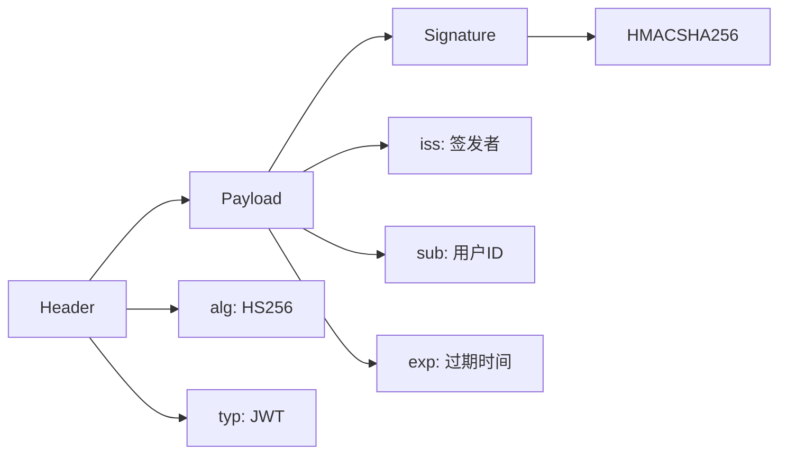
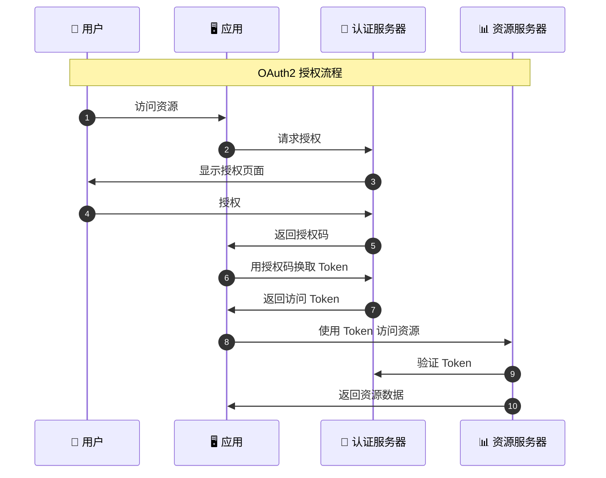
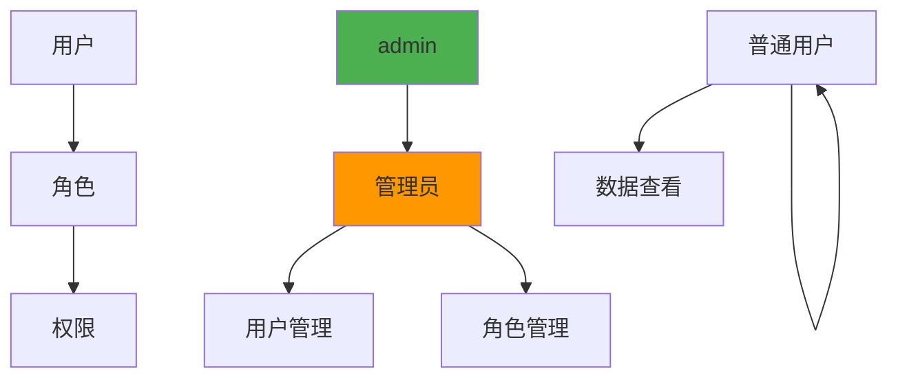

# 安全性与认证

## 学习目标

- 理解 JWT 认证原理
- 掌握 OAuth2 授权流程
- 学习密码加密存储
- 理解 RBAC 权限控制
- 掌握安全最佳实践

## 1. JWT 认证

### 1.1 JWT 基础

JWT (JSON Web Token) 是一种开放标准 (RFC 7519)，用于在各方之间安全地传输信息。

**JWT 组成部分：**



### 1.2 JWT 生成与验证

```python
import jwt
from datetime import datetime, timedelta

SECRET_KEY = "your-secret-key"
ALGORITHM = "HS256"

def create_access_token(data: dict, expires_delta: timedelta = None):
    """生成访问令牌"""
    to_encode = data.copy()

    # 设置过期时间
    if expires_delta:
        expire = datetime.utcnow() + expires_delta
    else:
        expire = datetime.utcnow() + timedelta(minutes=30)

    to_encode.update({"exp": expire})

    # 生成 JWT
    encoded_jwt = jwt.encode(to_encode, SECRET_KEY, algorithm=ALGORITHM)
    return encoded_jwt

def verify_token(token: str):
    """验证令牌"""
    try:
        payload = jwt.decode(token, SECRET_KEY, algorithms=[ALGORITHM])
        return payload
    except jwt.ExpiredSignatureError:
        raise AuthException('Token 已过期')
    except jwt.InvalidTokenError:
        raise AuthException('Token 无效')
```

### 1.3 项目中的认证实现

**文件：** `core/exhale.py` 或相关认证模块

```python
from fastapi import Depends, HTTPException
from fastapi.security import HTTPBearer, HTTPAuthorizationCredentials

security = HTTPBearer()

async def get_current_user(
    credentials: HTTPAuthorizationCredentials = Depends(security)
):
    """获取当前用户"""
    token = credentials.credentials

    # 验证 Token
    try:
        payload = decode_token(token)
        user_id = payload.get('sub')

        # 查询用户信息
        user = await get_user_by_id(user_id)
        if not user:
            raise HTTPException(status_code=401, detail='用户不存在')

        return user
    except Exception:
        raise HTTPException(status_code=401, detail='认证失败')

# 使用
@router.get('/users')
async def get_users(
    current_user: UserModel = Depends(get_current_user)
):
    """需要认证的接口"""
    return current_user
```

## 2. OAuth2 授权

### 2.1 OAuth2 流程



### 2.2 FastAPI OAuth2

```python
from fastapi import Depends
from fastapi.security import OAuth2PasswordBearer

oauth2_scheme = OAuth2PasswordBearer(tokenUrl='token')

@router.post('/login')
async def login(
    form_data: OAuth2PasswordRequestForm = Depends()
):
    """OAuth2 密码登录"""
    # 验证用户名密码
    user = await authenticate_user(
        form_data.username,
        form_data.password
    )

    if not user:
        raise HTTPException(
            status_code=400,
            detail='用户名或密码错误'
        )

    # 生成访问令牌
    access_token = create_access_token(
        data={'sub': user.user_id, 'name': user.user_name}
    )

    return {'access_token': access_token, 'token_type': 'bearer'}
```

## 3. 密码加密

### 3.1 bcrypt 哈希

```python
import bcrypt

def hash_password(password: str) -> str:
    """哈希密码"""
    # 生成盐值并哈希
    salt = bcrypt.gensalt()
    hashed = bcrypt.hashpw(password.encode('utf-8'), salt)
    return hashed.decode('utf-8')

def verify_password(plain_password: str, hashed_password: str) -> bool:
    """验证密码"""
    return bcrypt.checkpw(
        plain_password.encode('utf-8'),
        hashed_password.encode('utf-8')
    )
```

### 3.2 项目中的密码处理

**文件：** `utils/pwd_util.py`

```python
class PwdUtil:
    """密码工具类"""

    @staticmethod
    def get_password_hash(password: str) -> str:
        """获取密码哈希"""
        # 使用 bcrypt 进行哈希
        pwd_hash = bcrypt.hashpw(
            password.encode('utf-8'),
            bcrypt.gensalt()
        )
        return pwd_hash.decode('utf-8')

    @staticmethod
    def verify_password(
        plain_password: str,
        hashed_password: str
    ) -> bool:
        """验证密码"""
        return bcrypt.checkpw(
            plain_password.encode('utf-8'),
            hashed_password.encode('utf-8')
        )
```

## 4. RBAC 权限控制

### 4.1 权限模型



### 4.2 权限检查

```python
from exceptions.exception import PermissionException

def check_permission(user: UserModel, permission: str):
    """检查权限"""

    # 管理员拥有所有权限
    if user.admin:
        return True

    # 检查用户是否拥有指定权限
    user_permissions = await get_user_permissions(user.user_id)
    if permission not in user_permissions:
        raise PermissionException(
            message=f'缺少权限: {permission}',
            data={'permission': permission}
        )

    return True
```

## 5. 安全最佳实践

### 5.1 密钥管理

```python
# ✅ 好的做法
from config.env import AppConfig

SECRET_KEY = AppConfig.SECRET_KEY  # 从环境变量读取

# ❌ 不好的做法
SECRET_KEY = "hardcoded-secret-key"  # 硬编码密钥
```

### 5.2 Token 有效期

```python
# 访问令牌：短期（30分钟）
access_token_expires = timedelta(minutes=30)

# 刷新令牌：长期（7天）
refresh_token_expires = timedelta(days=7)

# 记住令牌：长期（30天）
remember_token_expires = timedelta(days=30)
```

### 5.3 HTTPS 传输

```python
# 始终通过 HTTPS 传输敏感信息

@app.middleware("https")
async def force_https(request: Request, call_next):
    """强制 HTTPS"""
    if request.url.scheme != 'https':
        url = request.url.replace('http://', 'https://')
        return RedirectResponse(url)

    response = await call_next(request)
    return response
```

## 6. 总结

### 6.1 安全层次

| 层次 | 措施 | 目的 |
|------|------|------|
| **传输层** | HTTPS | 防止窃听 |
| **认证层** | JWT | 身份验证 |
| **授权层** | RBAC | 权限控制 |
| **数据层** | 加密 | 数据保护 |

### 6.2 安全清单

- [ ] 使用 HTTPS
- [ ] 密钥存储在环境变量
- [ ] 密码使用 bcrypt 哈希
- [ ] Token 设置合理过期时间
- [ ] 实现 RBAC 权限控制
- [ ] 定期更换密钥
- [ ] 记录安全审计日志

## 7. 下一步

完成本节学习后，继续学习：
- **[11-数据库集成](./11-数据库集成.md)** - 学习SQLAlchemy
