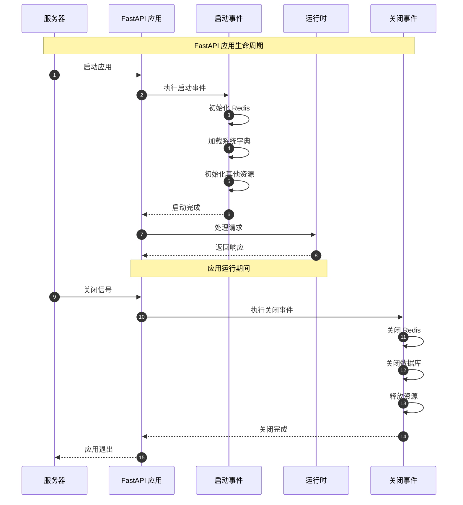

# 生命周期事件

## 学习目标

- 掌握 lifespan 上下文管理器
- 学习启动事件处理
- 理解关闭事件处理
- 掌握资源初始化与清理
- 理解优雅关闭机制

## 1. 应用生命周期

### 1.1 lifespan 上下文管理器

FastAPI 使用 `lifespan` 上下文管理器来管理应用的生命周期事件。

**文件：** `server.py:1-60`

```python
from contextlib import asynccontextmanager
from fastapi import FastAPI
from config.get_redis import RedisUtil
from config.database import async_engine


@asynccontextmanager
async def lifespan(app: FastAPI):
    """
    应用生命周期管理

    在应用启动和关闭时执行相应的操作
    """
    # ==================== 启动时执行 ====================
    print('===============================================')
    print('*                                             *')
    print('*                                             *')
    print('*          RuoYi-Vue3-FastAPI 已启动           *')
    print('*                                             *')
    print('*                                             *')
    print('===============================================')

    # 初始化 Redis 连接
    redis_pool = await RedisUtil.create_redis_pool()
    app.state.redis = redis_pool

    # 初始化系统字典到缓存
    await RedisUtil.init_sys_dict(app.state.redis)

    # 可以在这里添加其他初始化操作
    # - 连接数据库
    # - 加载配置
    # - 初始化缓存
    # - 启动后台任务

    yield  # 应用运行期间，代码在这里暂停

    # ==================== 关闭时执行 ====================
    print('===============================================')
    print('*                                             *')
    print('*                                             *')
    print('*          RuoYi-Vue3-FastAPI 已关闭           *')
    print('*                                             *')
    print('*                                             *')
    print('===============================================')

    # 关闭 Redis 连接
    await RedisUtil.close_redis_pool(app.state.redis)

    # 关闭数据库连接
    await async_engine.dispose()

    # 其他清理操作
    # - 关闭文件
    # - 释放资源
    # - 保存状态


# 创建 FastAPI 应用实例
app = FastAPI(
    title='RuoYi-Vue3-FastAPI',
    description='RuoYi-Vue3-FastAPI 后台接口系统',
    version='1.0.0',
    lifespan=lifespan  # 注册生命周期管理器
)
```

### 1.2 生命周期流程



## 2. 启动事件

### 2.1 资源初始化

**文件：** `config/get_redis.py:296-314`

```python
class RedisUtil:
    """Redis 工具类"""

    @staticmethod
    async def init_sys_dict(redis):
        """初始化系统字典到缓存"""
        # 查询所有字典
        from sqlalchemy import select
        from config.database import get_db
        from module_admin.model.sys_dict_model import SysDict

        async with get_db() as db:
            stmt = select(SysDict)
            result = await db.execute(stmt)
            dict_list = result.scalars().all()

        # 写入 Redis
        for dict_item in dict_list:
            await redis.hset(
                f'sys:dict:{dict_item.dict_code}',
                mapping={
                    'dict_code': dict_item.dict_code,
                    'dict_label': dict_item.dict_label,
                    'dict_type': dict_item.dict_type,
                    'is_default': dict_item.is_default,
                    'status': dict_item.status
                }
            )

        logger.info('系统字典已加载到 Redis')
```

### 2.2 数据库连接初始化

```python
@asynccontextmanager
async def lifespan(app: FastAPI):
    """应用生命周期"""

    # 启动时
    print('正在连接数据库...')

    # 测试数据库连接
    from config.database import AsyncSessionLocal
    from sqlalchemy import text

    async with AsyncSessionLocal() as db:
        await db.execute(text('SELECT 1'))
        print('数据库连接成功')

    # 初始化连接池
    print(f'数据库连接池已初始化')

    yield

    # 关闭时
    print('正在关闭数据库连接...')
    await async_engine.dispose()
    print('数据库连接已关闭')
```

### 2.3 缓存预热

```python
async def warm_up_cache():
    """缓存预热 - 加载热点数据"""

    redis = await get_redis_connection()

    # 预加载系统配置
    configs = await load_system_configs()
    for config in configs:
        await redis.hset(
            f'sys:config:{config.config_key}',
            mapping=config.__dict__
        )

    # 预加载字典数据
    dicts = await load_system_dicts()
    for dict_item in dicts:
        await redis.hset(
            f'sys:dict:{dict_item.dict_code}',
            mapping=dict_item.__dict__
        )

    # 预加载菜单数据
    menus = await load_system_menus()
    await redis.setex(
        'sys:menu:all',
        3600,
        json.dumps([m.__dict__ for m in menus])
    )

    print('缓存预热完成')


@asynccontextmanager
async def lifespan(app: FastAPI):
    """应用生命周期"""

    # 启动时预热缓存
    await warm_up_cache()

    yield
```

### 2.4 定时任务启动

```python
from apscheduler.schedulers.asyncio import AsyncIOScheduler


scheduler = AsyncIOScheduler()


@asynccontextmanager
async def lifespan(app: FastAPI):
    """应用生命周期"""

    # 启动定时任务
    from module_admin.tasks import scheduled_tasks

    # 添加定时任务
    scheduler.add_job(
        scheduled_tasks.cleanup_temp_files,
        'cron',
        hour=2,  # 每天凌晨 2 点执行
        minute=0
    )

    scheduler.add_job(
        scheduled_tasks.sync_user_data,
        'interval',
        hours=6  # 每 6 小时执行一次
    )

    scheduler.start()
    print('定时任务已启动')

    yield

    # 关闭定时任务
    scheduler.shutdown()
    print('定时任务已关闭')
```

## 3. 关闭事件

### 3.1 资源清理

```python
@asynccontextmanager
async def lifespan(app: FastAPI):
    """应用生命周期"""

    yield

    # ==================== 关闭时清理 ====================

    # 1. 关闭 Redis 连接
    if hasattr(app.state, 'redis'):
        await app.state.redis.close()
        print('Redis 连接已关闭')

    # 2. 关闭数据库连接池
    await async_engine.dispose()
    print('数据库连接池已关闭')

    # 3. 关闭其他连接
    # - 关闭文件句柄
    # - 关闭网络连接
    # - 释放内存
```

### 3.2 优雅关闭

```python
import signal


@asynccontextmanager
async def lifespan(app: FastAPI):
    """应用生命周期"""

    # 设置信号处理器
    def handle_shutdown(signum, frame):
        print(f'收到关闭信号: {signum}')
        # 执行清理操作

    signal.signal(signal.SIGINT, handle_shutdown)
    signal.signal(signal.SIGTERM, handle_shutdown)

    yield

    # 确保所有请求完成
    print('等待正在处理的请求完成...')
    await asyncio.sleep(2)  # 等待 2 秒

    # 关闭资源
    print('正在关闭资源...')
    await cleanup_resources()
```

### 3.3 状态保存

```python
async def save_application_state():
    """保存应用状态"""

    # 保存统计信息
    stats = {
        'total_requests': request_count,
        'active_users': len(active_users),
        'uptime': uptime_seconds
    }

    # 保存到文件
    with open('app_state.json', 'w') as f:
        json.dump(stats, f)

    # 或保存到数据库
    await save_stats_to_db(stats)


@asynccontextmanager
async def lifespan(app: FastAPI):
    """应用生命周期"""

    # 启动时恢复状态
    if os.path.exists('app_state.json'):
        with open('app_state.json', 'r') as f:
            state = json.load(f)
            print(f'恢复状态: {state}')

    yield

    # 关闭时保存状态
    await save_application_state()
    print('应用状态已保存')
```

## 4. 应用状态管理

### 4.1 app.state 使用

```python
@asynccontextmanager
async def lifespan(app: FastAPI):
    """应用生命周期"""

    # 启动时存储状态
    app.state.redis = await create_redis_pool()
    app.state.db_engine = async_engine
    app.state.scheduler = scheduler
    app.state.config = load_config()
    app.state.start_time = datetime.now()

    yield

    # 关闭时清理
    await app.state.redis.close()
    await app.state.db_engine.dispose()
    app.state.scheduler.shutdown()


# 在路由中使用状态
@app.get('/admin/status')
async def get_status(request: Request):
    """获取应用状态"""
    app = request.app

    return {
        'redis_connected': app.state.redis is not None,
        'uptime': (datetime.now() - app.state.start_time).total_seconds(),
        'config': {
            'app_name': app.state.config.app_name,
            'environment': app.state.config.environment
        }
    }
```

### 4.2 共享资源管理

```python
class ResourceManager:
    """资源管理器"""

    def __init__(self):
        self.resources = {}

    async def init_resource(self, name: str, resource):
        """初始化资源"""
        self.resources[name] = resource
        print(f'资源 {name} 已初始化')

    async def get_resource(self, name: str):
        """获取资源"""
        return self.resources.get(name)

    async def cleanup_all(self):
        """清理所有资源"""
        for name, resource in self.resources.items():
            if hasattr(resource, 'close'):
                await resource.close()
            print(f'资源 {name} 已清理')


# 使用
resource_manager = ResourceManager()


@asynccontextmanager
async def lifespan(app: FastAPI):
    """应用生命周期"""

    # 初始化资源
    await resource_manager.init_resource('redis', await create_redis())
    await resource_manager.init_resource('db', await create_db())

    # 存储到 app.state
    app.state.resources = resource_manager

    yield

    # 清理所有资源
    await resource_manager.cleanup_all()
```

## 5. 错误处理

### 5.1 启动失败处理

```python
@asynccontextmanager
async def lifespan(app: FastAPI):
    """应用生命周期"""

    try:
        # 尝试连接数据库
        await init_database()
        print('数据库初始化成功')

        # 尝试连接 Redis
        await init_redis()
        print('Redis 初始化成功')

    except Exception as e:
        print(f'启动失败: {e}')
        # 记录错误日志
        logger.error(f'应用启动失败: {e}')
        # 重新抛出异常，阻止应用启动
        raise

    yield
```

### 5.2 关闭失败处理

```python
@asynccontextmanager
async def lifespan(app: FastAPI):
    """应用生命周期"""

    yield

    # 关闭时处理错误
    errors = []

    try:
        await close_redis()
    except Exception as e:
        errors.append(f'Redis 关闭失败: {e}')
        logger.error(f'Redis 关闭失败: {e}')

    try:
        await close_database()
    except Exception as e:
        errors.append(f'数据库关闭失败: {e}')
        logger.error(f'数据库关闭失败: {e}')

    if errors:
        print('关闭时发生错误:')
        for error in errors:
            print(f'  - {error}')
```

## 6. 多实例管理

### 6.1 实例健康检查

```python
import uuid


@asynccontextmanager
async def lifespan(app: FastAPI):
    """应用生命周期"""

    # 生成实例 ID
    instance_id = str(uuid.uuid4())
    app.state.instance_id = instance_id

    # 注册实例
    await register_instance(instance_id)
    print(f'实例 {instance_id} 已启动')

    # 启动健康检查
    async def health_check():
        while True:
            await update_heartbeat(instance_id)
            await asyncio.sleep(30)

    health_task = asyncio.create_task(health_check())

    yield

    # 取消健康检查
    health_task.cancel()

    # 注销实例
    await unregister_instance(instance_id)
    print(f'实例 {instance_id} 已关闭')
```

### 6.2 分布式锁

```python
@asynccontextmanager
async def lifespan(app: FastAPI):
    """应用生命周期"""

    # 获取启动锁（防止多实例同时初始化）
    lock_name = 'app:startup:lock'

    acquired, lock_value = await acquire_lock(lock_name, timeout=60)

    if not acquired:
        print('另一个实例正在初始化，等待...')
        # 等待初始化完成
        await wait_for_initialization()
    else:
        try:
            # 执行初始化
            await initialize_resources()
            # 标记初始化完成
            await mark_initialization_complete()
        finally:
            # 释放锁
            await release_lock(lock_name, lock_value)

    yield
```

## 7. 监控与日志

### 7.1 启动日志

```python
import logging

logger = logging.getLogger(__name__)


@asynccontextmanager
async def lifespan(app: FastAPI):
    """应用生命周期"""

    # 记录启动信息
    logger.info('=' * 50)
    logger.info('应用启动中...')
    logger.info(f'版本: {app.version}')
    logger.info(f'环境: {os.getenv("APP_ENV", "development")}')
    logger.info('=' * 50)

    # 记录配置
    logger.info(f'数据库: {db_host}:{db_port}')
    logger.info(f'Redis: {redis_host}:{redis_port}')
    logger.info(f'调试模式: {debug}')

    # 记录启动时间
    start_time = time.time()
    app.state.start_time = start_time

    yield

    # 记录关闭信息
    uptime = time.time() - start_time
    logger.info('=' * 50)
    logger.info('应用关闭')
    logger.info(f'运行时间: {uptime:.2f} 秒')
    logger.info('=' * 50)
```

### 7.2 性能监控

```python
@asynccontextmanager
async def lifespan(app: FastAPI):
    """应用生命周期"""

    # 启动性能监控
    from prometheus_client import Counter, Histogram

    request_count = Counter('http_requests_total', 'Total requests')
    request_duration = Histogram('http_request_duration_seconds', 'Request duration')

    app.state.metrics = {
        'request_count': request_count,
        'request_duration': request_duration
    }

    # 启动监控服务器
    start_prometheus_server()

    yield

    # 保存监控数据
    await save_metrics()
```

## 8. 总结

### 8.1 生命周期最佳实践

| 实践 | 说明 |
|------|------|
| **资源初始化** | 在启动时初始化所有需要的资源 |
| **资源清理** | 在关闭时正确释放所有资源 |
| **错误处理** | 妥善处理启动和关闭时的错误 |
| **状态管理** | 使用 app.state 存储应用状态 |
| **日志记录** | 记录重要的生命周期事件 |
| **优雅关闭** | 确保正在处理的请求完成后再关闭 |

### 8.2 生命周期检查清单

```python
# ✅ 启动检查清单
- [ ] 数据库连接已建立
- [ ] Redis 连接已建立
- [ ] 缓存已预热
- [ ] 配置已加载
- [ ] 定时任务已启动
- [ ] 日志系统已初始化

# ✅ 关闭检查清单
- [ ] 所有请求已完成
- [ ] 数据库连接已关闭
- [ ] Redis 连接已关闭
- [ ] 文件句柄已释放
- [ ] 定时任务已停止
- [ ] 状态已保存
```

### 8.3 完整示例

```python
from contextlib import asynccontextmanager
from fastapi import FastAPI
import logging

logger = logging.getLogger(__name__)


@asynccontextmanager
async def lifespan(app: FastAPI):
    """完整的生命周期管理"""

    # ==================== 启动 ====================
    logger.info('应用正在启动...')

    try:
        # 1. 初始化配置
        config = load_config()
        app.state.config = config
        logger.info('配置已加载')

        # 2. 初始化数据库
        db_engine = await init_database(config)
        app.state.db = db_engine
        logger.info('数据库已连接')

        # 3. 初始化 Redis
        redis = await init_redis(config)
        app.state.redis = redis
        logger.info('Redis 已连接')

        # 4. 预热缓存
        await warm_up_cache(redis)
        logger.info('缓存已预热')

        # 5. 启动定时任务
        scheduler = start_scheduler()
        app.state.scheduler = scheduler
        logger.info('定时任务已启动')

        logger.info('应用启动成功')

    except Exception as e:
        logger.error(f'应用启动失败: {e}')
        raise

    yield

    # ==================== 关闭 ====================
    logger.info('应用正在关闭...')

    try:
        # 1. 停止定时任务
        if hasattr(app.state, 'scheduler'):
            app.state.scheduler.shutdown()
            logger.info('定时任务已停止')

        # 2. 关闭 Redis
        if hasattr(app.state, 'redis'):
            await app.state.redis.close()
            logger.info('Redis 已关闭')

        # 3. 关闭数据库
        if hasattr(app.state, 'db'):
            await app.state.db.dispose()
            logger.info('数据库已关闭')

        # 4. 保存状态
        await save_state()
        logger.info('状态已保存')

        logger.info('应用关闭成功')

    except Exception as e:
        logger.error(f'应用关闭时发生错误: {e}')


# 创建应用
app = FastAPI(
    title='RuoYi-Vue3-FastAPI',
    lifespan=lifespan
)
```

## 9. 练习

1. 实现一个完整的 lifespan 管理器
2. 添加应用启动时的健康检查
3. 实现资源清理和状态保存
4. 添加生命周期事件的详细日志
5. 实现优雅关闭机制

## 10. 总结

完成本节学习后，你已经掌握了：

- **lifespan 上下文管理器**：管理应用启动和关闭
- **资源初始化**：在启动时初始化数据库、Redis 等资源
- **资源清理**：在关闭时正确释放资源
- **优雅关闭**：确保请求完成后再关闭应用
- **状态管理**：使用 app.state 存储应用状态
- **错误处理**：妥善处理生命周期中的错误

## 11. 后续学习

现在你已经完成了 FastAPI 核心知识点的学习！继续探索：

- **项目实战**：阅读项目源代码，理解实际应用
- **高级特性**：学习 WebSocket、后台任务等
- **性能优化**：学习缓存、连接池优化
- **部署运维**：学习 Docker、Kubernetes 部署

恭喜你完成 FastAPI 核心知识学习！🎉
