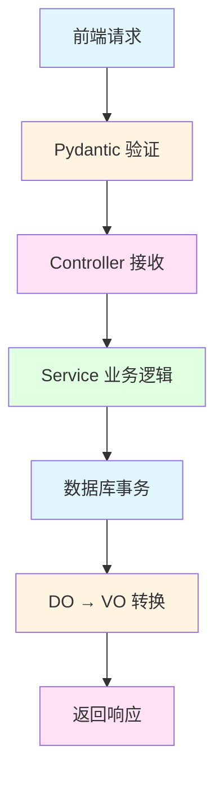

# 数据持久化：状态管理的本质

> 前端用 Pinia/Redux 管理内存状态，后端用数据库管理持久化状态。理解数据库，你就理解了后端的状态管理。

## 前端类比：状态管理

### 你熟悉的代码

```typescript
// 前端：Pinia 状态管理
const useUserStore = defineStore('user', {
  state: () => ({
    user: null,
    token: null
  }),

  actions: {
    setUser(user: User) {
      this.user = user
    },

    setToken(token: string) {
      this.token = token
    }
  }
})

// 使用
const userStore = useUserStore()
userStore.setUser({ id: 1, name: 'admin' })
```

### 前端状态的特点

```
前端状态：
- 存储在内存中
- 刷新页面丢失
- 只在当前浏览器有效
- 不能跨用户共享
```

---

## 后端：数据库持久化

### 本质对比

```
前端状态管理 = 内存中的数据
后端数据库 = 持久化的数据

数据库 = 刷新页面不丢失的状态
```

### 数据库的作用

```python
# 后端：存储到数据库
@userController.post("/add")
async def add_user(
    user: UserCreate,
    query_db: AsyncSession = Depends(get_db)
):
    # 创建新用户
    new_user = SysUser(**user.dict())
    query_db.add(new_user)

    # 提交到数据库（持久化）
    await query_db.commit()

    return Resp.success(msg="创建成功")
# 用户数据存储在数据库中
# 刷新页面、重启服务器都不会丢失
```

---

## 核心 1：数据库的 CRUD 操作

### 前端类比

```typescript
// 前端：操作数组
let users = []

// Create
users.push({ id: 1, name: 'admin' })

// Read
const user = users.find(u => u.id === 1)

// Update
users[0].name = 'new name'

// Delete
users.splice(0, 1)
```

### 后端：数据库操作

```python
# Create (创建)
async def create_user(db: AsyncSession, user: UserCreate):
    new_user = SysUser(**user.dict())
    db.add(new_user)
    await db.commit()
    await db.refresh(new_user)  # 刷新以获取自增 ID
    return new_user

# Read (查询)
async def get_user(db: AsyncSession, user_id: int):
    result = await db.execute(
        select(SysUser).where(SysUser.user_id == user_id)
    )
    return result.scalar_one_or_none()

# Update (更新)
async def update_user(db: AsyncSession, user_id: int, data: dict):
    user = await get_user(db, user_id)
    for key, value in data.items():
        setattr(user, key, value)
    await db.commit()
    return user

# Delete (删除)
async def delete_user(db: AsyncSession, user_id: int):
    user = await get_user(db, user_id)
    await db.delete(user)
    await db.commit()
```

---

## 核心 2：事务的概念

### 本质理解

```
事务 = 一组操作，要么全部成功，要么全部失败
```

### 前端类比

```typescript
// 前端：批量操作
async function transferMoney(from: number, to: number, amount: number) {
  // 1. 扣除发送者余额
  await updateUser(from, { balance: fromBalance - amount })

  // 2. 增加接收者余额
  await updateUser(to, { balance: toBalance + amount })

  // 问题：如果第 2 步失败，第 1 步已经执行了！
}
```

### 后端：事务保证一致性

```python
@userController.post("/transfer")
async def transfer_money(
    from_user_id: int,
    to_user_id: int,
    amount: int,
    query_db: AsyncSession = Depends(get_db)
):
    try:
        # 1. 扣除发送者余额
        from_user = await get_user(query_db, from_user_id)
        from_user.balance -= amount

        # 2. 增加接收者余额
        to_user = await get_user(query_db, to_user_id)
        to_user.balance += amount

        # 3. 提交事务（两步同时生效）
        await query_db.commit()

        return Resp.success(msg="转账成功")

    except Exception as e:
        # 任何一步失败，全部回滚
        await query_db.rollback()
        raise BusinessException("转账失败")
```

### 事务的 ACID 特性

| 特性 | 含义 | 示例 |
|------|------|------|
| A (Atomicity) | 原子性：要么全成功，要么全失败 | 转账要么成功，要么双方余额不变 |
| C (Consistency) | 一致性：数据始终符合约束 | 用户余额不能为负 |
| I (Isolation) | 隔离性：并发事务互不影响 | 两个转账同时进行，结果正确 |
| D (Durability) | 持久性：提交后永久保存 | 数据库崩溃后数据仍在 |

---

## 核心 3：ORM 的本质

### SQL vs ORM

```python
# 原生 SQL（字符串拼接）
result = await db.execute(
    "SELECT * FROM sys_user WHERE user_name = 'admin' AND status = '0'"
)
user = result.fetchone()

# ORM（对象操作）
result = await db.execute(
    select(SysUser)
    .where(SysUser.user_name == 'admin')
    .where(SysUser.status == '0')
)
user = result.scalar_one_or_none()
```

### ORM 的优势

| 优势 | 说明 |
|------|------|
| 类型安全 | IDE 有提示，编译时检查 |
| 防止注入 | 自动转义，防止 SQL 注入 |
| 数据库无关 | 切换数据库只需改配置 |
| 易于维护 | 代码即文档 |

### 前端类比

```typescript
// 前端：用 TypeScript 类型约束
interface User {
  id: number
  name: string
}

function getUser(id: number): User {
  // IDE 有提示，类型检查
}

// 后端：ORM 同样有类型约束
class SysUser(Base):
    user_id: int
    user_name: str

async def get_user(id: int) -> SysUser:
    # IDE 有提示，类型检查
    pass
```

---

## 核心 4：查询构建

### 基础查询

```python
# 查询所有
result = await db.execute(select(SysUser))
users = result.scalars().all()

# 条件查询
result = await db.execute(
    select(SysUser).where(SysUser.status == '0')
)
users = result.scalars().all()

# 排序
result = await db.execute(
    select(SysUser)
    .where(SysUser.status == '0')
    .order_by(SysUser.create_time.desc())
)
users = result.scalars().all()

# 限制
result = await db.execute(
    select(SysUser)
    .limit(10)
    .offset(0)
)
users = result.scalars().all()
```

### 关联查询（JOIN）

```python
# 查询用户及其部门
result = await db.execute(
    select(SysUser, SysDept)
    .join(SysDept, SysUser.dept_id == SysDept.dept_id)
    .where(SysUser.user_id == 1)
)

# 返回 (user, dept) 元组
user, dept = result.one()

# 查询用户的角色
result = await db.execute(
    select(SysRole)
    .join(sys_user_role, SysRole.role_id == sys_user_role.c.role_id)
    .where(sys_user_role.c.user_id == 1)
)
roles = result.scalars().all()
```

### 动态查询

```python
async def get_user_list(
    db: AsyncSession,
    user_name: Optional[str] = None,
    status: Optional[str] = None,
    dept_id: Optional[int] = None
):
    # 构建查询
    stmt = select(SysUser)

    # 动态添加条件
    if user_name:
        stmt = stmt.where(SysUser.user_name.like(f'%{user_name}%'))

    if status:
        stmt = stmt.where(SysUser.status == status)

    if dept_id:
        stmt = stmt.where(SysUser.dept_id == dept_id)

    # 执行查询
    result = await db.execute(stmt)
    return result.scalars().all()
```

**前端类比**：
```typescript
// 前端：动态构建查询参数
const params: any = {}
if (userName) params.userName = userName
if (status) params.status = status
if (deptId) params.deptId = deptId

axios.get('/api/users', { params })
```

---

## 核心 5：分页查询

### 前端类比

```typescript
// 前端：分页参数
const { data } = await axios.post('/api/user/list', {
  pageNum: 1,
  pageSize: 10
})

// 返回格式
{
  "rows": [...],     // 当前页数据
  "total": 100       // 总数
}
```

### 后端实现

```python
async def get_user_list(
    db: AsyncSession,
    query: UserQuery
):
    # 1. 构建查询
    stmt = select(SysUser).where(SysUser.del_flag == '0')

    # 2. 动态条件
    if query.userName:
        stmt = stmt.where(SysUser.user_name.like(f'%{query.userName}%'))
    if query.status:
        stmt = stmt.where(SysUser.status == query.status)

    # 3. 查询总数（分页前）
    count_stmt = select(func.count()).select_from(stmt.subquery())
    total = (await db.execute(count_stmt)).scalar()

    # 4. 分页查询
    stmt = stmt.offset((query.pageNum - 1) * query.pageSize).limit(query.pageSize)
    result = await db.execute(stmt)
    users = result.scalars().all()

    # 5. 返回数据和总数
    return users, total
```

### Controller 调用

```python
@userController.post("/list")
async def get_user_list(
    query: UserQuery,
    query_db: AsyncSession = Depends(get_db)
):
    users, total = await user_service.get_list(query_db, query)

    return Resp.success(data=users, msg=f"共 {total} 条")
```

---

## 核心 6：软删除 vs 硬删除

### 硬删除（不推荐）

```python
# ❌ 硬删除：直接删除记录
await db.delete(user)
await db.commit()

# 问题：数据永久丢失，无法恢复
```

### 软删除（推荐）

```python
# ✅ 软删除：标记为已删除
async def delete_user(db: AsyncSession, user_id: int):
    user = await get_user(db, user_id)
    user.del_flag = '1'  # 标记为删除
    await db.commit()

# 查询时过滤已删除
async def get_user(db: AsyncSession, user_id: int):
    result = await db.execute(
        select(SysUser)
        .where(SysUser.user_id == user_id)
        .where(SysUser.del_flag == '0')  # 只查未删除的
    )
    return result.scalar_one_or_none()
```

**前端类比**：
```typescript
// 前端也这样做：标记删除，而不是真的删除
function deleteUser(id: number) {
  const user = users.find(u => u.id === id)
  user.deleted = true  // 标记删除
  // 不会从数组中移除
}
```

---

## 核心 7：缓存策略

### 前端类比

```typescript
// 前端：缓存用户信息
const userCache = new Map()

async function getUser(id: number) {
  // 先查缓存
  if (userCache.has(id)) {
    return userCache.get(id)
  }

  // 缓存未命中，查数据库
  const user = await api.get(`/users/${id}`)
  userCache.set(id, user)
  return user
}
```

### 后端：Redis 缓存

```python
from module_admin.common.redis import redis_client

async def get_user(db: AsyncSession, user_id: int):
    # 1. 先查缓存
    cache_key = f"user:{user_id}"
    cached = await redis_client.get(cache_key)
    if cached:
        return SysUser(**json.loads(cached))

    # 2. 缓存未命中，查数据库
    result = await db.execute(
        select(SysUser).where(SysUser.user_id == user_id)
    )
    user = result.scalar_one_or_none()

    # 3. 写入缓存
    if user:
        await redis_client.set(
            cache_key,
            json.dumps(user.dict()),
            ex=3600  # 过期时间：1 小时
        )

    return user
```

### 缓存更新策略

```python
async def update_user(db: AsyncSession, user_id: int, data: dict):
    # 1. 更新数据库
    user = await get_user(db, user_id)
    for key, value in data.items():
        setattr(user, key, value)
    await db.commit()

    # 2. 删除缓存（下次查询会重新加载）
    cache_key = f"user:{user_id}"
    await redis_client.delete(cache_key)

    return user
```

---

## 实战：完整的数据流

### 创建用户的完整流程

```python
@userController.post("/add")
async def add_user(
    user: UserCreate,
    query_db: AsyncSession = Depends(get_db)
):
    # 1. 验证数据
    existing = await user_service.get_by_username(
        query_db, user.userName
    )
    if existing:
        raise BusinessException("用户名已存在")

    # 2. 创建 DO 对象
    new_user = SysUser(
        user_name=user.userName,
        email=user.email,
        # 密码加密
        password=hash_password(user.password),
        status=user.status,
        create_time=datetime.now()
    )

    # 3. 添加到会话
    query_db.add(new_user)

    # 4. 提交事务（写入数据库）
    await query_db.commit()

    # 5. 刷新以获取自增 ID
    await query_db.refresh(new_user)

    # 6. 转换为 VO（脱敏）
    user_vo = UserVO.model_validate(new_user)

    # 7. 返回响应
    return Resp.success(data=user_vo, msg="创建成功")
```

### 数据流动过程



---

## 本质总结

### 前端 vs 后端：状态管理对比

| 维度 | 前端 (Pinia) | 后端 (数据库) |
|------|--------------|---------------|
| 存储位置 | 内存 | 磁盘 |
| 持久性 | 刷新丢失 | 永久保存 |
| 作用域 | 当前浏览器 | 所有用户 |
| 共享性 | 不共享 | 可共享 |

### 数据库的核心价值

1. **持久化**：数据永久保存
2. **事务**：保证数据一致性
3. **查询**：高效检索数据
4. **并发**：支持多用户同时访问

### ORM 的本质

```
ORM = 用对象操作数据库

前端：TypeScript 接口约束数据
后端：ORM 类约束数据

本质相同：用类型系统保证数据安全
```

---

## 检查清单

理解了本节内容，你应该能回答：

- [ ] 数据库和前端状态管理的区别是什么？
- [ ] 事务的作用是什么？为什么需要事务？
- [ ] ORM 和原生 SQL 的优缺点是什么？
- [ ] 如何实现分页查询？
- [ ] 软删除和硬删除的区别是什么？
- [ ] 如何使用缓存提高查询性能？

**下一步**：学习 [实战项目：从零到一](./07-实战项目-从零到一.md)
