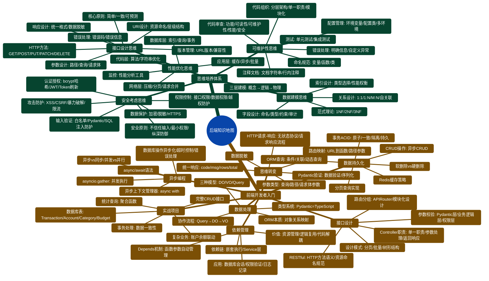

# 知识体系全景图

## 完整知识体系

## 核心知识领域

| 领域 | 核心内容 |
|-----|---------|
| 数据建模 | 三层建模(概念→逻辑→物理)、关系设计(1:1/1:N/M:N)、DO/VO/Query三种模型 |
| 接口设计 | RESTful风格、统一响应(code/msg/rows/total)、版本管理 |
| 性能优化 | 应用层(缓存/异步/批量)、数据库层(索引/查询)、网络层(压缩/分页) |
| 安全防护 | 认证授权(JWT/OAuth2)、输入验证(Pydantic)、攻击防护(XSS/CSRF/限流) |
| 异步编程 | async/await、asyncio.gather、异步IO、非阻塞操作 |
| 数据持久化 | CRUD操作、事务管理(ACID)、缓存策略(Redis) |

## 学习路径

### 初学者
前端开发者入门 → 思维培养体系 → 专题深入

### 有经验开发者
思维培养体系 → 专题文档查漏补缺 → 实践项目应用
