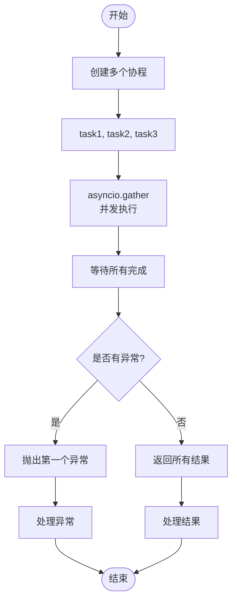

# 异步编程专题

> 本文档深入探讨 Python 异步编程的核心概念和实践，帮助你理解并掌握异步编程。

## 同步 vs 异步对比

```mermaid
flowchart TB
    subgraph 同步[同步执行]
        S1[请求1<br/>等待响应]
        S2[请求2<br/>等待响应]
        S3[请求3<br/>等待响应]

        S1 --> S2
        S2 --> S3

        Total1[总时间 = 1+2+3 = 6秒]
    end

    subgraph 异步[异步执行]
        A1[请求1<br/>发出后等待]
        A2[请求2<br/>发出后等待]
        A3[请求3<br/>发出后等待]

        A1 --> Response1[响应1返回]
        A2 --> Response2[响应2返回]
        A3 --> Response3[响应3返回]

        Total2[总时间 = max(1,2,3) = 3秒]
    end

```

## 并发执行流程


## 任务状态变化


## async/await 语法


### 语法要点

| 关键字 | 用途 | 示例 |
|-------|------|------|
| `async def` | 定义协程函数 | `async def fetch_data()` |
| `await` | 等待协程完成 | `result = await fetch()` |
| `async with` | 异步上下文管理器 | `async with session.get()` |
| `async for` | 异步迭代器 | `async for line in reader:` |

## 并发控制


### 并发模式对比

| 模式 | 优点 | 缺点 | 适用场景 |
|-----|------|------|---------|
| `gather` | 简单，等待全部 | 无法限制并发 | 少量任务，全部需要结果 |
| `Semaphore` | 控制并发数 | 需要手动管理 | 大量任务，限制资源 |
| `TaskGroup` | 结构化，自动清理 | Python 3.11+ | 复杂任务依赖 |
| `create_task` | 立即返回，后台执行 | 需要手动等待 | 后台任务，不关心结果 |

## 异步上下文管理器


### 异步上下文管理器示例

| 资源类型 | 上下文管理器 | 说明 |
|---------|-------------|------|
| 数据库会话 | `async with db.begin()` | 自动提交/回滚事务 |
| HTTP 客户端 | `async with aiohttp.ClientSession()` | 自动关闭连接 |
| 文件操作 | `async with aiofiles.open()` | 自动关闭文件 |
| 锁 | `async with lock:` | 自动释放锁 |

## asyncio.gather 并发执行



### gather 参数说明

```python
# 基本用法
results = await asyncio.gather(task1, task2, task3)

# 遇到异常不停止，返回异常对象
results = await asyncio.gather(
    task1, task2, task3,
    return_exceptions=True
)

# 按顺序返回结果
results = await asyncio.gather(
    coroutine1(),
    coroutine2(),
    coroutine3()
)
```

## 超时控制


### 超时控制方法

| 方法 | 说明 | 示例 |
|-----|------|------|
| `asyncio.wait_for` | 单个任务超时 | `await wait_for(task, timeout=5)` |
| `asyncio.timeout` | 上下文管理器 | `async with timeout(5):` |
| `asyncio.wait` | 等待一组任务 | `done, pending = wait(tasks, timeout=5)` |

## 数据库操作异步化


### 异步数据库操作要点

| 操作 | 同步 | 异步 |
|-----|------|------|
| 连接 | `engine.connect()` | `async_engine.acquire()` |
| 查询 | `session.query()` | `await session.execute()` |
| 事务 | `with session.begin()` | `async with session.begin()` |
| 执行 | `session.execute()` | `await session.execute()` |

## 错误处理


### 错误处理最佳实践

```python
try:
    result = await async_operation()
except asyncio.TimeoutError:
    # 超时处理
    logger.error("Operation timed out")
except asyncio.CancelledError:
    # 取消处理
    logger.info("Operation was cancelled")
except Exception as e:
    # 其他异常
    logger.error(f"Operation failed: {e}")
    raise
```

## 异步编程最佳实践


## 异步编程检查清单

### 基础使用
- 使用 `async def` 定义异步函数
- 使用 `await` 等待异步操作
- 使用 `async with` 管理资源
- 使用 `asyncio.run()` 运行异步代码

### 并发控制
- 使用 `asyncio.gather()` 并发执行
- 使用 `Semaphore` 限制并发数
- 设置合理的超时时间
- 正确处理任务取消

### 资源管理
- 使用连接池管理连接
- 及时释放不再使用的资源
- 避免创建过多协程
- 正确关闭异步资源

### 错误处理
- 捕获并处理异常
- 记录详细的错误日志
- 优雅处理超时
- 正确处理取消操作

## 实战案例：并发请求优化

### 问题：串行请求慢

```python
# 串行执行，总耗时 = 2 + 3 + 1 = 6秒
async def fetch_user(user_id):
    await asyncio.sleep(2)  # 模拟数据库查询
    return {"id": user_id, "name": f"User{user_id}"}

async def main():
    users = []
    for i in range(1, 4):
        user = await fetch_user(i)
        users.append(user)
    return users
```

### 解决：并发执行快

```python
# 并发执行，总耗时 = max(2, 3, 1) = 3秒
async def main():
    tasks = [fetch_user(i) for i in range(1, 4)]
    users = await asyncio.gather(*tasks)
    return users
```

### 性能对比

| 方式 | 耗时 | 提升 |
|-----|------|------|
| 串行执行 | 6秒 | - |
| 并发执行 | 3秒 | 2倍 |

## 相关文档

- [05-前端开发者的后端入门/05-异步编程-比Promise更优雅.md](../05-前端开发者的后端入门/05-异步编程-比Promise更优雅.md) - 异步编程入门
- [09-性能优化专题.md](./09-性能优化专题.md) - 性能优化
- [12-数据持久化专题.md](./12-数据持久化专题.md) - 异步数据库操作
