# 数据持久化专题

> 本文档深入探讨数据持久化的核心概念和实践，包括 CRUD 操作、事务管理、ORM 查询和缓存策略。

## 数据流转路径

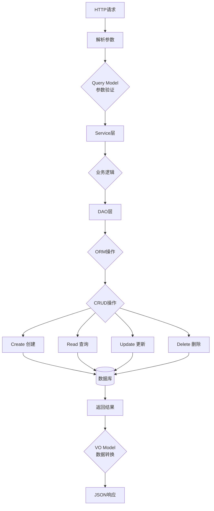

## 事务处理流程

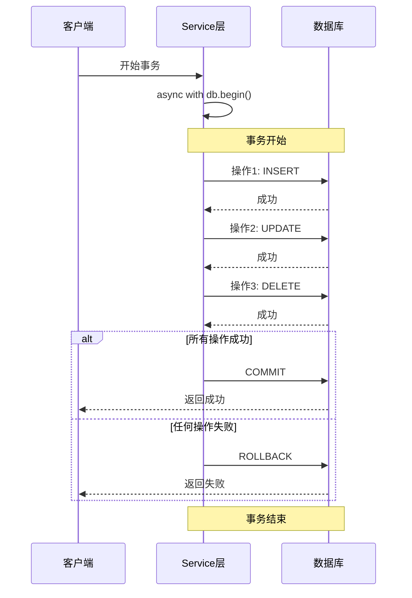

## 缓存策略选择

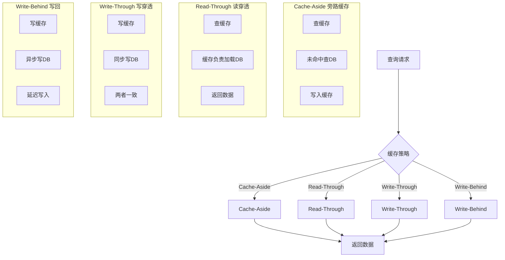

### 缓存策略对比

| 策略 | 优点 | 缺点 | 适用场景 |
|-----|------|------|---------|
| Cache-Aside | 简单灵活 | 首次查询慢 | 通用场景，最常用 |
| Read-Through | 缓存统一管理 | 代码复杂 | 高频读取 |
| Write-Through | 强一致性 | 写入慢 | 数据一致性要求高 |
| Write-Behind | 写入快 | 可能丢数据 | 允许短时不一致 |

## CRUD 操作

### Create (创建)

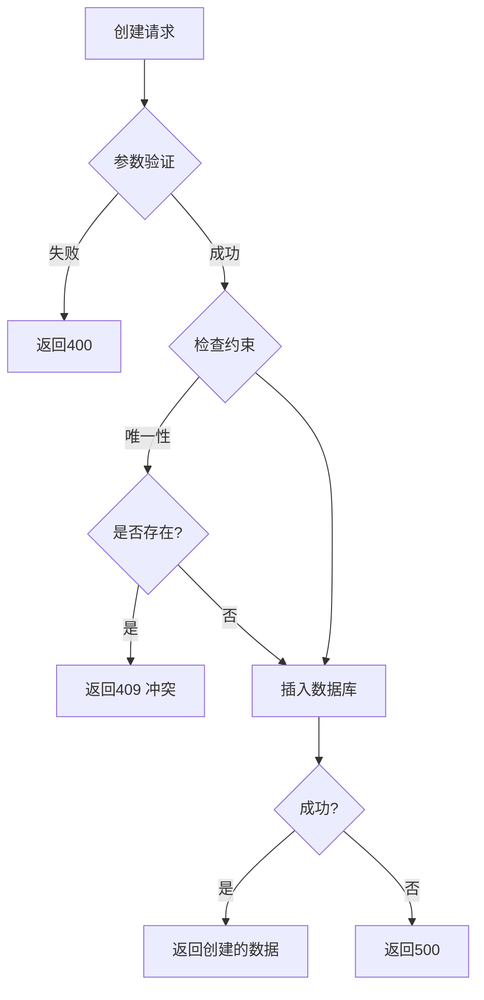

### Read (查询)

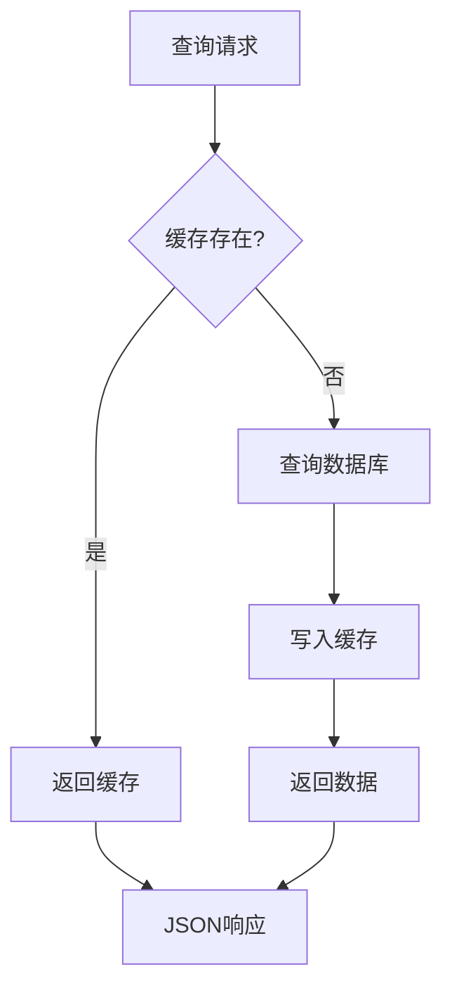

### Update (更新)

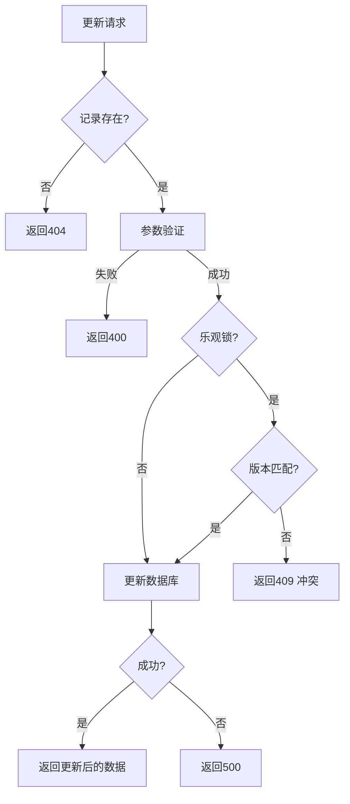

### Delete (删除)

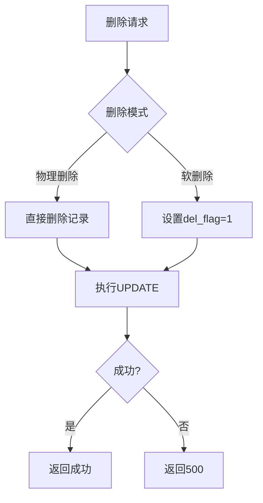

## ORM 查询构建

```mermaid
flowchart TB
    Query[构建查询] --> Base[基础查询<br/>session.query(Model)]

    Base --> Where{添加条件?}

    Where -->|是| Filter[filter()/filter_by()]
    Where -->|否| Join

    Filter --> Condition{条件类型}

    Condition -->|等值| C1[filter_by(name=value)]
    Condition -->|比较| C2[filter(Model.age > 18)]
    Condition -->|多条件| C3[filter(and_/or_/not_)]

    C1 --> Join{关联查询?}
    C2 --> Join
    C3 --> Join

    Join -->|是| J1[join()/outerjoin()]
    Join -->|否| Order

    J1 --> Order{排序?}

    Order -->|是| Sort[order_by()]
    Order -->|否| Limit

    Sort --> Limit{分页?}

    Limit -->|是| Page[offset()/limit()]
    Limit -->|否| Execute

    Page --> Execute[all()/one()/first()]

    Execute --> Result[返回结果]

```

## 查询优化技巧

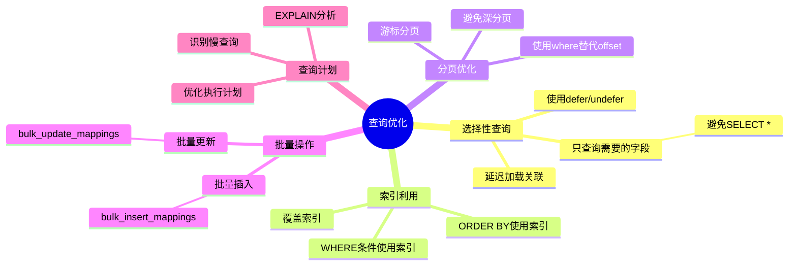

## 事务 ACID 特性

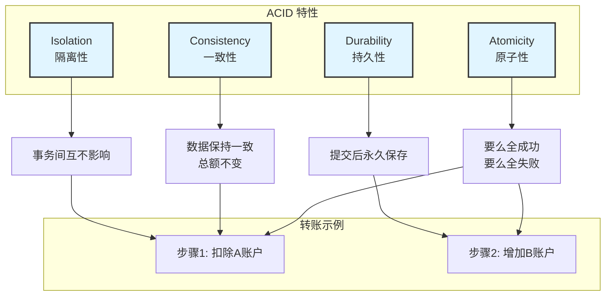

## 事务隔离级别

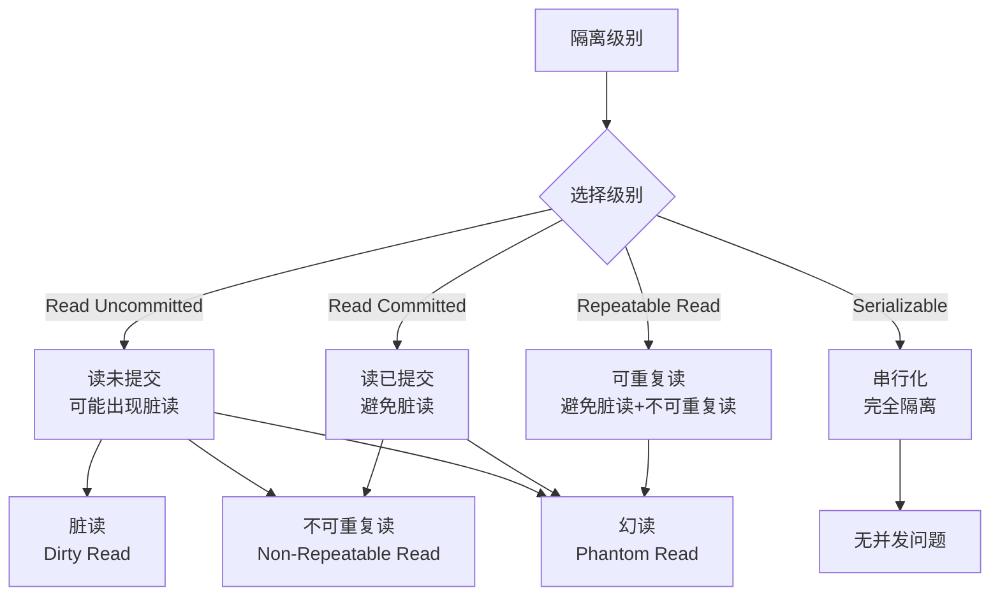

| 隔离级别 | 脏读 | 不可重复读 | 幻读 | 性能 | 适用场景 |
|---------|------|----------|------|------|---------|
| Read Uncommitted | ✗ | ✗ | ✗ | 高 | 极少使用 |
| Read Committed | √ | ✗ | ✗ | 中高 | 默认级别 |
| Repeatable Read | √ | √ | ✗ | 中 | 需要一致性 |
| Serializable | √ | √ | √ | 低 | 严格要求 |

## 分页查询实现

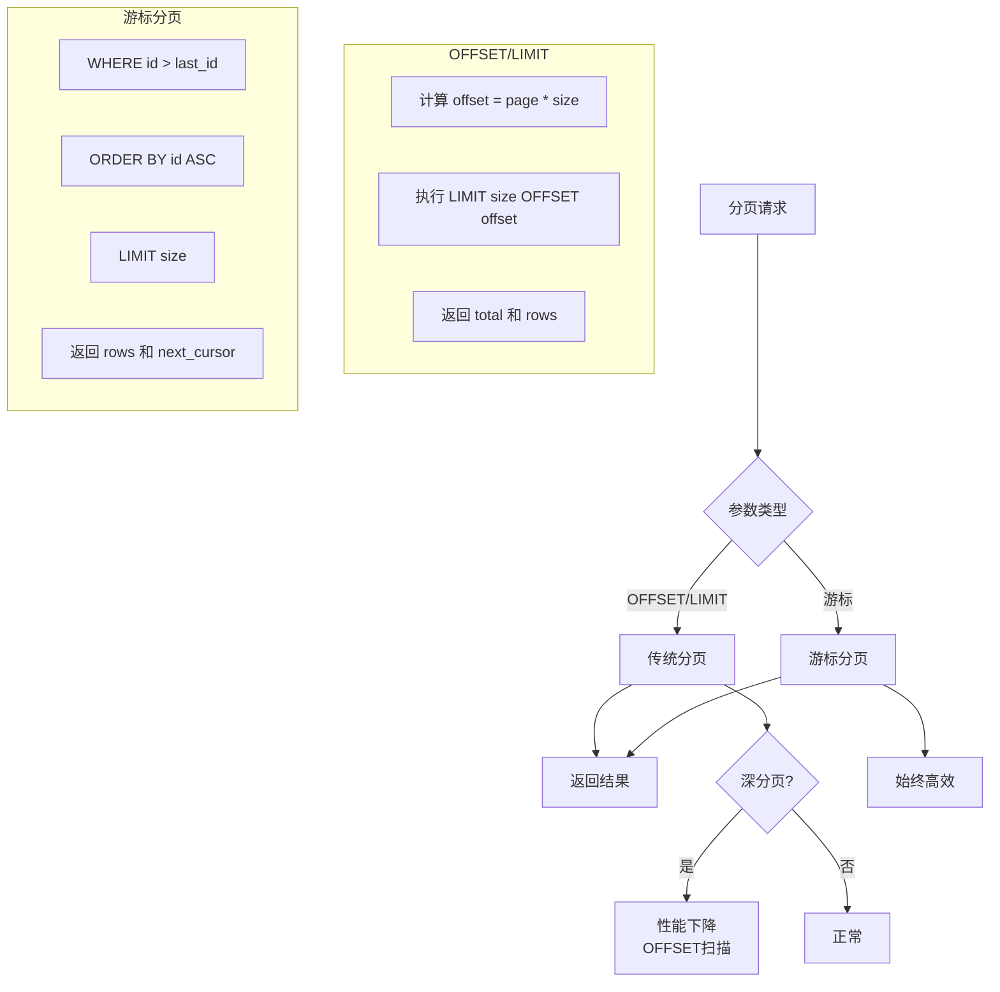

## 软删除 vs 硬删除

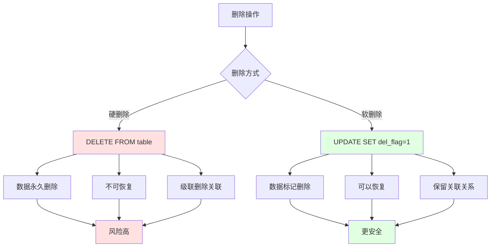

## 数据持久化检查清单

### CRUD 操作
- 创建时验证参数
- 检查唯一性约束
- 查询时使用缓存
- 更新时使用乐观锁
- 删除时考虑软删除

### 事务管理
- 明确事务边界
- 使用上下文管理器
- 正确处理异常
- 避免长事务
- 选择合适的隔离级别

### 查询优化
- 只查询需要的字段
- 使用索引加速查询
- 合理使用分页
- 批量操作代替循环
- 分析慢查询

### 缓存策略
- 选择合适的缓存策略
- 处理缓存穿透
- 处理缓存雪崩
- 设置合理的过期时间
- 更新时同步缓存

## 实战案例：转账事务

```python
async def transfer(from_id: int, to_id: int, amount: Decimal):
    async with db.begin():  # 自动提交/回滚
        # 1. 查询转出账户
        from_account = await db.get(Account, from_id)
        if not from_account or from_account.balance < amount:
            raise ValueError("余额不足")

        # 2. 查询转入账户
        to_account = await db.get(Account, to_id)
        if not to_account:
            raise ValueError("目标账户不存在")

        # 3. 扣除转出账户
        from_account.balance -= amount

        # 4. 增加转入账户
        to_account.balance += amount

        # 5. 记录交易日志
        transaction = Transaction(
            from_id=from_id,
            to_id=to_id,
            amount=amount
        )
        db.add(transaction)

        # 自动提交事务，如果任何步骤失败则回滚
```

## 相关文档

- [05-前端开发者的后端入门/06-数据持久化-状态管理的本质.md](../05-前端开发者的后端入门/06-数据持久化-状态管理的本质.md) - 数据持久化入门
- [07-数据建模专题.md](./07-数据建模专题.md) - 数据建模
- [09-性能优化专题.md](./09-性能优化专题.md) - 查询优化
- [11-异步编程专题.md](./11-异步编程专题.md) - 异步数据库操作
