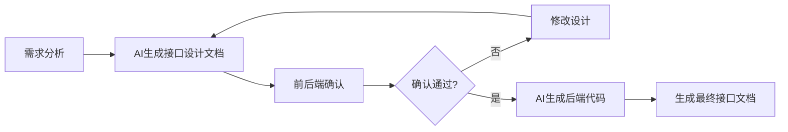

# 前置接口设计文档生成规范

## 1. 文档用途

本文档用于**需求分析阶段**，在AI编写后端代码之前，先输出接口设计方案。

**目的：**
- 明确前后端对接的"契约"
- 前端可提前根据设计文档开发页面和Mock数据
- 后端开发时有明确的设计参考
- 避免后期反复修改接口

## 2. 工作流程



## 3. AI提示词模板

### 3.1 完整模块接口设计

```
# 角色
你是一位资深的后端架构师，负责设计RESTful API接口。

# 任务
根据以下需求，设计一份完整的接口设计文档（Markdown格式）。

# 需求描述
{在此处填写需求描述，例如：}
我需要一个每日任务管理模块，功能包括：
1. 任务分类管理（增删改查、排序）
2. 每日任务管理（增删改查、完成/重开、置顶、排序）
3. 任务需要关联用户，每个用户只能看到自己的任务
4. 任务类型：每日任务、一次性任务、长期任务
5. 任务状态：待完成、已完成、已禁用
6. 任务可以置顶，可以自定义排序

# 输出要求
请按以下格式输出接口设计文档：

---
# {模块名称}接口设计文档

## 1. 模块概述
{简要描述模块功能和业务场景}

## 2. 数据模型设计
### 2.1 {表名1}
| 字段名 | 类型 | 必填 | 说明 |
|--------|------|------|------|
| id | int | 是 | 主键ID |
| ... | ... | ... | ... |

### 2.2 {表名2}
{同上}

## 3. 接口列表
### 3.1 {功能分组}

#### 3.1.1 {接口名称}
- **接口说明**：{简要说明接口功能}
- **请求方式**：GET/POST/PUT/DELETE/PATCH
- **接口路径**：`/api/{module}/{path}`
- **权限要求**：`{module}:{function}:{action}`

**请求参数：**
| 参数名 | 类型 | 位置 | 必填 | 说明 |
|--------|------|------|------|------|
| xxx | string | query/path/body | 是/否 | 参数说明 |

**响应参数：**
| 参数名 | 类型 | 说明 |
|--------|------|------|
| code | int | 状态码，200表示成功 |
| msg | string | 响应消息 |
| data | object/array | 响应数据 |

**data字段说明：**
| 参数名 | 类型 | 说明 |
|--------|------|------|
| ... | ... | ... |

**请求示例：**
```json
{
  "xxx": "xxx"
}
```

**响应示例：**
```json
{
  "code": 200,
  "msg": "操作成功",
  "data": {...}
}
```

## 4. 业务逻辑说明
### 4.1 {业务场景1}
{描述业务规则、校验逻辑等}

### 4.2 {业务场景2}
{同上}

## 5. 错误码说明
| 错误码 | 说明 |
|--------|------|
| 401 | 未授权，请先登录 |
| 403 | 权限不足 |
| 500 | 服务器错误 |
| {自定义错误码} | {错误说明} |

---

# 设计原则
1. 接口路径使用kebab-case（短横线命名）
2. 请求/响应参数使用camelCase（驼峰命名）
3. 遵循RESTful设计规范
4. 分页查询使用pageNum和pageSize参数
5. 删除接口支持批量删除（逗号分隔的ID）
6. 所有接口需要登录认证（除登录接口外）
7. 使用统一的响应格式 {code, msg, data}
```

### 3.2 单个接口设计

```
# 角色
你是一位后端开发工程师，负责设计API接口。

# 任务
设计一个{操作类型}接口，用于{功能描述}。

# 业务需求
{详细描述业务需求}

# 输出格式
请按以下格式输出接口设计：

---
## {接口标题}

### 接口信息
- **功能说明**：{详细说明}
- **请求方式**：GET/POST/PUT/DELETE/PATCH
- **接口路径**：`/api/xxx/xxx`
- **权限标识**：`xxx:xxx:xxx`

### 请求参数
| 参数名 | 类型 | 位置 | 必填 | 默认值 | 说明 |
|--------|------|------|------|--------|------|
| xxx | string/int/bool/... | query/path/body | 是/否 | - | 参数说明 |

### 请求示例
```json
{...}
```

### 响应参数
| 参数名 | 类型 | 说明 |
|--------|------|------|
| code | int | 状态码 |
| msg | string | 响应消息 |
| data | object/array/null | 响应数据 |

#### data字段说明
{如果是对象，详细说明data的每个字段}

### 响应示例
```json
{
  "code": 200,
  "msg": "操作成功",
  "data": {...}
}
```

### 业务规则
1. {规则1}
2. {规则2}
3. ...

### 异常情况
| 情况 | 错误码 | 错误信息 |
|------|--------|----------|
| {异常场景} | {code} | {msg} |
---
```

### 3.3 基于数据库表设计接口

```
# 角色
你是一位后端开发工程师，负责根据数据库表设计CRUD接口。

# 数据库表结构
```sql
CREATE TABLE xxx (
    id INT PRIMARY KEY AUTO_INCREMENT,
    name VARCHAR(50) NOT NULL,
    status VARCHAR(20) DEFAULT 'active',
    create_by VARCHAR(64),
    create_time DATETIME,
    update_by VARCHAR(64),
    update_time DATETIME
);
```

# 任务
根据以上表结构，设计一套完整的CRUD接口文档。

# 输出要求
1. 接口列表：列表查询（分页）、详情查询、新增、修改、删除
2. 每个接口包含：路径、方法、参数、响应、示例
3. 列表查询支持按常见字段筛选
4. 删除支持批量删除
5. 包含业务规则说明

# 模块信息
- 模块名称：{模块名称}
- 功能描述：{功能描述}
- 业务场景：{业务场景说明}
```

## 4. 设计要点检查

AI生成设计文档后，检查以下要点：

### 4.1 接口设计
- [ ] 路径使用kebab-case命名
- [ ] HTTP方法使用正确（GET查询、POST新增、PUT修改、DELETE删除）
- [ ] 遵循RESTful规范
- [ ] 有明确的权限标识

### 4.2 参数设计
- [ ] 参数名使用camelCase
- [ ] 有明确的类型定义
- [ ] 有明确的必填/可选标识
- [ ] 分页参数统一使用pageNum/pageSize
- [ ] 时间参数使用beginTime/endTime

### 4.3 响应设计
- [ ] 使用统一响应格式 {code, msg, data}
- [ ] 分页响应包含rows和total
- [ ] 有完整的响应示例

### 4.4 文档完整性
- [ ] 每个接口有功能说明
- [ ] 有请求示例
- [ ] 有响应示例
- [ ] 有业务规则说明
- [ ] 有异常情况说明

## 5. 完整示例

以下是每日任务管理模块的接口设计文档示例：

---
# 每日任务管理接口设计文档

## 1. 模块概述

本模块提供每日任务的管理功能，支持任务的创建、编辑、删除、完成等操作。每个用户只能管理自己的任务。

**业务场景：**
- 用户可以创建不同类型的任务（每日任务、一次性任务、长期任务）
- 任务可以标记为完成/未完成
- 任务可以置顶显示
- 任务可以自定义排序
- 每日任务会在每天自动重置为未完成状态

## 2. 数据模型设计

### 2.1 每日任务表 (daily_task)

| 字段名 | 类型 | 必填 | 说明 |
|--------|------|------|------|
| task_id | int | 是 | 主键ID |
| title | string | 是 | 任务标题 |
| description | string | 否 | 任务描述 |
| task_type | string | 是 | 任务类型（daily每日任务/once一次性/long长期） |
| status | string | 是 | 状态（pending待完成/completed已完成/disabled已禁用） |
| is_pinned | boolean | 否 | 是否置顶 |
| sort_order | int | 否 | 排序顺序 |
| completion_count | int | 否 | 累计完成次数 |
| icon_type | string | 否 | 图标类型 |
| user_id | int | 是 | 所属用户ID |
| category_id | int | 否 | 所属分类ID |
| last_completed_at | datetime | 否 | 最后完成时间 |
| disabled_at | datetime | 否 | 禁用时间 |
| create_by | string | 否 | 创建者 |
| create_time | datetime | 是 | 创建时间 |
| update_by | string | 否 | 更新者 |
| update_time | datetime | 是 | 更新时间 |
| remark | string | 否 | 备注 |

### 2.2 任务分类表 (daily_task_category)

| 字段名 | 类型 | 必填 | 说明 |
|--------|------|------|------|
| category_id | int | 是 | 主键ID |
| category_name | string | 是 | 分类名称 |
| category_icon | string | 否 | 分类图标 |
| sort_order | int | 否 | 排序顺序 |
| user_id | int | 是 | 所属用户ID |
| create_by | string | 否 | 创建者 |
| create_time | datetime | 是 | 创建时间 |
| update_by | string | 否 | 更新者 |
| update_time | datetime | 是 | 更新时间 |

## 3. 接口列表

### 3.1 任务管理

#### 3.1.1 获取任务列表（分页）

- **接口说明**：根据条件查询每日任务列表，支持分页
- **请求方式**：GET
- **接口路径**：`/api/daily-task/list`
- **权限要求**：`daily:task:list`

**请求参数：**

| 参数名 | 类型 | 位置 | 必填 | 说明 |
|--------|------|------|------|------|
| title | string | query | 否 | 任务标题（模糊查询） |
| taskType | string | query | 否 | 任务类型（daily/once/long） |
| status | string | query | 否 | 状态（pending/completed/disabled） |
| isPinned | boolean | query | 否 | 是否置顶 |
| categoryId | int | query | 否 | 分类ID |
| beginTime | string | query | 否 | 开始时间（yyyy-MM-dd） |
| endTime | string | query | 否 | 结束时间（yyyy-MM-dd） |
| pageNum | int | query | 否 | 页码，默认1 |
| pageSize | int | query | 否 | 每页数量，默认10 |

**响应参数：**

| 参数名 | 类型 | 说明 |
|--------|------|------|
| code | int | 状态码 |
| msg | string | 响应消息 |
| data | object | 分页数据 |

**data字段说明：**

| 参数名 | 类型 | 说明 |
|--------|------|------|
| rows | array | 任务列表 |
| total | int | 总记录数 |

**rows字段说明：**

| 参数名 | 类型 | 说明 |
|--------|------|------|
| taskId | int | 任务ID |
| title | string | 任务标题 |
| description | string | 任务描述 |
| taskType | string | 任务类型 |
| status | string | 状态 |
| isPinned | boolean | 是否置顶 |
| sortOrder | int | 排序顺序 |
| completionCount | int | 累计完成次数 |
| iconType | string | 图标类型 |
| categoryId | int | 分类ID |
| lastCompletedAt | string | 最后完成时间 |
| createTime | string | 创建时间 |

**请求示例：**
```
GET /api/daily-task/list?status=pending&pageNum=1&pageSize=10
```

**响应示例：**
```json
{
  "code": 200,
  "msg": "查询成功",
  "data": {
    "rows": [
      {
        "taskId": 1,
        "title": "晨跑30分钟",
        "description": "健康生活从晨跑开始",
        "taskType": "daily",
        "status": "pending",
        "isPinned": true,
        "sortOrder": 1,
        "completionCount": 15,
        "iconType": "sport",
        "categoryId": 1,
        "lastCompletedAt": "2024-03-01 07:30:00",
        "createTime": "2024-02-01 10:00:00"
      }
    ],
    "total": 25
  }
}
```

#### 3.1.2 获取任务详情

- **接口说明**：根据ID获取任务详细信息
- **请求方式**：GET
- **接口路径**：`/api/daily-task/{taskId}`
- **权限要求**：`daily:task:query`

**请求参数：**

| 参数名 | 类型 | 位置 | 必填 | 说明 |
|--------|------|------|------|------|
| taskId | int | path | 是 | 任务ID |

**响应参数：**

| 参数名 | 类型 | 说明 |
|--------|------|------|
| code | int | 状态码 |
| msg | string | 响应消息 |
| data | object | 任务详情 |

**data字段说明：**（同列表的rows字段）

**请求示例：**
```
GET /api/daily-task/1
```

**响应示例：**
```json
{
  "code": 200,
  "msg": "查询成功",
  "data": {
    "taskId": 1,
    "title": "晨跑30分钟",
    "description": "健康生活从晨跑开始",
    "taskType": "daily",
    "status": "pending",
    "isPinned": true,
    "sortOrder": 1,
    "completionCount": 15,
    "iconType": "sport",
    "categoryId": 1,
    "userId": 1,
    "lastCompletedAt": "2024-03-01 07:30:00",
    "disabledAt": null,
    "createTime": "2024-02-01 10:00:00",
    "updateTime": "2024-03-01 08:00:00"
  }
}
```

#### 3.1.3 新增任务

- **接口说明**：创建新的每日任务
- **请求方式**：POST
- **接口路径**：`/api/daily-task`
- **权限要求**：`daily:task:add`

**请求参数：**

| 参数名 | 类型 | 位置 | 必填 | 说明 |
|--------|------|------|------|------|
| title | string | body | 是 | 任务标题（1-200字符） |
| description | string | body | 否 | 任务描述（最多2000字符） |
| taskType | string | body | 是 | 任务类型（daily/once/long） |
| iconType | string | body | 否 | 图标类型 |
| categoryId | int | body | 否 | 分类ID |
| remark | string | body | 否 | 备注 |

**请求示例：**
```json
{
  "title": "晨跑30分钟",
  "description": "健康生活从晨跑开始",
  "taskType": "daily",
  "iconType": "sport",
  "categoryId": 1
}
```

**响应示例：**
```json
{
  "code": 200,
  "msg": "新增成功",
  "data": null
}
```

#### 3.1.4 修改任务

- **接口说明**：更新任务信息
- **请求方式**：PUT
- **接口路径**：`/api/daily-task`
- **权限要求**：`daily:task:edit`

**请求参数：**

| 参数名 | 类型 | 位置 | 必填 | 说明 |
|--------|------|------|------|------|
| taskId | int | body | 是 | 任务ID |
| title | string | body | 否 | 任务标题 |
| description | string | body | 否 | 任务描述 |
| taskType | string | body | 否 | 任务类型 |
| iconType | string | body | 否 | 图标类型 |
| categoryId | int | body | 否 | 分类ID |
| remark | string | body | 否 | 备注 |

**请求示例：**
```json
{
  "taskId": 1,
  "title": "晨跑30分钟",
  "description": "坚持每天晨跑，保持健康",
  "taskType": "daily",
  "iconType": "sport",
  "categoryId": 1
}
```

**响应示例：**
```json
{
  "code": 200,
  "msg": "更新成功",
  "data": null
}
```

#### 3.1.5 删除任务

- **接口说明**：删除任务，支持批量删除
- **请求方式**：DELETE
- **接口路径**：`/api/daily-task/{taskIds}`
- **权限要求**：`daily:task:remove`

**请求参数：**

| 参数名 | 类型 | 位置 | 必填 | 说明 |
|--------|------|------|------|------|
| taskIds | string | path | 是 | 任务ID，多个用逗号分隔 |

**请求示例：**
```
DELETE /api/daily-task/1,2,3
```

**响应示例：**
```json
{
  "code": 200,
  "msg": "删除成功",
  "data": null
}
```

#### 3.1.6 完成任务

- **接口说明**：将任务标记为已完成
- **请求方式**：PATCH
- **接口路径**：`/api/daily-task/{taskId}/complete`
- **权限要求**：`daily:task:edit`

**请求参数：**

| 参数名 | 类型 | 位置 | 必填 | 说明 |
|--------|------|------|------|------|
| taskId | int | path | 是 | 任务ID |

**响应示例：**
```json
{
  "code": 200,
  "msg": "任务已完成",
  "data": null
}
```

#### 3.1.7 重开任务

- **接口说明**：将已完成的任务重置为待完成状态
- **请求方式**：PATCH
- **接口路径**：`/api/daily-task/{taskId}/reopen`
- **权限要求**：`daily:task:edit`

**请求参数：**（同完成任务）

**响应示例：**
```json
{
  "code": 200,
  "msg": "任务已重开",
  "data": null
}
```

#### 3.1.8 置顶/取消置顶

- **接口说明**：设置任务的置顶状态
- **请求方式**：PUT
- **接口路径**：`/api/daily-task/{taskId}/pin`
- **权限要求**：`daily:task:edit`

**请求参数：**

| 参数名 | 类型 | 位置 | 必填 | 说明 |
|--------|------|------|------|------|
| taskId | int | path | 是 | 任务ID |
| isPinned | boolean | body | 是 | 是否置顶 |

**请求示例：**
```json
{
  "isPinned": true
}
```

**响应示例：**
```json
{
  "code": 200,
  "msg": "任务已置顶",
  "data": null
}
```

#### 3.1.9 批量排序

- **接口说明**：批量更新任务的排序
- **请求方式**：PUT
- **接口路径**：`/api/daily-task/reorder`
- **权限要求**：`daily:task:edit`

**请求参数：**

| 参数名 | 类型 | 位置 | 必填 | 说明 |
|--------|------|------|------|------|
| tasks | array | body | 是 | 任务列表 |

**tasks字段说明：**

| 参数名 | 类型 | 说明 |
|--------|------|------|
| taskId | int | 任务ID |
| sortOrder | int | 排序顺序 |

**请求示例：**
```json
{
  "tasks": [
    {"taskId": 1, "sortOrder": 1},
    {"taskId": 2, "sortOrder": 2},
    {"taskId": 3, "sortOrder": 3}
  ]
}
```

**响应示例：**
```json
{
  "code": 200,
  "msg": "排序成功",
  "data": null
}
```

### 3.2 任务分类管理

#### 3.2.1 获取分类列表（分页）

- **接口说明**：根据条件查询任务分类列表，支持分页
- **请求方式**：GET
- **接口路径**：`/api/daily-task-category/list`
- **权限要求**：`daily:task:category:list`

**请求参数：**

| 参数名 | 类型 | 位置 | 必填 | 说明 |
|--------|------|------|------|------|
| categoryName | string | query | 否 | 分类名称（模糊查询） |
| categoryIcon | string | query | 否 | 分类图标 |
| pageNum | int | query | 否 | 页码，默认1 |
| pageSize | int | query | 否 | 每页数量，默认10 |

**响应示例：**
```json
{
  "code": 200,
  "msg": "查询成功",
  "data": {
    "rows": [
      {
        "categoryId": 1,
        "categoryName": "运动",
        "categoryIcon": "sport",
        "sortOrder": 1,
        "createTime": "2024-02-01 10:00:00"
      }
    ],
    "total": 5
  }
}
```

#### 3.2.2 新增分类

- **接口说明**：创建新的任务分类
- **请求方式**：POST
- **接口路径**：`/api/daily-task-category`
- **权限要求**：`daily:task:category:add`

**请求参数：**

| 参数名 | 类型 | 位置 | 必填 | 说明 |
|--------|------|------|------|------|
| categoryName | string | body | 是 | 分类名称（1-50字符） |
| categoryIcon | string | body | 否 | 分类图标 |

**请求示例：**
```json
{
  "categoryName": "运动",
  "categoryIcon": "sport"
}
```

**响应示例：**
```json
{
  "code": 200,
  "msg": "新增成功",
  "data": null
}
```

#### 3.2.3 修改分类

- **接口说明**：更新分类信息
- **请求方式**：PUT
- **接口路径**：`/api/daily-task-category`
- **权限要求**：`daily:task:category:edit`

**请求参数：**

| 参数名 | 类型 | 位置 | 必填 | 说明 |
|--------|------|------|------|------|
| categoryId | int | body | 是 | 分类ID |
| categoryName | string | body | 否 | 分类名称 |
| categoryIcon | string | body | 否 | 分类图标 |

**请求示例：**
```json
{
  "categoryId": 1,
  "categoryName": "运动健身",
  "categoryIcon": "sport"
}
```

**响应示例：**
```json
{
  "code": 200,
  "msg": "更新成功",
  "data": null
}
```

#### 3.2.4 删除分类

- **接口说明**：删除分类，如果分类下有任务则不允许删除
- **请求方式**：DELETE
- **接口路径**：`/api/daily-task-category/{categoryIds}`
- **权限要求**：`daily:task:category:remove`

**请求参数：**

| 参数名 | 类型 | 位置 | 必填 | 说明 |
|--------|------|------|------|------|
| categoryIds | string | path | 是 | 分类ID，多个用逗号分隔 |

**响应示例：**
```json
{
  "code": 200,
  "msg": "删除成功",
  "data": null
}
```

**失败示例：**
```json
{
  "code": 500,
  "msg": "该分类下存在任务，无法删除",
  "data": null
}
```

## 4. 业务逻辑说明

### 4.1 任务完成逻辑
- 任务标记为完成时，自动更新`last_completed_at`为当前时间
- `completion_count`自动加1
- 每日任务类型的任务会在每天定时重置为待完成状态

### 4.2 数据隔离
- 所有查询默认只返回当前登录用户的数据
- 用户只能操作自己的任务和分类

### 4.3 排序规则
- 列表默认按`sort_order`升序、`task_id`降序排列
- 置顶任务排在前面

### 4.4 校验规则
- 新增/修改任务时，标题不能为空且不超过200字符
- 描述不超过2000字符
- 分类名称在当前用户下唯一

## 5. 错误码说明

| 错误码 | 说明 |
|--------|------|
| 200 | 操作成功 |
| 401 | 未授权，请先登录 |
| 403 | 权限不足 |
| 500 | 服务器错误 |
| 1001 | 任务不存在 |
| 1002 | 分类不存在 |
| 1003 | 分类名称已存在 |
| 1004 | 该分类下存在任务，无法删除 |
| 1005 | 任务标题不能为空 |
| 1006 | 任务标题超过200字符 |
---

## 6. 前端开发注意事项

1. **时间格式**：所有时间字段返回格式为 `yyyy-MM-dd HH:mm:ss`

2. **分页处理**：
   - 列表接口统一使用 `pageNum` 和 `pageSize` 参数
   - 响应中 `total` 表示总记录数，用于计算总页数

3. **错误处理**：
   - 统一判断 `code === 200` 表示成功
   - 其他情况使用 `msg` 显示错误信息

4. **数据转换**：
   - 后端使用驼峰命名（camelCase），前端可直接使用

5. **Token传递**：
   - 所有接口需要在请求头中携带token：`Authorization: Bearer {token}`

6. **特殊操作**：
   - 完成任务后建议刷新列表
   - 删除操作建议二次确认
   - 批量操作时用逗号分隔ID
