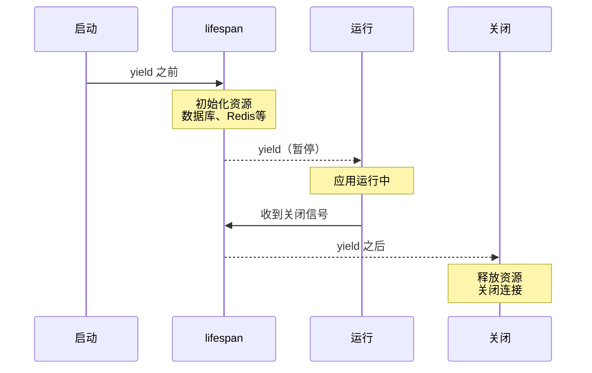

# lifespan 的执行时机与 yield 的作用

## 问题

1. lifespan 是在初始化 FastAPI 实例前执行，还是初始化后执行？
2. yield 的作用是什么？

## 回答

### lifespan 执行时机

```python
app = FastAPI(
    lifespan=lifespan,  # ← 传入函数，不是立即执行
)
```

**传入时：只是引用，不执行**

**执行时机：**


### yield 的作用

**分隔启动和关闭逻辑：**

```python
@asynccontextmanager
async def lifespan(app: FastAPI):
    # ┌─────────────────┐
    # │  启动时执行      │
    # └─────────────────┘
    await init_create_table()
    app.state.redis = await RedisUtil.create_redis_pool()

    yield  # ← 分界线：应用运行期间停在这里

    # ┌─────────────────┐
    # │  关闭时执行      │
    # └─────────────────┘
    await RedisUtil.close_redis_pool(app)
```

**时序图：**


