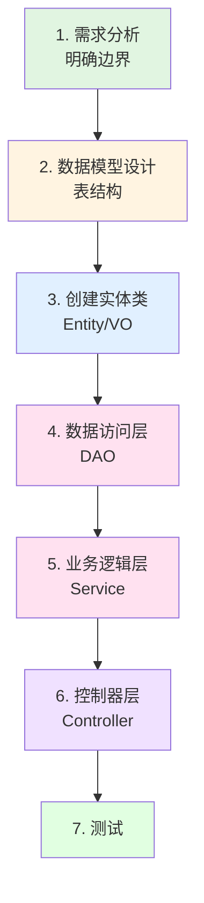

# 简单需求的开发顺序

## 问题

开发一个新需求时，正确的顺序是什么？先定义表？先写 Controller？先写 Service？还是先分析需求边界？

## 回答

### 推荐的开发顺序

```
分析需求
   ↓
设计数据模型（表结构）
   ↓
创建实体类（Entity/VO）
   ↓
数据访问层（DAO）
   ↓
业务逻辑层（Service）
   ↓
控制器层（Controller）
   ↓
测试
```

### 流程图



### 各步骤详解

#### 第一步：需求分析（最重要）

**在写代码前先想清楚：**

| 分析项 | 内容 |
|--------|------|
| 功能边界 | 做什么，不做什么 |
| 数据边界 | 需要存储哪些数据 |
| 接口边界 | 对外提供哪些 API |
| 权限边界 | 谁可以操作 |

**示例（新增任务功能）：**
```
✓ 做：任务的增删改查、状态切换
✗ 不做：任务的分享、协作

数据：标题、内容、优先级、状态、分类、截止时间
接口：POST /task, GET /task/list, PUT /task, DELETE /task/{id}
权限：本人可操作，其他人只读
```

#### 第二步：设计数据模型（表结构）

```sql
CREATE TABLE todo_task (
    task_id          BIGINT PRIMARY KEY AUTO_INCREMENT,
    task_title       VARCHAR(100) NOT NULL,
    task_content     TEXT,
    status           CHAR(1) DEFAULT '0',
    priority         CHAR(1) DEFAULT '2',
    category_id      BIGINT,
    user_id          BIGINT,
    create_time      DATETIME
);
```

#### 后续步骤

| 步骤 | 内容 | 文件 |
|------|------|------|
| 3 | 创建实体类 | `entity/vo/task_vo.py` |
| 4 | 创建 DAO | `dao/task_dao.py` |
| 5 | 创建 Service | `service/task_service.py` |
| 6 | 创建 Controller | `controller/task_controller.py` |

### 为什么先分析需求？

```
        ┌─────────────┐
        │  分析需求   │  ← 想清楚再动手
        └──────┬──────┘
               │
         ┌─────┴─────┐
         ↓           ↓
    ┌────────┐  ┌────────┐
    │ 写代码 │  │  写完  │
    │  发现  │  │  发现  │  ← 返工，浪费时间
    │ 需求  │  │ 不合理 │
    └────────┘  └────────┘
```

**先分析 = 避免返工**
