# 复杂需求的开发流程

## 问题

简单需求可以直接动手，复杂需求应该怎么处理？

## 回答

### 核心原则

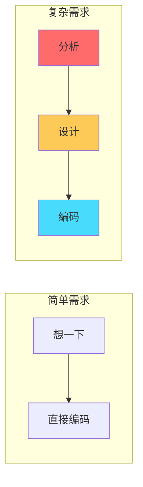

---

## 完整流程

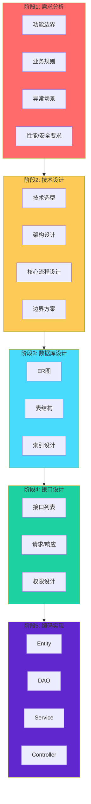

---

## 阶段对比

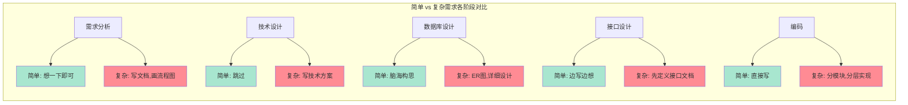

---

## 示例：任务分配系统

### 需求分析

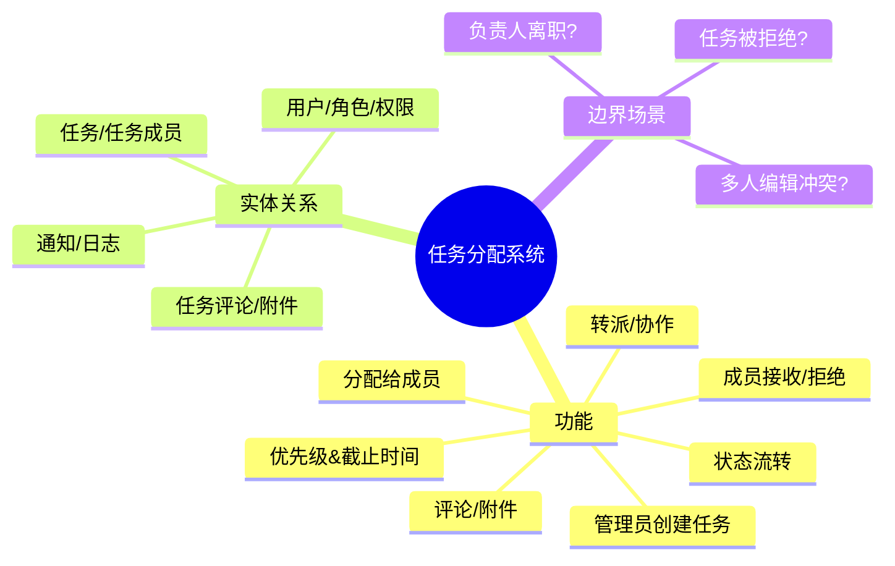

### 技术设计

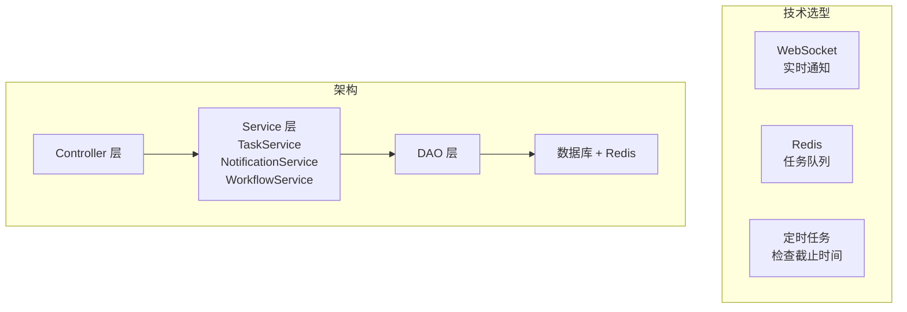

### 数据库 ER 图

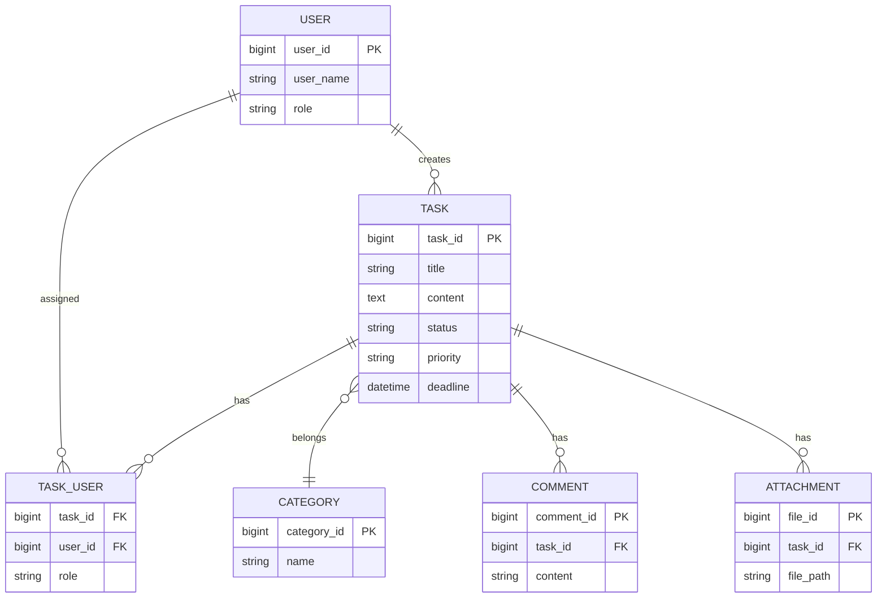

### 接口设计

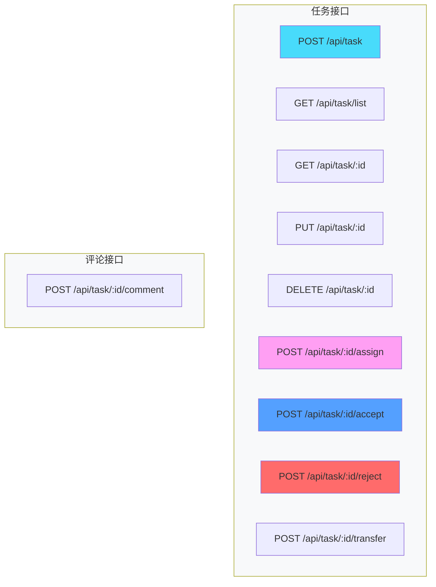

### 编码模块划分

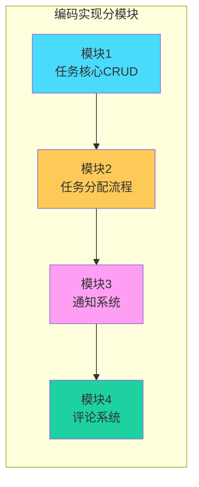

---

## 关键区别总结

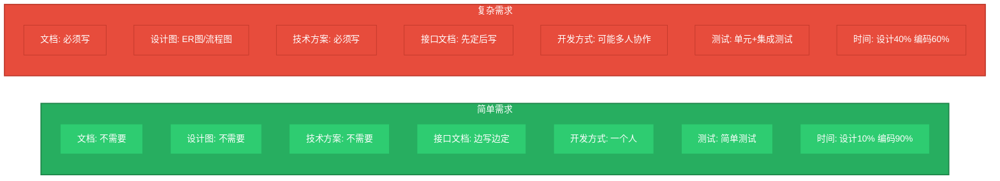

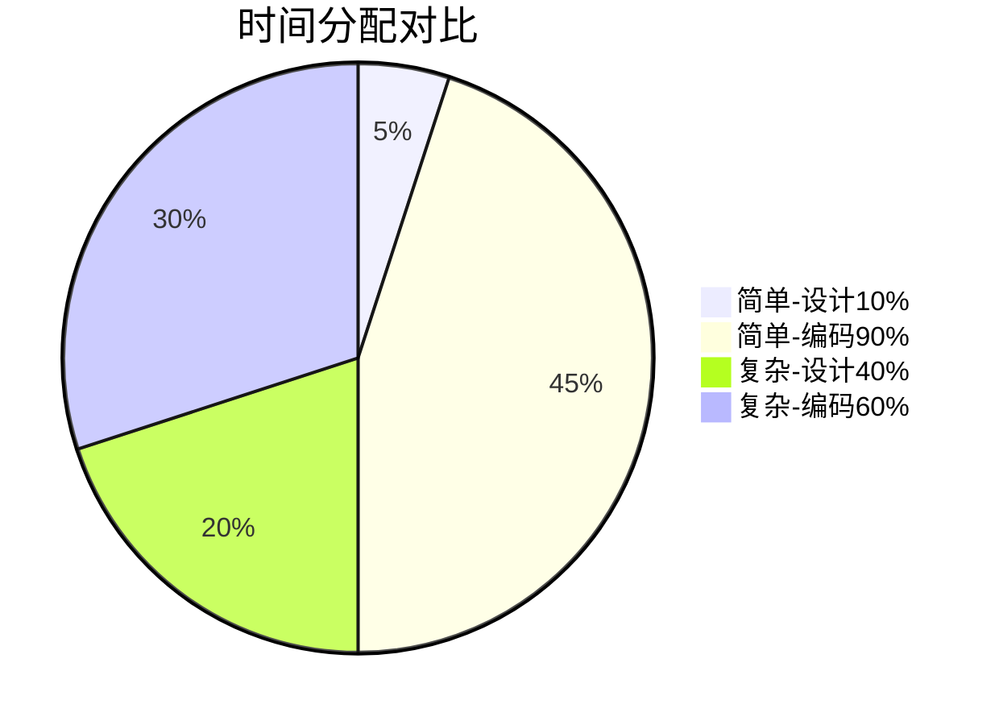

---

## 核心原则

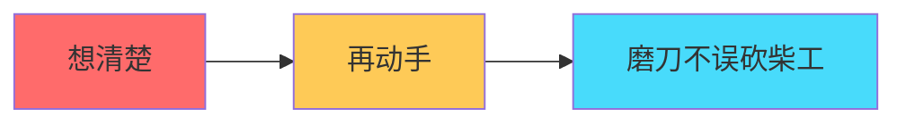
