# 依赖注入

> 掌握 FastAPI 依赖注入系统，学会优雅地管理资源和共享逻辑

## 📋 本章目标

- [ ] 理解依赖注入的概念和价值
- [ ] 掌握 `Depends` 的基本用法
- [ ] 学会创建可复用的依赖项
- [ ] 应用依赖注入解决实际问题

## 🎯 什么是依赖注入

### 概念解释

依赖注入（Dependency Injection，DI）是一种设计模式，它允许我们将组件的依赖关系从组件内部移到外部进行管理。

### 现实类比

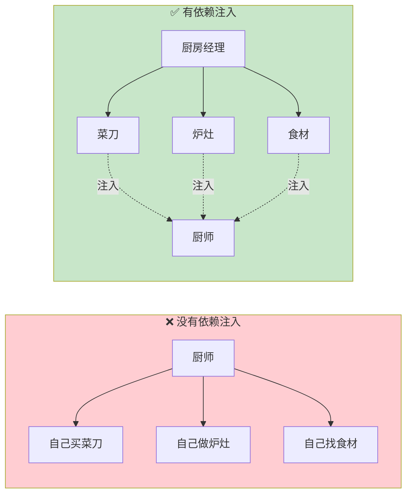

### 代码对比

```python
# ❌ 没有依赖注入：在函数内部创建依赖
def get_user(user_id: int):
    db = Database()  # 每次都创建新连接
    user = db.query(User).get(user_id)
    db.close()
    return user

# ✅ 有依赖注入：依赖从外部注入
def get_db():
    """数据库连接依赖"""
    db = Database()
    try:
        yield db
    finally:
        db.close()

def get_user(user_id: int, db: Database = Depends(get_db)):
    # db 由 FastAPI 自动注入
    return db.query(User).get(user_id)
```

## 🏗️ FastAPI 依赖注入架构

### 依赖注入流程

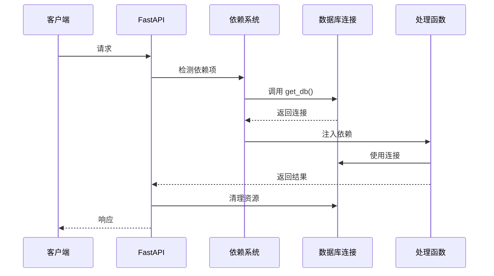

### 依赖注入的核心组件

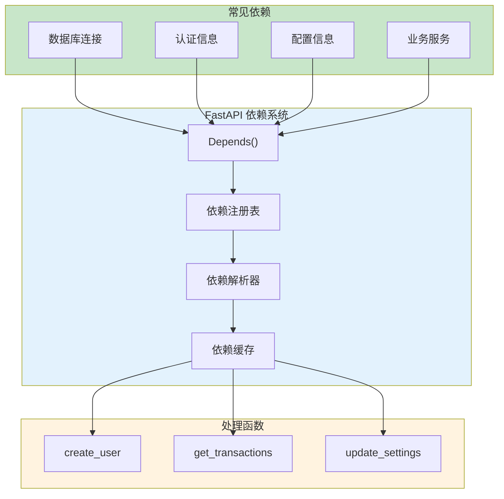

## 🔧 基本用法

### 简单依赖

```python
from fastapi import FastAPI, Depends

app = FastAPI()

# 定义依赖项
def common_parameters(q: str = None, skip: int = 0, limit: int = 100):
    return {"q": q, "skip": skip, "limit": limit}

# 使用依赖项
@app.get("/items")
def read_items(commons: dict = Depends(common_parameters)):
    # commons 包含 q, skip, limit
    return commons

@app.get("/users")
def read_users(commons: dict = Depends(common_parameters)):
    # 复用相同的依赖
    return commons
```

### 依赖注入流程图


### 类作为依赖

```python
from fastapi import FastAPI, Depends

app = FastAPI()

# 使用类定义依赖
class CommonParams:
    def __init__(self, q: str = None, skip: int = 0, limit: int = 100):
        self.q = q
        self.skip = skip
        self.limit = limit

# FastAPI 会自动实例化这个类
@app.get("/items")
def read_items(commons: CommonParams = Depends()):
    return {
        "q": commons.q,
        "skip": commons.skip,
        "limit": commons.limit
    }
```

## 🗃️ 实战：数据库依赖

### 数据库连接依赖

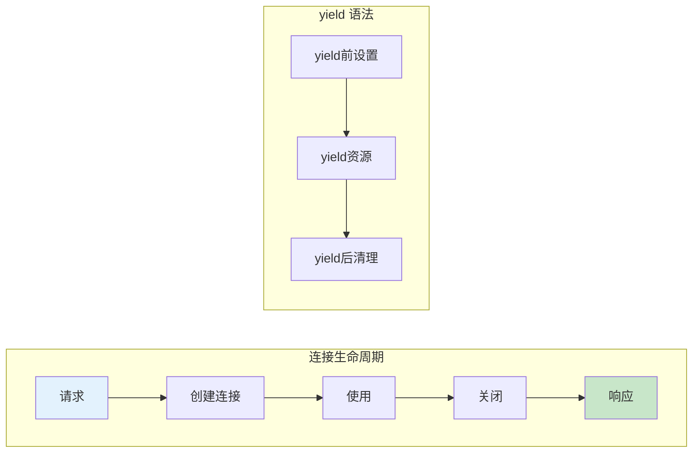

```python
from fastapi import FastAPI, Depends
from sqlalchemy import create_engine
from sqlalchemy.orm import sessionmaker, Session

app = FastAPI()

# 数据库配置
engine = create_engine("sqlite:///./test.db")
SessionLocal = sessionmaker(bind=engine)

# 数据库依赖
def get_db():
    """
    数据库会话依赖

    使用 yield 确保每个请求结束后自动关闭连接
    """
    db = SessionLocal()
    try:
        yield db  # 提供给处理函数使用
    finally:
        db.close()  # 请求结束后自动清理

# 使用数据库依赖
@app.get("/users/{user_id}")
def get_user(user_id: int, db: Session = Depends(get_db)):
    # db 已经是有效的数据库会话
    user = db.query(User).filter(User.id == user_id).first()
    return user
```

### 多个数据库依赖

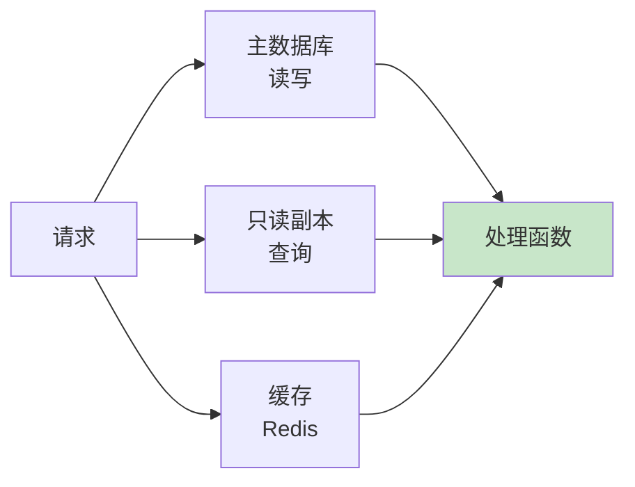

```python
from fastapi import FastAPI, Depends
from redis import Redis

app = FastAPI()

# 主数据库
def get_main_db():
    db = MainSessionLocal()
    try:
        yield db
    finally:
        db.close()

# 只读副本
def get_read_db():
    db = ReadSessionLocal()
    try:
        yield db
    finally:
        db.close()

# Redis 缓存
def get_redis():
    redis = Redis(host='localhost', port=6379)
    try:
        yield redis
    finally:
        redis.close()

# 同时使用多个依赖
@app.get("/users/{user_id}")
def get_user(
    user_id: int,
    main_db: Session = Depends(get_main_db),
    read_db: Session = Depends(get_read_db),
    cache: Redis = Depends(get_redis)
):
    # 先查缓存
    cached = cache.get(f"user:{user_id}")
    if cached:
        return cached

    # 查只读库
    user = read_db.query(User).get(user_id)

    # 写入缓存
    cache.set(f"user:{user_id}", user)

    return user
```

## 🔐 实战：认证依赖

### JWT 认证流程

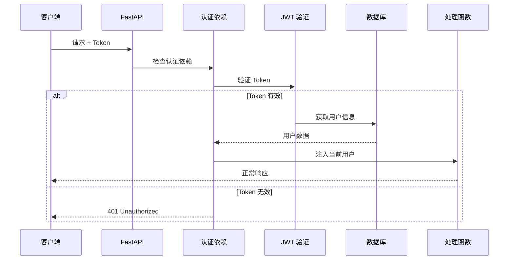

### 认证依赖实现

```python
from fastapi import FastAPI, Depends, HTTPException, status
from fastapi.security import HTTPBearer, HTTPAuthorizationCredentials
from jose import JWTError, jwt
from pydantic import BaseModel

app = FastAPI()
security = HTTPBearer()

# 用户模型
class User(BaseModel):
    id: int
    username: str
    email: str

# 认证依赖
def get_current_user(
    credentials: HTTPAuthorizationCredentials = Depends(security)
) -> User:
    """
    获取当前登录用户

    1. 从请求头提取 Bearer Token
    2. 验证 JWT 有效性
    3. 返回用户信息
    """
    token = credentials.credentials

    try:
        # 解码 JWT
        payload = jwt.decode(
            token,
            SECRET_KEY,
            algorithms=[ALGORITHM]
        )
        user_id: int = payload.get("sub")

        if user_id is None:
            raise HTTPException(
                status_code=status.HTTP_401_UNAUTHORIZED,
                detail="无效的认证凭证"
            )

    except JWTError:
        raise HTTPException(
            status_code=status.HTTP_401_UNAUTHORIZED,
            detail="无法验证凭证"
        )

    # 从数据库获取用户
    user = get_user_from_db(user_id)
    if user is None:
        raise HTTPException(
            status_code=status.HTTP_401_UNAUTHORIZED,
            detail="用户不存在"
        )

    return user

# 可选认证（允许匿名访问）
def get_current_user_optional(
    credentials: HTTPAuthorizationCredentials = Depends(HTTPBearer(auto_error=False))
) -> User | None:
    if credentials is None:
        return None
    return get_current_user(credentials)

# 使用认证依赖
@app.get("/users/me")
def read_users_me(current_user: User = Depends(get_current_user)):
    """获取当前用户信息（需要登录）"""
    return current_user

@app.get("/public")
def public_content(user: User = Depends(get_current_user_optional)):
    """公共内容（可选登录）"""
    if user:
        return {"message": f"欢迎回来, {user.username}!"}
    return {"message": "欢迎访客!"}
```

### 权限验证依赖

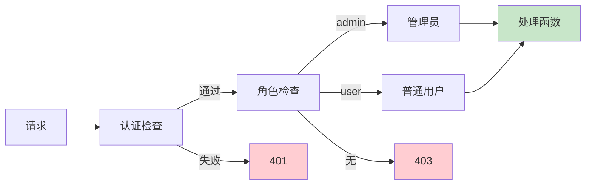

```python
from fastapi import Depends, HTTPException, status
from typing import List

def require_roles(required_roles: List[str]):
    """
    角色验证依赖工厂

    返回一个依赖函数，用于检查用户是否具有所需角色
    """
    def role_checker(current_user: User = Depends(get_current_user)):
        if current_user.role not in required_roles:
            raise HTTPException(
                status_code=status.HTTP_403_FORBIDDEN,
                detail="权限不足"
            )
        return current_user
    return role_checker

# 使用角色验证
@app.get("/admin/users")
def list_all_users(
    admin: User = Depends(require_roles(["admin"]))
):
    """管理员：查看所有用户"""
    return {"users": get_all_users()}

@app.get("/transactions")
def list_transactions(
    user: User = Depends(require_roles(["user", "admin"]))
):
    """用户/管理员：查看交易记录"""
    return {"transactions": get_user_transactions(user.id)}
```

## 🔄 依赖嵌套与组合

### 依赖嵌套

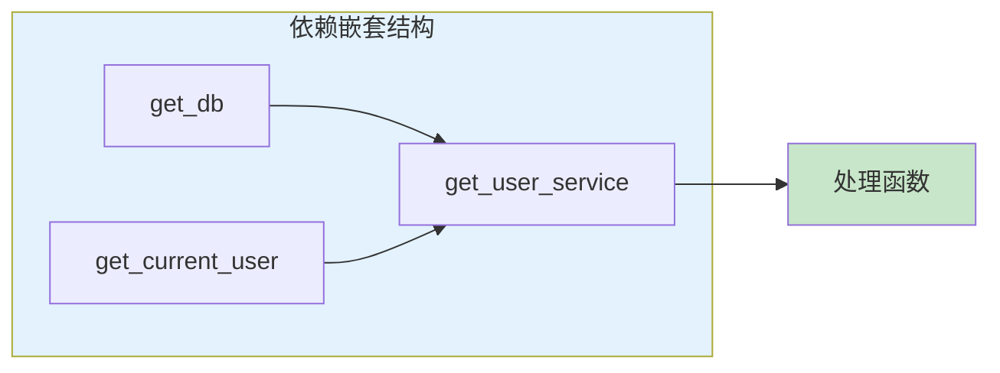

```python
from fastapi import FastAPI, Depends
from sqlalchemy.orm import Session

app = FastAPI()

# 基础依赖：数据库
def get_db():
    db = SessionLocal()
    try:
        yield db
    finally:
        db.close()

# 基础依赖：认证
def get_current_user(
    db: Session = Depends(get_db),
    token: str = Depends(oauth2_scheme)
):
    # 依赖 get_db
    user = verify_token(db, token)
    return user

# 组合依赖：用户服务
def get_user_service(
    db: Session = Depends(get_db),
    current_user: User = Depends(get_current_user)
):
    # 同时依赖数据库和当前用户
    return UserService(db, current_user)

# 使用组合依赖
@app.get("/my-transactions")
def get_my_transactions(
    service: UserService = Depends(get_user_service)
):
    # service 已经包含 db 和 current_user
    return service.get_transactions()
```

### 依赖图示例

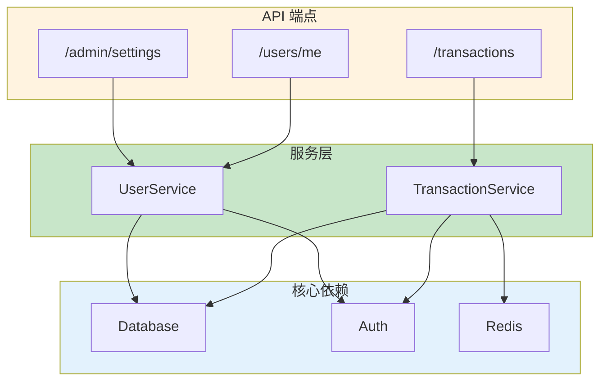

## 🎛️ 依赖缓存与作用域

### 依赖缓存机制

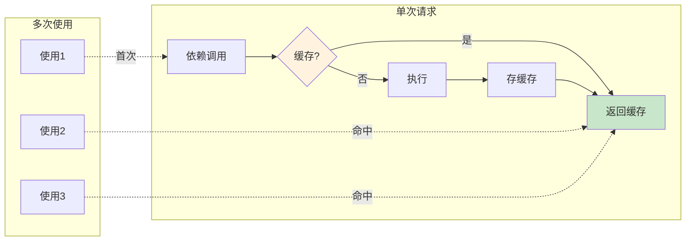

```python
from fastapi import FastAPI, Depends

app = FastAPI()

# 默认情况下，同一请求中依赖会被缓存
def expensive_operation():
    print("执行耗时操作...")  # 每个请求只执行一次
    return {"result": "data"}

@app.get("/cached")
def use_cached(
    data1: dict = Depends(expensive_operation),  # 执行
    data2: dict = Depends(expensive_operation),  # 使用缓存
    data3: dict = Depends(expensive_operation),  # 使用缓存
):
    # data1, data2, data3 是同一个对象
    return {"data": data1}

# 禁用缓存：use_cache=False
@app.get("/no-cache")
def use_no_cache(
    data1: dict = Depends(expensive_operation),
    data2: dict = Depends(expensive_operation, use_cache=False),  # 重新执行
):
    return {"data1": data1, "data2": data2}
```

### 全局依赖

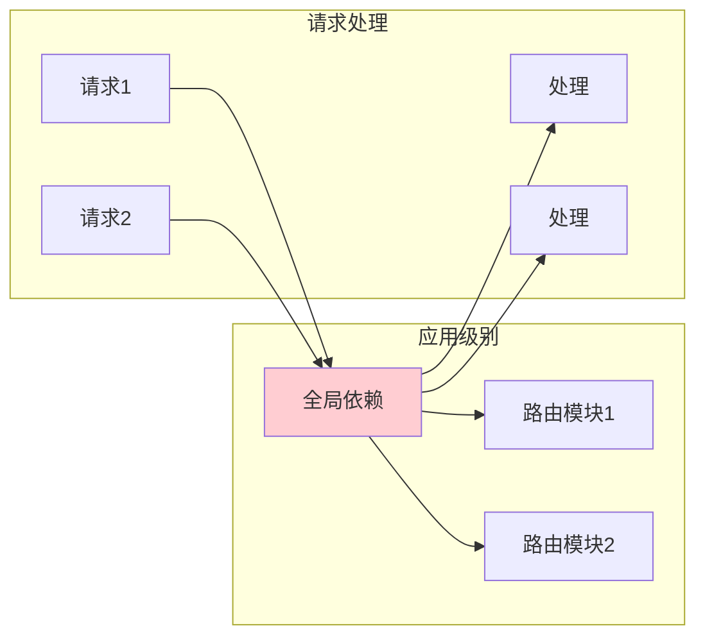

```python
from fastapi import FastAPI, Depends, APIRouter

app = FastAPI(
    # 应用级别全局依赖
    dependencies=[
        Depends(verify_token),
        Depends(verify_key)
    ]
)

# 路由级别依赖
router = APIRouter(
    prefix="/admin",
    dependencies=[Depends(require_admin)]
)

@router.get("/users")
def list_users():
    # 自动执行所有依赖：
    # 1. verify_token (应用级)
    # 2. verify_key (应用级)
    # 3. require_admin (路由级)
    return {"users": []}
```

## 📊 依赖注入最佳实践

### 项目结构

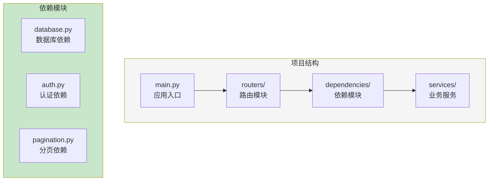

### 完整示例：记账系统依赖

```python
# dependencies/database.py
from sqlalchemy.orm import Session
from database import SessionLocal

def get_db():
    """数据库会话依赖"""
    db = SessionLocal()
    try:
        yield db
    finally:
        db.close()

# dependencies/auth.py
from fastapi import Depends, HTTPException
from fastapi.security import HTTPBearer
from jose import jwt

security = HTTPBearer()

def get_current_user(
    credentials = Depends(security),
    db: Session = Depends(get_db)
) -> User:
    """获取当前用户"""
    token = credentials.credentials
    try:
        payload = jwt.decode(token, SECRET_KEY, algorithms=[ALGORITHM])
        user_id = payload.get("sub")
        user = db.query(User).get(user_id)
        if not user:
            raise HTTPException(401, "用户不存在")
        return user
    except JWTError:
        raise HTTPException(401, "无效凭证")

# dependencies/pagination.py
from fastapi import Query
from pydantic import BaseModel

class PaginationParams(BaseModel):
    skip: int = 0
    limit: int = 10

def get_pagination(
    skip: int = Query(0, ge=0),
    limit: int = Query(10, ge=1, le=100)
) -> PaginationParams:
    """分页参数依赖"""
    return PaginationParams(skip=skip, limit=limit)

# dependencies/services.py
from services import TransactionService, UserService

def get_transaction_service(
    db: Session = Depends(get_db),
    current_user: User = Depends(get_current_user)
) -> TransactionService:
    """交易服务依赖"""
    return TransactionService(db, current_user)

# routers/transactions.py
from fastapi import APIRouter, Depends
from dependencies.auth import get_current_user
from dependencies.database import get_db
from dependencies.pagination import get_pagination
from dependencies.services import get_transaction_service

router = APIRouter(prefix="/transactions", tags=["交易"])

@router.get("")
def list_transactions(
    service: TransactionService = Depends(get_transaction_service),
    pagination: PaginationParams = Depends(get_pagination)
):
    """获取交易列表"""
    return service.get_transactions(
        skip=pagination.skip,
        limit=pagination.limit
    )

@router.post("")
def create_transaction(
    data: TransactionCreate,
    service: TransactionService = Depends(get_transaction_service)
):
    """创建交易"""
    return service.create_transaction(data)
```

### 依赖注入决策图

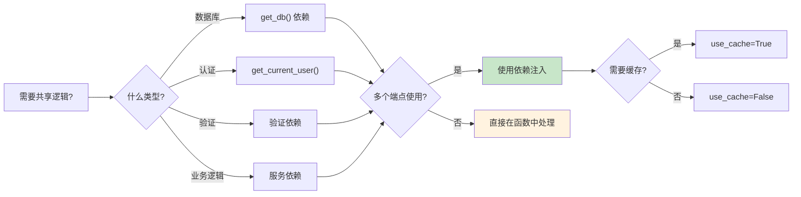

## 📝 练习任务

### 基础练习

1. **创建分页依赖**
   ```python
   # 实现一个分页依赖，支持 page/size 或 skip/limit 两种模式
   @app.get("/items")
   def list_items(pagination: Pagination = Depends(get_pagination)):
       pass
   ```

2. **创建日志依赖**
   ```python
   # 实现请求日志依赖，记录每个请求的基本信息
   def log_request(request: Request = Depends()):
       logger.info(f"Request: {request.method} {request.url}")
   ```

### 进阶练习

3. **实现完整认证系统**
   - JWT 生成与验证
   - 用户角色检查
   - 权限验证装饰器

4. **服务层依赖**
   - 创建 TransactionService
   - 实现依赖注入
   - 添加缓存支持

## ✅ 检查点

完成本章学习后，你应该能够：

- [ ] 解释依赖注入的概念和优势
- [ ] 使用 `Depends()` 创建和使用依赖
- [ ] 实现数据库会话依赖
- [ ] 实现认证和权限验证依赖
- [ ] 理解依赖缓存机制
- [ ] 组织项目依赖结构

## 🤔 常见问题

### Q1: 依赖注入和直接调用有什么区别？

```python
# 直接调用
def get_user(user_id: int):
    db = SessionLocal()  # 硬编码依赖
    user = db.query(User).get(user_id)
    db.close()
    return user

# 依赖注入
def get_user(user_id: int, db = Depends(get_db)):
    # 依赖由外部管理
    return db.query(User).get(user_id)
```

**A**: 依赖注入的优势：
- ✅ **可测试**：可以轻松替换 mock 数据库
- ✅ **可复用**：多个端点共享同一个依赖
- ✅ **关注分离**：业务逻辑不关心依赖创建
- ✅ **生命周期管理**：自动清理资源

### Q2: 什么时候不应该用依赖注入？

**A**: 以下情况可以不用：
- 简单的一次性操作
- 不需要复用的逻辑
- 不需要测试的场景

### Q3: 如何在测试中替换依赖？

```python
from fastapi.testclient import TestClient

# 测试用数据库依赖
def override_get_db():
    db = TestSessionLocal()
    try:
        yield db
    finally:
        db.close()

# 替换依赖
app.dependency_overrides[get_db] = override_get_db

client = TestClient(app)
```

## 📚 延伸阅读

- **FastAPI 依赖注入**：[https://fastapi.tiangolo.com/tutorial/dependencies/](https://fastapi.tiangolo.com/tutorial/dependencies/)
- **依赖注入模式**：[https://en.wikipedia.org/wiki/Dependency_injection](https://en.wikipedia.org/wiki/Dependency_injection)
- **测试与依赖覆盖**：[https://fastapi.tiangolo.com/advanced/testing-dependencies/](https://fastapi.tiangolo.com/advanced/testing-dependencies/)

---

**下一章**：[04-Pydantic验证.md](./04-Pydantic验证.md) - 深入学习数据验证和模型设计
