# SQL 基础

> 掌握数据库基础，为记账系统设计数据存储方案

## 📋 本章目标

- [ ] 理解数据库的基本概念
- [ ] 掌握 SQL 基本语法
- [ ] 学会设计表结构
- [ ] 完成记账系统数据库设计

## 🎯 为什么需要数据库

### 数据存储演进

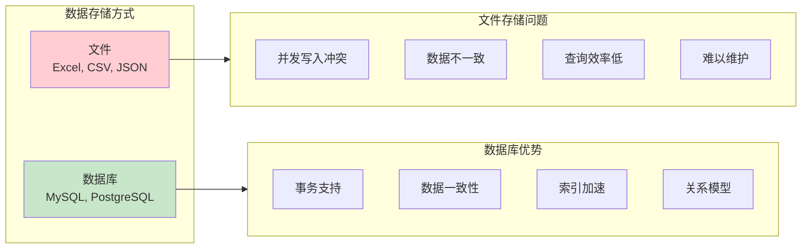

### 数据库应用场景

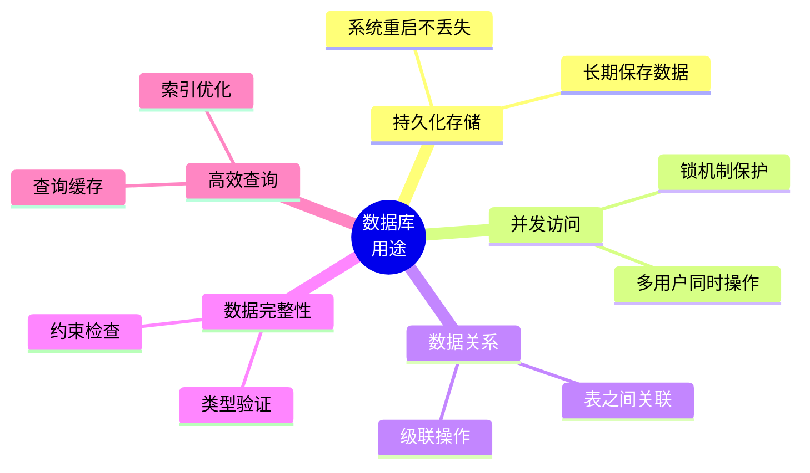

## 🏗️ 数据库基础概念

### 关系型数据库结构

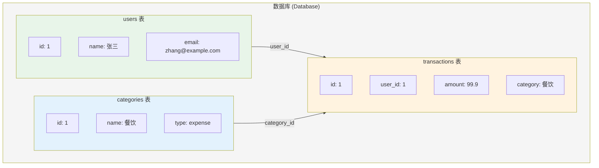

### 核心概念对比

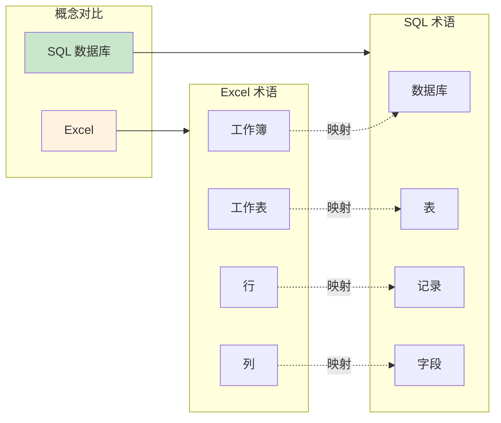

| Excel | SQL 数据库 | 说明 |
|-------|------------|------|
| 工作簿 | 数据库 | 容器 |
| 工作表 | 表 | 数据集合 |
| 行 | 记录 | 一条数据 |
| 列 | 字段 | 数据属性 |
| 公式 | SQL 查询 | 数据操作 |

## 📊 SQL 基础语法

### CREATE TABLE - 创建表

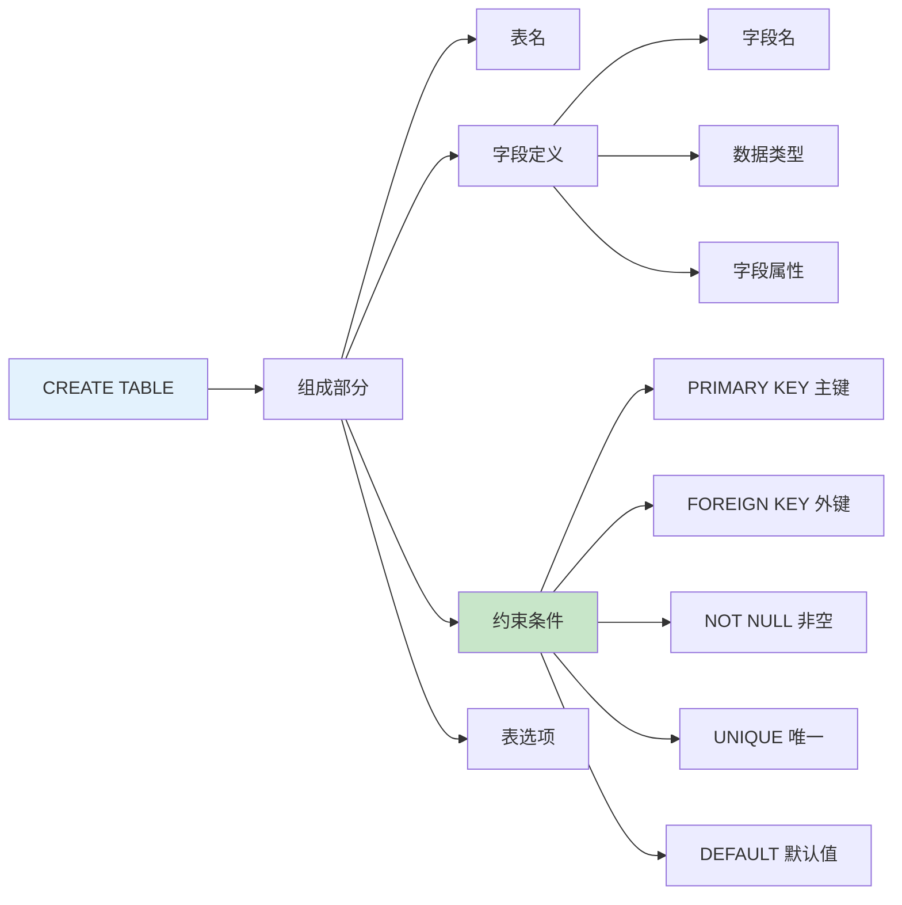

### 记账系统表结构设计

```sql
-- 用户表
CREATE TABLE users (
    id INT PRIMARY KEY AUTO_INCREMENT COMMENT '用户ID',
    username VARCHAR(50) NOT NULL UNIQUE COMMENT '用户名',
    email VARCHAR(100) NOT NULL UNIQUE COMMENT '邮箱',
    password_hash VARCHAR(255) NOT NULL COMMENT '密码哈希',
    is_active BOOLEAN DEFAULT TRUE COMMENT '是否激活',
    created_at TIMESTAMP DEFAULT CURRENT_TIMESTAMP COMMENT '创建时间',
    updated_at TIMESTAMP DEFAULT CURRENT_TIMESTAMP ON UPDATE CURRENT_TIMESTAMP COMMENT '更新时间',
    INDEX idx_username (username),
    INDEX idx_email (email)
) ENGINE=InnoDB DEFAULT CHARSET=utf8mb4 COMMENT='用户表';

-- 分类表
CREATE TABLE categories (
    id INT PRIMARY KEY AUTO_INCREMENT COMMENT '分类ID',
    user_id INT NOT NULL COMMENT '用户ID',
    name VARCHAR(50) NOT NULL COMMENT '分类名称',
    type ENUM('income', 'expense') NOT NULL COMMENT '类型：收入/支出',
    icon VARCHAR(20) COMMENT '图标',
    color VARCHAR(7) COMMENT '颜色 #RRGGBB',
    sort_order INT DEFAULT 0 COMMENT '排序',
    created_at TIMESTAMP DEFAULT CURRENT_TIMESTAMP COMMENT '创建时间',

    FOREIGN KEY (user_id) REFERENCES users(id) ON DELETE CASCADE,
    INDEX idx_user_type (user_id, type)
) ENGINE=InnoDB DEFAULT CHARSET=utf8mb4 COMMENT='分类表';

-- 账户表
CREATE TABLE accounts (
    id INT PRIMARY KEY AUTO_INCREMENT COMMENT '账户ID',
    user_id INT NOT NULL COMMENT '用户ID',
    name VARCHAR(50) NOT NULL COMMENT '账户名称',
    type ENUM('cash', 'bank', 'credit_card', 'alipay', 'wechat') NOT NULL COMMENT '账户类型',
    balance DECIMAL(10, 2) DEFAULT 0.00 COMMENT '当前余额',
    initial_balance DECIMAL(10, 2) DEFAULT 0.00 COMMENT '初始余额',
    icon VARCHAR(20) COMMENT '图标',
    color VARCHAR(7) COMMENT '颜色',
    is_active BOOLEAN DEFAULT TRUE COMMENT '是否启用',
    created_at TIMESTAMP DEFAULT CURRENT_TIMESTAMP COMMENT '创建时间',

    FOREIGN KEY (user_id) REFERENCES users(id) ON DELETE CASCADE,
    INDEX idx_user (user_id)
) ENGINE=InnoDB DEFAULT CHARSET=utf8mb4 COMMENT='账户表';

-- 交易表
CREATE TABLE transactions (
    id INT PRIMARY KEY AUTO_INCREMENT COMMENT '交易ID',
    user_id INT NOT NULL COMMENT '用户ID',
    account_id INT NOT NULL COMMENT '账户ID',
    category_id INT NOT NULL COMMENT '分类ID',
    type ENUM('income', 'expense') NOT NULL COMMENT '类型',
    amount DECIMAL(10, 2) NOT NULL COMMENT '金额',
    note VARCHAR(200) COMMENT '备注',
    transaction_date DATE NOT NULL COMMENT '交易日期',
    created_at TIMESTAMP DEFAULT CURRENT_TIMESTAMP COMMENT '创建时间',
    updated_at TIMESTAMP DEFAULT CURRENT_TIMESTAMP ON UPDATE CURRENT_TIMESTAMP COMMENT '更新时间',

    FOREIGN KEY (user_id) REFERENCES users(id) ON DELETE CASCADE,
    FOREIGN KEY (account_id) REFERENCES accounts(id) ON DELETE RESTRICT,
    FOREIGN KEY (category_id) REFERENCES categories(id) ON DELETE RESTRICT,
    INDEX idx_user_date (user_id, transaction_date DESC),
    INDEX idx_account (account_id),
    INDEX idx_category (category_id)
) ENGINE=InnoDB DEFAULT CHARSET=utf8mb4 COMMENT='交易表';
```

### 表关系可视化

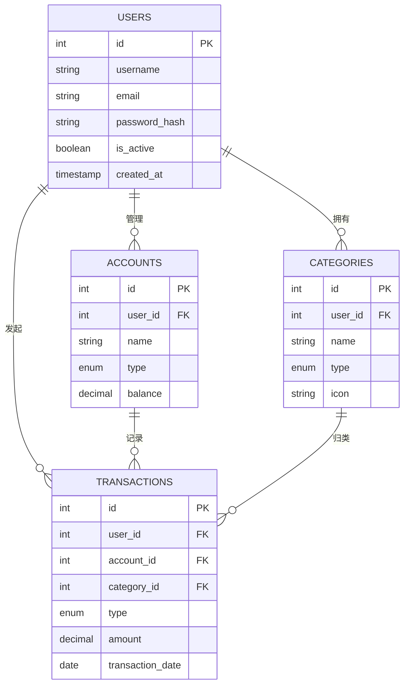

## 🔍 CRUD 操作

### INSERT - 插入数据

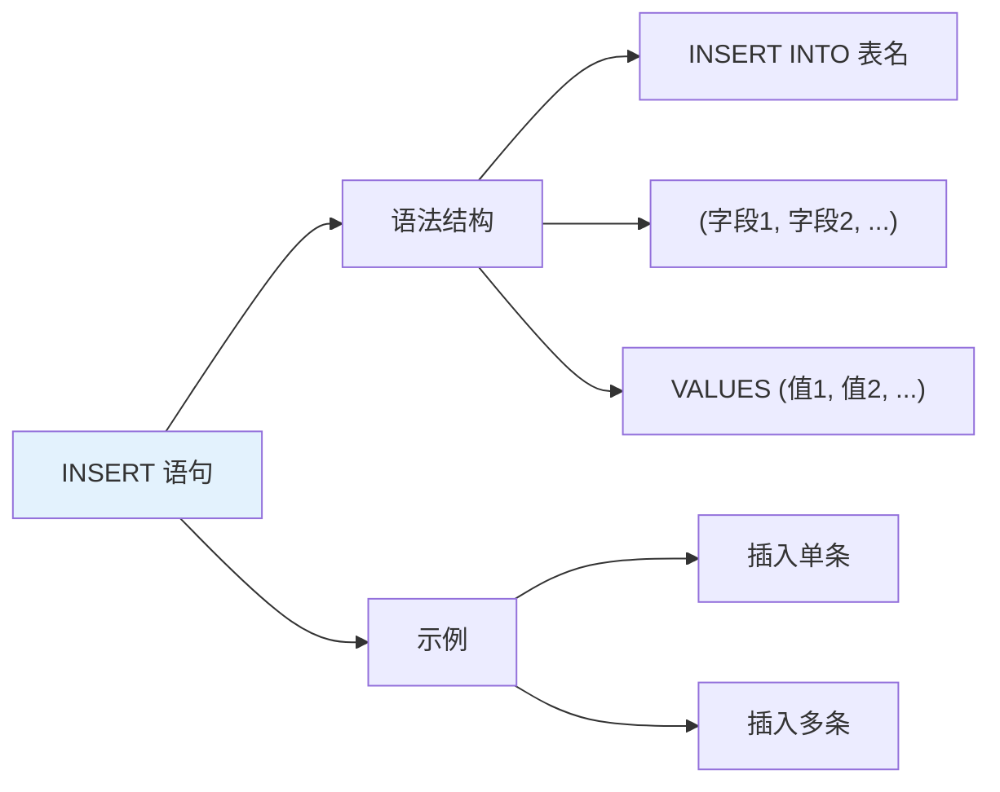

```sql
-- 插入用户
INSERT INTO users (username, email, password_hash)
VALUES ('zhangsan', 'zhang@example.com', 'hashed_password_here');

-- 插入分类
INSERT INTO categories (user_id, name, type, icon, color)
VALUES (1, '餐饮', 'expense', '🍜', '#FF6B6B');

-- 插入账户
INSERT INTO accounts (user_id, name, type, balance)
VALUES (1, '现金钱包', 'cash', 100.00);

-- 插入交易
INSERT INTO transactions (user_id, account_id, category_id, type, amount, note, transaction_date)
VALUES (1, 1, 1, 'expense', 50.00, '午餐', '2024-01-15');

-- 插入多条数据
INSERT INTO categories (user_id, name, type) VALUES
(1, '交通', 'expense'),
(1, '购物', 'expense'),
(1, '工资', 'income'),
(1, '奖金', 'income');
```

### SELECT - 查询数据

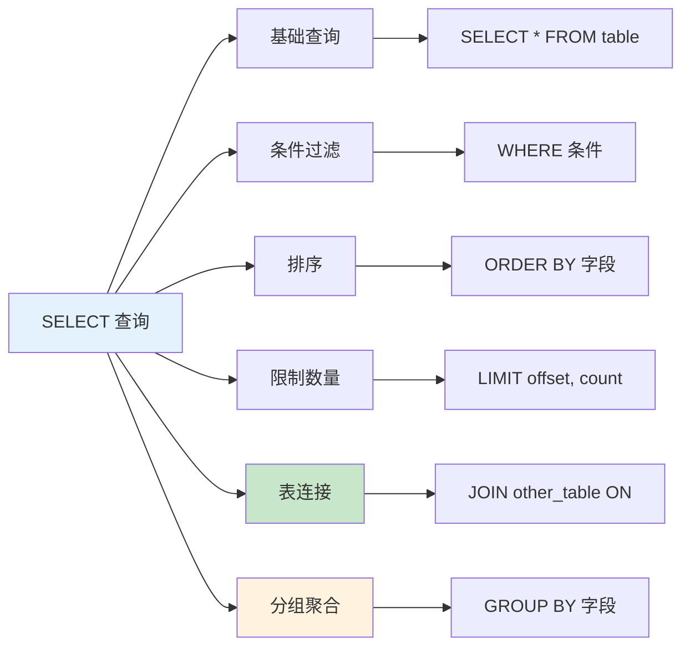

```sql
-- 基础查询
SELECT * FROM users;
SELECT id, username, email FROM users;

-- 条件过滤
SELECT * FROM transactions WHERE user_id = 1;
SELECT * FROM transactions WHERE amount > 100;
SELECT * FROM transactions WHERE transaction_date >= '2024-01-01';

-- 复杂条件
SELECT * FROM transactions
WHERE user_id = 1
  AND type = 'expense'
  AND amount BETWEEN 50 AND 200
  AND transaction_date >= '2024-01-01';

-- 排序
SELECT * FROM transactions
WHERE user_id = 1
ORDER BY transaction_date DESC, amount DESC;

-- 限制数量（分页）
SELECT * FROM transactions
WHERE user_id = 1
ORDER BY transaction_date DESC
LIMIT 10 OFFSET 0;  -- 第一页，每页10条

-- 表连接
SELECT
    t.id,
    t.amount,
    t.note,
    a.name AS account_name,
    c.name AS category_name
FROM transactions t
JOIN accounts a ON t.account_id = a.id
JOIN categories c ON t.category_id = c.id
WHERE t.user_id = 1;

-- 分组统计
SELECT
    c.name AS category,
    COUNT(*) AS count,
    SUM(t.amount) AS total
FROM transactions t
JOIN categories c ON t.category_id = c.id
WHERE t.user_id = 1 AND t.type = 'expense'
GROUP BY c.id
ORDER BY total DESC;
```

### UPDATE - 更新数据

```sql
-- 更新单个字段
UPDATE accounts
SET balance = balance + 100
WHERE id = 1;

-- 更新多个字段
UPDATE transactions
SET note = '更新后的备注',
    amount = 99.99
WHERE id = 1 AND user_id = 1;

-- 转账操作（更新两个账户）
-- 先扣钱
UPDATE accounts
SET balance = balance - 100
WHERE id = 1 AND balance >= 100;

-- 再加钱
UPDATE accounts
SET balance = balance + 100
WHERE id = 2;
```

### DELETE - 删除数据

```sql
-- 删除单条记录
DELETE FROM transactions
WHERE id = 1 AND user_id = 1;

-- 条件删除
DELETE FROM transactions
WHERE user_id = 1
  AND transaction_date < '2023-01-01';

-- 注意：外键约束可能阻止删除
-- 如果 accounts 被交易引用，需要先删除交易
DELETE FROM transactions WHERE account_id = 1;
DELETE FROM accounts WHERE id = 1;
```

## 🔗 表连接（JOIN）

### 连接类型对比


### JOIN 实例

```sql
-- INNER JOIN：只返回匹配的记录
SELECT
    t.id,
    t.amount,
    a.name AS account
FROM transactions t
INNER JOIN accounts a ON t.account_id = a.id
WHERE t.user_id = 1;

-- LEFT JOIN：返回左表所有记录，右表不匹配的为 NULL
SELECT
    c.id,
    c.name,
    COUNT(t.id) AS transaction_count
FROM categories c
LEFT JOIN transactions t ON c.id = t.category_id
WHERE c.user_id = 1
GROUP BY c.id;

-- 多表连接
SELECT
    t.id AS transaction_id,
    t.amount,
    t.note,
    a.name AS account_name,
    c.name AS category_name,
    u.username AS user_name
FROM transactions t
JOIN accounts a ON t.account_id = a.id
JOIN categories c ON t.category_id = c.id
JOIN users u ON t.user_id = u.id
WHERE t.id = 1;
```

## 📈 聚合与分组

### 聚合函数

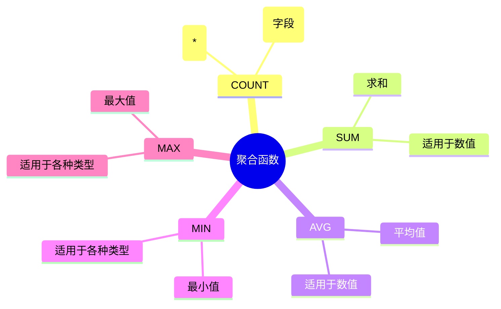

```sql
-- 统计用户交易数量
SELECT
    COUNT(*) AS total,
    COUNT(DISTINCT category_id) AS categories_used
FROM transactions
WHERE user_id = 1;

-- 统计总收支
SELECT
    type,
    COUNT(*) AS count,
    SUM(amount) AS total_amount,
    AVG(amount) AS avg_amount,
    MAX(amount) AS max_amount,
    MIN(amount) AS min_amount
FROM transactions
WHERE user_id = 1
GROUP BY type;

-- 按分类统计
SELECT
    c.name AS category,
    COUNT(*) AS count,
    SUM(t.amount) AS total
FROM transactions t
JOIN categories c ON t.category_id = c.id
WHERE t.user_id = 1 AND t.type = 'expense'
GROUP BY c.id, c.name
ORDER BY total DESC;

-- 按月统计
SELECT
    DATE_FORMAT(transaction_date, '%Y-%m') AS month,
    type,
    COUNT(*) AS count,
    SUM(amount) AS total
FROM transactions
WHERE user_id = 1
GROUP BY month, type
ORDER BY month DESC, type;
```

## 🔐 事务处理

### 事务概念

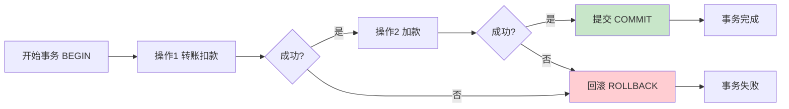

### 事务使用

```sql
-- 开始事务
BEGIN;

-- 操作1：扣钱
UPDATE accounts
SET balance = balance - 100
WHERE id = 1 AND balance >= 100;

-- 检查是否成功
SELECT ROW_COUNT();  -- 应该返回 1

-- 操作2：加钱
UPDATE accounts
SET balance = balance + 100
WHERE id = 2;

-- 记录交易
INSERT INTO transactions (user_id, account_id, category_id, type, amount, transaction_date)
VALUES (1, 1, 1, 'transfer', 100.00, CURDATE());

-- 如果都成功，提交
COMMIT;

-- 如果任何操作失败，回滚
-- ROLLBACK;
```

### 事务 ACID 特性

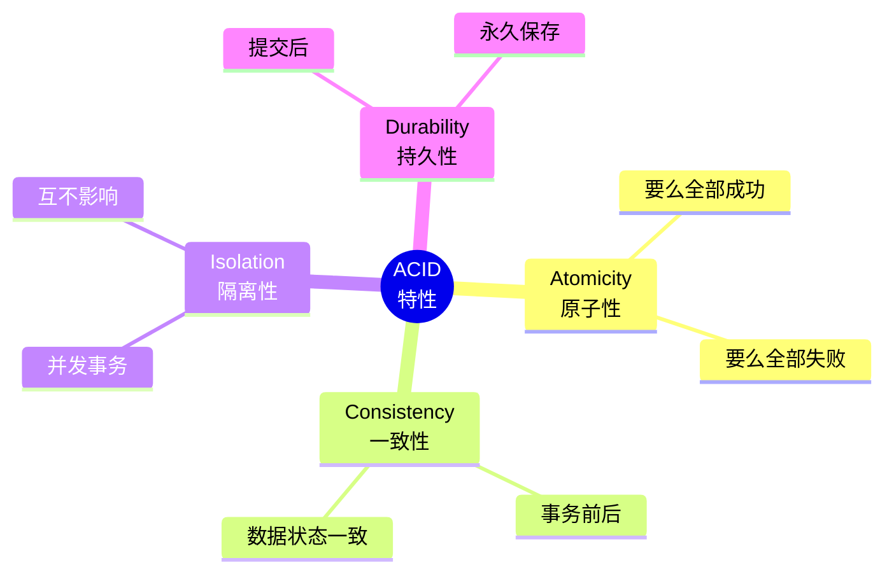

## 📝 练习任务

### 基础练习

1. **创建表**
   ```sql
   -- 创建一个 tags 标签表，用于给交易添加标签
   -- 字段：id, name, color, created_at
   ```

2. **查询练习**
   ```sql
   -- 查询 2024 年 1 月的所有支出
   -- 查询金额最高的 10 笔交易
   -- 统计每个账户的交易次数和总金额
   ```

### 进阶练习

3. **复杂查询**
   ```sql
   -- 查询每个分类在每月的支出趋势
   -- 查询本月比上月支出增加的分类
   ```

4. **事务练习**
   ```sql
   -- 实现账户转账的完整事务
   -- 包含余额检查、扣款、加款、记录日志
   ```

## ✅ 检查点

完成本章学习后，你应该能够：

- [ ] 理解数据库和表的基本概念
- [ ] 使用 CREATE TABLE 创建表结构
- [ ] 执行 INSERT、SELECT、UPDATE、DELETE 操作
- [ ] 使用 JOIN 连接多个表
- [ ] 使用 GROUP BY 进行分组统计
- [ ] 理解事务的 ACID 特性
- [ ] 设计简单的数据库表结构

## 🤔 常见问题

### Q1: CHAR 和 VARCHAR 有什么区别？

**A**:
- **CHAR**: 固定长度，不足用空格填充，速度快但占用空间
- **VARCHAR**: 可变长度，只占用实际长度，节省空间

```sql
name CHAR(10)   -- "abc"     -> "abc       " (占用10字节)
name VARCHAR(10) -- "abc"     -> "abc"       (占用3+2字节)
```

### Q2: 什么时候用 INT，什么时候用 BIGINT？

**A**:
| 类型 | 范围 | 说明 |
|------|------|------|
| TINYINT | -128 到 127 | 小整数，状态码 |
| INT | -21亿 到 21亿 | 常用ID |
| BIGINT | 极大数值 | 大数据量ID |

### Q3: PRIMARY KEY 和 UNIQUE 有什么区别？

**A**:
- **PRIMARY KEY**: 主键，每表只能有一个，不允许 NULL
- **UNIQUE**: 唯一键，可以有多个，允许一个 NULL

## 📚 延伸阅读

- **SQL 教程**：[https://www.w3schools.com/sql/](https://www.w3schools.com/sql/)
- **MySQL 文档**：[https://dev.mysql.com/doc/](https://dev.mysql.com/doc/)
- **PostgreSQL 文档**：[https://www.postgresql.org/docs/](https://www.postgresql.org/docs/)

---

**上一章**：[02-FastAPI框架/05-RESTful接口设计.md](../02-FastAPI框架/05-RESTful接口设计.md) - 学习 RESTful API 设计

**下一章**：[02-SQLAlchemy-ORM.md](./02-SQLAlchemy-ORM.md) - 学习使用 Python 操作数据库
