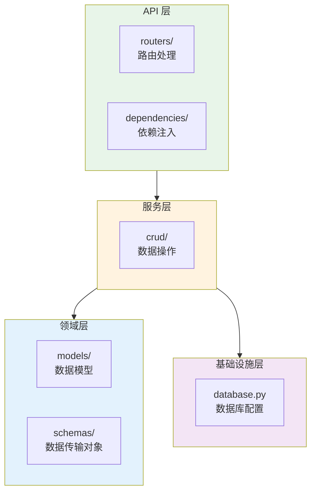
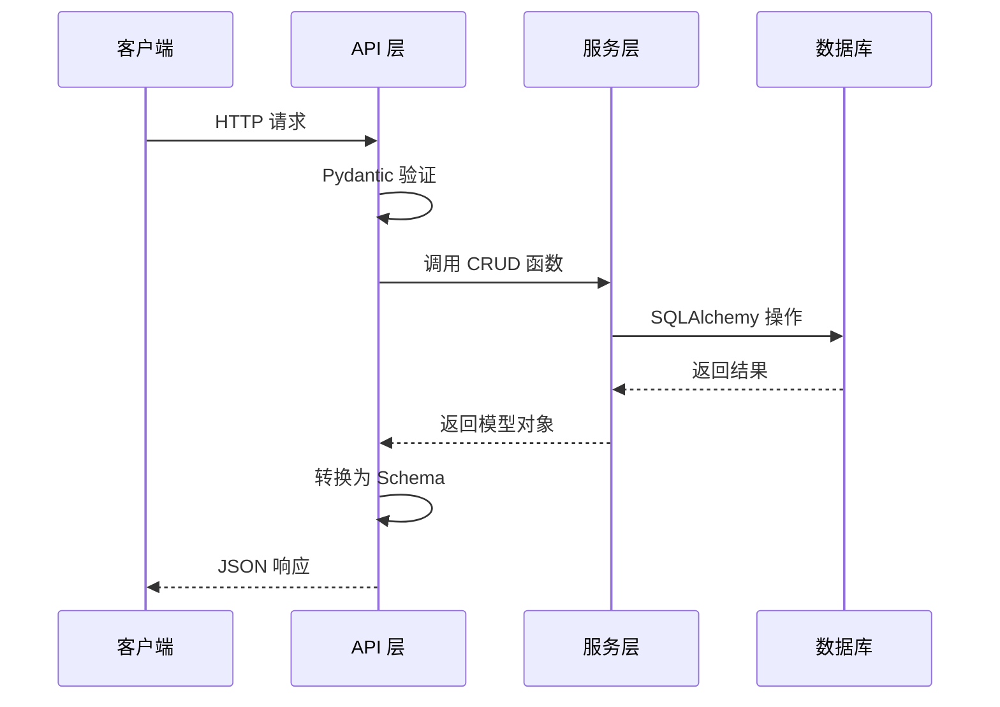
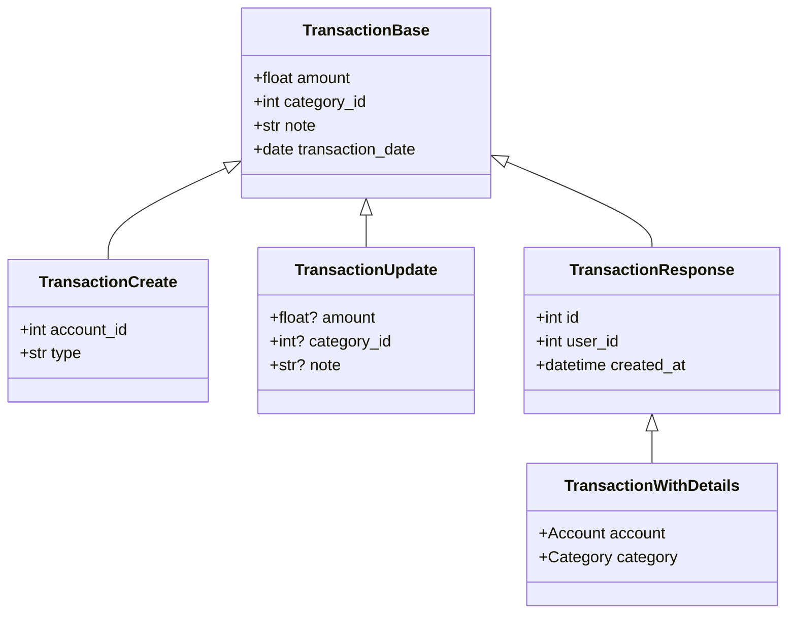
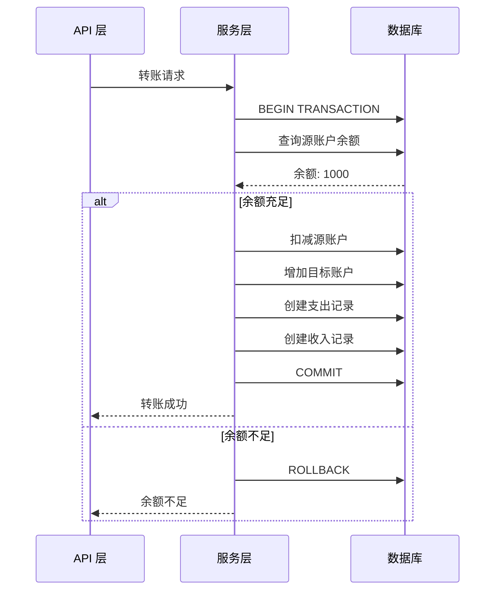

# 完整 CRUD 实现

> 将 FastAPI、Pydantic 和 SQLAlchemy 结合，实现记账系统核心功能

## 📋 本章目标

- [ ] 理解分层架构设计
- [ ] 实现 CRUD 操作函数
- [ ] 创建完整的 API 端点
- [ ] 掌握事务处理技巧

## 🏗️ 分层架构

### 项目结构



### 数据流向



## 📁 项目结构

```
app/
├── main.py                    # 应用入口
├── database.py                # 数据库配置
├── models/                    # SQLAlchemy 模型
│   ├── __init__.py
│   ├── user.py
│   ├── account.py
│   ├── category.py
│   └── transaction.py
├── schemas/                   # Pydantic 模型
│   ├── __init__.py
│   ├── user.py
│   ├── account.py
│   ├── category.py
│   └── transaction.py
├── crud/                      # CRUD 操作
│   ├── __init__.py
│   ├── base.py
│   ├── user.py
│   ├── account.py
│   ├── category.py
│   └── transaction.py
├── routers/                   # API 路由
│   ├── __init__.py
│   ├── users.py
│   ├── accounts.py
│   ├── categories.py
│   └── transactions.py
└── dependencies/              # 依赖项
    ├── __init__.py
    ├── auth.py
    └── database.py
```

## 📊 Pydantic Schema 定义

### Schema 继承结构



### 交易 Schema 实现

```python
# schemas/transaction.py
from pydantic import BaseModel, Field, ConfigDict
from typing import Optional, List
from datetime import datetime, date
from enum import Enum

class TransactionType(str, Enum):
    INCOME = "income"
    EXPENSE = "expense"
    TRANSFER = "transfer"

# 基础 Schema
class TransactionBase(BaseModel):
    amount: float = Field(..., gt=0, description="交易金额")
    category_id: int = Field(..., description="分类ID")
    note: str = Field(default="", max_length=200, description="备注")
    transaction_date: date = Field(..., description="交易日期")

# 创建请求
class TransactionCreate(TransactionBase):
    account_id: int = Field(..., description="账户ID")
    type: TransactionType = Field(
        default=TransactionType.EXPENSE,
        description="交易类型"
    )
    tag_ids: List[int] = Field(default_factory=list, description="标签ID列表")

# 更新请求
class TransactionUpdate(BaseModel):
    model_config = ConfigDict(extra='forbid')

    amount: Optional[float] = Field(None, gt=0)
    category_id: Optional[int] = None
    account_id: Optional[int] = None
    note: Optional[str] = Field(None, max_length=200)
    transaction_date: Optional[date] = None
    tag_ids: Optional[List[int]] = None

# 响应 Schema
class TransactionResponse(TransactionBase):
    model_config = ConfigDict(from_attributes=True)

    id: int
    user_id: int
    account_id: int
    type: TransactionType
    created_at: datetime
    updated_at: Optional[datetime] = None

# 带详情的响应
class AccountBrief(BaseModel):
    model_config = ConfigDict(from_attributes=True)
    id: int
    name: str
    type: str

class CategoryBrief(BaseModel):
    model_config = ConfigDict(from_attributes=True)
    id: int
    name: str
    icon: str

class TransactionWithDetails(TransactionResponse):
    """包含关联信息的交易详情"""
    account: AccountBrief
    category: CategoryBrief

# 列表响应
class TransactionListResponse(BaseModel):
    data: List[TransactionWithDetails]
    total: int
    page: int
    page_size: int
    total_pages: int

# 统计响应
class TransactionStats(BaseModel):
    """交易统计"""
    total_income: float
    total_expense: float
    balance: float
    transaction_count: int
    by_category: dict
```

## 🔧 CRUD 操作实现

### 基础 CRUD 类

```python
# crud/base.py
from typing import Generic, TypeVar, Optional, List, Any
from sqlalchemy.orm import Session
from sqlalchemy import select
from pydantic import BaseModel

ModelType = TypeVar("ModelType")
CreateSchemaType = TypeVar("CreateSchemaType", bound=BaseModel)
UpdateSchemaType = TypeVar("UpdateSchemaType", bound=BaseModel)

class CRUDBase(Generic[ModelType, CreateSchemaType, UpdateSchemaType]):
    """CRUD 基类，提供通用操作"""

    def __init__(self, model: type[ModelType]):
        self.model = model

    def get(self, db: Session, id: int) -> Optional[ModelType]:
        """根据 ID 获取"""
        return db.get(self.model, id)

    def get_multi(
        self,
        db: Session,
        *,
        skip: int = 0,
        limit: int = 100,
        order_by: Any = None
    ) -> List[ModelType]:
        """获取列表"""
        stmt = select(self.model)
        if order_by is not None:
            stmt = stmt.order_by(order_by)
        stmt = stmt.offset(skip).limit(limit)
        return list(db.scalars(stmt).all())

    def create(self, db: Session, *, obj_in: CreateSchemaType) -> ModelType:
        """创建"""
        db_obj = self.model(**obj_in.model_dump())
        db.add(db_obj)
        db.commit()
        db.refresh(db_obj)
        return db_obj

    def update(
        self,
        db: Session,
        *,
        db_obj: ModelType,
        obj_in: UpdateSchemaType
    ) -> ModelType:
        """更新"""
        update_data = obj_in.model_dump(exclude_unset=True)
        for field, value in update_data.items():
            setattr(db_obj, field, value)
        db.commit()
        db.refresh(db_obj)
        return db_obj

    def delete(self, db: Session, *, id: int) -> bool:
        """删除"""
        obj = db.get(self.model, id)
        if obj:
            db.delete(obj)
            db.commit()
            return True
        return False
```

### 交易 CRUD 实现

```python
# crud/transaction.py
from typing import List, Optional
from sqlalchemy.orm import Session, selectinload
from sqlalchemy import select, func, and_, or_
from datetime import date
from decimal import Decimal

from crud.base import CRUDBase
from models.transaction import Transaction, TransactionType
from schemas.transaction import TransactionCreate, TransactionUpdate

class CRUDTransaction(CRUDBase[Transaction, TransactionCreate, TransactionUpdate]):
    """交易 CRUD 操作"""

    def get_with_details(self, db: Session, id: int) -> Optional[Transaction]:
        """获取交易（包含关联信息）"""
        stmt = (
            select(Transaction)
            .options(
                selectinload(Transaction.account),
                selectinload(Transaction.category),
                selectinload(Transaction.tags)
            )
            .where(Transaction.id == id)
        )
        return db.scalar(stmt)

    def get_by_user(
        self,
        db: Session,
        *,
        user_id: int,
        account_id: Optional[int] = None,
        category_id: Optional[int] = None,
        transaction_type: Optional[TransactionType] = None,
        start_date: Optional[date] = None,
        end_date: Optional[date] = None,
        min_amount: Optional[Decimal] = None,
        max_amount: Optional[Decimal] = None,
        keyword: Optional[str] = None,
        skip: int = 0,
        limit: int = 20
    ) -> tuple[List[Transaction], int]:
        """
        获取用户交易列表（支持多条件筛选）

        返回: (交易列表, 总数)
        """
        # 基础查询
        stmt = (
            select(Transaction)
            .options(
                selectinload(Transaction.account),
                selectinload(Transaction.category)
            )
            .where(Transaction.user_id == user_id)
        )

        # 统计查询
        count_stmt = (
            select(func.count())
            .select_from(Transaction)
            .where(Transaction.user_id == user_id)
        )

        # 条件筛选
        conditions = []

        if account_id:
            conditions.append(Transaction.account_id == account_id)
        if category_id:
            conditions.append(Transaction.category_id == category_id)
        if transaction_type:
            conditions.append(Transaction.type == transaction_type)
        if start_date:
            conditions.append(Transaction.transaction_date >= start_date)
        if end_date:
            conditions.append(Transaction.transaction_date <= end_date)
        if min_amount is not None:
            conditions.append(Transaction.amount >= min_amount)
        if max_amount is not None:
            conditions.append(Transaction.amount <= max_amount)
        if keyword:
            conditions.append(Transaction.note.contains(keyword))

        if conditions:
            stmt = stmt.where(and_(*conditions))
            count_stmt = count_stmt.where(and_(*conditions))

        # 排序
        stmt = stmt.order_by(Transaction.transaction_date.desc(), Transaction.id.desc())

        # 分页
        stmt = stmt.offset(skip).limit(limit)

        # 执行
        transactions = list(db.scalars(stmt).all())
        total = db.scalar(count_stmt) or 0

        return transactions, total

    def create_with_tags(
        self,
        db: Session,
        *,
        obj_in: TransactionCreate,
        user_id: int,
        tag_ids: List[int] = None
    ) -> Transaction:
        """创建交易（带标签）"""
        from models.tag import Tag

        # 创建交易
        transaction_data = obj_in.model_dump(exclude={'tag_ids'})
        transaction = Transaction(**transaction_data, user_id=user_id)

        # 添加标签
        if tag_ids:
            tags = db.scalars(
                select(Tag).where(Tag.id.in_(tag_ids), Tag.user_id == user_id)
            ).all()
            transaction.tags = list(tags)

        db.add(transaction)
        db.commit()
        db.refresh(transaction)

        # 更新账户余额
        self._update_account_balance(db, transaction)

        return transaction

    def _update_account_balance(self, db: Session, transaction: Transaction):
        """更新账户余额"""
        from models.account import Account

        account = db.get(Account, transaction.account_id)
        if account:
            if transaction.type == TransactionType.INCOME:
                account.balance += Decimal(str(transaction.amount))
            elif transaction.type == TransactionType.EXPENSE:
                account.balance -= Decimal(str(transaction.amount))
            db.commit()

    def get_stats(
        self,
        db: Session,
        *,
        user_id: int,
        start_date: Optional[date] = None,
        end_date: Optional[date] = None
    ) -> dict:
        """获取交易统计"""
        # 基础条件
        conditions = [Transaction.user_id == user_id]
        if start_date:
            conditions.append(Transaction.transaction_date >= start_date)
        if end_date:
            conditions.append(Transaction.transaction_date <= end_date)

        # 总体统计
        stmt = (
            select(
                Transaction.type,
                func.sum(Transaction.amount).label('total'),
                func.count().label('count')
            )
            .where(and_(*conditions))
            .group_by(Transaction.type)
        )
        results = db.execute(stmt).all()

        stats = {
            'total_income': Decimal('0'),
            'total_expense': Decimal('0'),
            'transaction_count': 0,
            'by_category': {}
        }

        for row in results:
            if row.type == TransactionType.INCOME:
                stats['total_income'] = row.total or Decimal('0')
            elif row.type == TransactionType.EXPENSE:
                stats['total_expense'] = row.total or Decimal('0')
            stats['transaction_count'] += row.count

        stats['balance'] = stats['total_income'] - stats['total_expense']

        # 按分类统计
        from models.category import Category

        category_stmt = (
            select(
                Category.name,
                Transaction.type,
                func.sum(Transaction.amount).label('total')
            )
            .join(Transaction, Category.id == Transaction.category_id)
            .where(and_(*conditions))
            .group_by(Category.id, Transaction.type)
        )
        category_results = db.execute(category_stmt).all()

        for row in category_results:
            key = f"{row.type}_{row.name}"
            stats['by_category'][key] = float(row.total or 0)

        return stats

    def delete_and_reverse(self, db: Session, *, id: int, user_id: int) -> bool:
        """删除交易并回滚账户余额"""
        transaction = db.scalar(
            select(Transaction).where(
                Transaction.id == id,
                Transaction.user_id == user_id
            )
        )

        if not transaction:
            return False

        # 回滚账户余额
        from models.account import Account

        account = db.get(Account, transaction.account_id)
        if account:
            if transaction.type == TransactionType.INCOME:
                account.balance -= Decimal(str(transaction.amount))
            elif transaction.type == TransactionType.EXPENSE:
                account.balance += Decimal(str(transaction.amount))

        db.delete(transaction)
        db.commit()
        return True

# 实例化
transaction_crud = CRUDTransaction(Transaction)
```

## 🌐 API 路由实现

### 交易路由

```python
# routers/transactions.py
from fastapi import APIRouter, Depends, HTTPException, Query, status
from sqlalchemy.orm import Session
from typing import Optional
from datetime import date
from decimal import Decimal

from dependencies.database import get_db
from dependencies.auth import get_current_user
from models.user import User
from crud.transaction import transaction_crud
from schemas.transaction import (
    TransactionCreate,
    TransactionUpdate,
    TransactionResponse,
    TransactionWithDetails,
    TransactionListResponse,
    TransactionStats
)

router = APIRouter(prefix="/transactions", tags=["交易管理"])

@router.get("", response_model=TransactionListResponse)
def list_transactions(
    # 筛选参数
    account_id: Optional[int] = Query(None, description="账户ID"),
    category_id: Optional[int] = Query(None, description="分类ID"),
    type: Optional[str] = Query(None, description="交易类型"),
    start_date: Optional[date] = Query(None, description="开始日期"),
    end_date: Optional[date] = Query(None, description="结束日期"),
    min_amount: Optional[float] = Query(None, ge=0, description="最小金额"),
    max_amount: Optional[float] = Query(None, ge=0, description="最大金额"),
    keyword: Optional[str] = Query(None, max_length=50, description="搜索关键词"),
    # 分页
    page: int = Query(1, ge=1, description="页码"),
    page_size: int = Query(20, ge=1, le=100, description="每页数量"),
    # 依赖
    db: Session = Depends(get_db),
    current_user: User = Depends(get_current_user)
):
    """
    获取交易列表

    支持多条件筛选和分页
    """
    skip = (page - 1) * page_size

    # 转换交易类型
    transaction_type = None
    if type:
        try:
            transaction_type = TransactionType(type)
        except ValueError:
            raise HTTPException(400, "无效的交易类型")

    transactions, total = transaction_crud.get_by_user(
        db,
        user_id=current_user.id,
        account_id=account_id,
        category_id=category_id,
        transaction_type=transaction_type,
        start_date=start_date,
        end_date=end_date,
        min_amount=Decimal(str(min_amount)) if min_amount else None,
        max_amount=Decimal(str(max_amount)) if max_amount else None,
        keyword=keyword,
        skip=skip,
        limit=page_size
    )

    return TransactionListResponse(
        data=[TransactionWithDetails.model_validate(t) for t in transactions],
        total=total,
        page=page,
        page_size=page_size,
        total_pages=(total + page_size - 1) // page_size
    )

@router.post("", response_model=TransactionResponse, status_code=status.HTTP_201_CREATED)
def create_transaction(
    transaction_in: TransactionCreate,
    db: Session = Depends(get_db),
    current_user: User = Depends(get_current_user)
):
    """
    创建交易记录

    创建后自动更新账户余额
    """
    # 验证账户归属
    from models.account import Account
    account = db.get(Account, transaction_in.account_id)
    if not account or account.user_id != current_user.id:
        raise HTTPException(400, "无效的账户")

    # 验证分类归属
    from models.category import Category
    category = db.get(Category, transaction_in.category_id)
    if not category or category.user_id != current_user.id:
        raise HTTPException(400, "无效的分类")

    transaction = transaction_crud.create_with_tags(
        db,
        obj_in=transaction_in,
        user_id=current_user.id,
        tag_ids=transaction_in.tag_ids
    )

    return TransactionResponse.model_validate(transaction)

@router.get("/stats", response_model=TransactionStats)
def get_transaction_stats(
    start_date: Optional[date] = Query(None, description="开始日期"),
    end_date: Optional[date] = Query(None, description="结束日期"),
    db: Session = Depends(get_db),
    current_user: User = Depends(get_current_user)
):
    """
    获取交易统计

    返回收入、支出、余额等统计数据
    """
    return transaction_crud.get_stats(
        db,
        user_id=current_user.id,
        start_date=start_date,
        end_date=end_date
    )

@router.get("/{transaction_id}", response_model=TransactionWithDetails)
def get_transaction(
    transaction_id: int,
    db: Session = Depends(get_db),
    current_user: User = Depends(get_current_user)
):
    """获取交易详情"""
    transaction = transaction_crud.get_with_details(db, id=transaction_id)

    if not transaction:
        raise HTTPException(404, "交易记录不存在")

    if transaction.user_id != current_user.id:
        raise HTTPException(403, "无权访问此记录")

    return TransactionWithDetails.model_validate(transaction)

@router.put("/{transaction_id}", response_model=TransactionResponse)
def update_transaction(
    transaction_id: int,
    transaction_in: TransactionUpdate,
    db: Session = Depends(get_db),
    current_user: User = Depends(get_current_user)
):
    """更新交易记录"""
    transaction = transaction_crud.get(db, id=transaction_id)

    if not transaction:
        raise HTTPException(404, "交易记录不存在")

    if transaction.user_id != current_user.id:
        raise HTTPException(403, "无权修改此记录")

    # TODO: 处理账户余额变更

    transaction = transaction_crud.update(db, db_obj=transaction, obj_in=transaction_in)
    return TransactionResponse.model_validate(transaction)

@router.delete("/{transaction_id}", status_code=status.HTTP_204_NO_CONTENT)
def delete_transaction(
    transaction_id: int,
    db: Session = Depends(get_db),
    current_user: User = Depends(get_current_user)
):
    """
    删除交易记录

    删除后自动回滚账户余额
    """
    success = transaction_crud.delete_and_reverse(
        db,
        id=transaction_id,
        user_id=current_user.id
    )

    if not success:
        raise HTTPException(404, "交易记录不存在")

    return None
```

## 🔄 事务处理

### 转账功能实现



```python
# services/transfer.py
from sqlalchemy.orm import Session
from fastapi import HTTPException
from decimal import Decimal
from datetime import date

from models.account import Account
from models.transaction import Transaction, TransactionType

class TransferService:
    """转账服务"""

    @staticmethod
    def transfer(
        db: Session,
        *,
        user_id: int,
        from_account_id: int,
        to_account_id: int,
        amount: float,
        note: str = ""
    ) -> tuple[Transaction, Transaction]:
        """
        执行转账

        返回: (支出交易, 收入交易)
        """
        amount_decimal = Decimal(str(amount))

        # 验证账户
        from_account = db.get(Account, from_account_id)
        to_account = db.get(Account, to_account_id)

        if not from_account or from_account.user_id != user_id:
            raise HTTPException(400, "源账户无效")
        if not to_account or to_account.user_id != user_id:
            raise HTTPException(400, "目标账户无效")
        if from_account_id == to_account_id:
            raise HTTPException(400, "不能转到同一账户")

        # 检查余额
        if from_account.balance < amount_decimal:
            raise HTTPException(400, "余额不足")

        try:
            # 更新账户余额
            from_account.balance -= amount_decimal
            to_account.balance += amount_decimal

            # 创建交易记录
            today = date.today()

            expense_transaction = Transaction(
                user_id=user_id,
                account_id=from_account_id,
                to_account_id=to_account_id,
                type=TransactionType.TRANSFER,
                amount=amount_decimal,
                note=f"转出: {note}",
                transaction_date=today
            )

            income_transaction = Transaction(
                user_id=user_id,
                account_id=to_account_id,
                type=TransactionType.TRANSFER,
                amount=amount_decimal,
                note=f"转入: {note}",
                transaction_date=today
            )

            db.add(expense_transaction)
            db.add(income_transaction)
            db.commit()

            db.refresh(expense_transaction)
            db.refresh(income_transaction)

            return expense_transaction, income_transaction

        except Exception as e:
            db.rollback()
            raise HTTPException(500, f"转账失败: {str(e)}")
```

## 📝 练习任务

1. **完善账户 CRUD**
   - 实现账户创建时设置默认账户
   - 实现账户余额计算

2. **添加批量操作**
   - 批量导入交易
   - 批量删除交易

3. **实现月度结算**
   - 每月自动生成账单
   - 预算对比分析

## ✅ 检查点

- [ ] 理解分层架构设计
- [ ] 掌握 Pydantic Schema 设计
- [ ] 实现完整的 CRUD 操作
- [ ] 创建 RESTful API 端点
- [ ] 掌握事务处理技巧
- [ ] 理解关联查询和预加载

---

**上一章**：[03-数据模型设计.md](./03-数据模型设计.md) - 学习数据模型设计

**下一章**：进入 [04-后端思维递进](../04-后端思维递进/) 学习后端进阶知识
