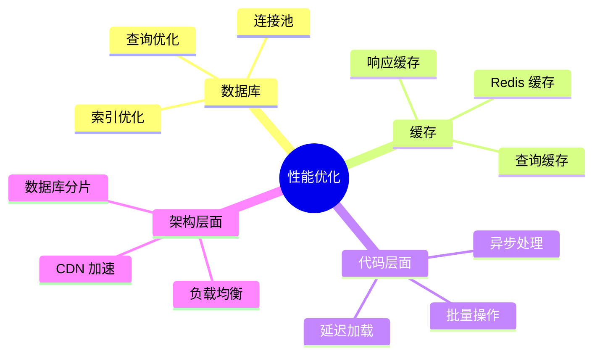
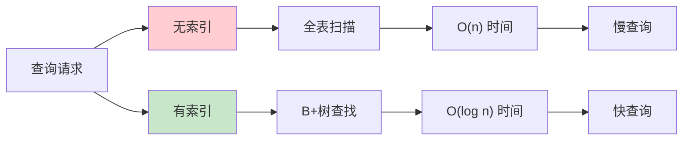
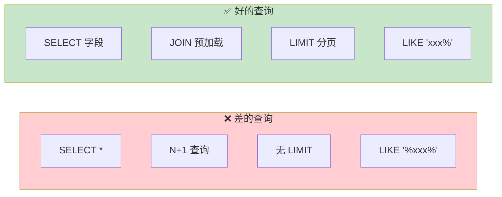
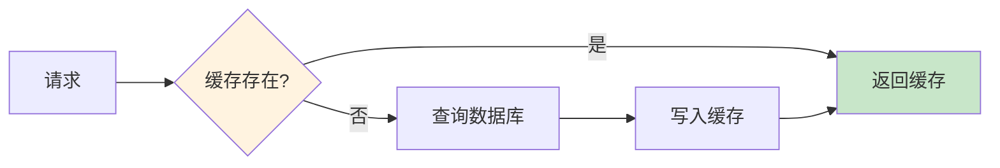
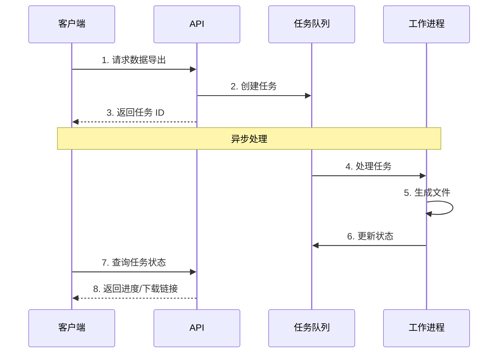

# 性能优化实践

> 让记账系统更快、更稳定，处理大量数据游刃有余

## 📋 本章目标

- [ ] 识别性能瓶颈
- [ ] 掌握数据库优化技巧
- [ ] 实现缓存策略
- [ ] 优化 API 响应速度

## 🎯 性能优化方向



## 🗄️ 数据库优化

### 索引策略



### 索引使用示例

```python
# models/transaction.py
from sqlalchemy import Index

class Transaction(Base):
    __tablename__ = "transactions"

    id: Mapped[int] = mapped_column(primary_key=True)
    user_id: Mapped[int] = mapped_column(index=True)  # 单列索引
    transaction_date: Mapped[date] = mapped_column(index=True)

    # 复合索引
    __table_args__ = (
        # 用户+日期复合索引（常用于按用户查询日期范围）
        Index('ix_transactions_user_date', 'user_id', 'transaction_date'),

        # 用户+类型+日期（常用于筛选统计）
        Index('ix_transactions_user_type_date', 'user_id', 'type', 'transaction_date'),

        # 覆盖索引（包含常用查询字段）
        Index('ix_transactions_covering', 'user_id', 'transaction_date', 'amount'),
    )
```

### 查询优化



```python
# crud/transaction.py
from sqlalchemy.orm import selectinload, joinedload
from sqlalchemy import select, func

class CRUDTransaction:

    def get_with_optimization(self, db: Session, transaction_id: int):
        """优化的查询：使用 JOIN 预加载"""
        stmt = (
            select(Transaction)
            .options(
                # 使用 joinedload 一次性加载关联数据
                joinedload(Transaction.account),
                joinedload(Transaction.category),
                selectinload(Transaction.tags)
            )
            .where(Transaction.id == transaction_id)
        )
        return db.scalar(stmt)

    def get_list_optimized(self, db: Session, user_id: int, skip: int, limit: int):
        """优化的列表查询"""
        # 只查询需要的字段
        stmt = (
            select(
                Transaction.id,
                Transaction.amount,
                Transaction.transaction_date,
                Transaction.note,
                Account.name.label('account_name'),
                Category.name.label('category_name')
            )
            .join(Account, Transaction.account_id == Account.id)
            .join(Category, Transaction.category_id == Category.id)
            .where(Transaction.user_id == user_id)
            .order_by(Transaction.transaction_date.desc())
            .offset(skip)
            .limit(limit)
        )
        return db.execute(stmt).all()

    def count_optimized(self, db: Session, user_id: int):
        """优化的计数：不加载实体"""
        stmt = select(func.count()).select_from(Transaction).where(
            Transaction.user_id == user_id
        )
        return db.scalar(stmt)
```

## 📦 Redis 缓存

### 缓存策略



### Redis 配置

```python
# core/cache.py
import redis
import json
from typing import Optional, Any
from datetime import timedelta
from functools import wraps

# Redis 连接
redis_client = redis.Redis(
    host='localhost',
    port=6379,
    db=0,
    decode_responses=True
)

class CacheService:
    """缓存服务"""

    @staticmethod
    def get(key: str) -> Optional[Any]:
        """获取缓存"""
        value = redis_client.get(key)
        if value:
            return json.loads(value)
        return None

    @staticmethod
    def set(key: str, value: Any, expire: int = 300):
        """设置缓存"""
        redis_client.setex(
            key,
            expire,
            json.dumps(value, ensure_ascii=False)
        )

    @staticmethod
    def delete(key: str):
        """删除缓存"""
        redis_client.delete(key)

    @staticmethod
    def delete_pattern(pattern: str):
        """删除匹配的缓存"""
        keys = redis_client.keys(pattern)
        if keys:
            redis_client.delete(*keys)

# 缓存装饰器
def cache_result(key_prefix: str, expire: int = 300):
    """缓存结果装饰器"""
    def decorator(func):
        @wraps(func)
        def wrapper(*args, **kwargs):
            # 生成缓存键
            cache_key = f"{key_prefix}:{':'.join(map(str, args))}"

            # 尝试获取缓存
            cached = CacheService.get(cache_key)
            if cached is not None:
                return cached

            # 执行函数
            result = func(*args, **kwargs)

            # 存入缓存
            CacheService.set(cache_key, result, expire)

            return result
        return wrapper
    return decorator
```

### 缓存使用示例

```python
# crud/stats.py
from core.cache import CacheService, cache_result

class StatsService:
    """统计服务"""

    @cache_result(key_prefix="user_stats", expire=60)
    def get_user_stats(self, db: Session, user_id: int) -> dict:
        """
        获取用户统计（带缓存）

        缓存 60 秒
        """
        # 复杂的统计查询
        stmt = select(
            func.sum(Transaction.amount).label('total'),
            func.count().label('count')
        ).where(Transaction.user_id == user_id)

        result = db.execute(stmt).first()

        return {
            'total': float(result.total or 0),
            'count': result.count
        }

    def invalidate_user_cache(self, user_id: int):
        """清除用户缓存"""
        CacheService.delete(f"user_stats:{user_id}")
        CacheService.delete_pattern(f"transactions:{user_id}:*")
```

## ⚡ 异步处理

### 异步架构



### Celery 任务队列

```python
# tasks/export.py
from celery import Celery
from datetime import datetime

# Celery 配置
celery_app = Celery(
    'bookkeeping',
    broker='redis://localhost:6379/1',
    backend='redis://localhost:6379/2'
)

@celery_app.task(bind=True)
def export_transactions_task(self, user_id: int, start_date: str, end_date: str):
    """
    异步导出交易记录

    使用 bind=True 可以访问 self 更新任务状态
    """
    from database import SessionLocal
    from crud.transaction import transaction_crud

    db = SessionLocal()

    try:
        # 更新进度
        self.update_state(state='PROGRESS', meta={'progress': 0})

        # 获取数据
        transactions, total = transaction_crud.get_by_user(
            db,
            user_id=user_id,
            start_date=datetime.strptime(start_date, '%Y-%m-%d').date(),
            end_date=datetime.strptime(end_date, '%Y-%m-%d').date(),
            limit=10000
        )

        self.update_state(state='PROGRESS', meta={'progress': 50})

        # 生成文件
        import pandas as pd
        df = pd.DataFrame([t.__dict__ for t in transactions])
        file_path = f'/tmp/export_{user_id}_{datetime.now().timestamp()}.xlsx'
        df.to_excel(file_path, index=False)

        self.update_state(state='PROGRESS', meta={'progress': 100})

        return {
            'status': 'SUCCESS',
            'file_path': file_path,
            'total': total
        }

    except Exception as e:
        self.update_state(state='FAILURE', meta={'error': str(e)})
        raise

    finally:
        db.close()

# API 端点
@router.post("/transactions/export")
async def request_export(
    export_data: ExportRequest,
    current_user: User = Depends(get_current_user)
):
    """请求导出（异步）"""
    task = export_transactions_task.delay(
        current_user.id,
        export_data.start_date,
        export_data.end_date
    )
    return {"task_id": task.id}

@router.get("/tasks/{task_id}")
async def get_task_status(task_id: str):
    """查询任务状态"""
    task = celery_app.AsyncResult(task_id)

    if task.state == 'PENDING':
        return {'status': 'pending'}
    elif task.state == 'PROGRESS':
        return {'status': 'processing', 'progress': task.info.get('progress', 0)}
    elif task.state == 'SUCCESS':
        return {'status': 'completed', 'result': task.info}
    else:
        return {'status': 'failed', 'error': str(task.info)}
```

## 📊 性能监控

### 响应时间监控

```python
# middleware/monitoring.py
import time
from fastapi import Request, Response
from starlette.middleware.base import BaseHTTPMiddleware

class PerformanceMiddleware(BaseHTTPMiddleware):
    """性能监控中间件"""

    async def dispatch(self, request: Request, call_next):
        start_time = time.time()

        response = await call_next(request)

        process_time = (time.time() - start_time) * 1000

        # 添加响应头
        response.headers["X-Process-Time"] = f"{process_time:.2f}ms"

        # 记录慢请求
        if process_time > 1000:  # 超过 1 秒
            logger.warning(
                f"慢请求: {request.method} {request.url} "
                f"耗时: {process_time:.2f}ms"
            )

        return response
```

### 数据库查询监控

```python
# database.py
from sqlalchemy import event
from sqlalchemy.engine import Engine
import time

# 慢查询阈值（秒）
SLOW_QUERY_THRESHOLD = 0.5

@event.listens_for(Engine, "before_cursor_execute")
def before_cursor_execute(conn, cursor, statement, parameters, context, executemany):
    conn.info.setdefault('query_start_time', []).append(time.time())

@event.listens_for(Engine, "after_cursor_execute")
def after_cursor_execute(conn, cursor, statement, parameters, context, executemany):
    total_time = time.time() - conn.info['query_start_time'].pop(-1)

    if total_time > SLOW_QUERY_THRESHOLD:
        logger.warning(
            f"慢查询 ({total_time:.2f}s): {statement}\n"
            f"参数: {parameters}"
        )
```

## 📝 练习任务

1. **优化统计接口** - 使用缓存减少数据库查询
2. **实现批量导入** - 使用异步任务处理大量数据
3. **添加监控面板** - 可视化性能指标

## ✅ 检查点

- [ ] 理解索引的作用和使用场景
- [ ] 掌握查询优化技巧
- [ ] 实现缓存策略
- [ ] 理解异步处理场景

---

**下一章**：[03-安全防护实践.md](./03-安全防护实践.md)
