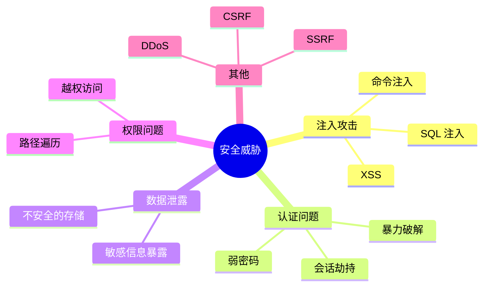
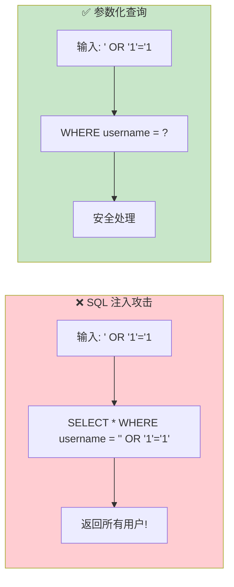
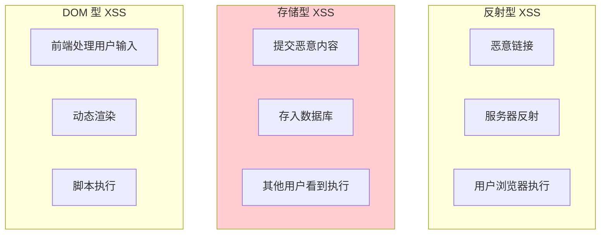
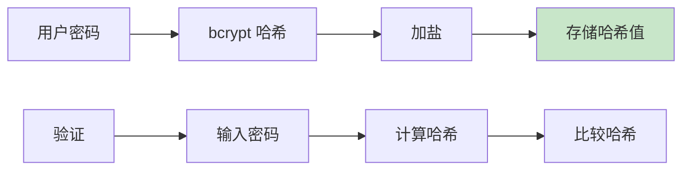
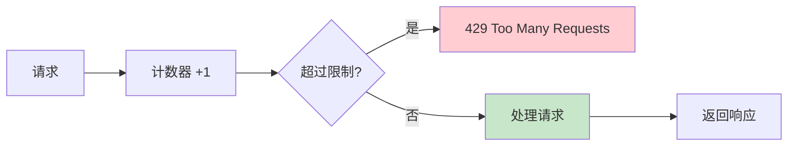

# 安全防护实践

> 构建安全的记账系统，保护用户数据不受威胁

## 📋 本章目标

- [ ] 理解常见 Web 安全威胁
- [ ] 实现输入验证和过滤
- [ ] 掌握 API 安全最佳实践
- [ ] 保护敏感数据

## 🛡️ 常见安全威胁



## 🔒 SQL 注入防护

### 攻击原理



### SQLAlchemy 防护

```python
# ✅ 安全：SQLAlchemy 自动参数化
stmt = select(User).where(User.username == username)
user = db.scalar(stmt)

# ✅ 安全：使用参数绑定
stmt = text("SELECT * FROM users WHERE username = :username")
result = db.execute(stmt, {"username": username})

# ❌ 危险：字符串拼接（不要这样做！）
# stmt = text(f"SELECT * FROM users WHERE username = '{username}'")
```

## 🚫 XSS 防护

### XSS 攻击类型



### 防护措施

```python
# schemas/transaction.py
from pydantic import BaseModel, field_validator
import re
from html import escape

class TransactionCreate(BaseModel):
    note: str = ""

    @field_validator('note')
    @classmethod
    def sanitize_note(cls, v: str) -> str:
        """清理备注中的 HTML 标签"""
        # 移除 HTML 标签
        v = re.sub(r'<[^>]+>', '', v)
        # 转义特殊字符
        v = escape(v)
        return v

# 也可以在前端层面做内容安全策略 (CSP)
# Content-Security-Policy: default-src 'self'
```

## 🔐 敏感数据保护

### 密码存储



```python
# core/security.py
from passlib.context import CryptContext

pwd_context = CryptContext(
    schemes=["bcrypt"],
    deprecated="auto",
    bcrypt__rounds=12  # 增加计算成本
)

def get_password_hash(password: str) -> str:
    """生成密码哈希"""
    return pwd_context.hash(password)

def verify_password(plain_password: str, hashed_password: str) -> bool:
    """验证密码"""
    return pwd_context.verify(plain_password, hashed_password)
```

### 敏感配置保护

```python
# config.py
from pydantic_settings import BaseSettings
from functools import lru_cache

class Settings(BaseSettings):
    """应用配置"""

    # 从环境变量读取敏感信息
    SECRET_KEY: str
    DATABASE_URL: str
    REDIS_URL: str

    # 非敏感配置
    APP_NAME: str = "记账系统"
    DEBUG: bool = False

    class Config:
        env_file = ".env"
        case_sensitive = True

@lru_cache()
def get_settings() -> Settings:
    return Settings()
```

## 🛡️ API 安全

### 速率限制



```python
# middleware/rate_limit.py
from fastapi import Request, HTTPException, status
from fastapi.responses import JSONResponse
from collections import defaultdict
import time

class RateLimiter:
    """简单的速率限制器"""

    def __init__(self, requests_per_minute: int = 60):
        self.requests_per_minute = requests_per_minute
        self.requests = defaultdict(list)

    def is_allowed(self, client_id: str) -> bool:
        """检查是否允许请求"""
        now = time.time()
        minute_ago = now - 60

        # 清理过期记录
        self.requests[client_id] = [
            t for t in self.requests[client_id] if t > minute_ago
        ]

        # 检查数量
        if len(self.requests[client_id]) >= self.requests_per_minute:
            return False

        self.requests[client_id].append(now)
        return True

rate_limiter = RateLimiter(requests_per_minute=60)

async def rate_limit_middleware(request: Request, call_next):
    """速率限制中间件"""
    # 获取客户端标识（IP 或用户 ID）
    client_id = request.client.host
    if hasattr(request.state, 'user'):
        client_id = str(request.state.user.id)

    if not rate_limiter.is_allowed(client_id):
        return JSONResponse(
            status_code=status.HTTP_429_TOO_MANY_REQUESTS,
            content={"detail": "请求过于频繁，请稍后再试"}
        )

    return await call_next(request)
```

### 输入验证

```python
# schemas/user.py
from pydantic import BaseModel, Field, field_validator
import re

class UserCreate(BaseModel):
    username: str = Field(..., min_length=3, max_length=20)
    password: str = Field(..., min_length=8, max_length=100)
    email: str = Field(..., max_length=100)

    @field_validator('username')
    @classmethod
    def validate_username(cls, v: str) -> str:
        """验证用户名格式"""
        if not re.match(r'^[a-zA-Z0-9_]+$', v):
            raise ValueError('用户名只能包含字母、数字和下划线')
        return v.lower()

    @field_validator('password')
    @classmethod
    def validate_password(cls, v: str) -> str:
        """验证密码强度"""
        if not re.search(r'[A-Z]', v):
            raise ValueError('密码必须包含大写字母')
        if not re.search(r'[a-z]', v):
            raise ValueError('密码必须包含小写字母')
        if not re.search(r'\d', v):
            raise ValueError('密码必须包含数字')
        return v

    @field_validator('email')
    @classmethod
    def validate_email(cls, v: str) -> str:
        """验证邮箱格式"""
        pattern = r'^[a-zA-Z0-9._%+-]+@[a-zA-Z0-9.-]+\.[a-zA-Z]{2,}$'
        if not re.match(pattern, v):
            raise ValueError('无效的邮箱格式')
        return v.lower()
```

## 🔒 HTTPS 和安全头

### 安全响应头

```python
# middleware/security_headers.py
from fastapi import Request
from starlette.middleware.base import BaseHTTPMiddleware

class SecurityHeadersMiddleware(BaseHTTPMiddleware):
    """安全响应头中间件"""

    async def dispatch(self, request: Request, call_next):
        response = await call_next(request)

        # 防止 MIME 类型嗅探
        response.headers["X-Content-Type-Options"] = "nosniff"

        # 防止点击劫持
        response.headers["X-Frame-Options"] = "DENY"

        # XSS 保护
        response.headers["X-XSS-Protection"] = "1; mode=block"

        # 内容安全策略
        response.headers["Content-Security-Policy"] = (
            "default-src 'self'; "
            "script-src 'self'; "
            "style-src 'self' 'unsafe-inline'; "
            "img-src 'self' data:; "
            "font-src 'self';"
        )

        # HSTS（仅 HTTPS）
        response.headers["Strict-Transport-Security"] = (
            "max-age=31536000; includeSubDomains"
        )

        return response
```

## 📝 练习任务

1. **实现密码强度检查** - 添加密码强度指示器
2. **添加登录失败锁定** - 多次失败后锁定账户
3. **实现审计日志** - 记录敏感操作

## ✅ 检查点

- [ ] 理解常见 Web 安全威胁
- [ ] 实现输入验证
- [ ] 保护敏感数据
- [ ] 实现速率限制
- [ ] 配置安全响应头

---

**下一章**：[04-代码重构与可维护性.md](./04-代码重构与可维护性.md)
