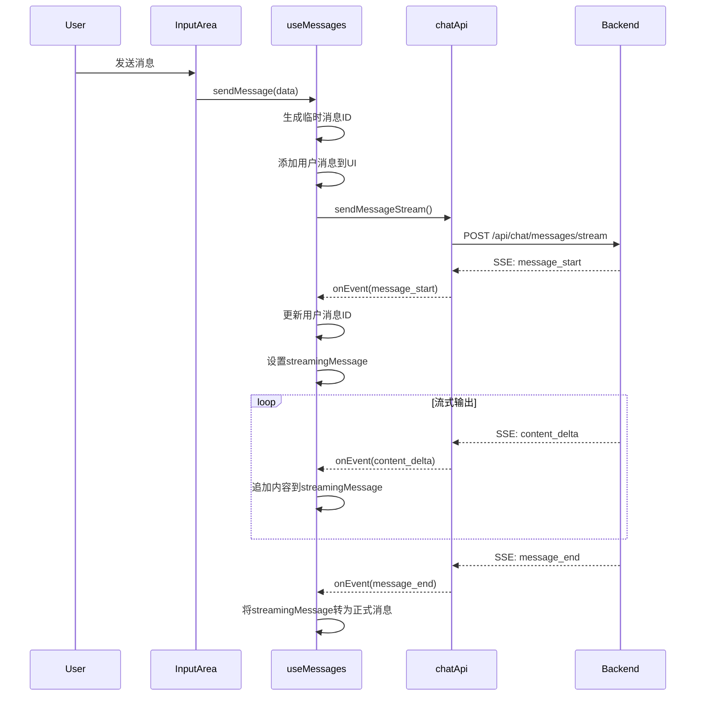

# AI Chat 模块设计文档

> **目标读者**: 前端开发者、架构师
> **技术栈**: React + TypeScript + Ant Design + Context API + SSE
> **文档版本**: v1.0
> **更新日期**: 2026-03-05

---

## 1. 概述

### 1.1 模块定位

AI Chat 模块是一个基于 React 的聊天界面，支持与 AI 模型进行实时对话，采用 SSE (Server-Sent Events) 实现流式响应，提供流畅的用户体验。

### 1.2 核心特性

| 特性 | 描述 | 状态 |
|------|------|------|
| 流式响应 | 基于 SSE 的实时 AI 回复输出 | ✅ |
| 多会话管理 | 支持创建、切换、删除会话 | ✅ |
| 消息历史 | 分页加载消息历史记录 | ✅ |
| 模型选择 | 支持切换不同的 AI 模型 | ✅ |
| 停止生成 | 支持中断 AI 响应生成 | ✅ |
| 重新生成 | 支持重新生成上一条消息 | ✅ |
| 思考过程 | 支持 Reasoner 模型的深度思考展示 | ✅ |
| 标签管理 | 支持为会话添加标签 | ✅ |
| 置顶会话 | 支持置顶重要会话 | ✅ |

---

## 2. Hooks 设计详解

### 2.1 useChatActions.ts 整体架构

`useChatActions.ts` 是聊天模块的核心 Hooks 层，采用**职责分离**原则，将不同功能域拆分为独立的 Hooks：

```
useChatActions.ts
├── useConversations()      # 会话管理
├── useMessages()           # 消息操作（含流式响应）
├── useTags()               # 标签管理
├── useModels()             # 模型配置
└── useChatUI()             # UI 状态
```

**设计优势**：
- ✅ 按功能域拆分，降低耦合度
- ✅ 每个 Hook 可独立使用
- ✅ 统一使用 Context 进行状态管理
- ✅ 支持灵活组合使用

### 2.2 useConversations - 会话管理 Hook

**文件位置**: `frontend/src/pages/chat/hooks/useChatActions.ts:24-121`

#### 2.2.1 职责

负责会话的 CRUD 操作，包括会话列表获取、创建、更新、删除和置顶。

#### 2.2.2 返回值接口

```typescript
interface UseConversationsReturn {
  // 状态
  conversationsLoading: boolean;
  conversationsError: string | null;

  // 方法
  fetchConversations: (params?: FetchParams) => Promise<void>;
  createConversation: (data: CreateConversationRequest) => Promise<Conversation | null>;
  updateConversation: (data: UpdateConversationRequest) => Promise<void>;
  deleteConversations: (conversationIds: string[]) => Promise<void>;
  togglePin: (conversationId: string, isPinned: boolean) => Promise<void>;
  setCurrentConversation: (conversationId: string | null) => void;
}
```

#### 2.2.3 核心方法详解

##### fetchConversations

获取会话列表，支持分页和筛选。

| 参数 | 类型 | 说明 |
|------|------|------|
| params.title? | string | 按标题搜索 |
| params.modelId? | string | 按模型筛选 |
| params.isPinned? | boolean | 按置顶状态筛选 |
| params.tagId? | number | 按标签筛选 |
| params.pageNum? | number | 页码 |
| params.pageSize? | number | 每页数量 |

**处理逻辑**：
```typescript
// 1. 设置加载状态
dispatch({ type: 'SET_CONVERSATIONS_LOADING', payload: true });

// 2. 调用 API
const res = await chatApi.fetchConversations(params);

// 3. 处理后端字段映射（下划线转驼峰）
const conversations = res.rows || res.data?.rows || [];

// 4. 更新状态
dispatch({ type: 'SET_CONVERSATIONS', payload: conversations });
```

**AI Chat 需求匹配**：✅ 满足会话列表展示需求

##### createConversation

创建新会话，返回完整的会话对象。

**特点**：
- 自动处理后端字段映射（`conversation_id` → `conversationId`）
- 自动将新会话添加到列表头部
- 返回的会话对象可用于直接切换

```typescript
const conversation: Conversation = {
  conversationId: res.data.conversationId || res.data.conversation_id,
  title: res.data.title,
  modelId: res.data.modelId || res.data.model_id,
  isPinned: res.data.isPinned || res.data.is_pinned || false,
  tagList: res.data.tagList || res.data.tag_list || [],
  // ... 更多字段
};
```

**AI Chat 需求匹配**：✅ 满足新建对话需求

##### togglePin

切换会话置顶状态，完成后自动刷新列表。

**AI Chat 需求匹配**：✅ 满足会话置顶需求

#### 2.2.4 状态管理

使用 Context + Reducer 模式：

| Action Type | Payload | 效果 |
|-------------|---------|------|
| SET_CONVERSATIONS | Conversation[] | 替换整个列表 |
| ADD_CONVERSATION | Conversation | 添加到列表头部 |
| UPDATE_CONVERSATION | Conversation | 更新指定会话 |
| REMOVE_CONVERSATION | string[] | 批量删除会话 |
| SET_CURRENT_CONVERSATION | string \| null | 设置当前会话 ID |

---

### 2.3 useMessages - 消息操作 Hook（核心）

**文件位置**: `frontend/src/pages/chat/hooks/useChatActions.ts:128-363`

#### 2.3.1 职责

负责消息的获取、发送、流式响应处理、停止生成和重新生成。

#### 2.3.2 返回值接口

```typescript
interface UseMessagesReturn {
  // 状态
  streamingMessage: Message | null;  // 当前正在生成的消息
  isStreaming: boolean;              // 是否正在生成

  // 方法
  fetchMessages: (conversationId: string, beforeMessageId?: string) => Promise<MessageListResult>;
  sendMessage: (data: SendMessageRequest, onEvent?: (event: SSEEvent) => void) => CancelFn;
  stopGeneration: () => Promise<void>;
  regenerate: (messageId: string, modelId?: string) => CancelFn;
}
```

#### 2.3.3 SSE 事件处理流程



#### 2.3.4 SSE 事件类型处理

| 事件类型 | 数据字段 | 处理逻辑 |
|---------|---------|---------|
| `message_start` | userMessageId, assistantMessageId, conversationId | 更新临时消息ID，初始化流式消息 |
| `content_delta` | content | 追加到 `streamingMessage.content` |
| `thinking_start` | - | 初始化 `thinkingContent` |
| `thinking_delta` | content | 追加到 `streamingMessage.thinkingContent` |
| `thinking_end` | - | 标记思考结束 |
| `message_end` | messageId, tokensUsed | 将流式消息转为正式消息，添加到列表 |
| `error` | code, message | 标记错误状态 |

**代码实现**：
```typescript
switch (event.type) {
  case 'message_start':
    // 更新临时用户消息ID为后端返回的实际ID
    dispatch({
      type: 'UPDATE_MESSAGE_ID',
      payload: {
        conversationId: targetConversationId,
        oldMessageId: tempId,
        newMessageId: event.data.userMessageId,
      },
    });
    // 设置流式AI消息
    dispatch({
      type: 'SET_STREAMING_MESSAGE',
      payload: {
        messageId: event.data.assistantMessageId,
        conversationId: event.data.conversationId,
        role: 'assistant',
        content: '',
        isStreaming: true,
      } as Message,
    });
    break;

  case 'content_delta':
    dispatch({ type: 'APPEND_STREAMING_CONTENT', payload: event.data.content });
    break;

  case 'message_end':
    // 将流式消息转为正式消息
    const completedMessage: Message = {
      ...streamingMessage,
      content: streamingMessage.content,
      tokensUsed: event.data.tokensUsed,
      isStreaming: false,
    };
    dispatch({
      type: 'ADD_MESSAGE',
      payload: { conversationId: targetConversationId, message: completedMessage },
    });
    dispatch({ type: 'SET_STREAMING_MESSAGE', payload: null });
    dispatch({ type: 'SET_IS_STREAMING', payload: false });
    break;
}
```

**AI Chat 需求匹配**：✅ 完全满足流式 AI 聊天需求

#### 2.3.5 sendMessage 方法设计

**临时消息 ID 机制**：

```typescript
// 1. 生成前端临时 ID
const tempId = `temp-${Date.now()}-${Math.random().toString(36).substring(2, 9)}`;

// 2. 立即显示用户消息
const userMessage: Message = {
  messageId: tempId,  // 临时 ID
  conversationId: targetConversationId,
  role: 'user',
  content: data.content,
  createTime: new Date().toISOString(),
};
dispatch({ type: 'ADD_MESSAGE', payload: { conversationId: targetConversationId, message: userMessage } });

// 3. 等待后端返回真实 ID 后更新
case 'message_start':
  dispatch({
    type: 'UPDATE_MESSAGE_ID',
    payload: {
      conversationId: targetConversationId,
      oldMessageId: tempId,
      newMessageId: event.data.userMessageId,  // 后端返回的真实 ID
    },
  });
```

**取消机制**：

```typescript
return cancelStream;  // 返回取消函数
```

调用方可调用返回的函数来取消正在进行的流式请求。

**AI Chat 需求匹配**：✅ 满足消息发送和取消需求

#### 2.3.6 stopGeneration 方法

停止正在生成的消息：

```typescript
const stopGeneration = useCallback(async () => {
  if (streamingMessage) {
    try {
      await chatApi.stopMessageGeneration(streamingMessage.messageId);
    } catch (error) {
      console.error('Failed to stop generation:', error);
    }
  }
  dispatch({ type: 'SET_IS_STREAMING', payload: false });
  dispatch({ type: 'SET_STREAMING_MESSAGE', payload: null });
}, [streamingMessage, dispatch]);
```

**AI Chat 需求匹配**：✅ 满足停止生成需求

#### 2.3.7 regenerate 方法

重新生成指定消息的回复：

```typescript
const regenerate = useCallback(async (messageId: string, modelId?: string) => {
  const cancelStream = chatApi.regenerateMessageStream(
    messageId,
    modelId,
    (event) => {
      // SSE 事件处理（与 sendMessage 类似）
    }
  );
  return cancelStream;
}, [currentConversationId, dispatch, streamingMessage]);
```

**AI Chat 需求匹配**：✅ 满足重新生成需求

---

### 2.4 useTags - 标签管理 Hook

**文件位置**: `frontend/src/pages/chat/hooks/useChatActions.ts:370-418`

#### 2.4.1 职责

管理会话标签的 CRUD 操作。

#### 2.4.2 返回值接口

```typescript
interface UseTagsReturn {
  tags: Tag[];
  fetchTags: () => Promise<void>;
  createTag: (tagName: string, tagColor?: string) => Promise<Tag>;
  deleteTags: (tagIds: string[]) => Promise<void>;
}
```

**AI Chat 需求匹配**：✅ 满足标签管理需求

---

### 2.5 useModels - 模型配置 Hook

**文件位置**: `frontend/src/pages/chat/hooks/useChatActions.ts:425-473`

#### 2.5.1 职责

管理 AI 模型选择和模型参数配置。

#### 2.5.2 返回值接口

```typescript
interface UseModelsReturn {
  models: Model[];
  currentModelId: string;
  modelConfig: Record<string, ModelConfig>;
  setCurrentModel: (modelId: string) => void;
  fetchModelConfig: (modelId: string) => Promise<ModelConfig>;
  saveModelConfig: (config: ModelConfig) => Promise<void>;
}
```

**AI Chat 需求匹配**：✅ 满足模型选择和配置需求

---

### 2.6 useChatUI - UI 状态 Hook

**文件位置**: `frontend/src/pages/chat/hooks/useChatActions.ts:480-526`

#### 2.6.1 职责

管理 UI 相关状态，如 Toast 通知、侧边栏状态。

#### 2.6.2 返回值接口

```typescript
interface UseChatUIReturn {
  toasts: Toast[];
  sidebarCollapsed: boolean;
  sidebarVisible: boolean;
  showToast: (type, message, duration?) => void;
  removeToast: (id: string) => void;
  toggleSidebar: () => void;
  setSidebarVisible: (visible: boolean) => void;
}
```

**AI Chat 需求匹配**：✅ 满足 UI 状态管理需求

---

## 3. 状态管理设计

### 3.1 ChatContext 架构

**文件位置**: `frontend/src/pages/chat/context/ChatContext.tsx`

#### 3.1.1 状态结构

```typescript
interface ChatState {
  // 模型相关
  models: Model[];
  currentModelId: string;
  modelConfig: Record<string, ModelConfig>;

  // 会话相关
  conversations: Conversation[];
  currentConversationId: string | null;
  currentConversation: ConversationDetail | null;
  conversationsLoading: boolean;
  conversationsError: string | null;

  // 消息相关
  messages: Record<string, Message[]>;  // 按会话 ID 分组存储
  messagesLoading: Record<string, boolean>;
  streamingMessage: Message | null;
  isStreaming: boolean;

  // 标签相关
  tags: Tag[];

  // 文件相关
  files: ChatFile[];

  // 用户设置
  userSettings: UserSettings | null;

  // UI 状态
  toasts: Toast[];
  sidebarCollapsed: boolean;
  sidebarVisible: boolean;
}
```

#### 3.1.2 Reducer 模式

采用 Redux-style 的 Reducer 模式：

```typescript
type ChatAction =
  | { type: 'SET_CONVERSATIONS'; payload: Conversation[] }
  | { type: 'ADD_CONVERSATION'; payload: Conversation }
  | { type: 'SET_STREAMING_MESSAGE'; payload: Message | null }
  | { type: 'APPEND_STREAMING_CONTENT'; payload: string }
  // ... 30+ 种 action 类型

function chatReducer(state: ChatState, action: ChatAction): ChatState {
  switch (action.type) {
    case 'SET_CONVERSATIONS':
      return { ...state, conversations: action.payload };
    case 'APPEND_STREAMING_CONTENT':
      return {
        ...state,
        streamingMessage: state.streamingMessage
          ? { ...state.streamingMessage, content: state.streamingMessage.content + action.payload }
          : null,
      };
    // ...
  }
}
```

**设计优势**：
- ✅ 集中式状态管理
- ✅ 可预测的状态更新
- ✅ 易于调试（Redux DevTools 兼容）
- ✅ 类型安全（TypeScript）

### 3.2 消息存储策略

消息按会话 ID 分组存储：

```typescript
messages: {
  "123": [Message, Message, ...],
  "456": [Message, Message, ...],
}
```

**优势**：
- ✅ 支持快速切换会话
- ✅ 避免重复请求历史消息
- ✅ 支持多会话并发操作

---

## 4. 组件架构

### 4.1 组件树

```
ChatPage
└── ChatProvider (Context)
    └── ChatPageContent
        ├── ChatHeader (顶部导航栏)
        ├── Sidebar (侧边栏)
        │   └── ConversationList (会话列表)
        │       └── TagList (标签筛选)
        └── ChatArea (聊天区域)
            ├── MessageList (消息列表)
            │   ├── MessageBubble (消息气泡)
            │   ├── MarkdownRenderer (Markdown 渲染)
            │   └── StopGenerationButton (停止生成按钮)
            └── InputArea (输入区域)
                └── ModelSelector (模型选择器)
```

### 4.2 组件职责

| 组件 | 职责 | 使用的 Hook |
|------|------|------------|
| ChatPage | 页面入口，提供 Context | - |
| ChatHeader | 顶部导航，模型切换 | useModels, useChatUI |
| Sidebar | 侧边栏容器 | useChatUI |
| ConversationList | 会话列表展示和操作 | useConversations |
| ChatArea | 聊天区域容器 | useMessages, useConversations |
| MessageList | 消息列表渲染 | useMessages |
| InputArea | 消息输入和发送 | useMessages, useModels |

---

## 5. 类型系统设计

**文件位置**: `frontend/src/pages/chat/types/index.ts`

### 5.1 核心类型

```typescript
// 消息角色
type MessageRole = 'user' | 'assistant' | 'system';

// 模型类型
type ModelType = 'chat' | 'reasoner';

// SSE 事件类型
type SSEEventType =
  | 'message_start'
  | 'content_delta'
  | 'thinking_start'
  | 'thinking_delta'
  | 'thinking_end'
  | 'message_end'
  | 'message_stopped'
  | 'error';

// 消息接口
interface Message {
  messageId: string;
  conversationId: string;
  role: MessageRole;
  content: string;
  thinkingContent?: string;  // Reasoner 模型思考内容
  tokensUsed?: number;
  attachments: Attachment[];
  createTime: string;
  isStreaming?: boolean;
  hasError?: boolean;
}
```

### 5.2 类型安全保证

- ✅ 所有 API 请求/响应都有类型定义
- ✅ SSE 事件有严格的类型约束
- ✅ Context 和 Reducer 完全类型化
- ✅ 组件 Props 有完整类型定义

---

## 6. API 服务层设计

**文件位置**: `frontend/src/pages/chat/services/chatApi.ts`

### 6.1 API 分组

| 分类 | 方法 | 说明 |
|------|------|------|
| 模型管理 | fetchModels, fetchModelConfig, saveModelConfig | 获取和配置模型 |
| 会话管理 | fetchConversations, createConversation, updateConversation, deleteConversation | 会话 CRUD |
| 标签管理 | fetchTags, createTag, deleteTag | 标签 CRUD |
| 消息管理 | fetchMessages, sendMessageStream, stopMessageGeneration, regenerateMessageStream | 消息操作 |
| 文件管理 | uploadFile, fetchFiles, deleteFile | 文件上传管理 |

### 6.2 流式请求处理

```typescript
export const sendMessageStream = (
  data: SendMessageRequest,
  onEvent: (event: SSEEvent) => void,
  onError?: (error: Error) => void,
  onComplete?: () => void,
): (() => void) => {
  const url = `${baseURL}/api/chat/messages/stream`;

  return streamRequest({
    url,
    method: 'POST',
    body: data,
    onEvent,
    onError,
    onComplete,
  });
};
```

**返回值**：取消函数，用于中断请求。

---

## 7. AI Chat 需求满足度分析

### 7.1 功能需求对照

| 需求 | 实现位置 | 状态 |
|------|---------|------|
| 发送消息 | useMessages.sendMessage | ✅ |
| 流式响应展示 | useMessages + SSE 事件处理 | ✅ |
| 停止生成 | useMessages.stopGeneration | ✅ |
| 重新生成 | useMessages.regenerate | ✅ |
| 多会话管理 | useConversations | ✅ |
| 会话切换 | useConversations.setCurrentConversation | ✅ |
| 消息历史 | useMessages.fetchMessages | ✅ |
| 模型选择 | useModels.setCurrentModel | ✅ |
| 模型参数配置 | useModels.saveModelConfig | ✅ |
| 思考过程展示 | thinkingContent 字段 + 事件处理 | ✅ |
| 标签管理 | useTags | ✅ |
| 会话置顶 | useConversations.togglePin | ✅ |
| 文件上传 | chatApi.uploadFile | 🔄 待完善 |

### 7.2 非功能需求

| 需求 | 实现 | 状态 |
|------|------|------|
| 类型安全 | TypeScript + 严格类型定义 | ✅ |
| 状态可预测 | Reducer 模式 | ✅ |
| 错误处理 | 统一错误处理 + Toast 通知 | ✅ |
| 性能优化 | 消息分组缓存，按需加载 | ✅ |
| 可维护性 | 职责分离，模块化设计 | ✅ |

---

## 8. 设计模式总结

### 8.1 应用的设计模式

| 模式 | 应用场景 | 优势 |
|------|---------|------|
| Context + Reducer | 全局状态管理 | 集中式、可预测、易调试 |
| Custom Hooks | 逻辑复用和封装 | 职责分离、可组合 |
| 单一职责原则 | 每个 Hook 只负责一个功能域 | 低耦合、高内聚 |
| 临时 ID 模式 | 消息立即显示 | 优化用户体验 |
| 事件驱动 | SSE 流式响应处理 | 实时性、可扩展 |

### 8.2 架构优势

1. **职责清晰**：每个 Hook 专注于一个功能域
2. **类型安全**：完整的 TypeScript 类型定义
3. **状态可预测**：Reducer 模式保证状态更新可追踪
4. **可扩展性**：模块化设计便于添加新功能
5. **用户体验**：临时 ID 机制实现消息立即显示

---

## 9. 待优化项

### 9.1 当前已知问题

| 问题 | 影响 | 优先级 |
|------|------|--------|
| 文件上传功能不完整 | 无法上传附件 | P1 |
| 消息搜索功能缺失 | 无法查找历史消息 | P2 |
| 会话导出功能未实现 | 无法导出对话记录 | P2 |
| 移动端适配待优化 | 小屏幕体验不佳 | P3 |

### 9.2 建议改进

1. **完善文件上传**：集成 `useMessages` 中的文件处理逻辑
2. **添加消息搜索**：新增 `useSearch` Hook
3. **实现会话导出**：调用已有 API 并处理下载
4. **优化移动端**：改进响应式布局和触摸交互

---

## 10. 附录

### 10.1 相关文件索引

| 文件 | 路径 | 说明 |
|------|------|------|
| Hooks 层 | `frontend/src/pages/chat/hooks/useChatActions.ts` | 核心业务逻辑 |
| Context | `frontend/src/pages/chat/context/ChatContext.tsx` | 状态管理 |
| 类型定义 | `frontend/src/pages/chat/types/index.ts` | TypeScript 类型 |
| API 服务 | `frontend/src/pages/chat/services/chatApi.ts` | API 调用封装 |
| 页面组件 | `frontend/src/pages/chat/ChatPage.tsx` | 主页面入口 |

### 10.2 参考资料

- [SSE 规范](https://html.spec.whatwg.org/multipage/server-sent-events.html)
- [React Hooks 最佳实践](https://react.dev/learn/reusing-logic-with-custom-hooks)
- [TypeScript 类型体操](https://www.typescriptlang.org/docs/handbook/2/types-from-types.html)
