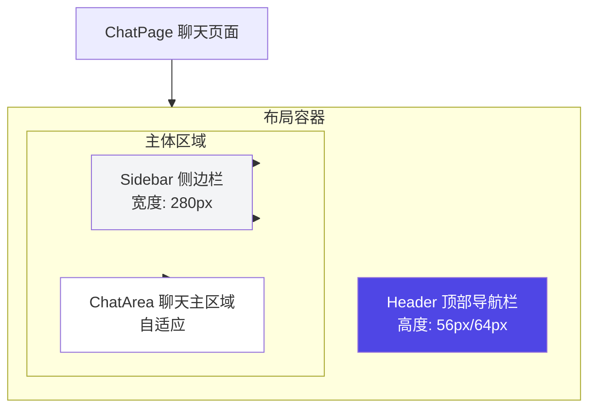
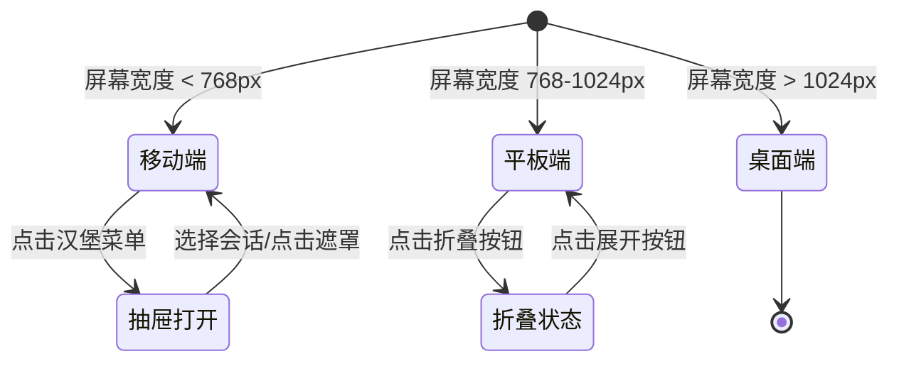

# 聊天模块 - 整体布局设计

> **目标**: 定义聊天页面的视觉层次、响应式断点、区域划分
> **后端对齐**: 参考 `/docs/api-design/01-chat/API设计文档.md`

## 📐 页面结构

### 布局层次



### 布局约束

| 区域 | 尺寸约束 | 定位行为 | 响应式 |
|------|----------|----------|--------|
| Header | H: 56px(移动) / 64px(桌面) | 固定顶部 | 始终显示 |
| Sidebar | W: 280px(桌面) / 64px(平板折叠) / 100%(移动抽屉) | 固定左侧 | 可折叠/抽屉 |
| ChatArea | W: calc(100% - 280px) | 占据剩余空间 | 自适应 |

### 响应式断点

| 断点名称 | 屏幕宽度 | Sidebar | Header | ChatArea最大宽度 |
|----------|----------|---------|--------|------------------|
| 移动端 | < 768px | 抽屉式(点击展开) | 56px | 100% |
| 平板端 | 768px - 1024px | 可折叠至64px | 64px | 85% |
| 桌面端 | > 1024px | 始终显示280px | 64px | 800px |

---

## 🔷 Header 顶部导航栏

### 视觉描述

固定顶部的水平条形区域，高度64px（移动端56px）。左侧Logo+产品名，中间搜索框，右侧工具栏（模型选择、主题切换、用户头像）。背景色跟随主题，底部轻微阴影。

### 组件规格

**组件名**: `Header`

| Props | 类型 | 默认值 | 说明 |
|-------|------|--------|------|
| - | - | - | 无props |

| Emits | 事件名 | 参数 | 说明 |
|-------|--------|------|------|
| - | - | - | 无事件 |

| 子组件 | 必填 | 说明 |
|--------|------|------|
| `Logo` | ✅ | 品牌标识 |
| `SearchBar` | ✅ | 会话搜索输入框 |
| `ModelSelector` | ✅ | 模型下拉选择器 |
| `ThemeToggle` | ✅ | 主题切换按钮 |
| `UserMenu` | ✅ | 用户头像和菜单 |

### 子组件约束

#### Logo

视觉描述：左侧圆形机器人图标，右侧"DeepSeek Chat"文字。

| Props | 类型 | 默认值 | 说明 |
|-------|------|--------|------|
| clickable | boolean | true | 是否可点击跳转首页 |

#### SearchBar

视觉描述：圆角输入框，左侧搜索图标，占位符"搜索对话..."，聚焦时边框高亮主题色。

| Props | 类型 | 默认值 | 说明 |
|-------|------|--------|------|
| placeholder | string | "搜索对话..." | 输入框占位符 |

| Emits | 事件名 | 参数 | 说明 |
|-------|--------|------|------|
| search | (query: string) | - | 用户输入触发搜索 |

#### ModelSelector

视觉描述：下拉选择器，显示当前模型名称和图标，点击展开切换。

| Props | 类型 | 默认值 | 说明 |
|-------|------|--------|------|
| models | Model[] | [] | 可用模型列表 |
| currentModelId | string | - | 当前选中的模型ID |

| Emits | 事件名 | 参数 | 说明 |
|-------|--------|------|------|
| change | (modelId: string) | - | 切换模型时触发 |

```typescript
// Model 接口定义（与后端API一致）
interface Model {
  modelId: number
  modelCode: string        // 如 "deepseek-chat"
  modelName: string        // 如 "DeepSeek Chat"
  modelType: 'chat' | 'reasoner'
  maxTokens: number
  isEnabled: boolean
}
```

---

## 🔷 Sidebar 侧边栏

### 视觉描述

左侧固定宽度280px的垂直面板（平板可折叠至64px，移动端为抽屉）。浅灰背景，顶部"新建对话"按钮，中间可滚动会话列表，底部标签管理和数据统计。

### 组件规格

**组件名**: `Sidebar`

| Props | 类型 | 默认值 | 说明 |
|-------|------|--------|------|
| collapsed | boolean | false | 是否折叠（仅平板） |

| Emits | 事件名 | 参数 | 说明 |
|-------|--------|------|------|
| newConversation | - | - | 点击"新建对话" |
| selectConversation | (conversationId: number) | - | 选择会话 |

| Slots | 插槽名 | 说明 |
|-------|--------|------|
| default | - | 默认内容区域 |

### 子组件约束

#### NewChatButton

视觉描述：醒目蓝色矩形按钮，左侧加号图标，右侧"新建对话"文字。

| Props | 类型 | 默认值 | 说明 |
|-------|------|--------|------|
| - | - | - | 无props |

| Emits | 事件名 | 参数 | 说明 |
|-------|--------|------|------|
| click | - | - | 点击触发新建会话 |

#### ConversationList

视觉描述：可滚动垂直列表，每项代表一个会话。按更新时间倒序排列，置顶会话固定顶部。

| Props | 类型 | 默认值 | 说明 |
|-------|------|--------|------|
| conversations | Conversation[] | [] | 会话列表 |
| currentId | number \| null | null | 当前选中会话ID |

```typescript
// Conversation 接口定义（与后端API一致）
interface Conversation {
  conversationId: number
  title: string
  modelId: string
  isPinned: boolean
  pinTime?: string
  tagList: string[]
  totalTokens: number
  messageCount: number
  createTime: string
  updateTime: string
}
```

#### ConversationItem

视觉描述：卡片式列表项。左侧置顶图标（如置顶），中间会话标题，右侧更新时间和更多操作。标签在标题下方以胶囊形式显示。

| Props | 类型 | 默认值 | 说明 |
|-------|------|--------|------|
| conversation | Conversation | - | 会话数据 |
| active | boolean | false | 是否为当前选中 |

| Emits | 事件名 | 参数 | 说明 |
|-------|--------|------|------|
| click | (conversationId: number) | - | 点击切换会话 |
| pin | (conversationId: number) | - | 置顶/取消置顶 |
| delete | (conversationId: number) | - | 删除会话 |

#### TagList

视觉描述：标签列表，每个标签为彩色圆角胶囊。

| Props | 类型 | 默认值 | 说明 |
|-------|------|--------|------|
| tags | Tag[] | [] | 标签列表 |

```typescript
// Tag 接口定义（与后端API一致）
interface Tag {
  tagId: number
  tagName: string        // 如 "工作"
  tagColor: string       // 如 "#1890ff"
  conversationCount: number
}
```

#### StatsPanel

视觉描述：显示用户统计的文本区域。

| Props | 类型 | 默认值 | 说明 |
|-------|------|--------|------|
| todayMessages | number | - | 今日消息数 |
| totalTokens | number | - | 累计Token数 |

---

## 🔷 ChatArea 聊天主区域

### 视觉描述

占据页面右侧剩余空间的白色区域。顶部可选会话信息栏（标题、置顶、标签、导出），中间可滚动消息列表，底部固定输入区域。

### 组件规格

**组件名**: `ChatArea`

| Props | 类型 | 默认值 | 说明 |
|-------|------|--------|------|
| conversationId | number \| null | null | 当前会话ID |
| messages | Message[] | [] | 消息列表 |
| isStreaming | boolean | false | 是否正在生成 |

| Emits | 事件名 | 参数 | 说明 |
|-------|--------|------|------|
| sendMessage | (content: string) | - | 发送消息 |
| stopGeneration | - | - | 停止生成 |
| regenerate | (messageId: number) | - | 重新生成 |

```typescript
// Message 接口定义（与后端API一致）
interface Message {
  messageId: number
  conversationId: number
  role: 'user' | 'assistant' | 'system'
  content: string
  thinkingContent?: string
  tokensUsed?: number
  attachments: number[]
  createTime: string
  isStreaming?: boolean      // 前端状态
  hasError?: boolean         // 前端状态
}
```

### 子组件约束

#### ChatHeader（可选）

视觉描述：会话标题栏，左侧标题，右侧操作按钮组（置顶、标签、更多、导出）。

| Props | 类型 | 默认值 | 说明 |
|-------|------|--------|------|
| conversation | Conversation | - | 会话数据 |
| visible | boolean | true | 是否显示 |

#### MessageList

视觉描述：占据剩余所有空间的垂直滚动区域。初始滚动到底部，新消息自动滚动到底部。每条消息上下间距16px。

| Props | 类型 | 默认值 | 说明 |
|-------|------|--------|------|
| messages | Message[] | [] | 消息列表 |
| isStreaming | boolean | false | 是否正在生成 |

| Emits | 事件名 | 参数 | 说明 |
|-------|--------|------|------|
| scrollNearTop | - | - | 滚动到顶部附近（触发加载历史） |
| copyMessage | (messageId: number) | - | 复制消息 |
| deleteMessage | (messageId: number) | - | 删除消息 |

#### MessageItem

视觉描述：单条消息容器。左侧圆形头像（用户/AI图标），右侧圆角矩形气泡。AI气泡浅灰背景，用户气泡主题蓝。AI思考过程在气泡上方可折叠显示。

| Props | 类型 | 默认值 | 说明 |
|-------|------|--------|------|
| message | Message | - | 消息数据 |
| isStreaming | boolean | false | 是否正在生成 |

#### InputArea

视觉描述：固定底部的输入区域。左侧附件按钮，中间多行文本输入框（高度自适应56-200px），右侧发送按钮。生成中发送按钮变为停止按钮。

| Props | 类型 | 默认值 | 说明 |
|-------|------|--------|------|
| disabled | boolean | false | 是否禁用（生成中） |
| placeholder | string | "给 DeepSeek 发送消息..." | 占位符 |

| Emits | 事件名 | 参数 | 说明 |
|-------|--------|------|------|
| send | (content: string) | - | 发送消息 |
| stop | - | - | 停止生成 |

---

## 📱 空状态设计

### 无会话时

当用户还没有任何会话时，ChatArea显示欢迎界面。中央显示大型机器人图标，下方是"开始你的第一次对话"文字，再下方是三个快捷入口卡片："💡 随便聊聊"、"📝 写个代码"、"🔍 问个问题"。

### 新建会话时

当用户点击"新建对话"但尚未发送消息时，显示欢迎语："👋 你好！我是 DeepSeek，有什么可以帮助你的？"，下方显示建议使用场景列表。

---

## 📐 详细布局尺寸表

### 主要区域尺寸

| 区域 | 属性 | 移动端 | 平板端 | 桌面端 | 单位 |
|------|------|--------|--------|--------|------|
| **Header** | 高度 | 56 | 64 | 64 | px |
| | 宽度 | 100% | 100% | 100% | % |
| **Sidebar** | 宽度(展开) | 100 | 64 | 280 | px |
| | 宽度(折叠) | - | 64 | - | px |
| | 内边距 | 12 | 12 | 16 | px |
| **ChatArea** | 最大宽度 | 100% | 85% | 800 | px |
| | 内边距(左右) | 12 | 16 | 24 | px |
| | 内边距(上下) | 12 | 16 | 24 | px |

### 子组件尺寸

| 组件 | 高度 | 宽度 | 内边距 | 备注 |
|------|------|------|--------|------|
| **NewChatButton** | 48 | 100% | 12 | 圆角8px |
| **ConversationItem** | 64 | 100% | 12 | 单行 |
| **ChatHeader** | 48 | 100% | 0,16 | 可选显示 |
| **MessageItem** | 自适应 | 最大85% | 12 | 间距16px |
| **InputArea** | 56-200 | 100% | 12 | 高度自适应 |
| **SearchBar** | 40 | 最大300 | 0,12 | 圆角8px |
| **ModelSelector** | 40 | 120 | 0,8 | 下拉框 |
| **TagItem** | 28 | 自适应 | 6,12 | 圆角14px |

---

## 📏 对齐与间距规范

### 对齐规则

| 场景 | 对齐方式 | 说明 |
|------|----------|------|
| **Header内元素** | 垂直居中 | 所有导航栏元素垂直居中对齐 |
| **Sidebar子项** | 左对齐 | 列表项、按钮左对齐 |
| **ChatArea内容** | 居中对齐 | 空状态居中，消息左对齐 |
| **MessageItem** | 左对齐 | 头像和气泡左对齐 |
| **InputArea** | 底对齐 | 输入框和按钮底部对齐 |

### 间距规范（4px基准）

| 间距类型 | 移动端 | 平板端 | 桌面端 | CSS变量 |
|----------|--------|--------|--------|---------|
| **超小间距** | 4 | 4 | 4 | `--spacing-xs` |
| **小间距** | 8 | 8 | 8 | `--spacing-sm` |
| **标准间距** | 12 | 16 | 16 | `--spacing-md` |
| **大间距** | 16 | 24 | 24 | `--spacing-lg` |
| **超大间距** | 24 | 32 | 32 | `--spacing-xl` |

### 常见间距场景

| 场景 | 间距值 | 说明 |
|------|--------|------|
| 消息上下间距 | 16px | 相同发送者8px |
| 组件内元素间距 | 8px | 按钮组、图标与文字 |
| 组件外边距 | 16px | 模块之间的间距 |
| 列表项内边距 | 12px | 左右内边距 |
| Header元素间距 | 16px | Logo、搜索、工具栏之间 |

---

## 🔄 布局状态流转



---

## 🔗 API 对齐

| 前端状态 | 后端API | 数据流向 |
|----------|---------|----------|
| 会话列表 | `GET /api/chat/conversations` | 后端 → 前端 |
| 当前会话 | `GET /api/chat/conversations/{id}` | 后端 → 前端 |
| 发送消息 | `POST /api/chat/messages/stream` (SSE) | 前端 ↔ 后端 |
| 停止生成 | `POST /api/chat/messages/{id}/stop` | 前端 → 后端 |
| 模型列表 | `GET /api/chat/models` | 后端 → 前端 |
| 用户设置 | `GET /api/chat/settings` | 后端 → 前端 |

---

**文档版本**: v2.1
**最后更新**: 2026-03-05
**对齐后端API**: v1.0
