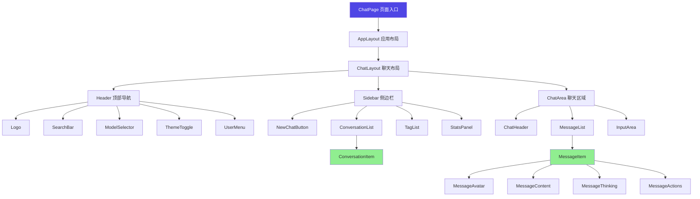
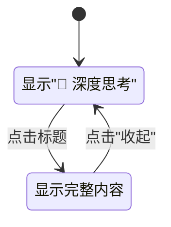
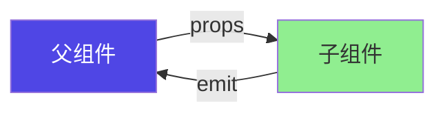
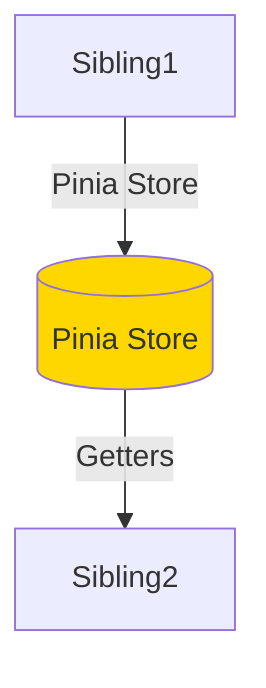
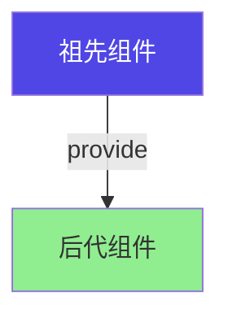

# 聊天模块 - 组件拆分设计

> **目标**: 定义组件层次、职责边界、规格约束
> **原则**: 单一职责、高内聚低耦合、可复用性

## 📂 组件目录结构

```
src/
├── pages/
│   └── ChatPage.vue              # 页面入口（动态路由）
├── layouts/
│   ├── AppLayout.vue             # 应用整体布局
│   └── ChatLayout.vue            # 聊天页面专用布局
├── components/
│   ├── header/
│   │   ├── Header.vue            # 顶部导航栏
│   │   ├── Logo.vue
│   │   ├── SearchBar.vue
│   │   ├── ModelSelector.vue
│   │   ├── ThemeToggle.vue
│   │   └── UserMenu.vue
│   ├── sidebar/
│   │   ├── Sidebar.vue           # 侧边栏容器
│   │   ├── NewChatButton.vue
│   │   ├── ConversationList.vue
│   │   ├── ConversationItem.vue
│   │   ├── TagList.vue
│   │   ├── TagItem.vue
│   │   └── StatsPanel.vue
│   ├── chat/
│   │   ├── ChatArea.vue          # 聊天主区域
│   │   ├── ChatHeader.vue        # 会话信息栏
│   │   ├── MessageList.vue       # 消息列表容器
│   │   ├── MessageItem.vue       # 单条消息
│   │   ├── MessageAvatar.vue
│   │   ├── MessageContent.vue    # Markdown渲染
│   │   ├── MessageThinking.vue   # 思考过程面板
│   │   ├── MessageActions.vue    # 操作按钮
│   │   ├── InputArea.vue         # 输入区域
│   │   └── ScrollToBottom.vue    # 滚动到底部按钮
│   └── common/
│       ├── Button.vue
│       ├── Input.vue
│       ├── Modal.vue
│       ├── Drawer.vue
│       ├── Toast.vue
│       └── Spinner.vue
└── composables/
    ├── useChat.ts                # 聊天逻辑
    ├── useSSE.ts                 # SSE连接管理
    └── useMessage.ts             # 消息操作
```

---

## 🌳 组件层次结构



---

## 📋 组件分类与职责

### 页面级组件 (Pages)

#### ChatPage

**职责**: 聊天页面唯一入口，负责路由参数解析和整体状态初始化

| Props | 类型 | 默认值 | 说明 |
|-------|------|--------|------|
| - | - | - | 无props（从路由获取参数） |

| 状态管理 | 说明 |
|----------|------|
| 当前会话ID | 从 route.params 获取 |
| 加载状态 | 初始加载时显示骨架屏 |
| 错误状态 | 会话不存在时显示错误页 |

```typescript
// ChatPage 核心逻辑
const route = useRoute()
const conversationStore = useConversationStore()

// 从路由获取会话ID
const conversationId = computed(() =>
  route.params.conversationId
    ? parseInt(route.params.conversationId as string)
    : null
)

// 切换会话
watch(conversationId, async (newId) => {
  if (newId) {
    await conversationStore.setCurrentConversation(newId)
  }
}, { immediate: true })
```

---

### 布局组件 (Layouts)

#### AppLayout

**职责**: 应用整体布局框架，包含Header和主体内容区域

| Slots | 插槽名 | 说明 |
|-------|--------|------|
| default | - | 主体内容 |

#### ChatLayout

**职责**: 聊天页面专用布局，管理Sidebar和ChatArea的响应式切换

| Props | 类型 | 默认值 | 说明 |
|-------|------|--------|------|
| - | - | - | 无props |

| 状态 | 类型 | 说明 |
|------|------|------|
| sidebarCollapsed | boolean | 平板端折叠状态 |
| sidebarVisible | boolean | 移动端可见状态 |

```typescript
// ChatLayout 响应式逻辑
const isMobile = computed(() => window.innerWidth < 768)
const isTablet = computed(() =>
  window.innerWidth >= 768 && window.innerWidth < 1024
)

// 移动端：进入会话时自动收起侧边栏
watch(() => route.params.conversationId, (id) => {
  if (id && isMobile.value) {
    sidebarVisible.value = false
  }
})
```

---

### 业务组件 (Features)

#### Header

| Props | 类型 | 默认值 | 说明 |
|-------|------|--------|------|
| - | - | - | 无props |

#### Sidebar

| Props | 类型 | 默认值 | 说明 |
|-------|------|--------|------|
| conversations | Conversation[] | [] | 会话列表 |
| currentId | number \| null | null | 当前会话ID |

| Emits | 事件名 | 参数 | 说明 |
|-------|--------|------|------|
| newConversation | - | - | 新建会话 |
| selectConversation | (id: number) | - | 选择会话 |

#### ChatArea

| Props | 类型 | 默认值 | 说明 |
|-------|------|--------|------|
| conversationId | number \| null | null | 当前会话ID |

| Emits | 事件名 | 参数 | 说明 |
|-------|--------|------|------|
| sendMessage | (content: string) | - | 发送消息 |
| stopGeneration | - | - | 停止生成 |

---

### 基础组件 (Common)

#### Button

通用按钮组件，支持多种样式和尺寸。

| Props | 类型 | 默认值 | 说明 |
|-------|------|--------|------|
| type | 'primary' \| 'default' \| 'danger' | 'default' | 按钮类型 |
| size | 'small' \| 'medium' \| 'large' | 'medium' | 尺寸 |
| disabled | boolean | false | 是否禁用 |
| loading | boolean | false | 是否加载中 |

| Slots | 插槽名 | 说明 |
|-------|--------|------|
| default | - | 按钮内容 |

#### Input

通用输入框组件。

| Props | 类型 | 默认值 | 说明 |
|-------|------|--------|------|
| modelValue | string | '' | 输入值（v-model） |
| placeholder | string | '' | 占位符 |
| disabled | boolean | false | 是否禁用 |
| maxlength | number | - | 最大长度 |

| Emits | 事件名 | 参数 | 说明 |
|-------|--------|------|------|
| update:modelValue | (value: string) | - | 更新输入值 |

---

## 🔧 核心组件详细规格

### MessageItem

**职责**: 单条消息的完整展示，包括头像、内容、思考过程、操作按钮

| Props | 类型 | 默认值 | 说明 |
|-------|------|--------|------|
| message | Message | - | 消息数据 |
| isStreaming | boolean | false | 是否正在生成 |

| Emits | 事件名 | 参数 | 说明 |
|-------|--------|------|------|
| copy | - | - | 复制消息内容 |
| regenerate | (messageId: number) | - | 重新生成AI回复 |
| delete | (messageId: number) | - | 删除消息 |

```typescript
// MessageItem 核心逻辑
const isThinking = computed(() =>
  message.value.role === 'assistant' &&
  Boolean(message.value.thinkingContent)
)

const showThinking = ref(false)  // 思考过程展开状态
const isHovering = ref(false)    // 鼠标悬停状态（显示操作按钮）
```

### MessageContent

**职责**: 渲染Markdown内容，支持代码高亮

| Props | 类型 | 默认值 | 说明 |
|-------|------|--------|------|
| content | string | '' | Markdown内容 |
| isStreaming | boolean | false | 是否正在生成 |

**依赖**: `marked` (Markdown解析), `highlight.js` (代码高亮)

```typescript
// MessageContent 核心逻辑
import { marked } from 'marked'
import hljs from 'highlight.js'

const renderedHtml = computed(() => {
  if (!props.content) return ''

  return marked(props.content, {
    highlight: (code, lang) => {
      if (lang && hljs.getLanguage(lang)) {
        return hljs.highlight(code, { language: lang }).value
      }
      return hljs.highlightAuto(code).value
    }
  })
})
```

### MessageThinking

**职责**: 折叠式展示AI推理过程

| Props | 类型 | 默认值 | 说明 |
|-------|------|--------|------|
| content | string | '' | 推理过程内容 |
| isStreaming | boolean | false | 是否正在生成 |

| 状态 | 类型 | 默认值 | 说明 |
|------|------|--------|------|
| expanded | boolean | false | 是否展开 |



### InputArea

**职责**: 消息输入区域，支持多行输入、附件上传、发送/停止

| Props | 类型 | 默认值 | 说明 |
|-------|------|--------|------|
| disabled | boolean | false | 是否禁用（生成中） |
| isStreaming | boolean | false | 是否正在生成 |

| Emits | 事件名 | 参数 | 说明 |
|-------|--------|------|------|
| send | (content: string) | - | 发送消息 |
| stop | - | - | 停止生成 |
| attach | (files: File[]) | - | 上传附件 |

| 状态 | 类型 | 默认值 | 说明 |
|------|------|--------|------|
| inputContent | string | '' | 输入内容 |
| inputHeight | number | 56 | 输入框高度（px） |

```typescript
// InputArea 核心逻辑
const textareaRef = ref<HTMLTextAreaElement>()

// 自适应高度
const adjustHeight = () => {
  const el = textareaRef.value
  if (!el) return

  el.style.height = '56px'  // 重置
  const scrollHeight = el.scrollHeight
  inputHeight.value = Math.min(Math.max(scrollHeight, 56), 200)
  el.style.height = `${inputHeight.value}px`
}

// 快捷键支持
const handleKeydown = (e: KeyboardEvent) => {
  if (e.key === 'Enter' && !e.shiftKey) {
    e.preventDefault()
    emit('send', inputContent.value)
  }
}
```

---

## 🔄 组件通信方式

### 父子通信



**示例**: MessageList → MessageItem
- Props: `message`, `isStreaming`
- Emits: `copy`, `regenerate`, `delete`

### 兄弟通信



**示例**: Sidebar 和 ChatArea
- 通过 `useConversationStore()` 共享 `currentConversationId`

### 跨层级通信



**示例**: ChatPage → MessageItem
- Provide: `handleMessageAction`
- Inject: `sendMessage`, `regenerateMessage`

---

## 📦 懒加载策略

### 路由级懒加载

```typescript
const routes = [
  {
    path: '/chat/:conversationId?',
    component: () => import('@/pages/ChatPage.vue')
  }
]
```

### 组件级懒加载

| 组件 | 加载时机 |
|------|----------|
| ExportModal | 点击导出按钮时 |
| TagManagerModal | 点击标签管理时 |
| ImagePreview | 点击图片时 |

```typescript
// 懒加载示例
const ExportModal = defineAsyncComponent(() =>
  import('@/components/export/ExportModal.vue')
)
```

---

## 🔗 API 对齐

| 组件 | 后端API | 数据流向 |
|------|---------|----------|
| ModelSelector | `GET /api/chat/models` | 获取可用模型 |
| ConversationList | `GET /api/chat/conversations` | 获取会话列表 |
| MessageList | `GET /api/chat/conversations/{id}/messages` | 获取消息列表 |
| InputArea | `POST /api/chat/messages/stream` | SSE发送消息 |
| StatsPanel | `GET /api/chat/conversations/{id}/context` | 获取Token统计 |

---

## 📐 组件尺寸规范

| 组件 | 默认高度 | 默认宽度 | 自适应 |
|------|----------|----------|--------|
| Header | 64px | 100% | - |
| Sidebar | 100% | 280px | 可折叠至64px |
| ConversationItem | 64px | 100% | - |
| MessageItem | 自适应 | 最大85% | 高度根据内容 |
| InputArea | 56-200px | 100% | 高度自适应 |

---

**文档版本**: v2.0
**最后更新**: 2026-03-05
