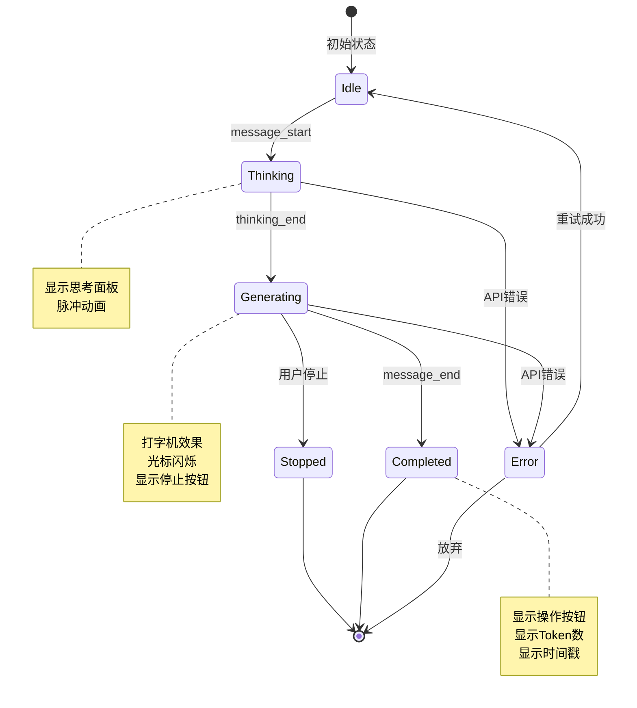
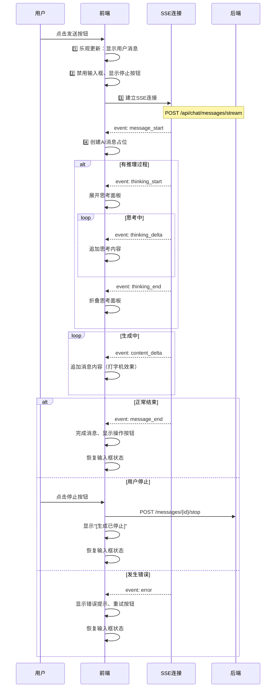
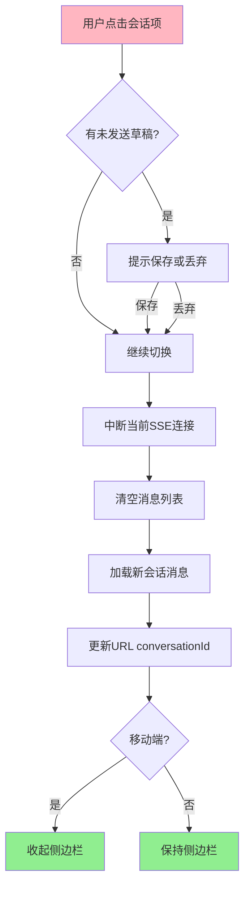
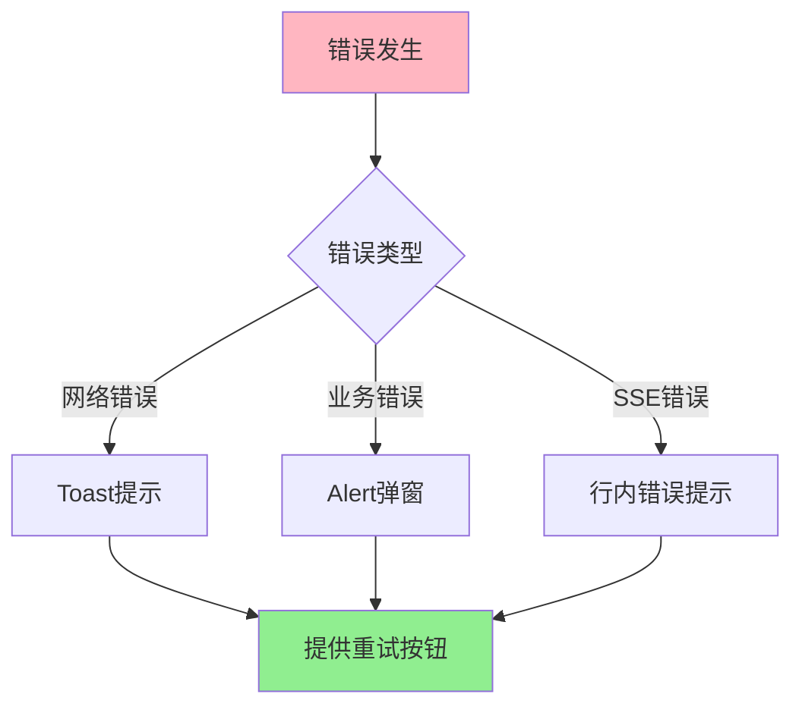

# 聊天模块 - 交互逻辑设计

> **目标**: 定义用户交互流程、状态流转、SSE事件处理
> **后端对齐**: 参考 `/docs/api-design/01-chat/技术实现文档.md` 第2.2节

---

## 📡 SSE 事件流处理

### SSE 事件类型映射

| 后端事件 | 前端状态 | UI效果 | 处理逻辑 |
|----------|----------|--------|----------|
| `message_start` | 创建消息占位 | 显示"AI正在思考..." | 初始化空消息对象 |
| `thinking_start` | 思考中 | 显示"深度思考中..." | 展开思考面板 |
| `thinking_delta` | 思考中 | 追加思考内容 | 流式展示思考过程 |
| `thinking_end` | 思考完成 | 显示"查看思考过程" | 折叠思考面板 |
| `content_delta` | 生成中 | 打字机效果 | 追加消息内容 |
| `message_end` | 完成 | 显示操作按钮、时间、Token数 | 更新消息状态 |
| `error` | 错误 | 显示错误提示、重试按钮 | 错误处理 |

### 消息状态机



### 滚动行为

| 场景 | 滚动行为 | 判断条件 |
|------|----------|----------|
| 新消息到达 | 自动滚动到底部 | `isAtBottom === true` |
| 流式生成中 | 持续跟随最新内容 | `userScrolled === false` |
| 用户向上滚动 | 暂停自动滚动 | `scrollBottom > 100px` |
| 用户发送消息 | 立即滚动到底部 | - |
| 加载历史消息 | 保持当前位置 | 保存滚动位置 |

```typescript
// 滚动判断逻辑
const isAtBottom = computed(() => {
  const { scrollTop, scrollHeight, clientHeight } = scrollState
  return scrollHeight - scrollTop - clientHeight < 100
})

const userScrolled = ref(false)

watch(isAtBottom, (atBottom) => {
  if (atBottom) {
    userScrolled.value = false
  }
})
```

---

## 🔄 消息发送流程

### 完整时序图



### 输入框状态流转

```mermaid
stateDiagram-v2
    [*] --> 空闲
    空闲 --> 有内容: 用户输入
    有内容 --> 空闲: 清空输入

    空闲 --> 发送中: 点击发送
    有内容 --> 发送中: 点击发送

    发送中 --> 完成: message_end
    发送中 --> 已停止: 用户停止
    发送中 --> 错误: API错误

    完成 --> 空闲
    已停止 --> 空闲
    错误 --> 空闲

    note right of 发送中
        输入框禁用
        显示停止按钮
        隐藏发送按钮
    end note

    note right of 空闲,有内容
        输入框可用
        显示发送按钮
        隐藏停止按钮
    end note
```

### 防抖与节流策略

| 场景 | 策略 | 延迟 | 用途 |
|------|------|------|------|
| 输入框高度调整 | 节流 | 100ms | 避免频繁DOM操作 |
| 搜索会话 | 防抖 | 300ms | 等待用户停止输入 |
| 自动保存草稿 | 防抖 | 1000ms | 避免频繁写入localStorage |
| 滚动位置检测 | 节流 | 100ms | 优化性能 |

```typescript
// 防抖Hook示例
import { useDebounceFn } from '@vueuse/core'

const { run: debouncedSearch } = useDebounceFn((query: string) => {
  conversationStore.searchConversations(query)
}, 300)
```

---

## 🛑 停止生成逻辑

### 停止生成的两种方式

| 触发方式 | UI元素 | 交互 |
|----------|--------|------|
| 点击停止按钮 | InputArea中的停止按钮 | 发送停止请求 |
| 离开页面 | window.beforeunload | 自动断开SSE |

### 停止后状态处理

```mermaid
graph TD
    A[用户点击停止] --> B[中断SSE连接]
    B --> C[调用POST /messages/{id}/stop]
    C --> D{已生成内容}

    D -->|有内容| E[保留内容]
    D -->|仅思考| F[隐藏思考面板]
    D -->|无内容| G[删除占位消息]

    E --> H[显示"[生成已停止]"]
    F --> H
    H --> I[恢复输入框状态]
    I --> J[显示"继续生成"按钮]

    style A fill:#FFB6C1
    style J fill:#90EE90
```

### 部分消息的处理

| 情况 | 处理方式 |
|------|----------|
| 有内容但未完成 | 保留内容，标记"已停止" |
| 仅思考过程 | 隐藏思考面板，标记"已停止" |
| 完全无内容 | 删除占位消息 |

---

## 🔄 重新生成逻辑

### 重新生成触发流程

```mermaid
graph TD
    A[用户点击"重新生成"] --> B[获取用户消息ID]
    B --> C[调用POST /messages/{id}/regenerate]

    C --> D{是否有旧AI回复}

    D -->|是| E[替换内容]
    D -->|否| F[新建消息]

    E --> G[保持消息ID不变]
    F --> H[创建新消息ID]

    G --> I[处理SSE流]
    H --> I

    I --> J[流式内容覆盖旧内容]
    J --> K[完成更新时间]

    style A fill:#FFB6C1
    style K fill:#90EE90
```

### 重新生成UI表现

| 状态 | UI变化 |
|------|---------|
| 点击时 | 消息内容淡出、显示加载中 |
| 生成中 | 流式内容覆盖旧内容 |
| 完成 | 显示新内容、更新时间 |
| 错误 | 显示错误、保留旧内容 |

### 与新消息的区别

| 项目 | 新消息 | 重新生成 |
|------|--------|----------|
| 创建新消息 | ✅ 是 | ❌ 否 |
| 更新会话时间 | ✅ 是 | ❌ 否 |
| 消息计数 | +1 | 不变 |
| 历史记录 | 包含旧AI回复 | 不包含旧AI回复 |

---

## 📜 消息列表加载

### 初始加载

```mermaid
graph TD
    A[进入会话] --> B[显示骨架屏]
    B --> C[调用GET /conversations/{id}/messages]
    C --> D[加载最近50条消息]
    D --> E[滚动到最底部]
    E --> F[移除骨架屏]

    style B fill:#FFD700
    style F fill:#90EE90
```

### 滚动加载（分页）

```mermaid
graph TD
    A[用户滚动到顶部] --> B{scrollTop < 100?}
    B -->|否| C[不处理]
    B -->|是| D[显示顶部Spinner]

    D --> E[调用GET /messages?before_message_id={}]
    E --> F[新消息插入到列表顶部]
    F --> G[保持滚动位置]

    G --> H{还有更多?}
    H -->|是| I[继续监听滚动]
    H -->|否| J[显示"已加载全部消息"]

    style A fill:#FFB6C1
    style J fill:#90EE90
```

### 加载状态

| 状态 | UI表现 |
|------|---------|
| 首次加载 | 全屏骨架屏 |
| 加载更多 | 顶部显示Spinner |
| 加载完成 | 移除Spinner |
| 无更多数据 | 显示"已加载全部消息" |
| 加载失败 | 显示"加载失败，点击重试" |

---

## 🔀 会话切换逻辑

### 切换会话流程



### 新建会话流程

```mermaid
graph TD
    A[用户点击"新建会话"] --> B{当前会话有消息?}
    B -->|是| C[保持当前会话]
    B -->|否| D[调用API创建新会话]

    C --> E[清空输入框]
    D --> F[跳转到新会话]

    E --> G[显示欢迎界面]
    F --> G

    G --> H[等待首条消息]
    H --> I[首条消息发送后]
    I --> J[自动生成会话标题]

    style A fill:#FFB6C1
    style J fill:#90EE90
```

### 会话列表更新

| 触发场景 | 更新方式 | API |
|----------|----------|-----|
| 发送消息 | 当前会话移到顶部 | 实时更新 |
| 接收消息 | 当前会话移到顶部 | SSE推送 |
| 删除会话 | 从列表移除 | `DELETE /conversations/{ids}` |
| 置顶会话 | 移到置顶区域 | `PUT /conversations/{id}/pin` |
| 重命名 | 更新标题 | `PUT /conversations` |

---

## ⚠️ 错误处理

### 网络错误处理

| 错误类型 | 处理方式 | 用户提示 |
|----------|----------|----------|
| SSE连接断开 | 自动重试3次（间隔1s/2s/5s） | "连接中断，正在重连..." |
| 发送失败 | 保留输入内容 | "消息发送失败，点击重试" |
| 加载失败 | 显示重试按钮 | "加载失败，点击重试" |
| API超时 | 显示超时提示 | "请求超时，请稍后重试" |

### 业务错误处理

| 错误场景 | 处理方式 | 用户提示 |
|----------|----------|----------|
| 会话不存在 | 跳转会话列表 | "会话不存在" |
| 无权限访问 | Toast提示，跳转会话列表 | "无权限访问此会话" |
| 消息不存在 | 移除该消息 | - |
| Token超限 | 提示升级或切换模型 | "Token超限，建议新建会话" |

### 错误提示规范



---

## ⌨️ 快捷键交互

### 全局快捷键

| 快捷键 | 功能 | 备注 |
|--------|------|------|
| `Ctrl/Cmd + K` | 聚焦搜索框 | - |
| `Ctrl/Cmd + N` | 新建会话 | - |
| `Ctrl/Cmd + /` | 打开快捷键面板 | - |

### 聊天快捷键

| 快捷键 | 功能 | 条件 |
|--------|------|------|
| `Enter` | 发送消息 | 输入框聚焦 |
| `Shift + Enter` | 换行 | 输入框聚焦 |
| `Ctrl/Cmd + Enter` | 发送消息 | 输入框聚焦 |
| `Esc` | 停止生成 | 生成中 |
| `↑` | 编辑上一条消息 | 仅用户消息、空闲时 |
| `Ctrl/Cmd + ↑` | 上一条会话 | 输入框聚焦 |
| `Ctrl/Cmd + ↓` | 下一条会话 | 输入框聚焦 |

```typescript
// 快捷键处理示例
const handleKeydown = (e: KeyboardEvent) => {
  const isMac = navigator.platform.toUpperCase().indexOf('MAC') >= 0
  const modKey = isMac ? e.metaKey : e.ctrlKey

  if (modKey && e.key === 'k') {
    e.preventDefault()
    searchInputRef.value?.focus()
  }
}
```

---

## 📱 移动端特殊交互

### 手势操作

| 手势 | 功能 | 实现 |
|------|------|------|
| 左滑会话项 | 显示操作菜单（删除/置顶） | touchstart + touchmove |
| 下拉消息列表 | 加载历史消息 | 滚动到顶部 |
| 长按消息 | 显示操作菜单 | longpress事件 |
| 双击消息 | 复制内容 | dblclick事件 |

### 响应式交互差异

| 场景 | 桌面端 | 移动端 |
|------|--------|--------|
| 侧边栏 | 始终显示 | 抽屉式（点击展开） |
| 输入框 | 固定高度 | 自适应、键盘弹出时调整 |
| 消息操作 | 悬停显示 | 点击显示 |
| 代码块 | 内联展开 | 全屏查看 |
| 思考过程 | 默认折叠 | 默认折叠、点击全屏展开 |

---

**文档版本**: v2.0
**最后更新**: 2026-03-05
**对齐后端API**: v1.0
