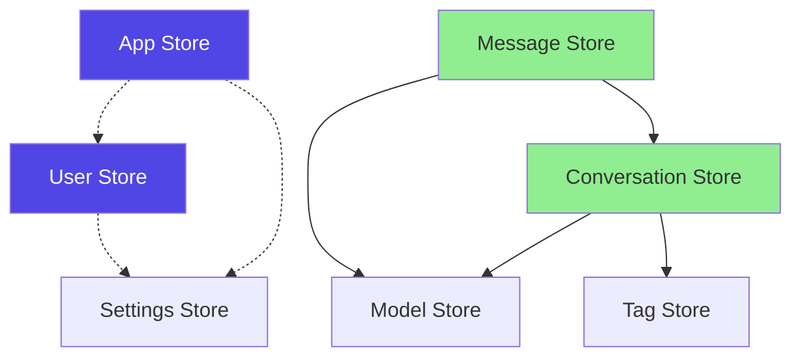
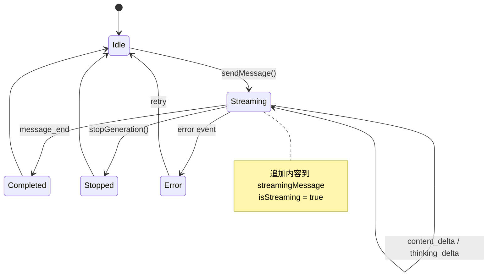

# 聊天模块 - 状态管理设计

> **目标**: 定义 Pinia Store 结构、状态流转、数据流
> **后端对齐**: 参考 `/docs/api-design/01-chat/API设计文档.md` 第2节数据模型

---

## 📦 Store 结构

### 目录结构

```
stores/
├── index.ts                    # Store 入口
├── modules/
│   ├── app.ts                  # 应用全局状态
│   ├── user.ts                 # 用户状态
│   ├── conversation.ts         # 会话状态
│   ├── message.ts              # 消息状态
│   ├── model.ts                # 模型配置状态
│   ├── tag.ts                  # 标签状态
│   └── settings.ts             # 用户设置状态
└── types/
    ├── conversation.ts         # 会话类型定义
    ├── message.ts              # 消息类型定义
    └── model.ts                # 模型类型定义
```

### Store 依赖关系



---

## 🔷 App Store (全局应用状态)

### 状态定义

```typescript
interface AppState {
  // 主题
  theme: 'light' | 'dark' | 'auto'

  // 侧边栏
  sidebarCollapsed: boolean     // 平板端折叠状态
  sidebarVisible: boolean        // 移动端可见状态

  // 加载状态
  globalLoading: boolean
  globalLoadingText: string

  // Toast 通知
  toasts: Toast[]
}

interface Toast {
  id: string
  type: 'success' | 'error' | 'warning' | 'info'
  message: string
  duration?: number
}
```

### Actions

| Action | 参数 | 返回值 | 说明 |
|--------|------|--------|------|
| `setTheme(theme)` | `ThemeType` | `void` | 设置主题 |
| `toggleSidebar()` | - | `void` | 切换侧边栏 |
| `setGlobalLoading(loading, text?)` | `boolean, string?` | `void` | 设置全局加载 |
| `showToast(toast)` | `Toast` | `void` | 显示通知 |
| `removeToast(id)` | `string` | `void` | 移除通知 |

### 核心代码

```typescript
import { defineStore } from 'pinia'
import { ref, computed } from 'vue'

export const useAppStore = defineStore('app', () => {
  const theme = ref<'light' | 'dark' | 'auto'>('light')
  const sidebarCollapsed = ref(false)
  const sidebarVisible = ref(false)
  const toasts = ref<Toast[]>([])

  // 自动检测系统主题
  const resolvedTheme = computed(() => {
    if (theme.value === 'auto') {
      return window.matchMedia('(prefers-color-scheme: dark)').matches
        ? 'dark'
        : 'light'
    }
    return theme.value
  })

  // 应用主题到 DOM
  watch(resolvedTheme, (theme) => {
    document.documentElement.setAttribute('data-theme', theme)
  }, { immediate: true })

  const setTheme = (newTheme: ThemeType) => {
    theme.value = newTheme
  }

  const toggleSidebar = () => {
    if (window.innerWidth < 768) {
      sidebarVisible.value = !sidebarVisible.value
    } else {
      sidebarCollapsed.value = !sidebarCollapsed.value
    }
  }

  return {
    theme,
    sidebarCollapsed,
    sidebarVisible,
    toasts,
    resolvedTheme,
    setTheme,
    toggleSidebar
  }
}, {
  persist: {
    key: 'app-store',
    paths: ['theme']
  }
})
```

---

## 🔷 User Store (用户状态)

### 状态定义

```typescript
interface UserState {
  // 用户信息
  userId: number
  username: string
  nickname: string
  avatar: string
  email: string

  // 认证
  token: string
  isAuthenticated: boolean
  permissions: string[]

  // 用户统计数据
  stats: {
    todayMessages: number
    totalMessages: number
    totalTokens: number
  }
}
```

### Actions

| Action | 参数 | 返回值 | API |
|--------|------|--------|-----|
| `login(username, password)` | `string, string` | `Promise<void>` | `POST /login` |
| `logout()` | - | `Promise<void>` | `POST /logout` |
| `fetchUserInfo()` | - | `Promise<void>` | `GET /user/info` |
| `updateUserStats()` | - | `Promise<void>` | `GET /user/stats` |

### 核心代码

```typescript
export const useUserStore = defineStore('user', () => {
  const token = ref('')
  const userInfo = ref<UserInfo | null>(null)
  const isAuthenticated = computed(() => !!token.value)

  const login = async (username: string, password: string) => {
    const res = await api.login({ username, password })
    token.value = res.data.token
    userInfo.value = res.data.user
  }

  const logout = async () => {
    await api.logout()
    token.value = ''
    userInfo.value = null
  }

  return {
    token,
    userInfo,
    isAuthenticated,
    login,
    logout
  }
}, {
  persist: {
    key: 'user-store',
    paths: ['token']
  }
})
```

---

## 🔷 Conversation Store (会话状态)

### 状态定义

```typescript
interface ConversationState {
  // 会话列表
  conversations: Conversation[]

  // 当前会话
  currentConversationId: number | null
  currentConversation: ComputedRef<Conversation | null>

  // 分页
  hasMore: boolean
  page: number
  pageSize: number

  // 筛选和排序
  filterTagId: number | null
  sortBy: 'update_time' | 'create_time'
  sortOrder: 'desc' | 'asc'

  // 加载状态
  loading: boolean
  error: string | null
}
```

### 类型定义（与后端一致）

```typescript
interface Conversation {
  conversationId: number
  title: string
  modelId: string
  isPinned: boolean
  pinTime?: string
  tagList: string[]
  totalTokens: number
  messageCount: number
  createTime: string
  updateTime: string
}
```

### Actions

| Action | 参数 | 返回值 | API |
|--------|------|--------|-----|
| `fetchConversations(params?)` | `FetchParams?` | `Promise<void>` | `GET /api/chat/conversations` |
| `createConversation(data)` | `CreateData` | `Promise<Conversation>` | `POST /api/chat/conversations` |
| `updateConversation(id, data)` | `number, UpdateData` | `Promise<void>` | `PUT /api/chat/conversations` |
| `deleteConversation(ids)` | `number[]` | `Promise<void>` | `DELETE /api/chat/conversations/{ids}` |
| `togglePin(id)` | `number` | `Promise<void>` | `PUT /api/chat/conversations/{id}/pin` |
| `setCurrentConversation(id)` | `number \| null` | `void` | - |

### Getters

| Getter | 返回值 | 说明 |
|--------|--------|------|
| `pinnedConversations` | `Conversation[]` | 置顶会话列表 |
| `unpinnedConversations` | `Conversation[]` | 非置顶会话列表 |
| `currentConversation` | `Conversation \| null` | 当前会话详情 |
| `filteredConversations` | `Conversation[]` | 筛选后的会话列表 |

### 核心代码

```typescript
export const useConversationStore = defineStore('conversation', () => {
  const conversations = ref<Conversation[]>([])
  const currentConversationId = ref<number | null>(null)
  const loading = ref(false)

  const currentConversation = computed(() =>
    conversations.value.find(c => c.conversationId === currentConversationId.value) || null
  )

  const pinnedConversations = computed(() =>
    conversations.value.filter(c => c.isPinned)
  )

  const unpinnedConversations = computed(() =>
    conversations.value.filter(c => !c.isPinned)
  )

  const fetchConversations = async (params?: FetchParams) => {
    loading.value = true
    try {
      const res = await api.getConversations(params)
      conversations.value = res.data.rows
    } finally {
      loading.value = false
    }
  }

  const createConversation = async (data: CreateData) => {
    const res = await api.createConversation(data)
    conversations.value.unshift(res.data)
    return res.data
  }

  const setCurrentConversation = (id: number | null) => {
    currentConversationId.value = id
  }

  return {
    conversations,
    currentConversationId,
    currentConversation,
    pinnedConversations,
    unpinnedConversations,
    loading,
    fetchConversations,
    createConversation,
    setCurrentConversation
  }
})
```

---

## 🔷 Message Store (消息状态)

### 状态定义

```typescript
interface MessageState {
  // 消息列表（按会话ID分组）
  messages: Record<number, Message[]>

  // 加载状态
  loading: boolean
  loadingMore: boolean
  streaming: boolean

  // 分页
  hasMore: Record<number, boolean>
  beforeMessageId: Record<number, number | null>

  // 当前流式消息
  streamingMessage: Message | null

  // 错误
  error: string | null
}
```

### 类型定义（与后端一致）

```typescript
interface Message {
  messageId: number
  conversationId: number
  role: 'user' | 'assistant' | 'system'
  content: string
  thinkingContent?: string
  tokensUsed?: number
  attachments: number[]
  userId: number
  createTime: string

  // 前端状态
  isStreaming?: boolean
  hasError?: boolean
}
```

### Actions

| Action | 参数 | 返回值 | API |
|--------|------|--------|-----|
| `fetchMessages(conversationId, beforeMessageId?)` | `number, number?` | `Promise<void>` | `GET /api/chat/conversations/{id}/messages` |
| `sendMessage(conversationId, content, options?)` | `number, string, Options?` | `Promise<void>` | `POST /api/chat/messages/stream` (SSE) |
| `stopGeneration(messageId)` | `number` | `Promise<void>` | `POST /api/chat/messages/{id}/stop` |
| `regenerateMessage(messageId, modelId?)` | `number, string?` | `Promise<void>` | `POST /api/chat/messages/{id}/regenerate` |
| `appendStreamingContent(content)` | `string` | `void` | - (SSE) |
| `appendThinkingContent(content)` | `string` | `void` | - (SSE) |
| `completeStreamingMessage(data)` | `CompleteData` | `void` | - (SSE) |

### Getters

| Getter | 返回值 | 说明 |
|--------|--------|------|
| `getMessages(conversationId)` | `Message[]` | 获取会话的消息列表 |
| `getCurrentMessages` | `Message[]` | 获取当前会话的消息列表 |
| `hasMoreMessages(conversationId)` | `boolean` | 是否有更多消息 |
| `isStreaming` | `boolean` | 是否正在生成 |

### 消息状态流转



### 核心代码

```typescript
export const useMessageStore = defineStore('message', () => {
  const messages = ref<Record<number, Message[]>>({})
  const streamingMessage = ref<Message | null>(null)
  const streaming = ref(false)

  const getMessages = (conversationId: number) => {
    return messages.value[conversationId] || []
  }

  const appendStreamingContent = (content: string) => {
    if (streamingMessage.value) {
      streamingMessage.value.content += content
    }
  }

  const completeStreamingMessage = (data: CompleteData) => {
    if (streamingMessage.value) {
      streamingMessage.value.messageId = data.messageId
      streamingMessage.value.tokensUsed = data.tokensUsed
      streamingMessage.value.isStreaming = false

      // 添加到消息列表
      const list = getMessages(data.conversationId)
      list.push(streamingMessage.value)

      streamingMessage.value = null
      streaming.value = false
    }
  }

  return {
    messages,
    streamingMessage,
    streaming,
    getMessages,
    appendStreamingContent,
    completeStreamingMessage
  }
})
```

---

## 🔷 Model Store (模型配置状态)

### 状态定义

```typescript
interface ModelState {
  // 可用模型列表
  models: Model[]

  // 当前选中的模型
  currentModelId: string

  // 用户模型配置
  userConfig: ModelConfig

  // 加载状态
  loading: boolean
}
```

### 类型定义（与后端一致）

```typescript
interface Model {
  modelId: number
  modelCode: string              // 如 "deepseek-chat"
  modelName: string              // 如 "DeepSeek Chat"
  modelType: 'chat' | 'reasoner'
  maxTokens: number
  isEnabled: boolean
  sortOrder: number
}

interface ModelConfig {
  modelId: string
  temperature: number
  topP: number
  maxTokens: number
  presetName?: 'creative' | 'balanced' | 'precise'
}
```

### Actions

| Action | 参数 | 返回值 | API |
|--------|------|--------|-----|
| `fetchModels()` | - | `Promise<void>` | `GET /api/chat/models` |
| `fetchUserConfig(modelId?)` | `string?` | `Promise<void>` | `GET /api/chat/model-config` |
| `saveUserConfig(config)` | `ModelConfig` | `Promise<void>` | `POST /api/chat/model-config` |
| `setCurrentModel(modelId)` | `string` | `void` | - |

---

## 🔷 Tag Store (标签状态)

### 状态定义

```typescript
interface TagState {
  tags: Tag[]
  loading: boolean
}
```

### 类型定义（与后端一致）

```typescript
interface Tag {
  tagId: number
  tagName: string
  tagColor: string
  conversationCount: number
}
```

### Actions

| Action | 参数 | 返回值 | API |
|--------|------|--------|-----|
| `fetchTags()` | - | `Promise<void>` | `GET /api/chat/tags` |
| `createTag(name, color)` | `string, string` | `Promise<Tag>` | `POST /api/chat/tags` |
| `deleteTag(ids)` | `number[]` | `Promise<void>` | `DELETE /api/chat/tags/{ids}` |

---

## 🔷 Settings Store (用户设置状态)

### 状态定义

```typescript
interface SettingsState {
  // 主题
  themeMode: 'light' | 'dark' | 'auto'

  // 联网搜索
  enableSearch: boolean

  // 语言
  language: 'zh-CN' | 'en-US'

  // 其他设置
  fontSize: 'small' | 'medium' | 'large'
  streamEnabled: boolean
  autoScroll: boolean
}
```

### Actions

| Action | 参数 | 返回值 | API |
|--------|------|--------|-----|
| `fetchSettings()` | - | `Promise<void>` | `GET /api/chat/settings` |
| `updateSettings(settings)` | `Partial<SettingsState>` | `Promise<void>` | `PUT /api/chat/settings` |
| `resetSettings()` | - | `Promise<void>` | - |

---

## 💾 状态持久化

### 持久化策略

| Store | 持久化方式 | 存储位置 | 持久化字段 |
|-------|-----------|----------|------------|
| User | localStorage | `user-store` | `token`, `userInfo` |
| App | localStorage | `app-store` | `theme` |
| Settings | localStorage | `settings-store` | 全部 |
| Conversation | 不持久化 | 内存 | - |
| Message | 不持久化 | 内存 | - |
| Model | 不持久化 | 内存 | - |
| Tag | 不持久化 | 内存 | - |

### 持久化配置

```typescript
import { createPinia } from 'pinia'
import piniaPluginPersistedstate from 'pinia-plugin-persistedstate'

const pinia = createPinia()
pinia.use(piniaPluginPersistedstate)

// Store 中配置
{
  persist: {
    key: 'user-store',
    storage: localStorage,
    paths: ['token', 'userInfo']
  }
}
```

---

## 🔄 状态同步策略

### 服务端推送 (SSE)

| 事件 | 更新的Store | 处理方式 |
|------|-------------|----------|
| `content_delta` | Message | 追加内容到 `streamingMessage` |
| `message_end` | Message, Conversation | 完成消息、更新会话时间 |
| `thinking_delta` | Message | 追加思考内容 |

### 跨Tab同步

| 事件 | 同步方式 | 处理逻辑 |
|------|----------|----------|
| 登录/登出 | BroadcastChannel | 同步token、刷新页面 |
| 主题切换 | localStorage监听 | 同步主题设置 |
| 会话创建/删除 | BroadcastChannel | 刷新会话列表 |
| 消息发送 | 不同步 | 各Tab独立 |

```typescript
// 跨Tab同步示例
const channel = new BroadcastChannel('chat-sync')

channel.onmessage = (event) => {
  const { type, payload } = event.data

  switch (type) {
    case 'LOGOUT':
      // 清空本地状态
      userStore.$reset()
      router.push('/login')
      break
    case 'THEME_CHANGE':
      appStore.setTheme(payload.theme)
      break
  }
}
```

### 乐观更新

| 操作 | 乐观更新 | 回滚条件 |
|------|----------|----------|
| 发送消息 | 立即显示用户消息 | API失败 |
| 创建会话 | 立即添加到列表 | API失败 |
| 删除会话 | 立即从列表移除 | API失败 |
| 置顶会话 | 立即移动位置 | API失败 |

---

## 🔗 API 对齐

| Store | 后端API | 数据流向 |
|-------|---------|----------|
| User | `POST /login`, `GET /user/info` | 双向 |
| Conversation | `GET /api/chat/conversations`, `POST /api/chat/conversations` | 双向 |
| Message | `GET /api/chat/conversations/{id}/messages`, `POST /api/chat/messages/stream` | 双向+SSE |
| Model | `GET /api/chat/models`, `GET /api/chat/model-config` | 后端→前端 |
| Tag | `GET /api/chat/tags`, `POST /api/chat/tags` | 双向 |
| Settings | `GET /api/chat/settings`, `PUT /api/chat/settings` | 双向 |

---

**文档版本**: v2.0
**最后更新**: 2026-03-05
**对齐后端API**: v1.0
