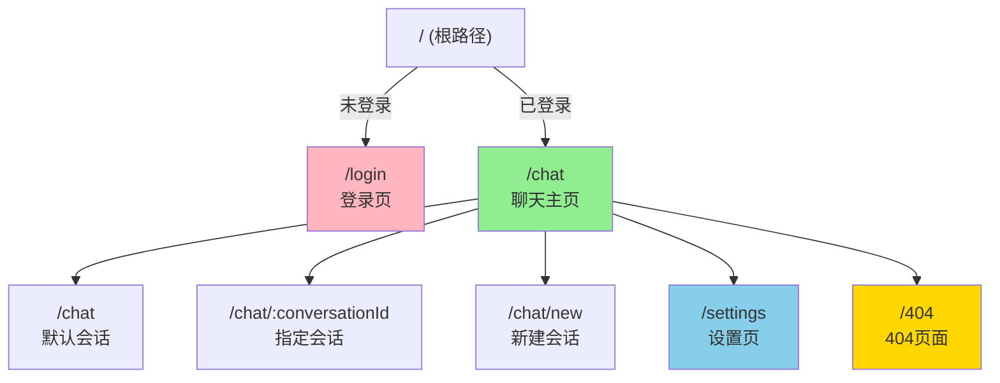
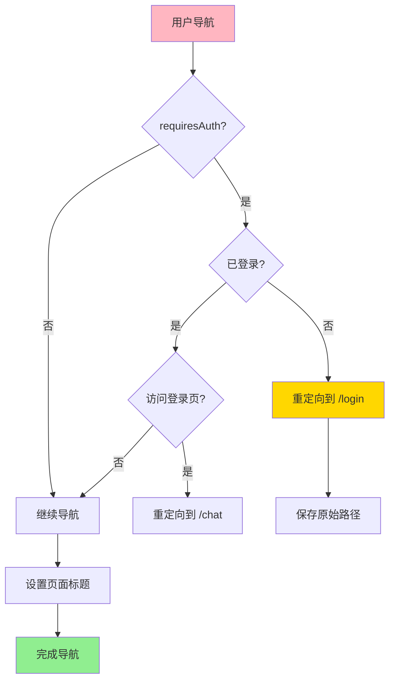
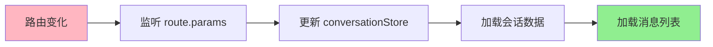
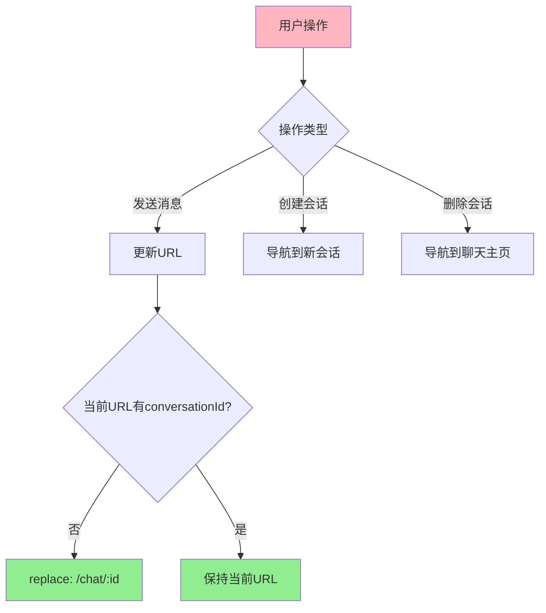
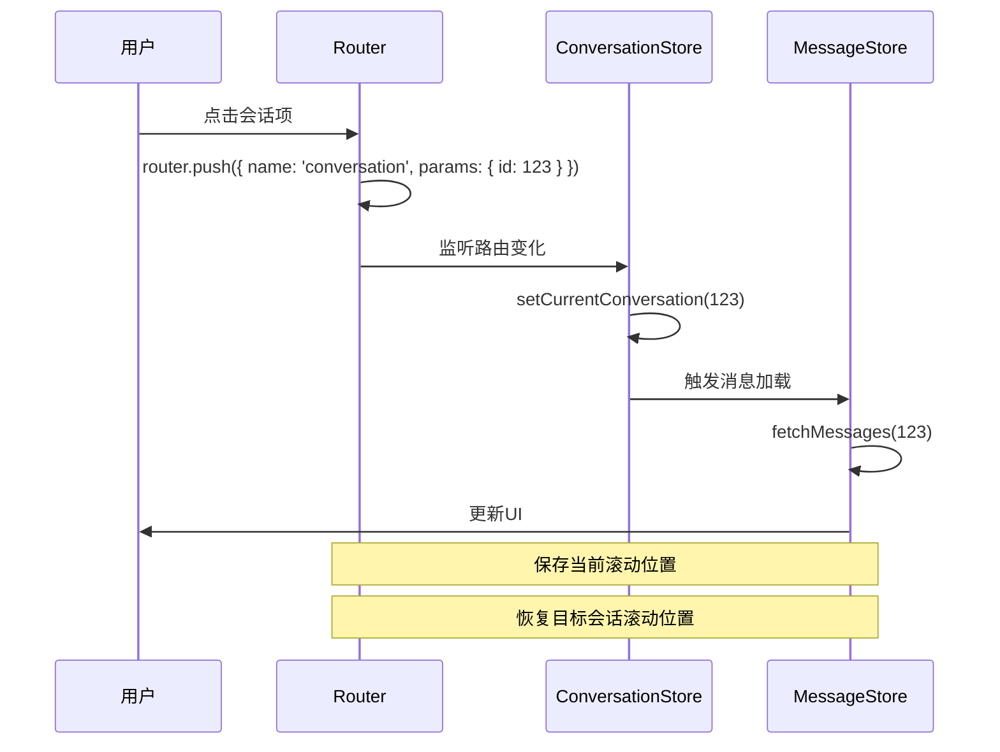
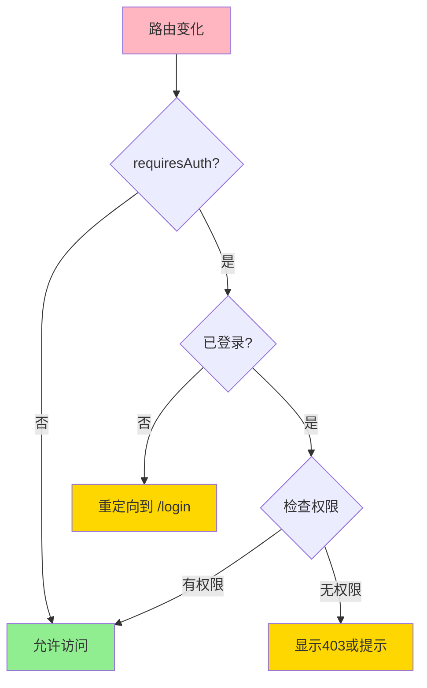

# 聊天模块 - 路由设计

> **目标**: 定义路由结构、守卫、导航逻辑
> **后端对齐**: 参考 `/docs/api-design/01-chat/API设计文档.md`

---

## 🌳 路由结构

### 路由树



### 路由表

| 路径 | 名称 | 组件 | 布局 | 权限 | 说明 |
|------|------|------|------|------|------|
| `/login` | `login` | `LoginPage` | `EmptyLayout` | 公开 | 未登录用户重定向到此处 |
| `/chat` | `chat` | `ChatPage` | `AppLayout` | 需登录 | 默认显示最近会话或新建 |
| `/chat/:conversationId` | `conversation` | `ChatPage` | `AppLayout` | 需登录 | 指定会话ID |
| `/settings` | `settings` | `SettingsPage` | `AppLayout` | 需登录 | 用户设置 |
| `/404` | `404` | `NotFoundPage` | `EmptyLayout` | 公开 | 404页面 |
| `/:pathMatch(.*)*` | - | - | - | - | 重定向到 `/chat` |

---

## 🔧 路由配置

### 完整路由配置

```typescript
// router/index.ts
import { createRouter, createWebHistory, RouteRecordRaw } from 'vue-router'

const routes: RouteRecordRaw[] = [
  // 登录页
  {
    path: '/login',
    name: 'login',
    component: () => import('@/pages/LoginPage.vue'),
    meta: {
      title: '登录',
      requiresAuth: false
    }
  },

  // 聊天主页
  {
    path: '/chat',
    name: 'chat',
    component: () => import('@/pages/ChatPage.vue'),
    meta: {
      title: 'DeepSeek Chat',
      requiresAuth: true
    }
  },

  // 指定会话
  {
    path: '/chat/:conversationId',
    name: 'conversation',
    component: () => import('@/pages/ChatPage.vue'),
    meta: {
      title: 'DeepSeek Chat',
      requiresAuth: true
    },
    props: true
  },

  // 设置页
  {
    path: '/settings',
    name: 'settings',
    component: () => import('@/pages/SettingsPage.vue'),
    meta: {
      title: '设置',
      requiresAuth: true
    }
  },

  // 404页面
  {
    path: '/404',
    name: '404',
    component: () => import('@/pages/NotFoundPage.vue'),
    meta: {
      title: '页面未找到'
    }
  },

  // 通配符重定向
  {
    path: '/:pathMatch(.*)*',
    redirect: '/chat'
  }
]

const router = createRouter({
  history: createWebHistory(),
  routes,
  scrollBehavior(to, from, savedPosition) {
    // 聊天页面保持滚动位置
    if (to.name === 'conversation') {
      return savedPosition || false
    }
    // 其他页面滚动到顶部
    return { top: 0 }
  }
})

export default router
```

### 路由元信息类型

```typescript
declare module 'vue-router' {
  interface RouteMeta {
    title?: string
    requiresAuth?: boolean
    keepAlive?: boolean
    hideHeader?: boolean
    hideSidebar?: boolean
    permissions?: string[]
  }
}
```

---

## 🛡️ 路由守卫

### 全局前置守卫



### 守卫实现

```typescript
// 全局前置守卫
router.beforeEach(async (to, from, next) => {
  // 设置页面标题
  if (to.meta.title) {
    document.title = to.meta.title as string
  }

  // 获取用户状态
  const userStore = useUserStore()
  const requiresAuth = to.meta.requiresAuth !== false

  // 需要登录但未登录
  if (requiresAuth && !userStore.isAuthenticated) {
    return next({
      name: 'login',
      query: { redirect: to.fullPath }
    })
  }

  // 已登录用户访问登录页
  if (to.name === 'login' && userStore.isAuthenticated) {
    return next({ name: 'chat' })
  }

  next()
})

// 全局后置守卫
router.afterEach((to, from) => {
  // 清除加载状态
  const appStore = useAppStore()
  appStore.setGlobalLoading(false)
})
```

### 路由独享守卫

```typescript
{
  path: '/chat/:conversationId',
  name: 'conversation',
  component: ChatPage,
  beforeEnter: (to, from, next) => {
    const conversationId = parseInt(to.params.conversationId as string)
    const conversationStore = useConversationStore()

    // 检查会话是否存在
    const exists = conversationStore.conversations.some(
      c => c.conversationId === conversationId
    )

    if (!exists) {
      // 会话不存在，可选择跳转404或重定向到聊天主页
      return next({ name: 'chat' })
    }

    next()
  }
}
```

### 组件内守卫

```typescript
// ChatPage.vue
import { onBeforeRouteLeave, onBeforeRouteUpdate } from 'vue-router'

onBeforeRouteUpdate(async (to, from, next) => {
  const newId = parseInt(to.params.conversationId as string)

  // 检查是否有未发送的草稿
  if (hasUnsavedContent.value) {
    const confirmed = await confirm('有未发送的消息，确定要离开吗？')
    if (!confirmed) {
      return next(false)
    }
  }

  // 切换会话
  await conversationStore.setCurrentConversation(newId)
  await messageStore.fetchMessages(newId)

  next()
})

onBeforeRouteLeave((to, from, next) => {
  // 离开页面时检查草稿
  if (hasUnsavedContent.value) {
    const confirmed = confirm('有未发送的消息，确定要离开吗？')
    if (!confirmed) {
      return next(false)
    }
  }

  next()
})
```

---

## 🔄 路由与状态同步

### 路由 → 状态



### 实现

```typescript
// ChatPage.vue
const route = useRoute()
const conversationStore = useConversationStore()
const messageStore = useMessageStore()

// 监听路由参数变化
watch(
  () => route.params.conversationId,
  async (newId, oldId) => {
    if (!newId) return

    const id = parseInt(newId as string)

    // 切换会话
    await conversationStore.setCurrentConversation(id)

    // 加载消息
    if (id !== oldId) {
      await messageStore.fetchMessages(id)
    }
  },
  { immediate: true }
)
```

### 状态 → 路由



### 实现

```typescript
// 发送消息后更新URL
const sendMessage = async (content: string) => {
  const res = await messageStore.sendMessage(
    conversationStore.currentConversationId,
    content
  )

  // 如果是新建会话，更新URL
  if (route.name === 'chat' && !route.params.conversationId) {
    router.replace({
      name: 'conversation',
      params: { conversationId: res.conversationId }
    })
  }
}

// 创建新会话后导航
const createConversation = async () => {
  const conversation = await conversationStore.createConversation({
    title: '新对话',
    modelId: 'deepseek-chat'
  })

  router.push({
    name: 'conversation',
    params: { conversationId: conversation.conversationId }
  })
}

// 删除当前会话后导航
const deleteCurrentConversation = async () => {
  await conversationStore.deleteConversation([
    conversationStore.currentConversationId
  ])

  router.push({ name: 'chat' })
}
```

---

## 🔗 路由导航

### 声明式导航

```vue
<!-- 导航到指定会话 -->
<router-link
  :to="{ name: 'conversation', params: { conversationId: conversation.conversationId } }"
>
  {{ conversation.title }}
</router-link>

<!-- 导航到新建会话 -->
<router-link :to="{ name: 'chat' }">
  新建对话
</router-link>
```

### 编程式导航

```typescript
import { useRouter } from 'vue-router'

const router = useRouter()

// 导航到指定会话
router.push({
  name: 'conversation',
  params: { conversationId: 123 }
})

// 替换当前路由（不产生历史记录）
router.replace({
  name: 'conversation',
  params: { conversationId: 123 }
})

// 返回上一页
router.back()

// 导航到新建会话
router.push({ name: 'chat' })
```

---

## 🌐 特殊场景处理

### 新建会话

**方案1**: 使用路由参数

```typescript
// 导航
router.push({ name: 'chat', query: { new: 'true' } })

// 组件内判断
const isNewConversation = computed(() =>
  route.query.new === 'true'
)
```

**方案2**: 使用特殊路径（推荐）

```typescript
// 路由配置
{
  path: 'new',
  name: 'new-conversation',
  component: ChatPage
}

// 导航
router.push({ name: 'new-conversation' })
```

### 会话切换



### 滚动位置保持

```typescript
const scrollPositions = ref<Record<number, number>>({})

// 切换前保存滚动位置
onBeforeRouteLeave((to, from, next) => {
  if (from.params.conversationId) {
    scrollPositions.value[from.params.conversationId] = window.scrollY
  }
  next()
})

// 切换后恢复滚动位置
watch(
  () => route.params.conversationId,
  (newId) => {
    if (newId) {
      nextTick(() => {
        const savedPosition = scrollPositions.value[newId]
        if (savedPosition) {
          window.scrollTo(0, savedPosition)
        }
      })
    }
  }
)
```

---

## 📱 移动端路由处理

### 抽屉式导航

```typescript
const isMobile = computed(() => window.innerWidth < 768)

// 进入会话时自动收起侧边栏
watch(
  () => route.params.conversationId,
  (conversationId) => {
    if (isMobile.value && conversationId) {
      appStore.sidebarVisible = false
    }
  }
)
```

### 返回手势处理

```typescript
const goBack = () => {
  if (isMobile.value) {
    // 移动端返回逻辑
    if (appStore.sidebarVisible) {
      // 侧边栏打开，关闭侧边栏
      appStore.sidebarVisible = false
    } else if (route.params.conversationId) {
      // 在会话中，返回会话列表
      router.push({ name: 'chat' })
    } else {
      // 在会话列表，退出应用或提示
      if (window.confirm('确定要退出吗？')) {
        router.push({ name: 'login' })
      }
    }
  } else {
    // 桌面端正常返回
    router.back()
  }
}
```

---

## 🔗 路由与权限

### 权限检查流程



### 权限守卫实现

```typescript
router.beforeEach(async (to, from, next) => {
  const userStore = useUserStore()

  // 检查登录状态
  if (to.meta.requiresAuth && !userStore.isAuthenticated) {
    return next({ name: 'login', query: { redirect: to.fullPath } })
  }

  // 检查权限
  if (to.meta.permissions) {
    const hasPermission = to.meta.permissions.some(
      permission => userStore.permissions.includes(permission)
    )

    if (!hasPermission) {
      // 无权限，跳转403或显示提示
      return next({ name: '403' })
    }
  }

  next()
})
```

---

## 📊 路由性能优化

### 路由级懒加载

```typescript
const routes = [
  {
    path: '/chat',
    component: () => import('@/pages/ChatPage.vue')
  }
]
```

### 预加载关键路由

```typescript
// 预加载聊天页面
const preloadChatPage = () => {
  import('@/pages/ChatPage.vue')
}

// 鼠标悬停时预加载
onMounted(() => {
  const link = document.querySelector('[href="/chat"]') as HTMLElement
  link?.addEventListener('mouseenter', preloadChatPage, { once: true })
})
```

---

## 🔗 API 对齐

| 路由 | 后端API | 数据流向 |
|------|---------|----------|
| `/login` | `POST /login` | 前端 → 后端 |
| `/chat` | `GET /api/chat/conversations` | 后端 → 前端 |
| `/chat/:id` | `GET /api/chat/conversations/{id}` | 后端 → 前端 |
| `/chat/:id/messages` | `GET /api/chat/conversations/{id}/messages` | 后端 → 前端 |
| `/settings` | `GET /api/chat/settings` | 后端 → 前端 |

---

**文档版本**: v2.0
**最后更新**: 2026-03-05
**对齐后端API**: v1.0
