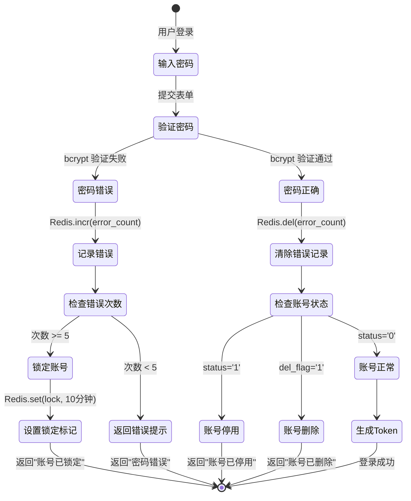
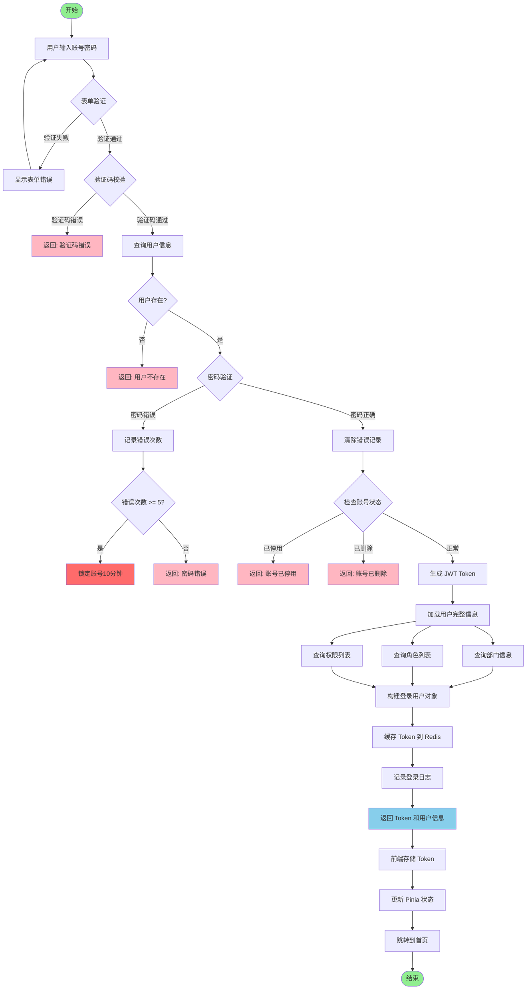
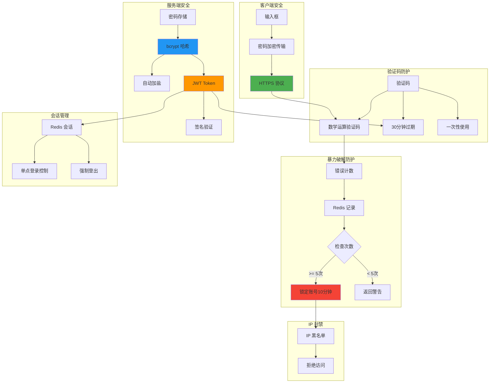
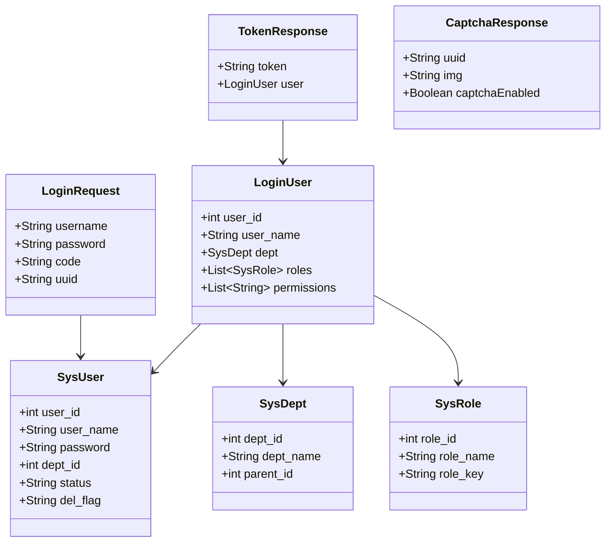

# 登录流程详解

## 1. 登录完整流程

```mermaid
sequenceDiagram
    autonumber
    participant User as 👤 用户
    participant Frontend as 🌐 前端 (Vue3)
    participant Router as 🔄 Vue Router
    participant API as 🔌 API 调用
    participant Nginx as 🌐 Nginx
    participant Gateway as 🚪 后端网关
    participant LogDecorator as 📝 日志切面
    participant LoginController as 🎮 LoginController
    participant LoginService as 🔧 LoginService
    participant UserDAO as 💾 UserDAO
    participant MySQL as 🗄️ MySQL
    participant Redis as 🔴 Redis
    participant JWT as 🔐 JWT 服务
    participant AsyncRedis as ⚡ AsyncRedis
    participant DeptDAO as 💾 DeptDAO
    participant RoleDAO as 💾 RoleDAO
    participant MenuDAO as 💾 MenuDAO

    User->>Frontend: 输入用户名密码
    User->>Frontend: 点击登录按钮

    Frontend->>Frontend: 表单验证
    Frontend->>Frontend: 加载状态开启

    Frontend->>API: login(username, password, code, uuid)
    API->>Nginx: POST /api/login
    Nginx->>Gateway: 代理转发

    Note over Gateway: 请求进入后端

    Gateway->>LogDecorator: @Log() 切面拦截
    LogDecorator->>LogDecorator: 记录请求开始

    LogDecorator->>LoginController: 调用 login()
    LoginController->>LoginService: login(username, password)

    Note over LoginService: 验证码校验
    LoginService->>AsyncRedis: get(verify_key)
    AsyncRedis-->>LoginService: 返回验证码
    alt 验证码错误或过期
        LoginService-->>LogDecorator: 抛出异常
        LogDecorator-->>Gateway: 返回错误
        Gateway-->>Nginx: 验证码错误
        Nginx-->>Frontend: 500 错误
        Frontend-->>User: 提示"验证码错误"
    end

    Note over LoginService: 用户信息查询
    LoginService->>UserDAO: select_user_by_username()
    UserDAO->>MySQL: SELECT * FROM sys_user
    MySQL-->>UserDAO: 用户数据
    UserDAO-->>LoginService: SysUser 对象

    alt 用户不存在
        LoginService-->>LogDecorator: 抛出异常
        LogDecorator-->>Gateway: 返回错误
        Gateway-->>Frontend: 用户不存在
        Frontend-->>User: 提示"用户不存在"
    end

    Note over LoginService: 密码验证
    LoginService->>LoginService: bcrypt.checkpw()
    alt 密码错误
        LoginService->>AsyncRedis: incr(password_error:username)
        LoginService->>AsyncRedis: expire(600秒)

        LoginService->>AsyncRedis: get(password_error:username)
        alt 错误次数 >= 5
            LoginService->>AsyncRedis: set(account_lock:username, 10分钟)
            LoginService-->>Gateway: 账号已锁定
        end

        LoginService-->>LogDecorator: 密码错误
        LogDecorator-->>Gateway: 返回错误
        Gateway-->>Frontend: 密码错误
        Frontend-->>User: 提示"密码错误"
    end

    Note over LoginService: 检查账号状态
    alt 用户已停用
        LoginService-->>Gateway: 账号已停用
        Frontend-->>User: 提示"账号已停用"
    end

    alt 账号已删除
        LoginService-->>Gateway: 账号已删除
        Frontend-->>User: 提示"账号已删除"
    end

    Note over LoginService: 清除错误记录
    LoginService->>AsyncRedis: del(password_error:username)

    Note over LoginService: 生成 Token
    LoginService->>LoginService: 生成 session_id (UUID)
    LoginService->>JWT: create_access_token()
    JWT-->>LoginService: JWT Token

    LoginService->>AsyncRedis: set(token_key, user_info, 30分钟)

    Note over LoginService: 构建登录用户信息
    LoginService->>DeptDAO: get_dept_by_id()
    DeptDAO-->>LoginService: 部门信息

    LoginService->>RoleDAO: get_roles_by_user_id()
    RoleDAO-->>LoginService: 角色列表

    LoginService->>MenuDAO: get_permissions_by_user_id()
    MenuDAO-->>LoginService: 权限列表

    LoginService->>LoginService: 构建 LoginUser 对象

    Note over LogDecorator: 记录登录成功日志
    LogDecorator->>MySQL: INSERT sys_login_log

    LoginService-->>LoginController: LoginUser + Token
    LoginController-->>Gateway: 统一响应格式
    Gateway-->>Nginx: JSON 响应
    Nginx-->>Frontend: {
        code: 200,
        msg: "操作成功",
        token: "eyJ0eXAiOiJKV1QiLCJhbGc..."
    }

    Frontend->>Frontend: 存储 Token 到 localStorage
    Frontend->>Frontend: 存储用户信息到 Pinia

    Frontend->>Router: push('/dashboard')
    Router->>Frontend: 跳转到首页

    Frontend-->>User: 显示登录成功，进入系统
```

## 2. 验证码生成与验证流程

```mermaid
sequenceDiagram
    autonumber
    participant Frontend as 🌐 前端
    participant Backend as 🔌 后端
    participant Redis as 🔴 Redis
    participant Math as 🔢 数学运算

    Note over Frontend,Backend: 验证码生成
    Frontend->>Backend: GET /captchaImage

    Backend->>Math: 生成随机数学题
    Math-->>Backend: "5 + 3 = ?"

    Backend->>Backend: 计算 answer = 8

    Backend->>Backend: 生成 UUID = "abc-123-def"

    Backend->>Redis: set(captcha:abc-123-def, "8", 2分钟)

    Backend-->>Frontend: {
        uuid: "abc-123-def",
        img: "base64图片",
        captchaEnabled: true
    }

    Frontend->>Frontend: 显示验证码图片

    Note over Frontend,Backend: 验证码校验
    Frontend->>Frontend: 用户输入 "8"

    Frontend->>Backend: POST /api/login {
        username: "admin",
        password: "admin123",
        code: "8",
        uuid: "abc-123-def"
    }

    Backend->>Redis: get(captcha:abc-123-def)
    Redis-->>Backend: "8"

    Backend->>Backend: 比较 "8" == "8"

    alt 验证码正确
        Backend->>Redis: del(captcha:abc-123-def)
        Backend->>Backend: 继续登录流程
    else 验证码错误
        Backend-->>Frontend: 验证码错误
    end
```

## 3. 密码错误与账号锁定流程



## 4. 登录流程状态流转



## 5. Token 刷新机制

```mermaid
sequenceDiagram
    autonumber
    participant User as 👤 用户
    participant Frontend as 🌐 前端
    participant API as 🔌 API
    participant Backend as 🔌 后端
    participant Redis as 🔴 Redis
    participant JWT as 🔐 JWT

    Note over Frontend,Backend: 正常请求（Token 有效）
    User->>Frontend: 访问需要权限的页面
    Frontend->>API: GET /api/user/list
    Frontend->>API: Header: Authorization: Bearer <access_token>

    API->>Backend: 转发请求
    Backend->>JWT: decode(access_token)

    alt Token 有效
        JWT-->>Backend: payload 信息
        Backend->>Redis: get(token_key)
        Redis-->>Backend: 用户信息
        Backend-->>Frontend: 返回数据
    end

    Note over Frontend,Backend: Token 过期（使用刷新 Token）
    Backend->>JWT: decode(access_token)
    JWT-->>Backend: TokenExpireError

    Backend-->>Frontend: 401 Unauthorized

    Frontend->>Frontend: 检测到 401 错误
    Frontend->>API: POST /auth/refresh {
        refresh_token: <refresh_token>
    }

    API->>Backend: 验证 refresh_token
    Backend->>JWT: decode(refresh_token)

    alt refresh_token 有效
        JWT-->>Backend: user_id
        Backend->>JWT: 生成新的 access_token
        JWT-->>Backend: new_access_token
        Backend-->>Frontend: {
            access_token: new_token
        }

        Frontend->>Frontend: 更新 localStorage
        Frontend->>API: 重试原请求
        API-->>Frontend: 返回数据
    else refresh_token 过期
        Backend-->>Frontend: 401 Token 无效
        Frontend->>Frontend: 清除 Token
        Frontend->>User: 跳转到登录页
    end
```

## 6. 登录安全措施



## 7. 登录相关数据结构



## 关键代码位置

| 功能 | 文件路径 |
|------|---------|
| 登录接口 | `module_admin/controller/login_controller.py` |
| 登录服务 | `module_admin/service/login_service.py` |
| 用户 DAO | `module_admin/dao/user_dao.py` |
| JWT 配置 | `common/jwt/jwt_config.py` |
| 异步 Redis | `common/redis/async_redis.py` |
| 登录日志 | `module_admin/entity/do/login_log_do.py` |

## Redis Key 设计

| Key | 格式 | 过期时间 | 用途 |
|-----|------|---------|------|
| 验证码 | `captcha:{uuid}` | 2分钟 | 存储验证码答案 |
| 密码错误次数 | `password_error:{username}` | 10分钟 | 记录密码错误次数 |
| 账号锁定 | `account_lock:{username}` | 10分钟 | 账号锁定标记 |
| IP 黑名单 | `blacklist:{ip}` | 自定义 | IP 封禁 |
| Token 缓存 | `token:{token}` | 30分钟 | 缓存用户信息 |
